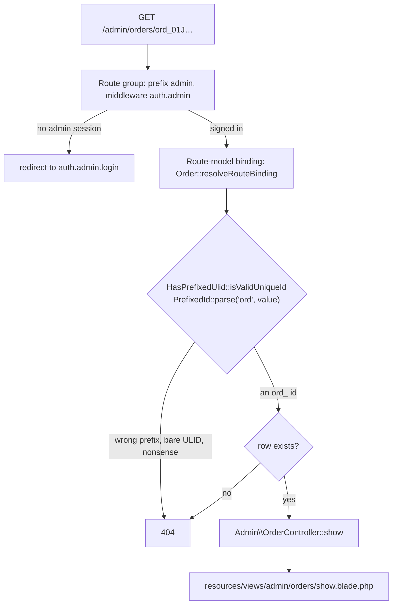
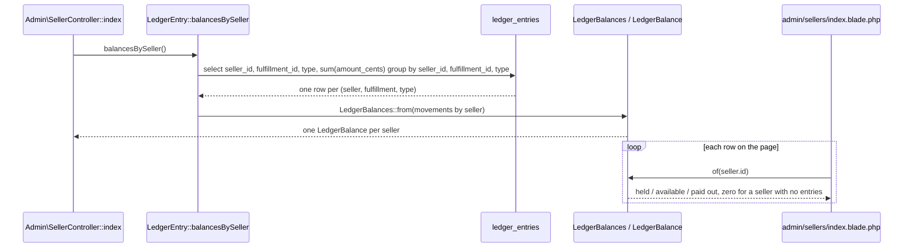
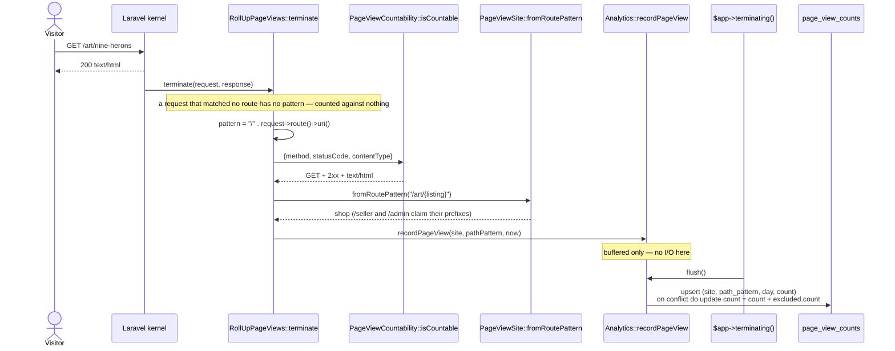
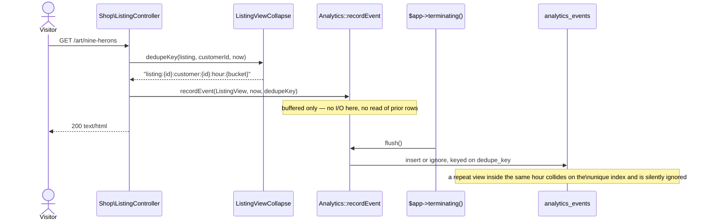
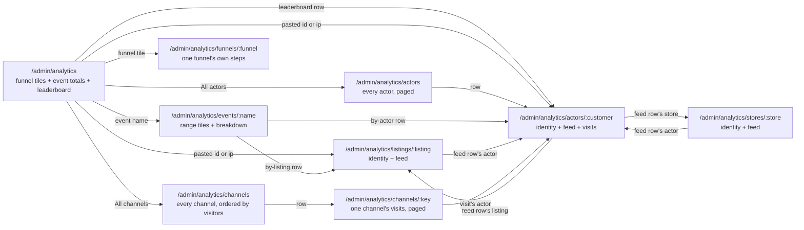
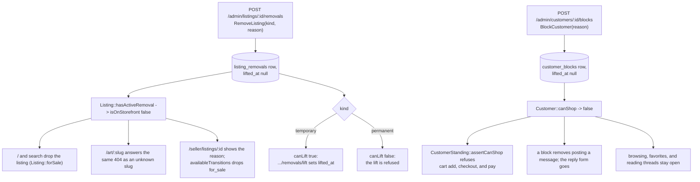
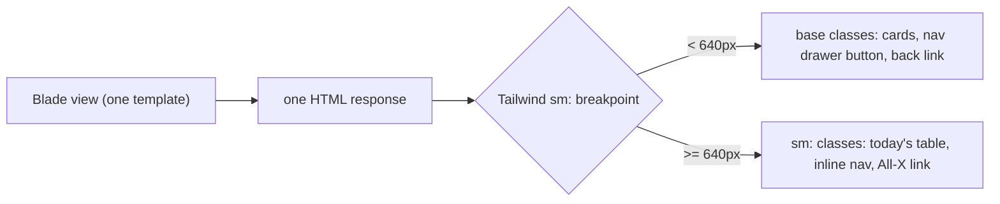
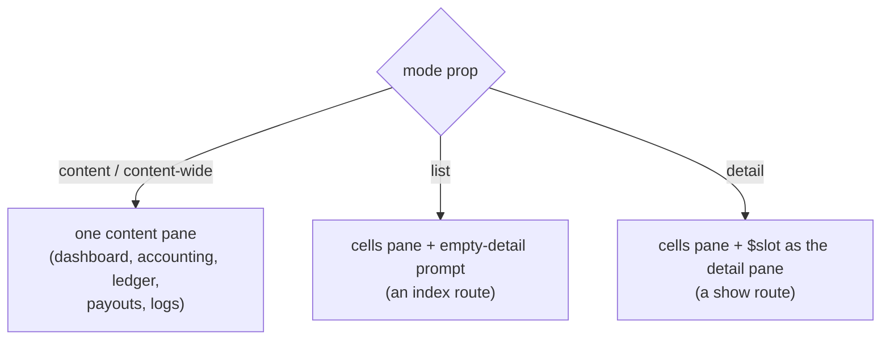

# Admin site

What a platform operator does:

- read every seller, customer, listing, order, and fulfillment on the
  platform;
- moderate a listing or a customer they need to stop;
- settle the money: cancel an unpaid order, refund a fulfillment, run the
  weekly payout;
- read the platform's state, money, and traffic from the front door.

Code: `app/Http/Controllers/Admin/`, `routes/admin.php`,
`resources/views/admin/`, `resources/views/components/admin/`,
`app/View/Composers/AdminLayoutComposer.php`,
`app/Http/Middleware/RollUpPageViews.php`, `app/Analytics/`,
`app/Domain/Analytics/`.

Admins are seeded, never created — `database/seeders/AdminSeeder.php` — and
sign in through the same magic link sellers and customers use
([`identity.md`](identity.md)).

## Pages

| Path                                                                    | Reads                                                                    |
| ----------------------------------------------------------------------- | ------------------------------------------------------------------------ |
| `GET /admin`                                                            | tallies for every listing / order / fulfillment status (zero rows still  |
|                                                                         | listed), platform money, page views this week                            |
| `GET /admin/sellers`                                                    | every seller with listing and fulfillment counts, and the balance folded |
|                                                                         | from one read of the ledger                                              |
| `GET /admin/sellers/{seller}`                                           | the seller's listings, fulfillments, payouts, escrow balance, and a      |
|                                                                         | 30-day storefront funnel scoped to their own listings                    |
| `GET /admin/customers?standing=all\|verified\|anonymous\|blocked`       | every customer, anonymous rows included, with order, favorite and        |
|                                                                         | cart-line counts                                                         |
| `GET /admin/customers/{customer}`                                       | orders, favorites, cart, block history, merge history, and the block /   |
|                                                                         | lift form                                                                |
| `GET /admin/listings?status=&seller=&removed=any\|removed\|visible`     | every listing across every seller                                        |
| `GET /admin/listings/{listing}`                                         | the listing, its active removal and removal history, its view / favorite |
|                                                                         | / cart-add counts, and every order line it sold on                       |
| `GET /admin/orders?status=&customer=`                                   | every order with its customer, item count and total                      |
| `GET /admin/orders/{order}`                                             | items, payment attempts, fulfillments, refunds, the cancel action and a  |
|                                                                         | refund form per fulfillment                                              |
| `GET /admin/fulfillments?status=&seller=`                               | every fulfillment with its order and seller                              |
| `GET /admin/fulfillments/{fulfillment}`                                 | the shipment, the lines it carries, its money, its ledger entries, and   |
|                                                                         | the refund or the form to issue one                                      |
| `GET /admin/accounting`                                                 | per-seller reconciliation (held / available / paid out / refunded), fees |
|                                                                         | earned and refunded at the platform level                                |
| `GET /admin/ledger?seller=&type=`                                       | every ledger entry matching the filter, folded totals for that filtered  |
|                                                                         | set                                                                      |
| `GET /admin/payouts?seller=`, `POST /admin/payouts`                     | payout history; run the weekly payout for every seller (`as_of`          |
|                                                                         | optional)                                                                |
| `GET /admin/stats`                                                      | permanent redirect to `/admin/analytics`                                 |
| `GET /admin/analytics?range=&actors=&q=`                                | one tile per funnel (end-to-end conversion, change vs the range before)  |
|                                                                         | above every event name compared with the range before it, a daily bar    |
|                                                                         | strip, distinct subject/actor counts, and the actors with the highest    |
|                                                                         | events-per-hour peak; `q` narrows both tables and a pasted listing or    |
|                                                                         | customer id or a shared ip jumps straight to it                          |
| `GET /admin/analytics/events/{name}?range=&by=`                         | one event name's range tiles, daily bars, and a breakdown by listing,    |
|                                                                         | actor, or — for `page.view` — route pattern                              |
| `GET /admin/analytics/actors?range=&sort=&actors=&q=&page=`             | every actor that carried an event in the range, paged, sorted by most    |
|                                                                         | active or most recent                                                    |
| `GET /admin/analytics/actors/{customer}?range=&event=`                  | the actor's identity, range tiles, a daily or (once flagged) hourly      |
|                                                                         | strip, and its event feed newest first, with links to the customer, the  |
|                                                                         | log viewer, and the block form                                           |
| `GET /admin/analytics/listings/{listing}?range=&event=`                 | the listing's identity, range tiles, its own funnel, a daily strip, and  |
|                                                                         | its event feed newest first, with a link to the listing                  |
| `GET /admin/analytics/stores/{store}?range=&event=`                     | the store's identity, range tiles, a daily strip, and its event feed     |
|                                                                         | newest first; linked from the seller page and from a feed row's store    |
| `GET /admin/analytics/funnels/{funnel}?range=`                          | one funnel's own steps, drawn by `x-admin.analytics.funnel`, with the    |
|                                                                         | range control; linked from its tile on the entry page and from          |
|                                                                         | `/admin/funnels`                                                        |
| `GET /admin/analytics/channels?range=`                                  | every channel — visitors, listing views, cart adds, orders placed, and   |
|                                                                         | orders paid, compared with the range before it — ordered by visitors     |
| `GET /admin/analytics/channels/{key}?range=&page=`                      | one channel's own visits in the range, paged, newest first               |
| `GET /admin/funnels`, `GET /admin/funnels/create`,                      | admin-defined funnels: a name and an ordered list of event names, two    |
| `POST /admin/funnels`, `GET /admin/funnels/{funnel}/edit`,              | or more, validated through `FunnelDefinition`; the editor is a plain     |
| `PUT /admin/funnels/{funnel}`, `DELETE /admin/funnels/{funnel}`         | form — add, remove, and reorder steps all post back and re-render        |
| `GET\|POST /admin/messages?domain=all\|sellers\|customers`,             | the shared desk: every admin sees every thread; `domain=` picks the      |
| `/admin/messages/{conversation}`, `.../resolve`, `.../reopen`           | tab; oversight (seller ↔ customer) threads read-only                     |
|                                                                         | ([`messaging.md`](messaging.md))                                         |
| `POST /admin/orders/{order}/cancel`                                     | cancel an order nothing has been charged for; the stock goes back on the |
|                                                                         | storefront                                                               |
| `POST /admin/fulfillments/{fulfillment}/refund`                         | refund one fulfillment with a reason; stock stays sold                   |
| `POST /admin/listings/{listing}/removals`, `.../removals/lift`          | temporary or permanent removal with a reason; lift refused for a         |
|                                                                         | permanent one                                                            |
| `POST /admin/customers/{customer}/blocks`, `.../blocks/lift`            | block with a reason; lift it                                             |
| `POST /admin/sellers/{seller}/messages`,                                | open a fresh, titled thread from the directory, optionally naming an     |
| `POST /admin/customers/{customer}/messages`                             | order                                                                    |
| `GET /admin/logs?domain=&level=&phase=&event=&request=&txn=&session=&actor=&msg=&from=&to=&key=&value=&group=&health=&viewer=&page=` | the log store's time series, newest first, with the level/domain stat    |
|                                                                         | tiles ([`log-store.md`](log-store.md))                                   |
| `GET /admin/logs/requests/{requestId}`                                  | one request's whole story, oldest first ([`log-store.md`](log-store.md)) |

Every filter is optional and an empty value means "all": the console submits
`seller=` for "All sellers", and the controller reads it back with
`$request->filled(...)` (a string filter) or `$request->enum(...)` (a status),
both of which answer null for an absent, empty, or unrecognised value — so a
hand-typed `?status=nonsense` shows everything rather than an error page.

The `status` selects on the orders and fulfillments lists are driven by
`OrderStatus::cases()` and `FulfillmentStatus::cases()`, so `cancelled`,
`refunded`, and `declined` appear as filter values with no console change.

`StandingFilter` (`app/Domain/Customers/StandingFilter.php`) is the one filter
whose "all" is a value of its own, because the customers list offers it as a
choice: `standing=all`, `standing=` and no `standing` at all are the same page.

## One guard, one 404

Question: what stands between a request for an admin page and the row it names?

Caveats: the guard is on the group in `routes/admin.php`, never on a route — a
per-route check is one the next page added forgets. Every miss answers the same
404: an unknown id, an id carrying another table's prefix, and a value of no
shape at all are one page, so nothing reveals whether a thing exists. That
falls out of the route binding, which is why no admin page looks a model up by
hand.

## Balances are folded, never queried per seller

Question: how does `/admin/sellers` show a balance on every row without a
query per row?

Caveats: the database sums each `(seller, fulfillment, type)` triple
(`LedgerEntry::totalledByType()`), so the fold sees one row per triple
rather than the whole table, and the page costs one ledger read
whatever the seller count — `SellerControllerTest` counts the reads and holds
it to one. `LedgerBalances::of()` answers a zero balance for a seller with no
entries at all, which is what keeps the page from asking. The per-seller
`Seller::escrowBalance()` is still what the seller detail page reads: one
seller, one balance, one query.

Counts come from the database the same way — `withCount(['listings',
'fulfillments'])` on the sellers list, `withCount(['orders', 'favorites',
'cartItems'])` on the customers list, `withCount('items')` on the orders
list — rather than from counting a loaded collection in PHP.

## Filters as query scopes, tables as components

Each filter is a scope on the model it narrows, taking the filter value as
nullable and adding no clause when it is null: `Listing::ofStatus` /
`ofSeller` / `ofRemoval`, `Order::ofStatus` / `ofCustomer`, `Fulfillment::ofStatus` /
`ofSeller`, `Payout::ofSeller`, `Customer::inStanding`. A controller passes
what it read off the request straight through, so "empty means all" is one
answer in one place per model rather than an `if` in every controller.
`ofRemoval` takes `RemovedFilter` and treats `null` and the explicit `Any`
case alike — the third option the listings console offers reads the same as
no filter at all, the way `removed=`, `removed=any`, and no `removed` in the
query string are one page.

The repeated tables are anonymous Blade components under
`resources/views/components/admin/` — `listings-table`, `orders-table`,
`fulfillments-table`, plus the `filters` form and its selects. Each takes a
`showSeller` / `showOrder` / `showCustomer` prop, because the column that
names the owner is noise on the owner's own page.

## Tallies with nothing hidden

`/admin`'s listing, order, and fulfillment tallies come from
`Listing::platformCountsByStatus()`, `Order::platformCountsByStatus()`, and
`App\Admin\PlatformFulfillmentReader::countsByStatus()`, each a `group by status` folded through
`*StatusTally::from()` (`App\Domain\Reports`) against the enum's full
`cases()`. A `group by` only answers for the statuses that have rows, and a
dashboard that hid `payment_failed` because nobody has hit it yet would be
lying about the state machine — so every status the enum names appears, at
zero if that is the true count. `/admin/analytics`'s event-name tally
(`EventTotals`) and the `admin.balance` tiles on the seller and platform
money sections follow the same rule.

Platform money — held, available, paid out, fees earned, fees refunded,
refunded — is `App\Domain\Escrow\PlatformMoney`, built from
`LedgerEntry::balancesBySeller()->total()` (every seller's balance folded
into one, free of a second ledger read — `LedgerBalance::combine()` in
`app/Domain/Escrow/LedgerBalance.php`) and
`App\Admin\PlatformFulfillmentReader::fees()` (`App\Domain\Escrow\PlatformFees`:
`isLive()` fulfillments have earned their fee, a declined or refunded one
forwent it). `/admin` and `/admin/accounting`'s totals row read the same
object. `/admin/ledger`'s totals are different on purpose: `LedgerBalance::from()`
over whatever rows the seller/type filter left, so a partial ledger reads as
a partial balance rather than the platform's.

## Page views, rolled up

Question: how does a request become a row on the `page.view` event page
(`/admin/analytics/events/page.view`)?

Caveats: `RollUpPageViews` is appended to the **global** middleware stack in
`bootstrap/app.php`, not the `web` group, because a middleware added there
runs for every site regardless of which group's guard it sits behind, and the
site a hit belongs to is read back off the route's own pattern rather than
the request's host. It is terminable — `terminate()` runs after the response
has already gone back to the browser — so the roll-up costs the request it
counts nothing: even the call inside `terminate()` only appends to
`App\Analytics\Analytics`'s in-memory buffer, which turns it into a row on
its own schedule (see [`analytics.md`](analytics.md)).

The pattern stored is `Route::uri()` with a leading slash, `/art/{listing}`
and never the concrete `/art/nine-herons`, so a thousand listing pages share
one row and the table grows with routes and days, not with traffic. The
unique index on `(site, path_pattern, day)` is what the flush's upsert
targets, adding the buffer's hit count to whatever the row already held.

"This week" on the dashboard is the seven days ending today
(`PageViewWeek::endingOn`), not Monday-to-Sunday: a calendar week reads as
almost nothing every Monday, and the number exists to be compared with the
day before it. The payout period is a calendar week and is a different
question — see [`escrow.md`](escrow.md).

## A view, collapsed to one per hour

Question: why does refreshing a listing page twenty times not write twenty
`analytics_events` rows?

Caveats: `listing.favorite`, `listing.unfavorite`, and `listing.cart_add` never carry a dedupe key —
each is a deliberate click, recorded every time. `ListingViewCollapse::dedupeKey()`
folds the listing, the customer (or `anonymous`), and the UTC hour into one
string; `ListingViewCollapse::windowStart()` floors to the top of the hour,
so a view at `14:59` and one at `14:01` share a window but one at `15:01`
does not. Because the collapse is a write-time constraint rather than a
read-before-write, nothing in the request can observe whether a given view
was the first of the hour or a duplicate the store discarded — the shop
listing page logs one `Story::for(ListingView)` "did" line per view and
never a refusal, since nothing is refused: the request never learns whether
its event was kept.

## Analytics drill-in

Question: from "what happened in this range" to "who did it" to "everything
that one did" — how do the nine analytics pages reach each other?

Query parameters, all optional, empty reading as "all" the way every other
admin filter does (the Pages table above):

- `range=7|30|90` (default `30`) — every page.
- `actors=all|anonymous|verified` — the entry and all-actors pages' actor-kind
  filter.
- `q=` — the entry and all-actors pages' free-text search: an event name or
  label on the entry page's events table, an actor's id/email/ip on either
  page's actor rows, and — entry page only — a pasted `lst_`/`cus_` id or an
  ip a single actor used, which jumps straight to that listing's or actor's
  page; any other value filters the two tables.
- `by=listing|actor|pattern|article` — the event page's breakdown; `page.view`
  offers only `pattern`, since the roll-up carries no listing or actor of its
  own; `help.answered` and `help.unanswered` offer only `article`
  (`EventBreakdown::allowedFor()`).
- `sort=active|recent` — the all-actors page, most events in the range or
  most recently seen.
- `page=` — the all-actors and channel-visits pages, a positive integer; an
  out-of-range value clamps to the nearest real page (`App\Support\Page::of()`).
- `event=` — the listing and actor pages' event-name filter on their own feed.

Caveats: `App\Analytics\Admin\EntityActivity::forListing()`/`forActor()`
share every query and formatting helper behind the listing and actor pages,
which is why both render from the same `admin/analytics/entities/show.blade.php`
view — the two differ only in which column of `analytics_events` scopes the
read and in which facts and tiles that column supports. An actor whose
busiest UTC hour in the range reaches `App\Domain\Analytics\ActorVelocity::THRESHOLD_PER_HOUR`
(100 events) is flagged on the leaderboard and on its own page: the daily
strip becomes an hourly strip for the flagged day, and a banner sentence
(`App\Domain\Analytics\FlaggedActorSummary::text()`) states the peak count,
the hour, the ip, the listing spread, and whether a favorite or cart event
happened at all. The identity card's actions differ by kind: a listing links
only to the listing itself; an actor links to the customer record, to
`/admin/logs?actor=` filtered to it, and to the customer page's own block
form — the block flow itself lives only there, never duplicated on the
analytics page. An actor's own page also carries a "Visits" panel between
the identity card and the tiles ([`analytics.md`](analytics.md) § "Channels") and the
identity card's own "First channel" fact; a listing carries neither, since
a visit belongs to a session, not to a listing.

**Channels.** `App\Analytics\Admin\ChannelTable` and `ChannelVisits`
([`analytics.md`](analytics.md) § "Channels") back the two channel pages: the first
lists every channel a visit in the range derives to, ordered by visitors,
each row's whole width tapping through to the second — that channel's own
visits, paged. A channel key names no stored row, so a key nothing in the
range derives to answers 404, the same "found" test the entry page's jump
row uses for a pasted id.

**Funnels.** A funnel is admin data — `/admin/funnels` (below) — a name and
an ordered list of event names `App\Domain\Analytics\FunnelDefinition`
validates, seeded with one built-in "Storefront" funnel. `App\Analytics\Admin\Funnel`
([`analytics.md`](analytics.md) § "The funnel") reads any funnel's steps — visitors
through its last named step — for a range, a listing, or a seller.
The listing and seller pages always render the storefront funnel as a
shared-borders grid (`x-admin.analytics.funnel`): the listing page below
its own tiles, and the seller page (`/admin/sellers/{seller}`) as its own
"Funnel, last 30 days" panel, since that page carries no range control
and always reads the last 30 days. The entry page instead shows one small
tile per funnel, in `position` order — its name, its end-to-end
conversion for the range (the last step's sessions as a share of
visitors), and the change in the last step's own count against the range
before — each linking to `/admin/analytics/funnels/{funnel}`: a
breadcrumb back to the entry page carrying the range, the funnel's name
with its step chain as mono chips, the range control, then the same grid.
Every cell carries its count, its rate from the step before it, its
change against the range before, two bars (this range's and the previous
range's own share of the first step), and the "largest drop" badge on the
one step with the lowest rate; an `order.pay` step's cell also carries the
range's cancelled sessions as a note, and a `listing.view` step's cell
carries the range's favorited sessions as a side count. An actor's own
feed also names the order and cart subjects the four steps beyond the
cart carry — an order links to `/admin/orders/{order}`, a cart does not,
since it has no page of its own — each with the listing titles
`data.listing_ids` names.

**Managing funnels.** `/admin/funnels` (`admin.funnels.index|create|store
|edit|update|destroy`) is a plain CRUD resource: an admin names a funnel
and picks its steps from `AnalyticsEventName::cases()`, two or more, in
order. The editor is server-rendered with no JavaScript — "Add step",
"Remove", "Move up", and "Move down" are all submit buttons that post
back to the same `store`/`update` route with an `op` naming the action;
the controller applies it to the working step list
(`App\Support\Admin\FunnelStepListOp`) and re-renders the form rather
than saving, so only the "Save" button (`op=save`) runs
`FunnelDefinition` and persists. An unknown or repeated step name, or a
slug already used by another funnel, is a validation error on the form.
The index lists every funnel with its step chain ("Listing views → Cart
adds → …"), linking to its analytics detail page; deleting a funnel is a
plain POST form.

## What a removal or a block actually does

Question: an admin removes a listing or blocks a customer — what changes, and
where?

Caveats: a listing with an active removal is off the storefront **whatever its
status** — `ListingAvailability::isOnStorefront(status, hasActiveRemoval)`
takes the removal as its second argument, `Listing::isOnStorefront()` is the
one place that asks it, and every page that turns a slug into a visible
listing goes through it (`Shop\ListingController`, `AskSellerRequest`). The
`forSale` scope that feeds browse and search excludes an active removal the
same way, because a removed listing keeps whatever `status` it held —
`for_sale` included — the removal changes nothing about the row underneath.
The storefront's 404 is one page for every miss (unknown slug, draft,
removed), so nothing reveals whether a thing exists.

The seller keeps their own page for a removed listing and reads the reason
there (`Listing::removalReason()`). `ListingAvailability::availableTransitions(status,
hasActiveRemoval)` is `ListingStatus::transitions()` with `for_sale` filtered
out while a removal stands, and it feeds both the status buttons on
`/seller/listings` and `ChangeListingStatusRequest`'s own validation — so a
seller cannot put a removed piece back on the storefront, and the refusal is a
422 on the status form rather than a rule the core has to catch.

At most one active removal per listing and one active block per customer.
Raising a temporary removal to a permanent one is lift then remove, which
leaves the seller one reason to read rather than two overlapping ones. Each
refusal is a `DomainRuleViolation`: `RemoveListing` on an already-removed
listing, `LiftListingRemoval` on a listing with nothing active or a
`permanent` removal, `BlockCustomer` on an already-blocked customer,
`LiftCustomerBlock` on an unblocked one.

Both lifts key off the **subject**, not the removal or block row —
`LiftListingRemoval` and `LiftCustomerBlock` both take the listing or the
customer, never the row itself — so a page that knows the listing or the
customer needs nothing else, and "which one is active" stays a single answer
in `Listing::currentRemoval()` / `Customer::currentBlock()`.

A blocked customer can still browse, favorite, and read their threads. What a
block removes is adding to a cart, checking out, paying, and sending
messages — which is why the predicate is named `canShop()` rather than after
the block.

## Payouts move to the admin site

`POST /admin/payouts` parses its own optional `as_of` field and calls the same
`RunWeeklyPayout` action `payouts:run` calls, for every seller rather than
one. `GET /admin/payouts?seller=` lists payout history, the same shape
`/admin/ledger` and the other admin lists use. The seller portal shows a
seller their held / available / paid-out balance and their payout history on
`/seller/earnings` and offers no control that runs one: paying sellers is a
platform action. The full sequence and the re-run rule are in
[`escrow.md`](escrow.md).

## Small-screen conventions

Question: one Blade template renders both a 390px phone and a desktop — how,
with one nav drawer and no second template per page?

Every admin page is server-rendered once; Tailwind's `sm:` prefix is the only
thing that picks which markup a viewport shows. The base (unprefixed) classes
are the phone layout; `sm:` restores today's desktop layout unchanged. Nothing
below `sm` is conditionally *rendered* — it is conditionally *hidden* — so a
test asserting on a link, a data-* attribute, or a filtered row finds it
regardless of which breakpoint's markup carries it.

**Shell nav** (`resources/views/components/layouts/admin.blade.php`): the
nav groups every admin page links to are rendered twice from one partial
(`components.layouts.partials.admin-nav-items`) — the `hidden lg:flex` rail
and an off-canvas drawer below `lg`. The drawer is a native
`<dialog id="admin-nav-drawer" data-nav-drawer … lg:hidden>`. The header's
`data-drawer-open` button opens it through `public/nav-drawer.js`; Escape
closes it natively; the drawer's own `data-drawer-close` button and the
`flex-1` filler button over the backdrop close it through the same script.
The logs page's More-filters button keeps its own script-free
`
` popover (`resources/views/admin/logs/index.blade.php`).
`<main>` drops `max-w-6xl` below `sm`, restoring it (or `content-wide`'s
`w-full sm:px-6`) at `sm` and up.

**Tables → cards.** Two small presentational components,
`x-admin.card-list` (the bordered/divided outer wrapper a table's own wrapper
already used) and `x-admin.card-row` (one record's padding), are the shared
mechanism — not a generic data-driven table renderer. Every table-bearing
admin page (and the four table components shared between an index and a show
page — `orders-table`, `listings-table`, `fulfillments-table`,
`payouts-table`) now renders its `<table>` as `hidden sm:block` and, right
after it, an `x-admin.card-list` of `x-admin.card-row`s built from the exact
same loop over the exact same collection. A generic renderer was rejected: the
columns that matter differ table to table (and some cells are themselves
links), so a data-driven abstraction would need HTML-safe value injection for
little gained over authoring each card's two or three lines directly.
`x-messaging.inbox` (the message list) needed no such conversion — it was
already a row-per-conversation flex list, never a `<table>`, so it already
worked below `sm`.

**Dashboard**: below `sm`, `admin/dashboard.blade.php` renders a second,
`sm:hidden` block — one card per section (Platform money, Listings, Orders,
Fulfillments, Page views) whose status rows are links into
`route('admin.listings.index', ['status' => ...])` and its order/fulfillment
equivalents. Today's static `<dl>` tally grids stay put, `hidden sm:block`,
unchanged at `sm` and up. Every tally and every `data-*` hook (`data-status`,
`data-tally`, `data-stat`) stays exactly where it was in the untouched
desktop block, so the existing zero-row assertions read it there regardless
of viewport.

**Detail pages**: `x-admin.back-link` renders a `‹ List name` link, `sm:hidden`,
above the page's `<h1>`; the existing "All X" link in the `<h1>` row gets
`hidden sm:inline` so the two never show together. Primary action buttons
(cancel an order, lift a removal, block a customer, refund a fulfillment, run
the weekly payout, send a message) go `block w-full sm:inline-block sm:w-auto`
— full width and thumb-reachable below `sm`, today's inline button at `sm` and
up. The log story view already opened with its own back link
(`admin/logs/show.blade.php`) before this ticket and needed only a
`min-h-11` touch target, not a rebuild.

**Logs list breakpoint switch, without JS**: each grouped row's `
`
now wraps two sibling blocks instead of being the grid row itself — a
`hidden sm:grid` div carrying today's nine-column grid (unchanged), and a
`sm:hidden` two-line card (time/status/duration, then method+path, per the
approved canvas's `Main.dc.html`; actor and session are dropped from the row
and read from the expanded/story view instead). A **request** group's mobile
card is a real `<a href="{{ route('admin.logs.story', ...) }}">` — nested
inside `
`, so tapping it follows the link instead of toggling the
panel, exactly the way the existing "Open request story" chevron button
already behaves nested inside the same `
` today. A group with no
story route (`kind !== 'request'`, e.g. a background line with no
`request_id`) has nothing to link to, so its mobile card is a plain `
`:
the tap falls through to the native `
` toggle, the same in-place
expansion `sm:` and up already gives every row. Both affordances are always
in the response; only the `sm:` breakpoint decides which one a tap reaches.

## The `lg`-and-up shell: rail, list, and detail panes

Question: at `lg` (1024px) and up, how does one Blade layout become a nav
rail plus either a list-and-detail pair or a single content pane, while
staying pixel-identical to the phone-and-desktop rendering below `lg`?

`x-layouts.admin`'s `mode` prop is the one switch, replacing the old
`full-width` boolean rather than sitting beside it as a second mechanism:

| `mode`         | Below `lg`                                         | `lg` and up                                                       |
| -------------- | -------------------------------------------------- | ----------------------------------------------------------------- |
| `content`      | today's `max-w-6xl` column (default)               | one content pane, full remaining width                            |
| `content-wide` | today's full-width column (old `full-width: true`) | one content pane, full remaining width                            |
| `list`         | the index route's table/cards, unchanged           | a `cells` list pane beside an empty-detail prompt                 |
| `detail`       | the show route's content, unchanged                | the same content, now the detail pane, beside a `cells` list pane |

`list` and `detail` both take a `cells` named slot — the section's compact,
two-line rows for the `lg`-and-up list pane. It is never rendered below `lg`
(the existing table and `x-admin.card-list` cards carry that breakpoint,
untouched) and it is the same content on both an index and a show page for
one section, because both call the same `x-admin.<section>-cells` component.
The header's hamburger button and the drawer get `lg:hidden`; the section
links and sign-out render again in the `hidden lg:flex` rail sibling, which
has no below-`lg` counterpart to match.

**The URL mapping needed no new routes.** An index route (`GET
/admin/orders`) renders `mode="list"`: the list pane's cells with nothing
selected, and the layout's own generic empty-detail prompt. A show route
(`GET /admin/orders/{order}`) renders `mode="detail"`: the same cells, with
the current item's `x-admin.card-row` carrying `aria-current="true"` and a
highlight, beside the existing detail content unchanged. Each of the six
list+detail controllers (`Order`, `Seller`, `Customer`, `Listing`,
`Fulfillment`, `Message`) grew a small private method building that list's
query once, called from both `index()` and `show()` — `show()` passes the
result under a `cell*`-prefixed key (`cellOrders`, `cellSellers`, …) so it
never collides with the singular model the rest of the page reads. The list
a show page's pane carries is the same default, unfiltered list the index
route opens with — a show URL carries no query string to filter it by, so
an item deep in a filtered list will not show highlighted if the
seller/status filters were never applied to begin with. Messages carries
its one filter through: `show()` and `store()` read the `domain=` the
linking inbox row carried (`Admin\MessagesQueryRequest`, default `all`)
and build the pane for that tab, with the open thread included even when
the tab would exclude it.

**The list is windowed, not paginated.** Sellers/customers/listings/orders/
fulfillments/messages have no pagination today; each section's query is
capped at `App\Support\ListPaneWindow::SIZE` (50) rows instead of an
unbounded `->get()` — real pagination across six controllers was still
judged more than this follow-up asked for. `ListPaneWindow::of()` runs the query twice, once for
a `count()` and once `limit()`-ed for the rows, and — on a show route —
takes a `mustInclude` model so the open item always gets a cell: if the
capped fetch missed it, one more single-row query (the same filtered
query, `whereKey()`) fetches and prepends it. A section whose total
exceeds the window says so in its pane: the header count reads the true
total, and `x-admin.cell-footer` renders "Showing 50 of 312" beneath the
list, linking back to the section's own index; a section that fits inside
the window renders neither. Index and show routes for a section share one
query, so the below-`lg` table/cards the pane sits beside inherit the same
cap — the "unchanged" in the table above holds structurally (same markup,
same components) but no longer means every row past the first fifty.

**The cell hierarchy** every `x-admin.<section>-cells` component follows:
line 1 is identity (the human-readable name, e.g. the customer on an order
cell — never a prefixed id) plus when, right-aligned (the date, `M j`);
line 2 is
state — a status pill (`x-admin.status-badge`, one of `ok`/`warn`/`bad`/the
default neutral gray), one supporting fact, and the number that matters,
right-aligned in mono. An anonymous customer has no name, so the id steps
into line 2's supporting slot rather than leading line 1. Messages keeps its
existing inbox row shape (`x-messaging.inbox`, which grew an optional
`selected` prop for the highlight) rather than adopting the two-line
pattern — it already carried the facts an inbox needs.

**The rail's per-section counts** (`AdminLayoutComposer`) are a bare
`count()` per section — Sellers, Customers, Listings, Orders,
Fulfillments — run on every admin page a signed-in admin views, the same
place the unread-message count was already computed. Accounting, ledger,
payouts, analytics, logs, and the dashboard itself carry no rail count: nothing
about them is a single cheap query the way a row count is.
