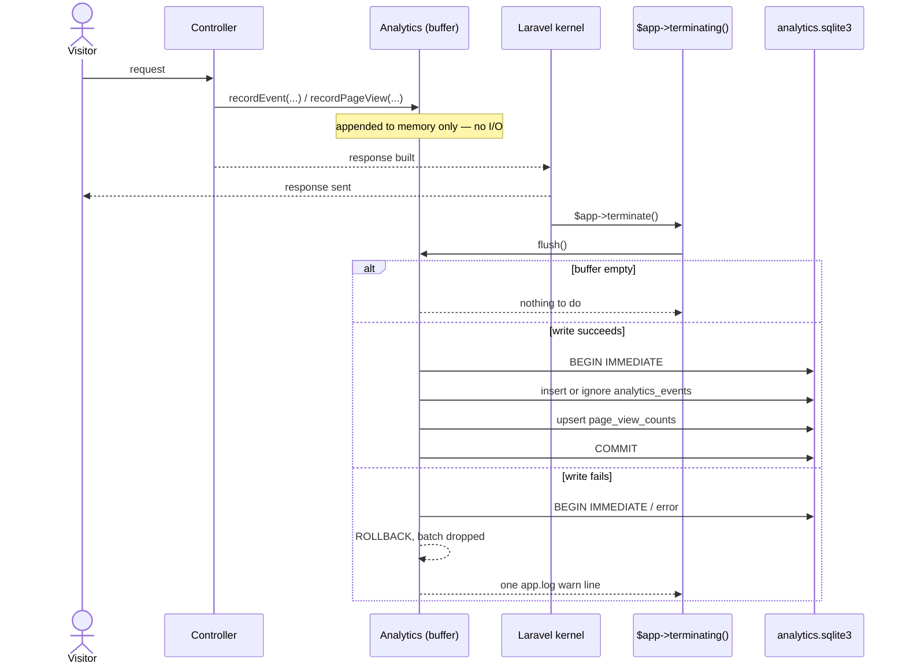

# Analytics store

The analytics store is a SQLite file of its own, separate from the commerce
database. It counts page views and listing interactions (views, favorites,
unfavorites, cart adds). Analytics load never slows a shopper's or seller's
page. `App\Analytics\Analytics` is the one entry point: every recording
call appends to an in-memory buffer and does no I/O; a later flush turns
the buffer into rows.

Code: `app/Analytics/{Analytics,AnalyticsEvent,AnalyticsEventRow,AnalyticsReport,AnalyticsVisit,ActorVisitRow,ListingEventCounts,RequestFacts,RowChannel}.php`,
`app/Domain/Analytics/{AnalyticsEventName,Channel}.php`,
`app/Providers/AnalyticsServiceProvider.php`, the `analytics` connection in
`config/database.php`, `config/analytics.php`, `app/Logging/RequestMarks.php`,
`app/Domain/Retention/RetentionDays.php`, `database/migrations/*_create_analytics_events_table.php`,
`database/migrations/*_create_page_view_counts_table.php`,
`database/migrations/*_create_analytics_visits_table.php`,
`app/Models/PageViewCount.php`, `app/Domain/Listings/ListingViewCollapse.php`,
`app/Domain/Analytics/{PageViewCountability,PageViewDay,PageViewSite,PageViewWeek}.php`,
`app/Http/Middleware/RollUpPageViews.php`, `App\Console\Commands\Sweep\SweepAnalytics`;
the admin drill-in reads through `app/Analytics/Admin/`,
`app/Domain/Analytics/` (the rest of it — velocity, range, breakdown, and
change value objects), `app/Http/Controllers/Admin/Analytics/`,
`app/Http/Requests/Admin/Analytics*QueryRequest.php`, and
`resources/views/admin/analytics/`.

Four invariants govern the design:

1. **One entry point.** Every analytics emission in the code calls
   `App\Analytics\Analytics::recordEvent()` or `recordPageView()`. There is
   no second writer, and no reader ever writes.
2. **Recording does no I/O.** `recordEvent()` and `recordPageView()` only
   append to an in-memory buffer and return. Nothing a shopper or seller is
   waiting on ever waits on the analytics connection.
3. **An event's timestamp is the moment it was recorded, not the moment it
   was written.** Every buffered row carries the `occurred_at` instant its
   caller handed in, so the stored sequence is the order things happened,
   independent of when the buffer happened to flush.
4. **The store's failure is never the request's failure.** A flush that
   cannot commit logs one `warn` line and drops the batch; the request or
   command that triggered it has already finished by the time that happens.

## The second database

The store is its own SQLite file: the `analytics` connection in
`config/database.php`, named by `ANALYTICS_DATABASE_FILE` (default
`storage/analytics.sqlite3`, beside the log store). WAL, `synchronous =
off` (losing a buffered count on a crash is acceptable), `busy_timeout =
250` (a twentieth of the commerce connection's 5000, so a contended flush
fails fast and no request waits behind it), and foreign keys off — the
store's rows reference commerce rows by id only, across two separate SQLite
files.

The three tables' migrations run on the `analytics` connection and drop their
table before creating it: the migrations ledger lives in the app database,
so rebuilding it (`make fresh`, a deleted `database.sqlite`) re-runs every
migration, including these, against an analytics file that may still hold
the table from before.

## Flush lifecycle

`App\Providers\AnalyticsServiceProvider` binds the process's one `Analytics`
handle as a container singleton and registers the flush against
`$app->terminating()`. `handleRequest()` sends the HTTP response before
calling `$kernel->terminate()`, and `handleCommand()` calls
`$kernel->terminate()` after an artisan command's `handle()` returns the same
way — both kernels' `terminate()` end by calling `$this->app->terminate()`,
which runs every `terminating()` callback, the one mechanism the HTTP and
console kernels share. The callback flushes only a store the request or
command actually resolved: a request that never calls `recordEvent()` or
`recordPageView()` never constructs an `Analytics` instance, so most
requests pay nothing here.

`Analytics::__construct()` also registers a `register_shutdown_function`
fallback flush, for a process that exits without `terminating()` ever
firing. A buffer that reaches 256 rows (`Analytics::FLUSH_AT`) flushes
immediately rather than waiting for either hook, the same cap `App\Logging\LogStore`
uses for its own chunked inserts. A flush that already ran leaves the buffer
empty, so a second call — the shutdown fallback running after `terminating()`
already flushed — finds nothing to do.

Every write in one flush runs inside a single `BEGIN IMMEDIATE` transaction:
`IMMEDIATE` so a concurrent flush fails fast against `busy_timeout` rather
than blocking on a lock upgrade mid-write. Inside `Tests\TestCase`'s
`RefreshDatabase` wrapper, the connection is already inside a transaction, so
the writes join that transaction instead of opening their own, and its own
commit or rollback decides their fate.

`Analytics::reassignActor()` is the one write outside the buffer-and-flush
path: an immediate `UPDATE` on `analytics_events.actor_id`, called by
`App\Actions\Customers\MergeAnonymousCustomer` after the commerce merge
transaction commits, to re-point every row an anonymous customer already
owns onto the verified customer they merged into. It never throws — a
failure logs the same one warning shape `flush()` does, and the merge's
commerce writes stand regardless.

## Schema

`analytics_events`:

| Column         | Type                     | Notes                                                         |
| -------------- | ------------------------ | ------------------------------------------------------------- |
| `id`           | text(30) PK              | prefix `aev`                                                  |
| `name`         | string                   | closed vocabulary — see below                                 |
| `occurred_at`  | timestamp                | UTC; the instant recorded, not the instant written            |
| `subject_type` | string, nullable         | `listing`, `cart`, `order`, `store`, or `help_article`        |
| `subject_id`   | text(30), nullable       | `listings.id`, `carts.id`, `orders.id`, `store_profiles.id`, or a help article's slug; no FK |
| `actor_id`     | text(30), nullable       | references e.g. `customers.id`, no FK                         |
| `ip`           | string(45), nullable     | the request's ip; null for a CLI run                          |
| `session_id`   | string, nullable         | the `sid` cookie's value; null for a CLI run                  |
| `dedupe_key`   | string, nullable, unique | the listing-view hour collapse                                |
| `data`         | text (JSON)              | event-specific payload; `request_id` when there was a request |

Indexes: `(subject_id, name)`, `(name, occurred_at)`, `actor_id`, `ip`, `session_id`.

`page_view_counts` holds `id` (prefix `pvc`), `site`, `path_pattern`,
`day`, and `count`, unique on `(site, path_pattern, day)`.

`analytics_visits`:

| Column          | Type                | Notes                                          |
| --------------- | ------------------- | ----------------------------------------------- |
| `session_id`    | text(30) PK         | the `sid` cookie's value                         |
| `first_seen_at` | timestamp           | UTC; the moment the row was captured             |
| `landing_path`  | string              | the path of the first request that carried this session |
| `referrer_host` | string, nullable    | the `Referer` header's host, foreign hosts only  |
| `utm_source`    | string(255), nullable | stored as given, capped at 255                 |
| `utm_medium`    | string(255), nullable | stored as given, capped at 255                 |
| `utm_campaign`  | string(255), nullable | stored as given, capped at 255                 |
| `utm_content`   | string(255), nullable | stored as given, capped at 255                 |
| `utm_term`      | string(255), nullable | stored as given, capped at 255                 |
| `actor_id`      | text(30), nullable  | references e.g. `customers.id`, no FK; filled when the request already has one, or later, when one is claimed |

Indexes: `first_seen_at`, `(utm_source, utm_medium)`, `actor_id`.

**A visit is first-touch per session cookie.** The `sid` cookie lives a
year, but `analytics_visits` holds one row per session for its whole
life: `App\Analytics\Analytics::recordVisit()` buffers whatever
`App\Analytics\AnalyticsVisit::fromRequest()` builds off the current
request, and `flush()` writes it `INSERT OR IGNORE` on `session_id`, so
only the first request of a session ever changes a row — every later
request in that session's year is a no-op write. First-touch is the
simpler definition and the one that answers "which channel brought this
visitor", the question a marketing decision waits on; a thirty-minute
session-gap definition was considered and set aside for that reason.

**Where it is captured.** `App\Http\Middleware\RollUpPageViews::terminate()`
records the visit, not `NameRequestVisitor` where the `sid` cookie is
minted: `RollUpPageViews` already computes whether a response is
countable (`PageViewCountability`) and which site a route pattern belongs
to (`PageViewSite`), and both are only knowable once the response exists
— `NameRequestVisitor` runs in `handle()`, before there is a response to
ask. A visit is captured only for the storefront (`PageViewSite::Shop`);
an admin or seller page records nothing. `App\Analytics\RequestFacts`
supplies the session id, including its fallback to the cookie
`NameRequestVisitor` just queued for a browser's first-ever request, so
the very first request a new visitor makes still records a visit under
the id it was just given.

A visit's `actor_id` stays null until the visitor's first tracked event,
since `App\Http\Middleware\ResolveCustomerIdentity` mints a `customers` row
lazily rather than on arrival (docs/spec.md §4.1). `App\Shop\CustomerIdentity::commit()`
claims the row for that session at that point (`Analytics::claimVisit()`),
so a session that lands on a read-only page before the event that makes it
a customer still keeps its first-touch channel and landing page.

## Vocabulary

`App\Domain\Analytics\AnalyticsEventName` is the closed enum every `recordEvent()`
call names: `listing.view`, `listing.favorite`, `listing.unfavorite`,
`listing.cart_add`, `checkout.open`, `order.place`, `order.pay`,
`order.cancel`, `store.view`, `help.answered`, `help.unanswered`. A reader
greps this one file for every name the store accepts.

A `listing.view` carries a `dedupe_key`
(`listing:{listingId}:customer:{customerId|"anonymous"}:hour:{UTC hour}`,
built by `App\Domain\Listings\ListingViewCollapse`) so that refreshing a
listing page repeatedly within one UTC hour writes at most one row: the
insert is `INSERT OR IGNORE`, and a second event carrying a dedupe key
already written collides on the unique index and is silently discarded — no
read happens in the request to decide whether the write is a duplicate.
`favorite`, `unfavorite`, and `cart_add` carry no dedupe key and are recorded
every time; each is a deliberate click, not a page load.

The four steps beyond the cart carry no dedupe key either and are recorded
by the code that already announces each step in the story
([`architecture.md`](architecture.md) § "The phases"), each through a
constructor-injected `Analytics`:
`Shop\CheckoutController::show` records `checkout.open` once per request,
`subject_type = 'cart'`, `subject_id` the visitor's cart id, `data.listing_ids`
the listings the cart holds. `App\Actions\Orders\PlaceOrder` records
`order.place`, `FinalizeOrder` records `order.pay` (only on an approved
payment — a decline records nothing), and `CancelOrder` records
`order.cancel`, all three `subject_type = 'order'`, `subject_id` the order
id, `data.listing_ids` the listings the order spans; `order.pay` also
carries `data.total_cents`, so a revenue report reads the paid amount
without a join back to the commerce database. Every recording happens
after the action's own commerce transaction commits, so an order placement
or payment that rolls back leaves no event behind — recording never runs
inside the commerce transaction and adds no write to the commerce database.
`App\Actions\Orders\SweepStaleOrders` cancels stale orders through
`CancelOrder`, so a swept order records `order.cancel` the same way a
customer- or admin-initiated cancellation does, with no ip or session since
the sweep runs from the console.

A seller's "Did this answer it?" click on a help article records
`help.answered` (Yes) or `help.unanswered` (No): `subject_type =
'help_article'`, `subject_id` the article's slug, `actor_id` null,
`data.seller_id` the seller. Every `App\Analytics\Admin` actor reader
resolves `actor_id` against `customers`, and a seller is never a customer,
so the seller identity travels in `data` instead —
[`seller-portal.md`](seller-portal.md)'s Support section has the routes and
the redirect shape. The dedupe key is
a UTC day and folds in the event name, so a Yes and a later No the same
day each get their own row (`App\Domain\Seller\HelpArticleFeedbackCollapse`).
The event page's own breakdown for these two names is `App\Domain\Analytics\EventBreakdown::Article`
— one row per article slug, the vocabulary's only subject-shaped
breakdown that names neither a listing nor an actor.

## Readers

`App\Analytics\AnalyticsReport` is the query layer over `analytics_events`:

- `countsForListing($listingId)` — one listing's view/favorite/cart-add
  tally, for the seller and admin listing-detail pages.
- `dailyCountsForListingSince($listingId, $from)` — the same, grouped by day
  and name, for the seller listing-detail page's activity timeline.
- `eventsForIp($ip, $from)` / `eventsForSession($sessionId, $from)` —
  everything one ip or one session did since `$from`, newest first, as a
  list of `AnalyticsEventRow` (name, `occurredAt`, subject, actor, ip,
  session, and the request id read back out of `data`). How an operator
  isolates what a scripted or abusive visitor did, and steps from a row to
  the request that produced it via its `request_id`.
- `visitsForActor($actorId)` — an actor's own `analytics_visits` rows,
  newest first, each read back as an `App\Analytics\ActorVisitRow`
  (`sessionId`, `firstSeenAt`, `landingPath`, and the
  `App\Domain\Analytics\Channel` it derives to) — a visitor's analytics
  page's source for the origin of each of their visits.

## Channels

`App\Domain\Analytics\Channel::derive()` is the pure precedence every
channel reads through: a campaign named by `utm_source`/`utm_medium`/`utm_campaign`
wins, then the `Referer` header's host mapped to a search engine, a social
network, or a bare referral, then direct. `Channel::key` is what a report
groups by (`campaign:sept`, `search:google`, `social:instagram`,
`referral:example.com`, `direct`); `Channel::label` is what a reader sees.

`App\Analytics\Admin\ChannelTable::forRange($range)` is the admin channel
report: one `ChannelRow` per channel — `channelKey`, `label`, and five
`ChannelMetric`s (`visitors`, `views`, `cartAdds`, `ordersPlaced`,
`ordersPaid`), each carrying its count for the range, the count for the
range before, and the `RangeChange` between them — ordered by visitors,
most first.

- **Visitors** read straight off `analytics_visits`: one query groups the
  visits whose `first_seen_at` falls in the window by their raw
  attribution columns (`utm_source`, `utm_medium`, `utm_campaign`,
  `referrer_host`), split into the current and the previous range the same
  way every other admin analytics reader splits a window.
- **Views, cart adds, orders placed, orders paid** read `analytics_events`
  joined to `analytics_visits` on `session_id` — one query, since both
  tables live in the one analytics SQLite file — grouped by the same raw
  attribution columns plus the event name. A two-query, PHP-side join was
  the alternative considered; the one-query join reads fewer rows into PHP
  for a range with many events, since SQL does the grouping.
- Every group either query returns derives its `Channel` in PHP
  (`Channel::derive()` is not expressible in SQL), and rows whose derived
  key matches are folded into one — two raw attribution tuples can derive
  the same channel (`twitter.com` and `x.com` both read
  `social:x/twitter`), which is why the fold happens after the SQL
  grouping rather than in the query itself.

**The channel pages.** `GET /admin/analytics/channels?range=`
(`admin.analytics.channels.index`) renders `ChannelTable::forRange()`'s rows
as a table (a card-list fallback below `sm`) ordered by visitors, most
first, each cell carrying the range's own count and the `RangeChange`
against the range before in the tone classes every other admin analytics
page uses; the whole row taps through to that channel's own visitors.
`GET /admin/analytics/channels/{key}?range=&page=`
(`admin.analytics.channels.show`) is that drill-in:
`App\Analytics\Admin\ChannelVisits::forRange()` derives every visit in the
range the way `ChannelTable` does and keeps the ones whose key matches,
paged the all-actors page's own way (`App\Domain\Paging\Page`, `x-admin.pager`).
A channel key names no stored row — "found" means at least one visit in
the range derives to it, so a key nothing derives to answers 404. Each row
lists when the visit started, where it landed, and the visitor: the
actor's own id chip, linked to their page, when the visit already carried
one, the session id chip otherwise. The entry page (`/admin/analytics`)
names the top three channels by visitors and their counts in a "Channels"
section, with an "All channels" link to the first page above — the same
shape its "Actors by velocity" section already uses for `/admin/analytics/actors`.

`App\Models\PageViewCount`'s own static methods (`totalForWeek`,
`totalsByDay`, `totalsByPattern`) read `page_view_counts` directly and are
unchanged.

Every reader here is unguarded: an unavailable store surfaces as whatever
error the connection throws, the way a missing data source reads anywhere
else in the app. Only the write path is guarded — see invariant 4 above.

`Listing` and `Customer` no longer expose an `events()` relation or event
counts as model attributes; a controller that needs them calls
`AnalyticsReport` directly and hands the result to the view as its own
variable (`eventCounts`). The admin listing page's "Favorited" figure is the
count of standing `favorites` rows in the app database
(`loadCount('favorites')`), not an analytics tally — a favorite un-favorited
and re-favorited writes two analytics events but the standing table still
holds at most one row.

## Reading the store: the admin drill-in

`/admin/analytics` and the eight pages under it ([`admin.md`](admin.md)
§ "Analytics drill-in") read `analytics_events` and `page_view_counts` through a second
query layer, `App\Analytics\Admin\`, kept apart from `AnalyticsReport` the
way the log viewer keeps `App\Logging\Admin\` apart from `App\Logging\LogStore`.
Every class in it is a static, stateless reader — no writer lives here.

- `EventTotals::forRange()` — every event name's current-vs-previous totals,
  distinct subject/actor counts, and daily series, plus the `page.view`
  roll-up; the entry page's events table.
- `ActorAggregates::forRange()` — every actor that carried an event in the
  range, aggregated once (totals, busiest UTC hour, first-seen-ever, ips);
  an internal collaborator, not read by a page directly.
- `ActorLeaderboard::forRange()` — `ActorAggregates`' result sorted by peak
  events per hour and capped to six; the entry page's leaderboard.
- `ActorList::forRange()` — the same aggregation sorted by the all-actors
  page's own `ActorSort` and paged; the all-actors page.
- `ActorIdentity::of()` — a customer read as `anonymous`/`verified` plus what
  to call them; shared by `ActorAggregates`, `AnalyticsJump`, and
  `EntityActivity`'s listing-page feed, so the same actor never reads two
  different ways on two different pages.
- `AnalyticsJump::for()` — a pasted search string read as a jump to exactly
  one listing or actor: a `lst_`/`cus_` id prefix, or an ip every event in
  the store agrees belongs to one actor; the entry page's jump row.
- `EventDetail::forRange()` — one event name's range tiles, daily series, and
  breakdown by listing, actor, article (`help.answered`/`help.unanswered`),
  or (`page.view`) route pattern; the event page.
- `EntityActivity::forListing()` / `forStore()` / `forActor()` — one
  listing's, one store's, or one actor's identity facts, range tiles,
  strip, and event feed, sharing every query and formatting helper across
  the three; the listing, store, and actor pages. `forStore()`'s identity
  facts carry the store's slug, its seller's name, and its visibility, and
  its one action links to the seller's own admin page — the store page and
  the seller page link each other both ways, and the admin seller list and
  detail pages carry the same store name, link, and visibility. An actor's
  feed reads its rows' own subject — a listing, an order, a cart, or a
  store — rather than assuming every subject is a listing; see "The funnel"
  below for the order and cart shape. Every feed row naming a store links
  to `admin.analytics.stores.show` the way a feed row naming a listing
  already links to `admin.analytics.listings.show`. `forActor()` also reads
  `AnalyticsReport::visitsForActor()` once: the identity card's "First
  channel" fact reads the earliest visit's `Channel` (the list comes back
  newest first, so the earliest is its last element), and the same list,
  capped at 20 and still newest first, is the actor page's "Visits" panel
  between the identity card and the tiles — first seen, channel label,
  landing path, and referrer host when the visit carried a foreign one.
  `forListing()` carries no visits — a visit belongs to a session, not to
  a listing — so the panel never renders there.
- `Funnel::forRange()` / `forListing()` / `forSeller()` — the whole
  storefront funnel, visitors through paid orders, for the store, one
  listing, or one seller; see "The funnel" below.
- `SqlInstant::format()` — the one place a moment is formatted the way
  `occurred_at` compares against it; every query class above that bounds a
  range by that column goes through it.

The pure values these assemble from live in `App\Domain\Analytics\`:
`AnalyticsRange` (a window of whole UTC days, its previous window, day
labels, and the caption comparing the two), `RangeChange` (a signed
percentage and its `ChangeDirection`, "new" for a zero previous count, flat
under 0.5%), `BarStrip` (scales a daily or hourly series onto bar heights,
never shorter than 2px; `baseline()` scales a signed series around a zero
line, returning a `BarStripBaseline` — bars, the pixel row zero falls on,
and the strip's own height), `EventBreakdown` (which breakdowns an event name
allows and its default), `ActorKindFilter` and `ActorSort` (the actor
segmented controls), `JumpKind` (which route a `Jump` links to), and
`ActorVelocity`/`FlaggedActorSummary` below.

**The velocity flag.** `ActorVelocity::THRESHOLD_PER_HOUR` (100) is the one
number that decides whether an actor reads as scripted or abusive:
`ActorAggregates::forRange()` computes every actor's busiest UTC hour in the
range once for the leaderboard, `EntityActivity::forActor()` computes the
same actor's own busiest hour again for its own page, and both call
`ActorVelocity::flags($peakPerHour)` — the one shared predicate, so the
leaderboard and the actor's own page never disagree about who is flagged. A
flagged actor's page swaps its daily strip for an hourly one on the peak day
(`EntityActivity::hourlyStripBars()`, each bar's own hour tinted hot at or
past the threshold) and shows a banner built by
`FlaggedActorSummary::text()`: the peak count, the hour window, the busiest
ip in that hour, the count of distinct listings touched in it, one-event
rate in seconds, and whether the actor ever favorited or cart-added in the
range at all.

**The first request's session.** `RequestFacts::current()` reads a
returning browser's `sid` off the request cookie; a browser's first request
carries none yet, since `NameRequestVisitor` mints the cookie and queues it
on the response without rewriting the request in hand. `RequestFacts` falls
back to `Cookie::queued(RequestMarks::SESSION_COOKIE)?->getValue()` for that
case, so the very first event a new visitor causes carries the session id
they were just given; without the fallback it lands null, a gap on an
actor's own feed.

**Query-count tests.** Each of the eight pages carries a test that seeds a
growing number of actors, listings, or feed events and asserts a fixed query
count on both the default and the analytics connections, so none of them
regresses into a query per row:

| Page                                 | Fixture                 | Default | Analytics |
| ------------------------------------ | ----------------------- | ------- | --------- |
| `/admin/analytics`                   | 12 actors               | 3       | 14        |
| `/admin/analytics/events/:name`      | 8 listings (by-listing) | 4       | 5         |
| `/admin/analytics/actors`            | 15 actors               | 2       | 4         |
| `/admin/analytics/actors/:customer`  | 15 feed events          | 4       | 12        |
| `/admin/analytics/listings/:listing` | 15 feed events          | 7       | 10        |
| `/admin/analytics/stores/:store`     | 15 feed events          | 5       | 6         |
| `/admin/analytics/channels`          | 3 channels              | 1       | 3         |
| `/admin/analytics/channels/:key`     | 15 visits               | 1       | 2         |

Every row's own analytics-connection count carries one statement no page
here reads on purpose: `App\Http\Middleware\RollUpPageViews` upserts
`page_view_counts` for every countable admin hit the same way it does for
the storefront, so every page in this table pays one write on top of its
own reads. The two channel pages' own default count is one lower than every other page here:
neither resolves a `Customer` or `Listing` row by id, so their one
default-connection query is the admin chrome's own tallies, with no
identity lookup added on top.

## The funnel

A funnel is admin data: `App\Models\Funnel` stores a name, a unique slug,
a `steps` JSON list of event names in order, and a `position` that orders
its tile on the analytics home. `App\Domain\Analytics\FunnelDefinition`
validates that list — two or more names, each a known
`AnalyticsEventName`, none repeated — and exposes it as a
`list<AnalyticsEventName>`; the model's `steps()` method and
`App\Http\Requests\Admin\FunnelRequest` both build one before trusting a
funnel's steps. Visitors is every funnel's implied first step and is
never stored — a two-name `steps` list reads as a three-tile funnel.
`FunnelDefinition::storefront()` is the built-in default (`listing.view`,
`listing.cart_add`, `checkout.open`, `order.place`, `order.pay` —
favorites sits off this list; see below), seeded as the "Storefront"
funnel by `Database\Seeders\FunnelSeeder`, which runs unconditionally
alongside `AdminSeeder` so the row exists on every `make fresh` and every
deploy, not only a freshly seeded demo database. Admins create, edit,
reorder, and remove funnels at `/admin/funnels`
([`admin.md`](admin.md) § "Analytics drill-in").

`App\Analytics\Admin\Funnel::forRange()`/`forListing()`/`forSeller()` take
a `FunnelDefinition` and a range (`forListing()`/`forSeller()` also the
scope) and return an ordered `FunnelView` of `FunnelStep`s: visitors, then
one step per name in the definition, in order. Each step carries:

- `key` — the event name it counts, or `visitors` for the first step.
- `label` — `AnalyticsEventName::pluralLabel()`, or `Visitors`.
- `current`/`previous` — the step's count for the range and the range
  before.
- `change` — `RangeChange` between them.
- `rate` — `App\Domain\Analytics\FunnelRate` against the step immediately
  before it in the definition (visitors for the first named step), a
  whole percentage and the ratio it rounds from, plus the prerequisite's
  own label, lowercased, for the "N% of {label}" a page renders; null on
  the visitors step, which has no prerequisite.
- `shareOfFirst`/`previousShareOfFirst` — `App\Domain\Analytics\FunnelShare`:
  the step's count as a percentage of the funnel's own first step
  (visitors), for this range and the range before, floored at 2% so a
  real, nonzero share still reads as a sliver rather than an empty cell;
  0% when the first step itself is zero.
- `isLargestDrop` — true on the one step whose `rate` is the lowest among
  every step that carries one.
- `note` — only on an `order.pay` step: the range's cancelled *sessions*
  ("N cancelled"), always present even at zero. Orders cancelled is not a
  step of its own, so a placed order that never pays is still visible
  without a denominator.
- `side` — only on a `listing.view` step: the range's favorited
  *sessions* ("N favorited"), always present even at zero. Favorites sits
  off the buying path — a viewer may favorite a listing they never add to
  cart — so it never becomes a step of its own; it rides along as a side
  count on the viewed step instead.

**The unit.** Every named step counts distinct `session_id`s among the
events that carry its own name, a session id, and the scope — never a raw
event count, so a session that views the same listing three times still
counts once. Visitors, the funnel's own first step, counts distinct
session ids among *every* event in the scope, the same way. A step is
therefore a subset of the sessions "visitors" counts, and the store-wide
funnel's own first-step count is every session that touched the store in
the range.

Scopes: `forRange()` reads every event in the range, unscoped. `forListing()`
and `forSeller()` (the seller's listing ids read from the app database in
one query) narrow every step to the events that belong to those listings.
A listing view, favorite, or cart add belongs to a listing by
`subject_type = 'listing'` / `subject_id`, the way every other admin
analytics page already reads it. A checkout, order placement, order
payment, or order cancellation has no listing subject — its subject is a
cart or an order — so it belongs to a listing through the `data.listing_ids`
JSON array `App\Orders\OrderListingIds` and
`Shop\CheckoutController::show` write onto it, read back with SQLite's
`json_each` (`exists (select 1 from json_each(data, '$.listing_ids') where
value in (…))`) rather than a join, since the two connections are separate
SQLite files. An order that spans two listings counts once on each
listing's own funnel — the scope test is per listing, not a split of one
order across the two.

Recorded through `App\Analytics\Analytics::recordEvent()` the same as
every other event (see "The second database" above), `Funnel::forRange()`
computes every step in two statements against `analytics_events`: one
grouped by name, distinct session ids, for every name the definition's
steps need (plus `order.cancel` when `order.pay` is a step, plus
`listing.favorite` when `listing.view` is a step); one for the distinct
session visitor count. `forListing()`/`forSeller()` run the same two
statements with the listing scope's `WHERE` clause added — the funnel
never issues a query per step, whatever the definition's length.

A test seeds orders through `App\Actions\Orders\PlaceOrder` and
`FinalizeOrder`, binding a distinct session per order, flushes the
analytics buffer, and asserts the funnel's placed and paid counts against
`Order::query()`'s own counts for the same range — the funnel's numbers
agree with the app database's.

**On the admin pages.** `x-admin.analytics.funnel` renders a `FunnelView`
as a shared-borders grid, one cell per step, each with two stacked bars
(this range's share of the first step, the previous range's own share
beneath it) and the "largest drop" badge on the one step `isLargestDrop`
marks — see [`admin.md`](admin.md) § "Analytics drill-in" for where it is
mounted: the listing and seller pages always render the storefront funnel
this way; the analytics home shows a small tile per funnel instead
(below) and links each one to its own detail page, drawn by this same
component, with a range control. [`funnel.md`](funnel.md) fixes the boundary
between this query and that component — the step contract `FunnelStep`
carries and the drawing rules the component follows.

**Tiles on the analytics home.** `App\Analytics\Admin\FunnelTiles::forRange()`
reads every funnel in `position` order, capped at eight — a row wider
than that reads as a list, not a row of tiles, and `/admin/funnels` is
where the rest of them live — and returns one `App\Analytics\Admin\FunnelTile`
per funnel: its name, its end-to-end conversion for the range (the last
step's sessions as a share of visitors, "—" rather than a division when
the range held no visitors), and the change in the last step's own count
against the range before. One `Funnel::forRange()` read per tile, the
same fixed-cost-per-funnel shape the query already keeps — the home never
issues a query per step or per actor. Each tile links to
`admin.analytics.funnels.show`.

## Test isolation

`phpunit.xml` sets `ANALYTICS_DATABASE_FILE=:memory:` and
`ANALYTICS_RETENTION_DAYS=off`, so an ordinary test never has `sweep:analytics`
prune rows out from under it; `SweepAnalyticsTest` overrides
`config(['analytics.retention_days' => …])` per test the way it already
does for the log store. `Tests\TestCase` lists
`analytics` in `$connectionsToTransact` alongside the default connection, so
`RefreshDatabase` migrates the in-memory analytics connection once and wraps
every test in its own transaction on it — left off that list, the analytics
connection would migrate on the first test that touches it and every test
after would see whatever that first test committed. Parallel-safe by
construction: an in-memory SQLite database is per PHP process.

`Tests\AnalyticsStoreFixtures::withUnwritableStore()` points the connection
at an unwritable path for the duration of one closure, purging and later
restoring the cached PDO — the shared fixture behind every test that asserts
on the guarded-failure branch (`AnalyticsTest`, `MergeAnonymousCustomerTest`,
`Shop\ListingControllerTest`, `RollUpPageViewsTest`).

## Request facts

Every event also carries the request that produced it: `ip` and
`session_id` as their own indexed columns, and the request id folded into
`data.request_id` — a cross-link to the log store ([`log-store.md`](log-store.md)),
never a filter on its own. `App\Analytics\RequestFacts::current()` reads
all three from whatever request is current in the container, and
`Analytics::recordEvent()` calls it once per event before buffering — the
caller (`ToggleFavorite`, `AddToCart`, the shop listing page) hands over
what happened and never mentions the request at all. A CLI run (a seeder,
an artisan command) has no tracked request, and all three columns stay
null: `RequestFacts` gates on the request-id attribute
`App\Http\Middleware\LogRequestStory` stamps, present only on a real HTTP
request and never on the synthetic request the console kernel binds for
an artisan run.

## Seeded activity

`make seed-activity` (`App\Console\Commands\SeedActivity`, `App\Domain\Seeding\ActivityPlan`)
fills a `make fresh`-seeded store with ninety-plus days of deterministic
history, so the funnel, the channel table, the leaderboard, and the log
viewer all have a season's worth of traffic to read rather than a
developer's own clicks. Local dev only; it refuses in production and
refuses a second run against a database that already carries its marker
(`seed_runs`).

**The ramp.** `ActivityPlan`'s day-by-day counts start small and surge: a
real 92-day run lands near 59 / 110 / 360 new customers a month (signups
plus anonymous visits), verified signups themselves climbing from a
handful in the first month to a surge in the third — near 8 / 30 / 80,
roughly 115 overall — while anonymous visitors carry most of the traffic
in every month. Daily listing views read in the tens early on and climb
into the hundreds by the end of the window — a visibly rising strip of
daily bars at `/admin/analytics?range=90`. Listing creation ramps the
same way, so the catalog itself grows from `make fresh`'s 46 listings to
upward of 150 by the third month.

**Two bad actors.** Scripted once per plan, outside the day-by-day ramp,
once the window reaches a third month:

- **The scraper** — one anonymous visitor, one evening five days from the
  end of the window, requesting a listing page every eight to ten seconds
  for most of an hour, rotating between two addresses in the
  `185.220.101.0/24` hosting range. Every request is a plain listing view
  carrying the real dedupe key, resolved against the live catalog rather
  than the plan's own fixed pool — the only way a burst this shape clears
  `ActorVelocity::THRESHOLD_PER_HOUR` (100) under real per-listing-per-hour
  dedupe, since a smaller catalog cannot cross the threshold no matter how
  fast the requests come. No favorite, cart, or checkout step ever appears
  in its script. Findable from `/admin/analytics` (top of the "Actors by
  velocity" leaderboard), from `/admin/analytics/actors?q=185.220.101` (an
  ip search), and its own actor page carries the flagged banner and
  `FlaggedActorSummary`'s sentence.
- **The prober** — one anonymous visitor scanning credential and admin
  paths (`App\Domain\Seeding\ProbePaths`: `.env`, `.aws/credentials`,
  `.git/config`, `wp-login.php`, `/admin`, and about twenty more) across
  five nights roughly a week apart, one to two seconds apart, from a fixed
  ip. Every probe answers 404 (or 302 for `/admin`) and
  `PageViewCountability` keeps a non-2xx response out of the roll-up by
  design, so a probe writes no analytics event and no domain story
  line — only the log store carries it. A couple of ordinary listing
  views open the session; without them the prober would carry no
  analytics event and no ip at all, and an admin could not find it by ip
  search. Findable from `/admin/analytics/actors?q=45.155.205.233` (the
  one real event its opening views left behind) and from
  `/admin/logs?actor=<its id>`, where its 404 trail shows in full.

**Log lines.** Every simulated request — each ordinary step, the
scraper's and prober's own, the magic-link request and consume a sign-up
or a returning visitor's verification would have produced — gets the
`http.request` will/did pair a real request would have written
(`App\Logging\LogLine::parse()` via `LogStore::append()` directly, the
exact shape [`log-store.md`](log-store.md) documents). The real domain actions this
command drives (`AddToCart`, `PlaceOrder`, and the rest) already write
their own story lines through the ordinary `Log` facade — nothing extra
was needed for those.

**Retention.** `ANALYTICS_RETENTION_DAYS` ([Retention](#retention) below)
prunes most of a 92-day seeded run on the next `sweep:analytics`, so widen
the window or set it `off` in local dev first.

## Retention

An `ip` is personal data, and a `session_id` joins a browser's visits
together whether or not anyone signs in — keeping either forever turns a
usage log into a standing record of who visited what. `ANALYTICS_RETENTION_DAYS`
(default `30`, `off` disables) bounds both tables' history:
`App\Analytics\Analytics::prune($cutoff)` deletes `analytics_events` rows
whose `occurred_at` and `analytics_visits` rows whose `first_seen_at` are
before the cutoff, each batched and looped until none change — the same
shape `App\Logging\LogStore::prune()` uses ([`log-store.md`](log-store.md)) — and
returns the two tables' combined delete count. `sweep:analytics` runs it and
prints the combined count ("N analytics row(s) pruned."). `page_view_counts`
carries no personal
data (a route pattern and a day, never an ip or a session) and is never
pruned.
