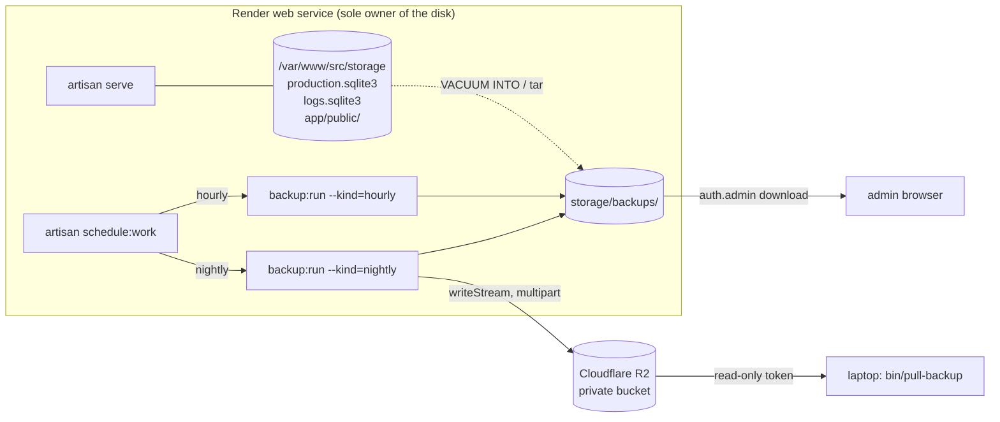

# Backups

SQLite is the production database, so a backup is a file copy and nothing
more — which is exactly why the discipline has to live somewhere. This
document fixes the design: an hourly snapshot that stays on the Render disk,
a nightly archive that carries the databases and the uploaded images to
Cloudflare R2, a `backup_runs` ledger that records every attempt, and an
admin panel at `/admin/backups` that reads it back.

Status: design. Nothing here is built yet. Encryption and credential scoping
are deferred — the mechanism lands first.

Planned code: `app/Console/Commands/{RunBackup}.php`,
`app/Backups/{BackupRunner,SqliteSnapshot,ArchiveBuilder,BackupManifest,BackupKind,BackupStore,DiskFloor,RemoteBackupDisk}.php`,
`app/Models/BackupRun.php`, `config/backups.php`,
`database/migrations/*_create_backup_runs_table.php`,
`app/Http/Controllers/Admin/{BackupController,RunBackupController,DownloadBackupController}.php`,
`routes/admin.php`, `resources/views/admin/backups/`,
`src/bin/backup`, `src/bin/deploy`, `bin/pull-backup`.

## The constraint that shapes everything

Render attaches a persistent disk to exactly one service, at runtime only. A
Render Cron Job runs in its own container and cannot see the web service's
disk. Render SSH is paid-plan only, needs Dockerfile changes for a `www-data`
whose shell is `nologin`, and documents no scp or rsync.

So: whatever copies the database runs **inside the web service's own
container**, on its own schedule, and pushes the result out over the network.
Nothing external can reach in and take it.



## Two jobs

| Job         | Cadence          | Contents                                        | Destination                    | Purpose                                                    |
| ----------- | ---------------- | ----------------------------------------------- | ------------------------------ | ---------------------------------------------------------- |
| `hourly`    | `:07` every hour | `production.sqlite3`, `logs.sqlite3`            | the Render disk, keep 24       | undo a bad hour — a migration, a bulk edit, a wrong refund |
| `nightly`   | `07:15 UTC`      | both databases + `storage/app/public` (uploads) | the Render disk + Cloudflare R2 | survive losing the disk, the service, or the account       |

One command runs both: `php artisan backup:run --kind=hourly|nightly`. The
kind selects the contents, the retention, and whether the artifact is
uploaded. Everything else — snapshotting, verification, the manifest, the
ledger row — is identical, so the nightly path is not a second
implementation that can drift from the hourly one.

`:07` and `07:15` rather than `:00` and `07:00` keep the jobs off the minute
every other scheduled thing in the world fires on.

## Invariants

1. **A backup failure is never the app's failure.** Every job runs inside its
   own try/catch, records a `failed` ledger row with the error, and returns a
   non-zero exit code. It never throws into the scheduler, never takes the
   server process with it, and never leaves a half-written artifact where a
   later run would treat it as real.
2. **An unverified copy is not a backup.** Every snapshot is reopened,
   `PRAGMA integrity_check`ed, and row-counted against a sentinel table before
   the run is allowed to report success. Every archive member is SHA-256'd
   into the manifest. A verification failure fails the run.
3. **The disk is the scarce thing.** Retention and the free-space floor run
   *before* the write that would need the room, never after. A backup that
   fills the disk takes the store down — which is a worse outcome than the
   missed backup it was trying to prevent.

## Layout on the disk

```
storage/
  production.sqlite3            the commerce database
  logs.sqlite3                  the log store
  app/public/                   uploaded listing images
  backups/
    tmp/                        in-progress work; emptied at the start of every run
    hourly/
      2026-08-30T15-07-00Z/
        production.sqlite3
        logs.sqlite3
        manifest.json
    nightly/
      2026-08-30T07-15-00Z.tar.gz
      2026-08-30T07-15-00Z.manifest.json
```

Directory names are the run's UTC instant in a filename-safe ISO-8601
(`:` → `-`), so lexical order is chronological and no filesystem needs to be
asked when something happened.

`storage/backups/` sits on the disk it backs up, and `storage/app/public` is
the only part of `storage/` the archive walks — so an archive can never
contain a previous archive. That exclusion is by construction (an explicit
member list), not a `--exclude` flag someone can forget.

## Snapshotting a live SQLite file

`VACUUM INTO` is the mechanism. Not `cp`, not `tar` over the live file:
either can catch a page mid-write, and with WAL enabled a file copy that
misses the `-wal` sidecar is a database missing its most recent commits.

```php
// destination must not exist; SQLite refuses to overwrite
$statement = $pdo->prepare('VACUUM INTO ?');
$statement->execute([$destination]);
```

Verified against the image (SQLite 3.46.1): the destination binds as a
parameter — `VACUUM INTO` takes an expression, so the path is never
interpolated into SQL — and an existing destination is refused with
`output file already exists`. That refusal is a feature: every run writes
into `storage/backups/tmp/` under a fresh name and renames into place only
once verification passes, so a crashed run leaves nothing that looks
finished.

What `VACUUM INTO` gives that a copy does not: it takes a read lock for the
duration and emits a single consistent, defragmented file with no `-wal`
sidecar to carry along. What it costs: writers block while it runs, bounded
by database size. At the app's current scale that is milliseconds. If
the commerce database ever grows past the point where an hourly lock is
noticeable, the answer is `sqlite3_backup` in incremental steps, not a
cheaper copy.

There is no `sqlite3` CLI in the image and no reason to add one — everything
here goes through PDO, which is already there.

**Two databases, two handles.** The commerce file comes off Laravel's
connection (`DB::connection('sqlite')->getPdo()`); the log store comes off
`LogStore::$connection`, its own handle. `VACUUM` cannot run inside a
transaction, so the runner asserts `PDO::inTransaction()` is false before
issuing it.

**The log store buffers.** `LogStore` holds rows in memory and flushes at 256
rows or process exit, so a snapshot taken from the scheduler's process sees
neither its own buffered lines nor any other process's. The runner calls
`flush()` on its own store first; lines buffered in the server's worker
processes at that instant are simply not in that snapshot. Log lines are
telemetry — the mirror is allowed to be a few lines behind. Recording this
here so nobody later reads a gap as corruption.

## The nightly archive

Uploads are ordinary files, so `tar` walks them. `tar` and `gzip` are both in
the base image (confirmed), which is why the archive shells out rather than
using `PharData` — `PharData` works (it is exempt from `phar.readonly`) but
buffers per entry and grows badly with the image count.

```
2026-08-30T07-15-00Z.tar.gz
├── manifest.json
├── production.sqlite3          (the VACUUM INTO output, not the live file)
├── logs.sqlite3
└── uploads/…                   storage/app/public, verbatim
```

The two databases are snapshotted first, into `backups/tmp/`; `tar` then
takes the snapshots and the uploads directory as an explicit member list.
The live database files are never handed to `tar`.

Uploads are written once and never mutated — a new image appears under a new
name, an existing file's bytes do not change — so a `tar` running against a
live uploads directory can only ever miss a file that arrived mid-walk, never
tear one. It cannot produce a half-written image. Recording the ceiling on
the inconsistency rather than pretending the walk is atomic.

The manifest goes in first so that reading the head of the archive tells you
what the rest of it is.

## The manifest

One JSON document, written into the archive and kept beside it on disk:

```json
{
  "id": "bkp_01J5X3M9A2K8YB7Q4R6T1V0WZE",
  "kind": "nightly",
  "created_at": "2026-08-30T07:15:00Z",
  "app": { "env": "production", "version": "8612c16" },
  "members": [
    { "path": "production.sqlite3", "bytes": 778240, "sha256": "…",
      "integrity_check": "ok", "row_counts": { "orders": 412, "listings": 96 } },
    { "path": "logs.sqlite3", "bytes": 4194304, "sha256": "…",
      "integrity_check": "ok", "row_counts": { "log_lines": 118432 } },
    { "path": "uploads/", "files": 214, "bytes": 96237112 }
  ],
  "archive": { "bytes": 71229440, "sha256": "…" }
}
```

`row_counts` is what makes a silently-empty backup visible. A file that opens
cleanly, passes `integrity_check`, and contains zero orders is a successful
backup of nothing; the count in the manifest is what the admin panel compares
against the previous run so a collapse shows up as a number rather than as a
discovery during a restore.

The archive's own SHA-256 is computed while streaming and is what the laptop
puller and the admin panel check a downloaded copy against.

## Cloudflare R2

R2 speaks S3, so it is a Laravel filesystem disk and nothing more exotic.
`league/flysystem-aws-s3-v3` is the one new dependency.

```php
// config/filesystems.php
'backups' => [
    'driver' => 's3',
    'key' => env('BACKUP_R2_ACCESS_KEY_ID'),
    'secret' => env('BACKUP_R2_SECRET_ACCESS_KEY'),
    'region' => 'auto',
    'bucket' => env('BACKUP_R2_BUCKET'),
    'endpoint' => env('BACKUP_R2_ENDPOINT'),   // https://<account>.r2.cloudflarestorage.com
    'use_path_style_endpoint' => true,
    'throw' => true,     // the runner catches; a silent upload failure is the worst case
    'report' => false,
],
```

`'throw' => true` is the departure from the other disks in that file, and it
is deliberate. Laravel's default swallows a write failure and answers
`false`; a backup that reports success because nobody checked a return value
is precisely the failure this whole document exists to prevent.

Object key: `art-store/php/<env>/<kind>/<YYYY>/<MM>/<YYYY-MM-DD>T<HH-MM-SS>Z.tar.gz`,
with the manifest beside it as `.manifest.json`. The date hierarchy keeps a
console listing navigable and lets a lifecycle rule target a prefix.

Upload is `Storage::disk('backups')->writeStream()`. The S3 adapter promotes
that to a multipart upload above its threshold, so a multi-gigabyte archive
never lands in PHP memory. The stream handle is closed in a `finally`.

**Retention in the bucket is an R2 lifecycle rule, not application code** —
"delete objects under `.../nightly/` older than 30 days", configured once in
the Cloudflare dashboard. Keeping deletion out of the app means the app's
credential never needs `DeleteObject`, and a bug in a retention loop cannot
erase history.

**Credentials.** Two R2 API tokens, each scoped to the one bucket:

| Holder            | Permission            | Why                                                                                     |
| ----------------- | --------------------- | ---------------------------------------------------------------------------------------- |
| the Render service | Object Read and Write | write the archive; `HEAD` it afterwards to confirm size and ETag match the manifest      |
| the laptop        | Object Read only      | `bin/pull-backup` downloads; it can never overwrite or delete what it is mirroring        |

Neither token can delete. An attacker with the app's credential can add
objects and read them; they cannot destroy the backup history. That property
is worth the small awkwardness of managing retention in a second place.

The post-upload `HEAD` is what turns "the write returned" into "the object is
there at the size we sent". Without it, `uploaded` in the ledger means only
that no exception was raised.

## Encryption

**Deferred; the decision below still stands to be made.**
The archive contains customer email addresses, shipping
addresses, and order history. R2 encrypts at rest and the bucket is private,
which is the minimum bar and is met by the design above. It is not the same
as the archive being unreadable to anyone who obtains the object.

The recommendation is to encrypt before upload with libsodium's
`crypto_secretstream_xchacha20poly1305`, chunked over the stream. `sodium` is
compiled into the image (confirmed) so this adds no dependency, it streams so
it costs no memory, and it is authenticated so a corrupted download fails
loudly rather than restoring garbage. The key is a 32-byte value in
`BACKUP_ENCRYPTION_KEY`, generated once and stored in a password manager.

The cost is real and should be stated plainly: **lose that key and every
backup is landfill.** It is a second secret with a different lifetime from
`APP_KEY`, and it has to survive the laptop it was generated on.

If encryption is deferred, `bin/pull-backup` and the restore path get simpler
and the decision is reversible — new archives encrypt, old ones stay
readable, and the manifest carries an `encryption` field so the puller knows
which it is holding. Deferring is defensible for a store with only seeded
data. It stops being defensible the day a real customer places a real order.

## Scheduling on Render

Nothing in this deployment schedules anything today. `composer run deploy`
chains `migrate` → `seed` → `serve`, and there is no scheduler process, which
is why `payouts:run` and `orders:sweep` have only ever been run by hand.
Periodic backups need that fixed, and fixing it is what makes the other two
jobs automatic as a side effect.

Replace the composer `deploy` script with `src/bin/deploy`:

```sh
#!/usr/bin/env bash
set -euo pipefail

mkdir -p storage/app/public storage/framework/{cache,sessions,testing,views} storage/logs storage/backups/{tmp,hourly,nightly}
touch "${DB_DATABASE:-database/database.sqlite}"

php artisan migrate --force
php artisan db:seed --force

php artisan schedule:work &
scheduler=$!
trap 'kill "$scheduler" 2>/dev/null || true' EXIT

exec php artisan serve --host=0.0.0.0 --port=8000 --no-reload
```

Render's Docker Command field passes no shell, so it invokes `bin/deploy`
directly — the shebang supplies the shell, the same way `composer run deploy`
supplies it today. Two processes now live in the container: the server, and a
scheduler that wakes every minute. `schedule:work` costs a few MiB and one
`artisan` boot per minute.

`exec` on the last line keeps the server as PID 1 so Render's stop signal
reaches it, and the `trap` takes the scheduler down with it.

That shape is adequate beside `artisan serve`. Moving the deploy target to
FrankenPHP, and a container running a server plus a scheduler as two
long-lived processes, wants real supervision — s6 or supervisord — rather
than `&` and a trap. Whichever change lands second owns reconciling the
process model.

```php
// routes/console.php
Schedule::command('backup:run --kind=hourly')->hourlyAt(7)->withoutOverlapping();
Schedule::command('backup:run --kind=nightly')->dailyAt('07:15')->withoutOverlapping();
Schedule::command('orders:sweep')->dailyAt('03:00')->withoutOverlapping();
```

`withoutOverlapping()` matters here more than usual: a nightly archive that
runs long must not have the next hourly snapshot start writing into
`backups/tmp/` underneath it.

Both jobs stay hand-runnable — `make backup KIND=nightly` locally, the admin
panel's **Run now** in production — so the scheduler is the convenience, not
the only path. That is also the fallback if `schedule:work` turns out to
misbehave in the container: the feature still works, someone just has to
press a button.

## Retention and the disk floor

Before any run writes a byte:

1. Delete artifacts beyond the keep count for that kind (`BACKUP_KEEP_HOURLY`,
   default 24; `BACKUP_KEEP_NIGHTLY`, default 7).
2. Empty `storage/backups/tmp/` — anything in it is debris from a crashed run.
3. Estimate the run's cost: the two database files' current size, plus the
   uploads directory's size for a nightly, plus 20%.
4. Read free space with `disk_free_space()`. If the estimate would leave less
   than `BACKUP_DISK_FLOOR_MB` (default 512) free, **refuse the run**, record
   a `failed` row naming the shortfall, and log a `warn`.

Step 4 is the one that keeps the store up. An hourly job that copies the
database onto the same disk is, unmanaged, a slow-motion outage: it fills the
volume, and SQLite's next write fails on a database that was healthy an hour
ago. Refusing a backup is recoverable. Filling the disk is not, and it
happens at 3am.

The refusal is loud — the admin panel's storage header turns red and the last
run reads `failed: disk floor`, so the condition is visible before the next
one is missed too.

## The `backup_runs` ledger

An ordinary migration in the commerce database. Prefix `bkp` (free in
`docs/spec.md` §1's table; see [Spec changes](#spec-changes)).

| Column           | Type    | Notes                                                              |
| ---------------- | ------- | ------------------------------------------------------------------ |
| `id`             | text pk | `bkp_<ulid>`                                                       |
| `kind`           | text    | `hourly` \| `nightly`                                              |
| `status`         | text    | `running` \| `succeeded` \| `failed`                               |
| `started_at`     | text    | ISO-8601 UTC                                                       |
| `finished_at`    | text    | null while running                                                 |
| `local_path`     | text    | relative to `storage/`; null once retention deletes the artifact   |
| `remote_key`     | text    | the R2 object key; null for hourly and for a failed upload         |
| `remote_verified_at` | text | when the post-upload `HEAD` matched                                |
| `bytes`          | integer | the artifact's size                                                |
| `sha256`         | text    | the artifact's hash                                                |
| `manifest`       | text    | the manifest JSON, verbatim                                        |
| `error`          | text    | the failure message; null on success                               |

The row is written `running` at the start and updated at the end, so a run
killed mid-flight leaves a `running` row rather than no row — the admin panel
shows a run older than an hour and still `running` as stalled, which is the
only way a crashed container becomes visible.

A snapshot never contains its own ledger row: the row completes after the
`VACUUM INTO` that would have captured it. So a restored database's last
`backup_runs` row is the run *before* the one being restored. Noted here
because it looks like data loss and is not.

`local_path` is nulled when retention deletes the file, keeping the history
readable after the artifact is gone.

## Admin panel

Four routes inside the existing `admin` group's `auth.admin` guard in
`routes/admin.php`:

```php
Route::get('backups', [BackupController::class, 'index'])->name('backups.index');
Route::get('backups/{backup}', [BackupController::class, 'show'])->name('backups.show');
Route::post('backups', RunBackupController::class)->name('backups.run');
Route::get('backups/{backup}/download', DownloadBackupController::class)->name('backups.download');
```

Nav rail: `['route' => 'admin.backups.index', 'label' => 'Backups', 'pattern' => 'admin.backups.*']`,
after Logs, in `resources/views/components/layouts/admin.blade.php`. No nav
count — `AdminLayoutComposer` carries counts only where a bare `count()`
answers something useful, and like Accounting, Ledger and Logs this section
has nothing that cheap worth showing.

### `GET /admin/backups`

A storage header, then the run list.

```
┌─ Backups ─────────────────────────────────────────────────────────────┐
│  Last nightly   ✅ 07:15 UTC today · 68.0 MB · uploaded, verified     │
│  Last hourly    ✅ 15:07 UTC · 4.2 MB                                  │
│  Next run       hourly in 41m · nightly in 16h                        │
│  Disk           2.1 GB free of 10 GB · 31 artifacts · 1.4 GB          │
│                                                    [ Run hourly ] [ Run nightly ] │
├────────────┬─────────┬───────────┬──────────┬─────────┬───────────────┤
│ When       │ Kind    │ Status    │ Size     │ Rows    │ Remote        │
├────────────┼─────────┼───────────┼──────────┼─────────┼───────────────┤
│ 15:07 UTC  │ hourly  │ succeeded │ 4.2 MB   │ 412 ord │ —             │
│ 14:07 UTC  │ hourly  │ succeeded │ 4.2 MB   │ 412 ord │ —             │
│ 07:15 UTC  │ nightly │ succeeded │ 68.0 MB  │ 412 ord │ ✅ verified   │
│ 06:07 UTC  │ hourly  │ failed    │ —        │ —       │ —             │
└────────────┴─────────┴───────────┴──────────┴─────────┴───────────────┘
```

Newest first, paged with the existing `x-admin.pager`. A `failed` row tints
red and a stalled `running` row tints yellow, matching the log viewer's
severity tinting.

The **Rows** column showing the commerce row count from the manifest is what
makes an empty backup obvious at a glance rather than at restore time.

Filters, per `docs/spec.md` §5: `kind=hourly|nightly` and
`status=succeeded|failed|running`, both optional, empty meaning all,
unrecognised answering 400 through a `FormRequest` the way
`LogsQueryRequest` does.

### `GET /admin/backups/{backup}`

One run: the full manifest rendered — every member with its size, hash,
`integrity_check` result and row counts — the timings, the local path and
remote key, the error if it failed, and a link into
`/admin/logs?request=<id>` for that run's log lines. The download control
lives here. Route-model binding on the `bkp_` prefix means an unknown id, a
wrong-prefix id, and nonsense are all the same 404, per `admin.md`.

### `POST /admin/backups` — Run now

Runs the job synchronously and redirects back with a flash. Guarded three
ways: the `auth.admin` middleware, a confirm step in the UI, and a rate limit
(`backup_run`, default `4/1h`) registered in `RateLimitName` per `docs/spec.md` §3
— an admin holding down a button must not be able to fill the disk faster
than retention drains it.

Synchronous is a deliberate simplification: the queue connection is
`database`, there is no worker process in the container, and an hourly
snapshot completes in well under a request timeout. If the nightly archive
ever outgrows that, it moves behind the scheduler and this button starts
queueing rather than running.

### `GET /admin/backups/{backup}/download`

Streams the local artifact to the admin's browser with
`Storage::download()`. This is the zero-infrastructure path to a copy on your
machine — it needs no bucket, no credentials, and no SSH, and it works from a
phone. It is also the most sensitive route in the admin site: one request
hands over every customer record the platform holds.

So it logs as a first-class event with the admin's actor id, the backup id,
and the byte count; it is rate-limited alongside the run action; and it
refuses a run whose `local_path` is null because retention has already
deleted the file.

There is no delete action. Retention owns deletion, and a destructive button
next to a list of backups is a bad trade for saving a few hundred megabytes
by hand.

There is no restore action here either. Restore lives in the standalone tool
(the Restore section below); the panel carries one link to it and
an admin session grants nothing there — the tool has its own credential,
because it must work when the database behind this panel is unreadable.

## Getting a copy to the laptop

Two paths, and the design supports both:

- **The admin download route.** Sign in, click, done. This is the day-one
  path and the one to use before the bucket exists.
- **`bin/pull-backup`**, on the laptop, from launchd nightly. A POSIX shell
  script over `curl` (or `rclone`, if already installed) against R2 with the
  read-only token: list the `nightly/` prefix, take the newest object, skip
  it if already held, download it and its manifest, verify the SHA-256,
  verify `PRAGMA integrity_check` on the extracted commerce database using
  macOS's built-in `/usr/bin/sqlite3`, then prune local copies past 30 days.
  It exits non-zero on any mismatch.

`bin/pull-backup` lives at `app/bin/`, outside `src/`, because it
runs on the host and never enters a container — the one sanctioned exception
to CLAUDE.md's Docker rule, which exists to keep language toolchains and
build artifacts off the host. It uses `curl`, `shasum` and `sqlite3`, all of
which macOS ships.

The laptop pull is a mirror, not the backup. R2 is the backup. That ordering
is the whole reason the nightly job pushes rather than waiting to be pulled:
a laptop that is asleep at 07:15 costs nothing.

## Restore

A backup with no rehearsed restore is a hope. The procedure below becomes a
**standalone restore tool**: a self-contained entry point in the
same container, on its own path behind its own environment-supplied secret,
sharing the disk with the app and nothing else — no Laravel boot, no commerce
database, no sessions. The admin site links to it; it lists archives from the
disk and from R2 by their sidecar manifests, shows the chosen manifest back
for confirmation, verifies, captures current state, swaps under a file-based
maintenance flag, and records the run in a file the restore never replaces.
The standalone shape is what lets it run — and let the operator watch — while
the commerce database is corrupt, absent, or mid-swap; an in-app restore dies
with the app it would repair. Serving a second entry point needs Caddy's path
routing, available once the deploy target moves to FrankenPHP. What follows
is the manual sequence the tool automates — and the one to follow until it
exists.

1. Obtain the archive — admin download, or `bin/pull-backup`, or the R2
   console.
2. Verify: `shasum -a 256` against the manifest, then
   `sqlite3 production.sqlite3 'pragma integrity_check'`.
3. Load it into the dev stack first and click through it —
   `make restore-local ARCHIVE=path/to.tar.gz` unpacks into
   `src/database/` and `src/storage/app/public/`. **Restore into dev before
   restoring into production, every time.** The archive is the only evidence
   the backup works, and a corrupt one discovered in dev is an inconvenience.
4. For production: stop the Render service (a disk already forces a
   stop-then-start deploy, so there is no additional downtime), replace
   `storage/production.sqlite3`, `storage/logs.sqlite3` and
   `storage/app/public/`, start it.
5. `make restore-local` against the latest nightly should be run on a
   schedule of its own — monthly is enough — because step 3 is the only
   thing that ever tests any of this.

Production restore keeps its deliberateness inside the tool rather than by
staying manual: the manifest confirmation before any overwrite, the restart
and the return to operational mode as explicit operator actions. Nothing
restores, restarts, or reopens the store as a side effect.

## Configuration

| Variable                     | Default                     | Meaning                                                     |
| ---------------------------- | --------------------------- | ------------------------------------------------------------ |
| `BACKUP_ENABLED`             | `true`                      | `false` disables both jobs; the panel still reads history    |
| `BACKUP_PATH`                | `storage/backups`           | where artifacts land                                         |
| `BACKUP_KEEP_HOURLY`         | `24`                        | hourly snapshots retained on disk                            |
| `BACKUP_KEEP_NIGHTLY`        | `7`                         | nightly archives retained on disk (R2 keeps its own by rule) |
| `BACKUP_DISK_FLOOR_MB`       | `512`                       | free space below which a run refuses rather than writes      |
| `BACKUP_ENCRYPTION_KEY`      | unset                       | 32 bytes, base64; unset means unencrypted archives           |
| `BACKUP_R2_ENDPOINT`         | unset                       | `https://<account>.r2.cloudflarestorage.com`                 |
| `BACKUP_R2_BUCKET`           | unset                       | the bucket name                                              |
| `BACKUP_R2_ACCESS_KEY_ID`    | unset                       | read+write token, scoped to the bucket                       |
| `BACKUP_R2_SECRET_ACCESS_KEY`| unset                       | ditto                                                        |

`config/backups.php` parses these at boot and refuses the process on a
malformed value, the way `config/log_store.php` and `config/rate_limits.php`
already do — a bad `BACKUP_KEEP_HOURLY` should stop the container, not the
3am job that needed it.

With the R2 variables unset the nightly job still runs and still writes
locally; it records `remote_key = null` and logs that upload is unconfigured.
That is what makes the feature shippable before the bucket exists.

## Failure modes

| Failure                          | What happens                                                                    |
| -------------------------------- | -------------------------------------------------------------------------------- |
| disk below the floor             | run refused, `failed` row naming the shortfall, `warn` line, panel turns red     |
| `VACUUM INTO` fails              | `failed` row, tmp cleaned, the previous artifacts stay untouched                 |
| `integrity_check` not `ok`       | `failed` row, artifact left in tmp for inspection, never renamed into place      |
| `tar` non-zero exit              | `failed` row with the exit code and stderr tail                                  |
| R2 upload throws                 | `failed` row; **the local artifact is kept** — the next nightly retries the day  |
| post-upload `HEAD` mismatches    | `failed` row; the object stays (no delete permission) and is superseded          |
| container killed mid-run         | `running` row with no `finished_at`; the panel shows it stalled                  |
| two runs overlap                 | prevented by `withoutOverlapping()`; the second is skipped, not queued           |
| log store disabled               | the archive carries the commerce database alone; not a failure                   |

## Spec changes

Four sections of `docs/spec.md` need updates once this lands:

1. **§1 Identifiers** — add `backup_runs` → `bkp` to the prefix table.
2. **§2.3 Event vocabulary** — the vocabulary is closed, so `backup.run`,
   `backup.upload` and `backup.download` have to be added there before the
   app may emit them. The alternative is that backups log nothing
   structured, which would put the one job that runs unattended at 3am
   outside the log viewer. Add the events.
3. **§5 Admin feature set** — add `/admin/backups`, `/admin/backups/:id`,
   `POST /admin/backups`, `GET /admin/backups/:id/download` with their
   filters.
4. **§6.1 Make vocabulary** — `backup` joins `payouts`, `sweep`, `outbox` on
   the "scheduled jobs, by hand" row: `make backup KIND=hourly|nightly`. Add
   `make restore-local ARCHIVE=…` as its own row.

`src/bin/deploy` replacing the composer `deploy` script also means the
README's Deployment section and the Render Docker Command, which both name
`composer run deploy` today, have to change together.

## Deferred

- **Encryption**, if the decision above goes that way — reversible, and the
  manifest's `encryption` field is there from the start so it can be turned
  on without a migration.
- **A second remote.** R2 plus the laptop is two copies in two places. A
  third destination is a config change, not a redesign.
- **Point-in-time recovery.** Hourly granularity is the floor here. SQLite's
  WAL can do better via `litestream`-style continuous replication, which is a
  different architecture and a real dependency; revisit if an hour of lost
  orders ever stops being acceptable.
- **Unattended production restore.** The tool requires an operator at every
  destructive step; see above.
- **Backup of the Render environment itself** — `APP_KEY`,
  `BACKUP_ENCRYPTION_KEY`, the R2 tokens. These are not in any archive and
  must not be. They live in a password manager, and the restore procedure is
  worthless without them.
