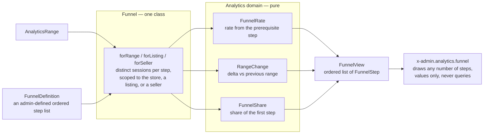

# The funnel

The boundary between the query that produces a funnel's steps and the
component that draws them, and the contract that crosses it. Code:
`app/Analytics/Admin/{Funnel,FunnelView,FunnelStep}.php`,
`app/Domain/Analytics/{FunnelDefinition,FunnelRate,FunnelShare,RangeChange,BarStrip}.php`,
`resources/views/components/admin/analytics/funnel.blade.php`. See
[analytics.md](analytics.md) § "The funnel" for the event vocabulary and scopes
(`forRange`/`forListing`/`forSeller`) the query reads.

## Data flow

Question: what produces a funnel step, what computes on it, and what
draws it?

`App\Analytics\Admin\Funnel` is the one class on this boundary that reads
`analytics_events`; it takes a range and a scope and returns a
`FunnelView`. `FunnelRate`, `RangeChange`, and `FunnelShare` are pure — no
I/O, no reference to the request or the database. All three live under
`App\Domain\Analytics`; `Funnel` is their only caller on this boundary.
`FunnelTiles` and the seller overview reuse them.
`x-admin.analytics.funnel` receives a `FunnelView` and
renders it: values only, formatted numbers and pre-computed widths, the
query and every percentage already done by the time the component sees
them.

## The step contract

`FunnelStep` is what crosses the boundary — one value per step, nothing a
step needs computed twice.

| Field                  | Meaning                                                                             |
| ----------------------- | ------------------------------------------------------------------------------------ |
| `key`                   | the event name the step counts, or `visitors` for the first step                     |
| `label`                 | the heading a reader sees ("Viewed a listing")                                       |
| `current`               | the step's count for the range                                                       |
| `previous`              | the step's count for the range before                                                |
| `change`                | `RangeChange` between `current` and `previous`                                       |
| `rate`                  | `FunnelRate` against the step's prerequisite, carrying the prerequisite's own label — null on the first step |
| `shareOfFirst`          | `current` as a share of this range's first step                                      |
| `previousShareOfFirst`  | `previous` as a share of the previous range's own first step                         |
| `isLargestDrop`         | true on the one step with the lowest `rate` among steps that carry one               |
| `note`                  | an optional line below the footer (the paid step's "N cancelled")                    |
| `side`                  | an optional line naming a non-path metric on a step (the viewed step's "N favorited") |

`Funnel` computes every field on this table, `shareOfFirst`,
`previousShareOfFirst`, and `isLargestDrop` included. The component draws
`shareOfFirst` and `previousShareOfFirst` as the two bars and reads
`isLargestDrop` to place the badge; it computes no share, no ratio, and no
"which step is worst" comparison itself.

## The unit decision

Every step counts distinct sessions among the events that qualify for it,
the same shape `Funnel::visitorTotals()` already uses for the visitors
step (`count(distinct session_id)`). A step is a subset of its
prerequisite's sessions, so no step's count can exceed the one before it
and no bar can exceed its container.

A session that views the same listing three times still counts once
toward the "listing views" step — `Funnel::sessionsByName()` groups by
`count(distinct session_id)` the same way `visitorTotals()` does, so an
event-count step never inflates past the visitor count that produced it.

Favorites sits off the buying path — a viewer may favorite a listing they
never add to cart, and a cart add never depends on having favorited.
Favorites is a side metric on the viewed step: when a funnel's steps
include `listing.view`, `Funnel` counts the sessions that favorited within
the scope and attaches it as that step's `side` ("98 favorited"). It never
becomes a step of its own — a session that favorited without viewing (a
listing favorited by id from an actor's own page, or a stale row from data
drift) would otherwise put a bar past its container.

## Drawing rules

The design follows Tailwind Plus Application UI › Data Display › Stats,
the "with shared borders" grid (a one-pixel hairline gap between cells, no
per-cell border — the admin dashboard's own stat row already uses this
grid) and the "with trending" variant's delta glyph (a small up/down
chevron beside a colored percentage, next to the label).

**Cell anatomy, top to bottom:**

1. Label and delta glyph, on one row, space-between.
2. The count, large and bold, tabular figures; the "largest drop" badge
   sits inline beside it when this step carries one.
3. Two stacked bars: an 8px bar for this range's share of the first step,
   directly beneath it a thinner 4px "ghost" bar for the previous range's
   share of its own first step. A `title` attribute on the pair carries
   the exact counts ("this range 128 · previous 42") for a reader who
   wants the numbers a hover shows on a chart.
4. The footer line: "x% of `<prerequisite label>`" alone when the step has
   no upstream comparison to add, or "x% of `<prerequisite label>` · y% of
   visitors" when the prerequisite is not visitors itself. The visitors
   step's own footer is blank (`&nbsp;`) — it has no prerequisite.
5. An optional side note below the footer, offset by a small top margin
   (the viewed step's "98 favorited", the paid step's "6 cancelled").

**Bars.** Both bars scale to a share of the first step's count — the top
of the funnel — so the row narrows left to right the way a funnel does.
Every bar floors at 2% width so a real zero still reads as a sliver
distinct from an empty cell. When a range's own first-step count is zero,
that range's bar draws at 0% (`FunnelShare::of()`).

**The largest-drop badge.** Placed on whichever step has the lowest `rate`
among the steps that carry one (every step but the first) — a computed
position that follows the data: the store-wide canvas puts it on "Opened
checkout"; the single-listing canvas puts it on "Added to cart", where
that listing's own worst conversion sits one step earlier.

**Dark variant.** Page background `#030712`; cell background `#1c1917`;
the hairline gap and outer ring become `rgba(255,255,255,0.1)`; label and
footer text `#a8a29e`; the count `#f5f5f4`; the "this range" bar `#a8a29e`
over an `#292524` track, the ghost bar `#57534d`; the up-delta glyph
`#4ade80`; the "largest drop" badge `#451a03` background on `#fbbf24`
text.

**Phone layout.** The grid collapses to one column
(`grid-template-columns: repeat(1, …)`); every cell keeps the same
anatomy, stacked top to bottom instead of side by side — no cell is
redesigned for the narrow width.

## How it works

A funnel is an `App\Models\Funnel` row: a name plus `steps`, an ordered list of two or
more `AnalyticsEventName` values `FunnelDefinition::of()` validates —
unknown or repeated names are refused at save time. Visitors is every
funnel's implied first step and is never stored in `steps`.
`/admin/funnels` (`admin.funnels.index|create|store|edit|update|destroy`,
plus `admin.funnels.delete`, a confirmation page a "Delete" link visits
before the form on it posts the `DELETE`) is where an admin names,
reorders, and removes a funnel's steps;
`/admin/analytics/funnels/{funnel}` (`admin.analytics.funnels.show`) is
its detail page, drawn by `x-admin.analytics.funnel`. The built-in
storefront funnel (`FunnelDefinition::storefront()`) is a row like any
other, seeded by `FunnelSeeder` on `make fresh` and edited the same way.

`App\Analytics\Admin\Funnel::build()` resolves a step's prerequisite as the
entry before it in the definition's own list, visitors for the first named
step. Favorites holds no slot in that list (see above), so cart add's
prerequisite is listing views by the same rule. Because the component only ever draws a
`FunnelView`, a two-step funnel and the five-step storefront funnel render
through the same markup: the grid's column count follows the step count,
capped at seven with wrap beyond.
