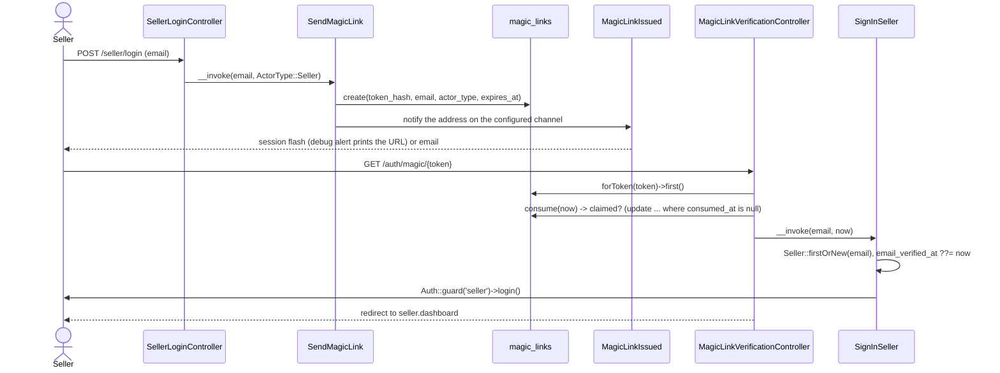
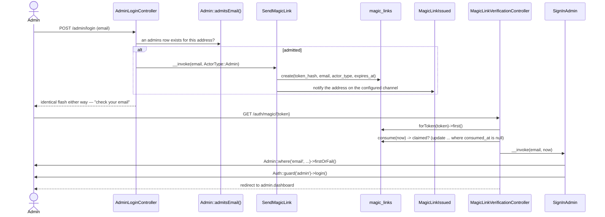
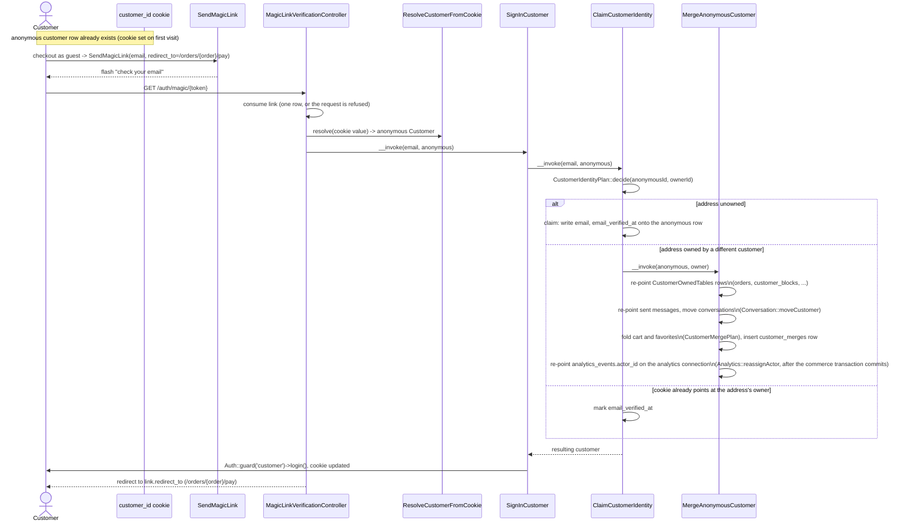
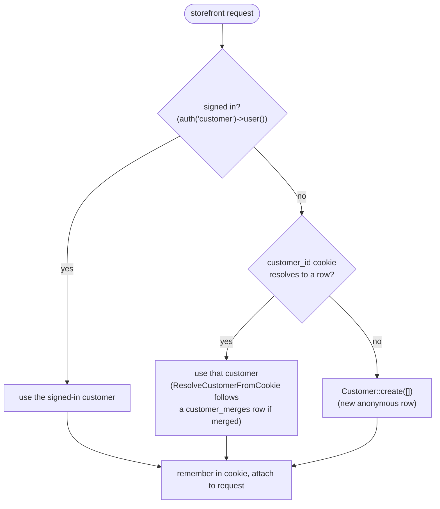

# Identity

Passwordless sign-in for all three actors — seller, customer, admin — plus the
anonymous-customer cookie the storefront hangs favorites, carts, and guest
orders on before anyone verifies an address. Code: `app/Actions/Auth/`,
`app/Actions/Customers/`, `app/Http/Middleware/ResolveCustomerIdentity.php`,
`app/Domain/Customers/CustomerIdentityPlan.php`.

## Seller magic-link sign-in

Question: what happens between a seller submitting an email and landing on
the dashboard?

Caveats: the link goes to an address, not to a row —
`Notification::route(MagicLinkIssued::channel(), $address)` — because a
first-time email creates the seller row, and there is no separate sign-up
step. An expired or already-consumed link redirects back to
`auth.seller.login` with an error instead of reaching `SignInSeller`.

**A link is consumed once.** `MagicLink::consume(now)` is a single
`update ... where consumed_at is null` and returns whether it affected a row;
only the caller it hands the row to reaches `SignInSeller` / `SignInCustomer`
/ `SignInAdmin`. The status read that precedes it is what names the refusal
for a link already used or expired, but it is not what decides: two
verifications of the same token arriving together both read a usable link, and
the write is what settles which of them gets it. The loser is refused with the
same sentence an already-used link gets. Without the row count in the write,
one token would open two sessions — a session-fixation primitive.

## Admin magic-link sign-in

Question: what happens between an admin submitting an email and landing on
the dashboard?

Caveats: unlike the seller and customer flows, **admins are seeded, never
signed up** — `Admin::admitsEmail()` checks whether the address already has
an `admins` row before `AdminLoginController::send()` ever calls
`SendMagicLink`, and the redirect and flash are identical whether or not it
does, so `/admin/login` never reveals which addresses are admins. `SignInAdmin`
answers 404 (`ModelNotFoundException`) rather than creating a row, which only
matters if an admin row is deleted between a link being sent and being
followed. `App\Domain\Auth\ActorType::allowsPath()` keeps an admin's link from
ever being followed to `/seller` or `/`, the same way it keeps a seller's or a
customer's off `/admin`.

## Customer guest verification with anonymous merge

Question: when a guest verifies an email mid-checkout, which customer row
ends up owning the order — and what happens to the anonymous one?

Caveats: `MergeAnonymousCustomer` walks
`App\Domain\Customers\CustomerOwnedTables::all()` (`orders`, `customer_blocks`,
and the other app-database tables it names) inside a transaction, writing one
column per table, and skips any table/column that does not exist yet (guards
schema drift across tickets landing in parallel). `analytics_events` lives in
the analytics connection (config/database.php), outside that transaction.
The merge re-points every already-written row the anonymous customer owns as
its own step, after the transaction commits, through
`App\Analytics\Analytics::reassignActor()` — a failure there logs a warning
and leaves the merge's commerce writes intact. Everything else carrying a
`customer_id` column is named in `CustomerOwnedTables::leftBehind()`, with
the reason a blind write would get it wrong, and a schema-manifest test
(`App\Actions\Customers\CustomerOwnedTablesManifestTest`) checks that the two
lists together cover every such column — a table added later with one cannot
go unhandled by accident. **Sent messages** name their sender by morph type
and id the way a notification names its recipient, so
`sentMessages()->update(...)` re-points the relation — the reason a message
the verified customer sent must not read as unread to them afterwards.
**Conversations**' `subject_key` names the participants as well as the
`customer_id` column does, so `Conversation::moveCustomer()` writes both
together — see [messaging.md](messaging.md) § "The merge" for what happens when the
verified customer already holds the thread for a subject the anonymous row
also asked about (the moved thread folds into the existing one instead of
leaving a duplicate).

**The cart and favorites are folded.** Writing `carts.customer_id` the way
`CustomerOwnedTables` does for a simple table would leave the verified
customer with two carts. A unique index used to swallow a duplicated
favorite; the plan now decides it. `App\Domain\Customers\CustomerMergePlan` (pure — no database, no
Eloquent, tested with its own Pest dataset) takes both customers' cart lines,
their favorites, and the stock behind whatever listings either cart names,
and works out: cart quantities summed per listing, clamped to stock, with
anything that lands at zero dropped; and favorites as the union, with a
listing already favorited by the verified customer dropped from the
anonymous side rather than duplicated. `MergeAnonymousCustomer` applies the
plan to the one cart that survives the merge — the verified customer's own if
they had one, otherwise the anonymous customer's cart re-pointed, otherwise a
new one — and to the favorites rows with updates and deletes only, never an
insert. A removed listing is not special-cased by the fold: its row still
carries the stock it held before removal, so a line for it survives at that
quantity, the same as it would sitting untouched in a single cart across a
removal, and `OrderPlacementPlan` is what blocks it when checkout is
attempted. `Customer::cart()` reads the one cart a customer holds. The
earlier `currentCart()` is removed.

The anonymous row is never deleted — the
`customer_merges` row lets a stale cookie on a second device resolve forward
to the verified customer, following as many recorded merges as it takes to
land on a row nothing else points at. Merging the same anonymous customer
into the same verified one twice writes one `customer_merges` row —
`customer_merges.anonymous_customer_id` is unique, and the action reads that
row back with `firstOrCreate` instead of failing on it.

A `redirect_to` naming a `/seller` path is never followed on a customer link,
even when it is otherwise local: the link falls back to `shop.account`. A
customer link carries no seller session, so following it there would only land
on the seller login wall. Both halves of that answer are the domain's:
`LocalRedirect::resolve($requested, $actor, $fallback, $origin)` keeps a target
only when it stays on this site and `ActorType::allowsPath()` says the actor
belongs on it.

## Which identity a storefront request resolves to

Question: given a request, which customer does `CustomerIdentity::current()`
return?

Caveats: this is `App\Http\Middleware\ResolveCustomerIdentity`, wrapping
every route in `routes/shop.php`. It never runs on `/auth/magic/{token}`,
`/login`, or `/logout`. `MagicLinkVerificationController` reads the cookie
through `ResolveCustomerFromCookie`. `/login` never reads it. `/logout`
calls `CustomerIdentity::forgetCookie()`. A seller clicking a seller link
therefore creates no customer row.
