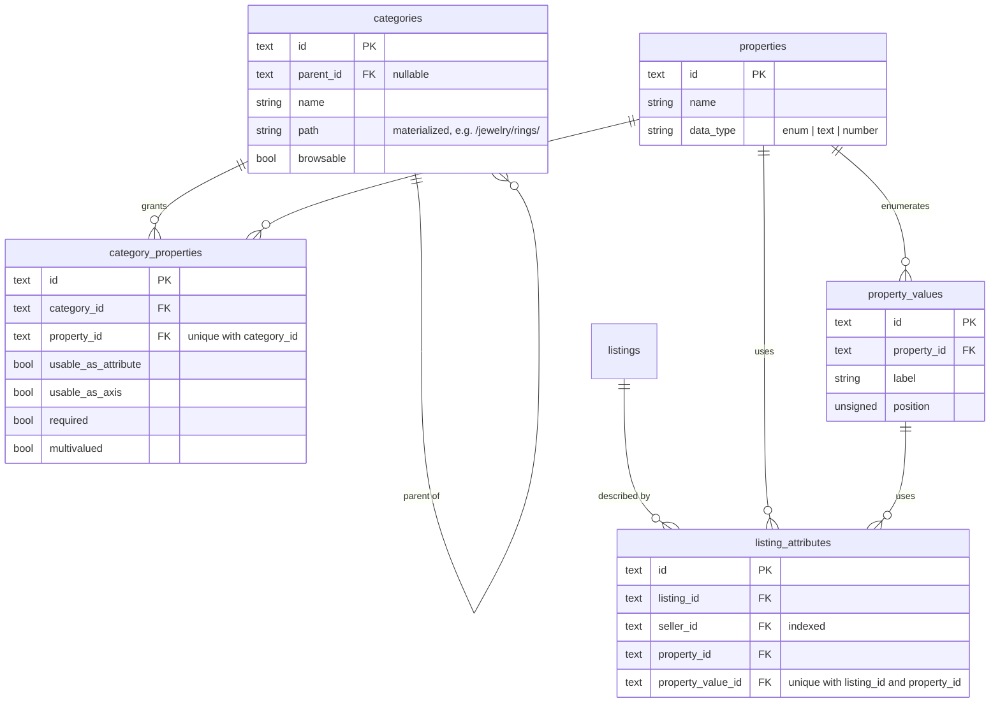
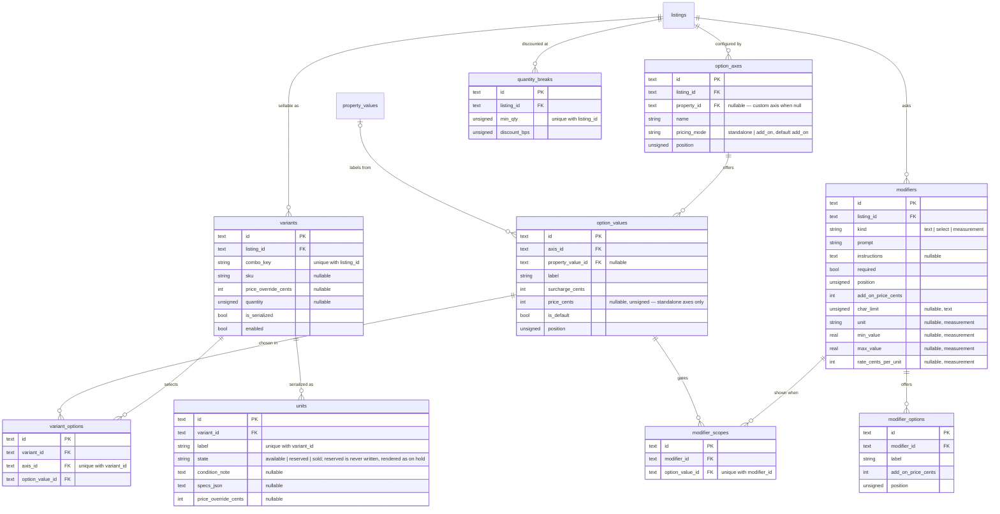
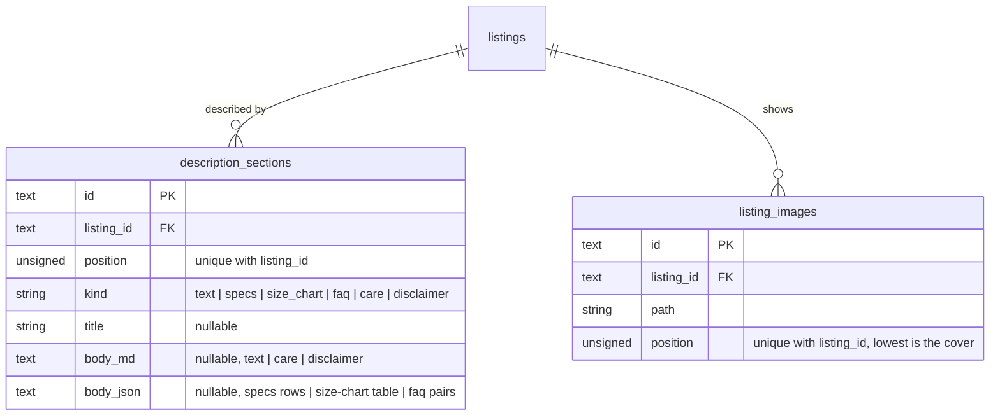
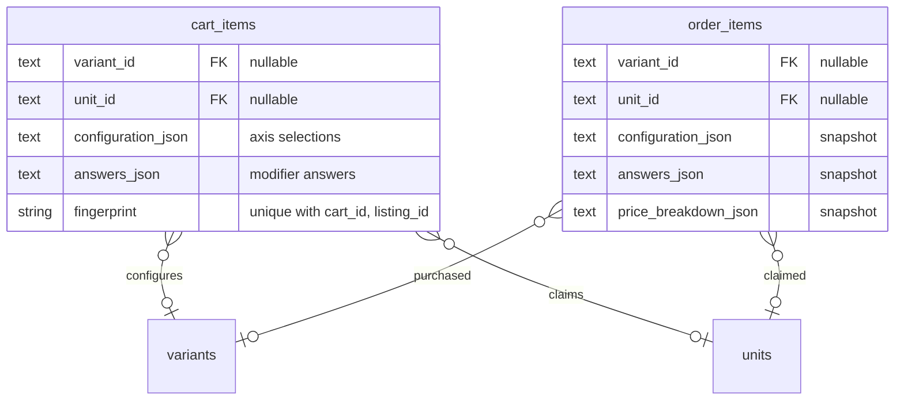
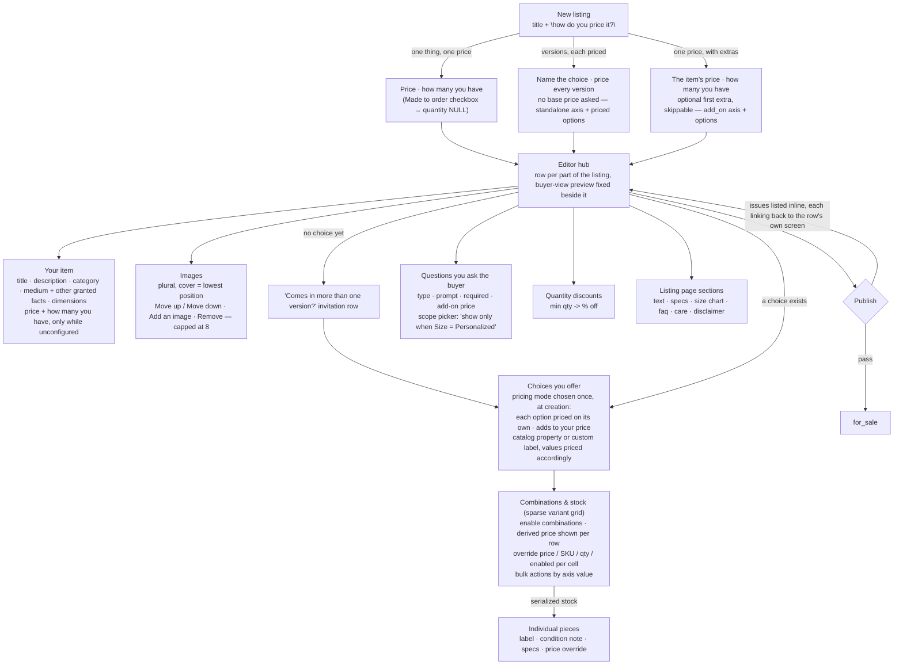
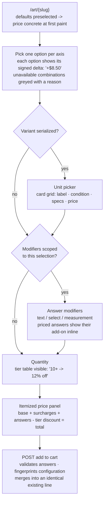

# Item configurator

Status: built.

This doc states the product-configuration schema and vocabulary the app
holds. The research note behind it is
`__local__/item-configuration/etsy-product-configuration.md`, a local,
git-ignored file; this doc says **listing** where the note says product,
**seller** where it says shop, **customer** where it says buyer.

A listing with no option axes has one price, one quantity, and an
add-to-cart button with no configurator screen.

## 1. Design principles

Kept from the research note, in this platform's terms:

1. **Every customer-facing choice is a first-class primitive.** Option axes,
   modifiers, serialized units, and quantity tiers each have their own table.
   No compound option labels like "Gold - Inside".
2. **The price on screen is the price at checkout.** The cart line re-resolves
   its price live; the order line freezes an itemized breakdown at placement.
3. **Modifiers appear only when they apply.** A modifier scoped to one option
   value disappears when the customer picks a different one.
4. **Sparse by default.** A variant is a row the seller creates. A 52-unit
   vintage lot costs 52 rows, not a materialized cross-product.
5. **Structure over prose.** Descriptions are typed sections instead of one
   free-text field.

## 2. Data model

Four groups: **taxonomy → configuration → content → cart and order**.
[`data-model.md`](data-model.md) draws the commerce tables these join.
Every table's primary key is a 30-character prefixed ULID
([`spec.md`](../../docs/spec.md) §1); every foreign key holds the
referenced table's id. Every listing-scoped table below (`listing_attributes`
and every table in §2.2 and §2.3) carries a `seller_id FK`, the listing's
seller copied down, indexed; the diagrams omit that column.

| Table                 | Prefix | Table               | Prefix |
| ---------------------- | ------ | -------------------- | ------ |
| categories             | `cat`  | units                | `unt`  |
| properties             | `prp`  | modifiers            | `mdf`  |
| property_values        | `pvl`  | modifier_options     | `mdo`  |
| category_properties    | `cpr`  | modifier_scopes      | `mds`  |
| listing_attributes     | `lat`  | quantity_breaks      | `qbk`  |
| option_axes            | `axs`  | description_sections | `dsc`  |
| option_values          | `ovl`  | listing_images       | `img`  |
| variants               | `vrt`  |                      |        |
| variant_options        | `vop`  |                      |        |

`listings` carries a nullable `category_id`. `cart_items` and `order_items`
carry the columns in §2.4.

### 2.1 Taxonomy layer



A category whitelists properties for the listings under it; each grant says
whether the property is a fixed attribute (`category_properties.usable_as_attribute`,
feeds `listing_attributes`, not buyer-selectable), a configurator axis
(`usable_as_axis`, feeds `option_axes`), or both. `required` on an
attribute grant gates publish validation (§6); on an axis-only grant it
records intent, since no `listing_attributes` row can satisfy it. One tree, no separate seller/buyer taxonomy split. Scales and
cross-scale value equivalence (ring size 7 US ↔ 54 EU) are out of scope — see
§7.

### Attribute altitude

A property carries an altitude, enforced by its grants — never by new schema:

- **Browse-level properties** (`Medium`: Wood, Metal, Ceramic, …) are granted
  `usable_as_attribute` only — `required` where the category's listings must
  state one, `multivalued` where mixed media is plausible. They answer "what
  kind of thing is this" and feed the storefront filter.
- **Specific-type properties** (`Wood Species`: Walnut, Oak, Maple; the
  jewelry `Metal` property is the same pattern) are granted per category with
  both flags meaningful:
  - No buyer choice → the seller states it as an attribute
    (`Wood Species = Walnut` on a fixed-species table).
  - Buyer choice → the seller builds an axis referencing the property; the
    axis's option values reference the property's values
    (`option_values.property_value_id`), so the walnut variant is
    structurally the walnut one, and the choice is search-meaningful.
- The implication "Walnut → Wood" is curation: a category granting a
  specific-type property marks its broad property `required`, so the pair is
  always stated together. A value hierarchy with browse roll-up
  (Wood → Walnut/Oak) is the upgrade path if species-level filtering ever
  matters — deferred (§9), and nothing here is thrown away by it.

The line to hold: attributes answer *what is this* at browse altitude; axes
answer *which one do you want*. No specific species as a browse attribute
vocabulary, no broad medium as an axis.

### 2.2 Configuration layer



Notes:

- **`variant_options` carries one row per (variant, axis)**, enforced by the
  `unique with variant_id` index on `axis_id` — a variant cannot select two
  values off the same axis.
- **`variants.combo_key`** is the sorted `option_values.id` list for that
  variant, computed by the app layer; the `unique with listing_id` index is
  what makes a combination unique. `combo_key` is empty for a listing with no
  axes, which is why an unconfigured listing needs no variant row at all —
  it prices and sells exactly as it does today, straight off `listings.price_cents`
  and `listings.quantity`.
- **`variants.quantity`** is nullable and unused once `is_serialized` is true:
  a serialized variant's available count is `count(units where state =
  'available')` for that variant, never a stored number.
- **`listings.quantity`** is nullable too, mirroring
  `variants.quantity`'s own "no fixed count" reading: `null` means made to
  order — always available while `for_sale`, untouched by a sale or a
  restock. Reached only through the "Made to order" checkbox on create or
  Your-item; a blank count field without it is a validation error, not a
  silent null.
- **`modifier_scopes`** has zero rows by default, which means the modifier
  shows for every configuration of the listing. A row names one option value
  the customer must have selected for the modifier to appear.
- **Media stays out of this layer.** Option values, units, and modifier
  options carry no image of their own in v1 — a listing's existing photo set
  is unchanged.
- **`option_axes.pricing_mode` is chosen once, at creation:** a
  `standalone` axis's options each carry their own absolute `price_cents`
  and no axis in this state ever reads `surcharge_cents` (stored `0`); an
  `add_on` axis's options carry a signed `surcharge_cents` and no
  `price_cents` (stored `null`). Every axis before this column existed, and
  every new axis by default, is `add_on` — an `add_on`-only listing's
  resolution and rendering are unchanged (§3). The mode may change only
  while the axis holds zero options; adding the first option locks it in.

### 2.3 Content layer



A listing's description becomes an ordered list of typed sections instead of
one free-text field. `body_md` carries prose kinds; `body_json` carries
structured kinds. No section kind renders automatically from configurator
data in v1 (a How-to-Order or What's-Included section is authored like any
other) — see §7.

`listing_images` replaces the single `listings.image_path` column: one row
per uploaded photo, ordered by `position`. The lowest position is the
cover — the image `Listing::imageUrl()` returns and every card, cart line,
and admin row renders; the rest render as a thumbnail grid on the buyer
page below it. A listing with no rows here falls back to a placeholder
drawn from its title, the same as before this table existed.

### 2.4 Cart and order



- `cart_items` is unique on `(cart_id, listing_id, fingerprint)`, where
  `fingerprint` is a hash of the selected variant, unit, and answers
  (`CartLineFingerprint::of()`). Two lines for the same listing with the
  same configuration merge quantities into one row; two different
  configurations of the same listing sit in the cart as separate lines. A
  cart line's price is never stored — it re-resolves from
  `variant_id`/`answers_json` against live listing data on every render, the
  way an unconfigured line reads `listings.price_cents` live.
- `order_items` freezes `configuration_json`, `answers_json`, and
  `price_breakdown_json` at placement, the same way it already freezes
  `title` and `unit_price_cents` — a later edit to the listing's axes or
  modifiers leaves a placed order reading exactly as it did at checkout.
- **Units flip `available` → `sold` inside `PlaceOrder`'s transaction**,
  alongside the listing-quantity decrement it already performs. Cancel and
  seller decline restore a unit to `available` the same way they already
  restore listing quantity; a variant's own `quantity` (non-serialized case)
  decrements and restores identically. `UnitState` carries a `reserved`
  case that nothing writes; `UnitStateWord` renders it as "on hold" — see
  §9.

## 3. Price and availability resolution

Pure domain code, `app/Domain` — no query, no clock, no random, unit tested
without a database ([`architecture.md`](architecture.md)'s Core layer).

```
standalone_sum = Σ over selected options on standalone axes: price_cents
addon_sum      = Σ over selected options on add_on axes: surcharge_cents

unit_price_cents = variant.price_override_cents
                 ?? (listing has ≥1 standalone axis ? standalone_sum : listing.price_cents)
                    + addon_sum

answer_add_on_cents = Σ over answered modifiers:
    select      → chosen modifier_option.add_on_price_cents
    measurement → answer_value * modifier.rate_cents_per_unit
    text        → modifier.add_on_price_cents (flat, if set)

line_price_cents = quantity_break(discount_bps for qty) applied to
                    (unit_price_cents + answer_add_on_cents), qty times

price_breakdown = [{label, cents}, ...]   -- base, each surcharge, each
                                              answer add-on, the tier discount
```

**Standalone axes replace the base line, not add to it.** A listing with no
`standalone` axis keeps the shape above exactly — one "Base price" line, then
one line per surcharging option value. A listing with at least one
`standalone` axis drops "Base price"
entirely and itemizes every selected option instead, unconditionally (a
zero-cost `add_on` selection still gets its own line, since there is no base
line left to fold it into): `"Size: 8x10" — $18.00` (absolute, the option's
own `price_cents`) alongside `"Frame: Unframed" — +$0.00` (still signed, the
option's `surcharge_cents`). The same rule renders the buyer dropdown: a
`standalone` axis's non-selected options show their absolute price
(`"11x14 ($24.00)"`), the selected one bare; an `add_on` axis keeps today's
signed delta (`"Black frame (+$32.00)"`).

**`listings.price_cents` is derived, not seller-edited, once a standalone
axis exists.** `App\Support\Configurator\ListingPriceSync` runs after every
option-axis and option-value write (add, update, remove — wired from the
Actions in `App\Actions\Configurator`, not the controllers, so a seeder or a
console command gets the same guarantee an HTTP request does) and sets
`price_cents` to the default configuration's `standalone_sum` — the price
`/art/{slug}` opens at — whenever the listing holds ≥1 `standalone` axis.
Storefront cards keep reading `price_cents` unchanged. A listing with no
`standalone` axis is never touched by the sync, so `price_cents` stays
seller-edited exactly as it does today; if a seller removes their listing's
last `standalone` axis, `price_cents` is left at whatever it last synced to
rather than reverting to an earlier seller-typed price — there is no earlier
value to revert to once the derived era has started.

Availability:

```
variant_available = variant.enabled
                   AND (variant.is_serialized
                          ? exists(units where variant_id = ? and state = 'available')
                          : variant.quantity IS NULL OR variant.quantity > 0)
```

An unconfigured listing (no axes, no variant row) resolves price and
availability exactly as it does today, off `listings.price_cents` and
`listings.quantity` — the latter nullable the same "no fixed count" way as
`variant.quantity` (`isPurchasable = status = for_sale AND (quantity IS NULL
OR quantity > 0)`).

## 4. Seller flow

Nested under the existing seller listing edit flow — no new top-level seller
route. The flow is a hub of row summaries, not a linear wizard: every row
opens its own detail screen and comes back to the hub, and an unconfigured
row reads as an invitation rather than an empty screen — there is no flat
title/price/photos form above the row summaries.

The entry point forks three ways: `GET /seller/listings/create`
asks a title and, in the seller's own words, which of three shapes the
pricing takes; each answer lands on a screen that collects exactly what that
shape needs and nothing else (never description, dimensions, category, or an
image — those wait on the hub), then creates the draft and opens the hub.
The fork routes, it never constrains — the hub's Choices screen still lets
any listing grow the other two shapes afterward, versions and add-ons
included (the Sunset Ridge archetype does exactly that).



Screen notes:

- **The hub is the contract, not a wizard.** Basics, Images, and each
  configurator section all read as a summary row with its own "Edit"
  affordance; a row with nothing on it yet reads as an invitation instead of
  an empty table ("Comes in more than one version? Offer choices", "Need an
  answer from the buyer? Ask a question", and so on for pieces, discounts,
  and page sections). A buyer-view preview sits fixed beside the rows,
  built from the same view model and rendering partials `/art/{slug}`
  itself uses — images, title, description, and either the
  live configurator form or, with nothing configurable yet, the title, the
  one price, an honest stock label, and an inert Add to cart button. The
  form is real: changing an option, unit, quantity, or answer submits a GET
  back to the seller screen's own URL and re-renders the panel with the new
  availability, grey-outs, and total — the same auto-submit script the shop
  page ships also runs here, so it happens on change rather than needing a
  click. Add to cart alone stays inert, since a preview must never mutate a
  cart. One embed is the deliberate exception: the questions screen's
  scope-demo pair (`ScopedListingPreview`) pins each panel to a specific,
  stored option value the request can never influence, so it renders
  disabled rather than as a form that would silently discard a seller's
  clicks.
- **Price and stock live in exactly one place at a time.** They appear on the
  Your-item row and its detail screen only while the listing holds no option
  axis and no serialized piece; the moment a first choice or piece exists,
  they move to the Choices/Combinations screens and the Your-item summary
  drops the line entirely. Once the listing holds a standalone axis, its
  price is derived rather than seller-typed (§3), and the Your-item save
  stops reading a price field at all. "How many you have" carries a "Made to
  order" checkbox, on create and on Your-item alike — checked, the count is
  ignored and `quantity` is stored `null`, read the same "no fixed count" way
  a variant's own untracked quantity already is (§2.2, §3).
- **Create is three on-ramps, not one form.** The question screen
  asks a title and a pricing shape in the seller's own words — "one thing,
  one price" / "it comes in versions, each with its own price" / "one price,
  with extras that add to it" — each mapping 1:1 onto a shipped mechanism (no
  axis / a standalone axis / an add_on axis). The versions landing asks for
  no base price at all — there isn't one, since each version's own price is
  what `ListingPriceSync` reads back onto `listings.price_cents` once the
  axis and its options exist (§3). The extras landing's first choice is
  skippable ("Create with just the price"), landing on a plain, axis-free
  draft the same as the one-thing ramp. Every ramp ends on the hub; the
  legacy flat title/price/photos form is gone from every code path.
- **A choice's pricing mode is chosen at creation, mode-first.** "Add another
  choice" opens on the two mode buttons — "Each option priced on its own" and
  "Options add to your price" — before any catalog-property or custom-name
  picker, so the seller commits to the mechanism before naming the choice,
  the same way a Question already declares its kind at creation. Every
  option row on a standalone choice is labeled "Price" (an absolute `$`
  amount); every option row on an add-on choice is labeled "Price
  difference" (a signed `+` amount). The choice's own pill — dark-fill "each
  option priced on its own" vs light-border "adds to your price" — repeats on
  both the Choices-screen card and the hub's Choices row, so which rule an
  option follows is never a guess. The mode locks the moment the choice's
  first option is added (§2.2).
- **Variant grid is the contract.** Each row shows its derived price (the
  listing's resolved default price, plus selected surcharges) beside the
  override cell, so the seller sees what the customer will pay per
  combination before typing an override.
- **Scoping is a picker**, not a text field: "show this modifier when…" lists
  the listing's option values; leaving it empty means always-shown.
- **Catalog axes first.** The axes screen offers the category's
  `usable_as_axis` grants before the custom label-only axis, and a
  catalog-backed add-on axis pre-fills its option values from the property's
  values — the nudge toward search-meaningful axes the source design
  specified. A standalone axis skips that prefill, since no price can be
  inferred from the catalog; the seller still names each option and its price
  by hand.
- **Images are plural and ordered, JS-off.** The lowest-position image is the
  cover — the one every card, cart line, admin row, and the buyer page's own
  primary photo renders — and the screen reorders the rest with Move up /
  Move down buttons rather than drag, capped at 8 per listing (§7).

## 5. Customer flow

`GET /art/{slug}` renders the configurator server-side; every choice is a GET
param, so the page works with JavaScript off ([`architecture.md`](architecture.md)'s
platform constraint). Any script on the page is progressive enhancement only.



Behavior this enforces:

- **No hidden configuration.** Each axis is its own control; a modifier
  renders only when `modifier_scopes` matches the current selection (or has
  no rows).
- **No surprise prices.** Defaults are preselected so the page opens with a
  concrete price; every priced option and answer shows its price at the
  point of choice — an add-on axis's non-selected options as a signed delta
  ("Black frame (+$32.00)"), a standalone axis's non-selected options as
  their own absolute price ("11x14 ($24.00)"), the selected option on either
  kind of axis bare — and the panel's breakdown is the same list that lands
  in `order_items.price_breakdown_json` and on the order page. The listing's
  cover image renders where its one image used to; any further images render
  below it as a plain, static thumbnail row (§2.3), no lightbox, no script
  required.

## 6. Publish validation

The draft → `for_sale` transition (`ListingStatus::transitions()`) holds
these gates (`App\Domain\Configurator\ConfiguratorPublishValidation`) when
the listing has configurator data:

- Every `required` `category_properties` grant that is `usable_as_attribute`
  has a matching `listing_attributes` row (an axis-only grant can never hold
  one by construction).
- Every `enabled` variant resolves to a price ≥ 0.
- Every variant has exactly one `variant_options` row per `option_axes` row
  on the listing.
- Every `is_serialized` variant has at least one `unt` row in state
  `available`.
- Every option on a `standalone` axis carries a `price_cents` ≥ 0
  (`option_missing_price` — the write path already refuses to save one
  without a price, so this is a defensive check on whatever the row actually
  holds, not the seller's only guard against it).
- Every count cap in §7 is respected.

A failing gate refuses the transition with every issue listed, each linking
to the seller-edit screen that owns it — the same shape `OrderPlacementRefused`
already uses for "list every blocked line, not just the first" ([`orders.md`](orders.md)).

## 7. Limits

| Limit                          | Value       |
| ------------------------------- | ----------- |
| Option axes per listing         | uncapped    |
| Options per axis                | 70          |
| Enabled variants per listing    | 500         |
| Modifiers per listing           | 5           |
| Modifier text answer length     | 1024 chars, or the modifier's own `char_limit` (`AddToCartRequest`) |
| Quantity-break tiers            | 10          |
| Description sections           | 15          |
| Images per listing              | 8           |

## 8. Traceability: observed hack → mechanism here

From the research note's §2.1.

| Observed hack (Etsy)                                         | Mechanism here                                                                        |
| -------------------------------------------------------------- | ---------------------------------------------------------------------------------------- |
| Compound option strings ("Gold - Inside", "3 US - 4mm")       | Uncapped `option_axes` with a variant-count cap instead                                  |
| Config hidden in personalization dropdowns (fonts, paper stock) | `select` modifier with per-option `modifier_options.add_on_price_cents`                  |
| "BLANK / EMPTY MUG", "Print file" as variation options         | An `option_axes` value can name the product-type distinction directly; digital delivery as its own concept is deferred (§9) |
| Personalization shown for configurations it can't apply to     | `modifier_scopes`                                                                        |
| Quantity tiers modeled as variation options                    | `quantity_breaks`                                                                        |
| 52-option axis of numbered one-of-a-kind units                 | `units` rows under one variant, buyer-facing unit picker                                 |
| Bespoke intake/proof loop run through Messages                 | Deferred (§9) — stays in the existing messaging threads                                  |
| Hand-priced 136-cell dimension matrix                          | Sparse `variants` with `price_override_cents`; linear cases use a `measurement` modifier with `rate_cents_per_unit` |
| Emoji headers, pasted How-to-Order and size charts              | Typed `description_sections`                                                             |
| Rush / sample / license as separate linked listings             | Deferred (§9) — add-ons stay separate listings                                           |
| A specific customer's quote published as a public option        | Deferred (§9) — no private-quote object                                                  |

## 9. Deferred

- **Scales and cross-scale equivalence.** No `property_value_equiv` table; a
  ring-size axis is plain option values with no US↔EU matching.
- **Digital assets and per-variant digital delivery.** No `digital_asset`
  table, no delivery-method field on `variants`; every variant is a physical
  good.
- **Add-on product links.** No `rush` / `sample` / `license_upgrade` relation
  between listings; those stay separate listings, as they are today.
- **Bespoke post-checkout workflow steps.** No order-line state machine for
  intake/proof/approval/production; that conversation stays in the existing
  messaging threads.
- **`file_upload` and `date` modifiers.** Modifier `kind` is `text | select |
  measurement`; no file intake on an order line, and no date-typed answer —
  none of the eight archetypes asks for one.
- **Cart-time unit reservation.** `UnitState` carries a `reserved` case;
  nothing writes it, and `UnitStateWord` renders it as "on hold". A unit
  stays `available` until an order places, so two shoppers can add the same
  unit to their carts before checkout resolves who claims it.
- **Search and facets.** The storefront's media filter, search, and listing
  display read `listing_attributes`' Medium property exclusively — the legacy
  `listings.medium` column is gone; no other property drives a facet or
  filter UI yet.
- **Property-value hierarchy.** No `parent_id` on `property_values` and no
  filter roll-up; the attribute-altitude split (§2.1) covers v1 and upgrades
  to a value tree without schema loss.
- **Private quotes.** No per-customer expiring offer object.
- **Formula pricing.** No `price = f(x, y)`; a dimension matrix is either
  enumerated as sparse variants or priced with a linear `measurement` rate.

## 10. Platform integration

- **Ids**: every table's primary key is a 30-character prefixed ULID via
  `HasPrefixedUlid`, minted from the application clock
  ([`spec.md`](../../docs/spec.md) §1). A row addressed by the wrong prefix answers 404 at route-model
  binding, same as every existing table.
- **Logging**: the event vocabulary is closed ([`spec.md`](../../docs/spec.md) §2.3) — no
  new event names. Seller writes to axes, variants, units, modifiers, or
  description sections log the existing `listing.update` / `listing.create`
  / `listing.publish` events; customer writes (add-to-cart with a
  configuration, placing an order with one) log the existing `cart.*` and
  `order.place` events. `data` carries the ids involved (`variant_id`,
  `unit_id`), which are already prefixed ids and need no redaction.
- **Rate limits**: seller configurator writes reuse `listing_write`
  ([`spec.md`](../../docs/spec.md) §3); no new limit name.
- **Authorization**: ownership is `ListingPolicy` all the way down — an axis,
  variant, unit, modifier, or description section not belonging to the
  signed-in seller's listing answers 404 through the same policy the listing
  itself is checked against, never a 403 ([`architecture.md`](architecture.md) §Authorization).
