# Log store

Every JSON line the app logs — server and CLI runs alike — is also
written to a queryable SQLite store, and the admin site reads it back: a
filterable time series at `/admin/logs` and a per-request story view. Stdout
stays exactly as `docs/spec.md` §2 specifies; the store is a mirror of
it. Lines older than a retention window are pruned by `orders:sweep`.

Code: `app/Logging/{LogStore,LogLine,LogStoreHandler,LogStoreTap,LogRetentionDays,LogDomain}.php`,
`app/Providers/LogStoreServiceProvider.php`, `config/log_store.php`,
`app/Logging/Admin/*.php`, `app/Http/Requests/Admin/LogsQueryRequest.php`,
`app/Http/Controllers/Admin/LogController.php`, `app/Support/Page.php`,
`resources/views/admin/logs/`, `resources/views/components/admin/{log-lines,log-id-chip,log-filter-rail,log-actor,log-ids,pager}.blade.php`,
`app/Console/Commands/SweepOrders.php`.

Three invariants govern the design:

1. **Stdout is canonical.** `App\Logging\LogStoreTap` places the store's
   handler after every handler already on the channel, so the stdout
   `StreamHandler` has already written the line by the time the store ever
   sees it. Every other step is best-effort.
2. **The store is a mirror; the store validates nothing.** It stores what
   was emitted, including lines it cannot parse and events added to the
   `docs/spec.md` §2.3 vocabulary after this DDL was written. The
   vocabulary is enforced at the emitter — `App\Logging\StoryEvent` and its
   siblings.
3. **The store's failure is never the app's failure.** Every public method
   on `App\Logging\LogStore` swallows its own errors rather than throwing
   into the logger it mirrors, except `prune()`, whose caller
   (`orders:sweep`) is expected to report a failure and carry on regardless.

## The second database

The store is its own SQLite file, opened on its own `PDO` handle.
`LOG_DATABASE_FILE` names it (default `storage/logs.sqlite3`, beside the
commerce file; the literal `off` disables the store). The separate file is
load-bearing: a log INSERT on the commerce connection issued inside a
business transaction joins that transaction, and a rollback would erase the
very `failed` line that explains it. `make fresh` clears this file along with
every other database; in the deployed app, retention is the one way log rows
die.

Schema creation is ensure-on-open, versioned by `PRAGMA user_version` — the
commerce database's Eloquent migrations own nothing here. `LogStore::open()`
sets pragmas in a fixed order before touching the schema: `auto_vacuum =
INCREMENTAL` first, outside any transaction and before every other pragma,
because SQLite only accepts an `auto_vacuum` change while the file is still
entirely virgin — setting `journal_mode` first already writes the WAL header
and disqualifies it. Then `journal_mode = WAL`, `synchronous = NORMAL`, and
`busy_timeout = 250` — a contended flush must fail fast and re-buffer; the
commerce connection's longer timeout would stall the request behind it.
When `user_version` is behind the build's `SCHEMA_VERSION`, `ensureSchema()`
runs the DDL and bumps `user_version` inside `BEGIN IMMEDIATE`; `IF NOT
EXISTS` on every statement makes a simultaneous server-and-CLI first boot
safe — one process bootstraps, the other waits out the busy timeout and
finds the schema already there. A file whose `user_version` is ahead of the
build, or any open failure (missing directory, disk full, corrupt file),
disables the store for that process: the app boots, one `app.log`-shaped
warn line is written directly to stdout — bypassing the logger it would
otherwise feed — and the store sits the rest of that process's life out.

`App\Providers\LogStoreServiceProvider` binds `LogStore` as a singleton,
opened lazily the first time something resolves it — in practice
`LogStoreTap`, the first time a line logs. PHP serves one request per
process: there is no event loop to schedule a flush on, so `LogStore`
buffers rows in memory and flushes at a row-count cap or when the process
exits. The exit flush is `register_shutdown_function`, not
`$app->terminating()` — `App\Providers\LoggingServiceProvider` fires the
`app.shutdown` line from inside `terminating()`, and that line must itself
reach the buffer before the final flush runs; a shutdown function registered
by `LogStore::open()` at boot is guaranteed to run after every
`terminating()` callback Laravel has already queued. One handle per process
is what lets the ingest path and the retention prune share a connection
rather than open the file twice, and what makes a test's temp-file store
visible to both the writer and the admin reader.

Page views and analytics events buffer and flush the same way, on their own
file: the `analytics` connection in `config/database.php`, named by
`ANALYTICS_DATABASE_FILE` (default `storage/analytics.sqlite3`, this store's
neighbour). The lifecycle differs in one respect: `App\Analytics\Analytics`
flushes primarily from `$app->terminating()`, with the process-exit shutdown
function as a fallback, rather than the shutdown function alone —
`terminating()` is safe there because nothing after it feeds the analytics
buffer the way `app.shutdown` still needs to reach `LogStore`'s. See
[`analytics.md`](analytics.md).

## Table

One table, `log_lines`. The DDL, the column mapping, the rowid exception to
`docs/spec.md` §1, and the three departures from the commerce-table idiom are
fixed in [`docs/logging.md`](../../docs/logging.md) § "Table" and not
repeated here — `LogStore::DDL` is the literal SQL that document describes.

Stored `raw` is capped at 64 KiB (`LogLine::RAW_CAP_BYTES`); the mirrored
columns are extracted from the full line first, so a pathological payload
loses tail bytes of `raw` and keeps its queryable facts. A line that fails
to decode as a JSON object — `LogLine::decode()` requires an object, so a
JSON array or scalar is rejected the same as invalid JSON — is stored as
`raw` plus a receive-time `ts` with every other column `null`.

## Ingest

```mermaid
flowchart LR
  logger["Illuminate\\Log\\Logger\n(stdout channel)"] -->|"handle(record)"| stack["Monolog handler stack"]
  stack -->|"1. first, per the tap order"| stdoutHandler["StreamHandler\n(php://stdout)"]
  stdoutHandler -->|"2. appended after, by LogStoreTap"| storeHandler["LogStoreHandler"]
  storeHandler -->|"format with the same StoryFormatter"| buffer["LogStore in-memory buffer"]
  buffer -->|"flush at 256 rows,\nor register_shutdown_function"| db[("logs.sqlite3\nlog_lines")]
  db -->|"same PDO handle"| admin["/admin/logs"]
```

`App\Logging\LogStoreTap` is registered as the `stdout` channel's `tap` in
`config/logging.php`. Laravel invokes a tap with the channel's
`Illuminate\Log\Logger` once its handlers are built, so the tap runs once
per process, the first time something logs. It reads the Monolog handler
stack — at that point holding the stdout `StreamHandler` alone — and
rebuilds it as `[...existing, new LogStoreHandler(...)]`. Monolog runs the
front-of-stack handler first, so appending rather than prepending is what
keeps stdout-first an ordering fact of the handler list rather than a
runtime guard. `LogStoreHandler` formats each record with the exact same
`FormatterInterface` instance the stdout `StreamHandler` uses, read off that
handler — so the stdout line and the mirrored line can never drift apart —
then turns the formatted line into a `LogLine` and appends it to the store.
Every step inside `LogStoreHandler::handle()` is guarded; nothing it does
ever propagates back into Monolog.

`LogStore::append()` buffers each `LogLine`, flushing immediately once the
buffer reaches 256 rows (`FLUSH_AT`) — also the row count one multi-row
INSERT chunk carries at most, keeping bound parameters under SQLite's
variable limit. `flush()` runs one `BEGIN IMMEDIATE`, one prepared
multi-row INSERT per chunk, one `COMMIT` — one durable write per batch. A
Monolog handler runs synchronously inside the request, so an unbatched
insert per line would put database work, worst case a full busy-timeout
stall, inside every log call; batching bounds that to one insert per
`FLUSH_AT`-row group. On any flush failure the whole batch re-buffers,
prepended ahead of whatever buffered since, for the next `append()` or the
exit flush to retry. Past `BUFFER_CAP` (10,000) buffered rows, `append()`
drops new lines instead of growing the buffer further — stdout already
carried them — and announces the drop once to stderr rather than on every
dropped line.

The store never logs through the pipeline it mirrors — its own failures
(`reportFailure()`, the buffer-full announcement, an open or bootstrap
failure) go to stderr, since stdout is the §2 surface — so it cannot feed
itself, per invariant 3. Whatever `LOG_LEVEL` lets Monolog emit is stored,
`debug` included; retention bounds size, so a second level filter inside
the store would only make the mirror disagree with stdout.

`LogStore`'s default stdout/stderr writers open `php://stdout` and
`php://stderr` per write rather than referencing the `STDOUT`/`STDERR`
constants: those constants exist only in the CLI SAPI, and `php artisan
serve`'s workers run under `cli-server`, where referencing an undefined
constant is a fatal error the store's own `open()` guard cannot catch. The
writers are also injectable parameters on `open()`, so a test can capture
what would otherwise go to the real streams.

## Viewer

Two GET routes in `routes/admin.php`, inside the existing `admin` group's
`auth.admin` guard: `admin.logs.index` at `/admin/logs` and
`admin.logs.story` at `/admin/logs/requests/{requestId}`.

`App\Http\Requests\Admin\LogsQueryRequest` validates every filter through
Laravel's `FormRequest` rules and answers a bare 400 (`failedValidation()`
throws `HttpResponseException(response('', 400))`) rather than the
framework's default redirect-with-flashed-errors — the admin's first filter
route to refuse an unrecognised value rather than fold it into "all".
`prepareForValidation()` first blanks every submitted empty string to
`null`, so a `<select>`'s "all" option and an emptied text input both read
as no filter rather than a value the rules below would have to admit.
`domain`, `level`, `phase`, and `event` validate against their backing enums
(`App\Logging\LogDomain`, `App\Logging\StoryLevel`, `App\Logging\StoryPhase`,
`App\Logging\StoryEvent`) with `Rule::enum()` rather than Laravel's
`$request->enum()` helper, because that helper reads a bad value as absent
instead of refusing it. `key` validates against
`LogRowFilters::ATTRIBUTE_KEY_PATTERN`; a `value` submitted without a `key`
fails in `withValidator()`'s `after` hook, since a value with no key names
nothing to compare it against.

`LogController::index` builds `LogRowFilters` from the validated request and
runs every read through `App\Logging\Admin\LogRowQuery` over the same `PDO`
handle `LogStore::$connection` exposes — count, page of rows, and the level
tallies all build their `WHERE` clause from the same `LogRowFilters`, so
they agree on what a filter means. A disabled store (`$store->connection
=== null`) is the one branch both actions take before touching the query
layer, rendering the "store unavailable" state instead. Filters, summarized
— full semantics for domain, health, the any-attribute filter, and grouping
live in [`docs/logging.md`](../../docs/logging.md) § "Viewer" and its
subsections, which this implementation matches:

- `domain` — a select over `LogDomain::cases()` (`shop`, `seller`, `admin`),
  derived per row via a correlated `EXISTS` against the request's opening
  `http.request` line's `data.path`.
- `level`, `phase`, `event` — selects built from the `StoryLevel`,
  `StoryPhase`, `StoryEvent` enum cases.
- `request`, `txn`, `session`, `actor` — text inputs, equality on indexed or
  mirrored columns.
- `msg` — a `LIKE` substring match, wildcards escaped.
- `from`/`to` — ISO-8601 UTC instants, compared lexically against `ts`.
- `key`/`value` — the any-attribute filter: a dotted path up to four
  segments, compiled to `json_extract(log_lines.raw, ?)` unless the key
  names a mirrored column, in which case it short-circuits to that column's
  equality; a numeric-looking value binds as `IN (?, CAST(? AS REAL))` to
  match both a JSON number and a numeric-looking string.
- `group=1` — one row per request rather than per line
  (`App\Logging\Admin\LogRequestGroup`); a line with no `request_id` groups
  alone under a `line:<id>` key rather than by `txn_id`.
- `health=1` — includes health-check request lines, hidden by default via
  the same opening-line correlation `domain` uses.
- `viewer=1` — includes the log viewer's own requests, hidden by default
  via the same opening-line correlation: `/admin/logs` exact or anything
  under `/admin/logs/` (the story view included), independent of
  `?domain=` — `domain=admin` alone does not show them. The story view
  itself ignores this filter, so a hidden viewer request's story stays
  addressable by id.

### Layout: workflow-first, columnar

A landing visit — `GET /admin/logs` with no query string at all —
redirects to `/admin/logs?domain=shop&group=1`: the view a founder means
by "the log viewer", not the union of every filter left at its widest
default. Any query parameter present, even an empty one (`?domain=`), is
a deliberate visit and skips the redirect; the check is `$request->query()
=== []` in `LogController::index`, run before the store is touched. This
is a URL-shape convenience — the filter semantics underneath (empty means
all, per `docs/spec.md` §5) do not change, and every filter is still
reachable at `?domain=` to see everything.

The header bar puts three controls at primary weight — domain (a
segmented control: All/shop/seller/admin), level, and event — and tucks
everything else behind a `
` "More filters" disclosure: phase,
request/txn/session/actor/msg/from/to/key/value, and the health and
viewer checkboxes. A small dot on the disclosure's summary marks when a
hidden filter is active. The four level counts (`LogRowQuery::levelTallies()`
against the current filters minus `level`) are now the level filter itself
— clickable chips, `aria-current="true"` on the active one. An inactive
chip keeps its severity tint (red border for Errors, amber for Warnings);
the active chip takes the same dark-fill treatment
(`bg-gray-900 dark:bg-gray-100`, inverted text) the domain segmented
control's selected segment uses, and its `href` points back to the same
query with `level` removed — tapping the active chip again clears the
filter, the same toggle `LogController::toggleAffordance()` gives
health/viewer. Domain, level, and the Requests/Lines view toggle are
plain links that already carry the full current filter set in their own
`href`; three hidden `<input>`s (`domain`, `level`, `group`) inside the
one `<form method="GET">` are what keep a More-filters submit or the
event/phase selects from dropping them, since a GET form submission
replaces the query string with only the fields the form itself declares.

"More filters" opens as a popover rather than reflowing the page beneath
it: a floating card (`sm:absolute`, right-aligned under the button, its
own `sm:w-[28rem]` two-column grid of fields) on `sm` and up, a fixed
viewport takeover (`inset-x-0 bottom-0`, scrolling its own content) below
it. Both keep the fields in the one `<form method="GET">` the header bar
already opened, with their own Apply/Clear pair at the panel's bottom
alongside the header bar's own. Native `
`/`
` is still
what opens and closes it — no `<dialog>`, so no focus trap and no
JS-driven close; the mobile takeover's only close path is tapping the
summary again, so the summary carries `relative z-20` against the panel's
`z-10` to guarantee it stays visible and tappable above the panel
regardless of the exact height of everything stacked above it.

An applied-state strip below the header shows every active filter as a
removable chip (`href` = the same query with that one param gone — `key`
and `value` collapse into one chip, since a `value` never applies without
a `key`), plus a quiet "health checks hidden · show" / "log viewer traffic
hidden · show" pair and the current result count ("N requests match" /
"N lines match").

The Requests (`group=1`) view is a columnar grid — time, request
(method+path), status, a tinted duration, line count, actor, session, a
story chevron — one native `
`/`
` per request; that
disclosure pair is the accessible pattern for expand-in-place, so the row
carries no ARIA table role laid over it (a `role="row"` on `
`
would override its own native disclosure semantics, and the structure
fails ARIA table requirements regardless — the role-less `
`
sits between table and row, and the expanded panel is an illegal owned
child of a table row). The header strip and every row share one
`$rowGridCols` fixed-pixel `grid-cols-[...]` template (only the
method+path track is `minmax(0,1fr)`), so every column starts at the same
x regardless of content; the actor and session columns additionally carry
`min-w-0` — without it, a grid item's default automatic minimum size is
its content's own min-content width, which for an unbreakable pill (or a
pill plus the actor's chevron button) can exceed a fixed-width track and
overflow into the next column rather than shrinking or wrapping to fit
it. The visual column-header strip above the rows is `aria-hidden="true"`;
the chevron's own `aria-label="Open request story for <request_id>"` is
the row's accessible name for that action, and the page's own "Logs"
`<h1>` is the list's accessible context — no extra heading needed. The
Lines (ungrouped) view keeps the existing `<table>`, restyled to
the same columnar rhythm: tabular numerals, a level badge, a tinted
duration; every body cell is `align-top`, so a line's `data`/`error`/`ids`
`
` grows the row downward when opened rather than re-centering
it.
Expanding a grouped row opens `components/admin/log-filter-rail.blade.php`
(the request's own id rail — see below) above its lines,
`components/admin/log-lines.blade.php` unchanged underneath — its own
grid rows are `items-start` for the same reason the Lines table is
`align-top`, with a little top padding on the plain-text cells to sit
level with the level badge's own padding. Time cells everywhere show
`App\Logging\Admin\LogTimestamp::timeOfDay()` — the `HH:MM:SS.mmm` slice
of the fixed-shape `ts` — with the full ISO instant in the cell's `title`;
the event cell truncates the same way, with the full `event`/`phase` pair
in its own `title`, since a handful of `StoryEvent` values (the
`moderation.*` ones) run past the column's fixed width.

Pagination is unchanged: `App\Support\Page`, `components/admin/pager.blade.php`,
total-count-based prev/next over `page=N` with the current filter set
carried through both links. `Page::of()` clamps an out-of-range page onto
the nearest real one rather than answering 400.

The logs pages (list and story) render inside `x-layouts.admin
:full-width="true"`, which opts the `<main>` out of the shell's `max-w-6xl`
reading column; every other admin page keeps the narrower default.

### Truncated row id chips

A row id chip — actor, session, or (in the Lines table) request — shows a
truncated id in a collapsed row: the prefix plus 8 body characters
(`cus_01J5X3M9`, via `App\Logging\Admin\LogIdLinks::truncate()`), with the
link's `href`, `title`, and accessible name still carrying the full id.
`components/admin/log-id-chip.blade.php` renders this (`:truncate="true"`
by default); `components/admin/log-actor.blade.php` renders the actor id
through this same component (`:truncate` passed through), so an actor
pill is the pill — same markup, same truncation rule — not a lookalike.
An expanded row's filter rail and the story view render every id in full
— truncation is a collapsed row's concession to width, not a rule those
places need.

### Duration tint

`App\Logging\Admin\LogDurationTint::ofMs()` selects one of three tints —
green (`Fast`, at or under 300ms), orange (`Slow`, 301–600ms), or red
(`Bad`, over 600ms) — server-side, so the threshold lives in one PHP value
object with its own sidecar test rather than a Blade conditional repeated
at every duration cell. `textClasses()` supplies the Tailwind pair (light
and dark) for whichever cell prints a `duration_ms`: the columnar rows,
the grouped view's summary, and the story header.

### Severity tint

`App\Logging\Admin\LogSeverity` tints a row yellow on a `warn` line, red on
a `failed`/`error` line, red winning. A request is a conversation: the
`group=1` group row and the story view's header tint from
`LogSeverity::worstOf()` over every line the request holds, not just the
one that matched the filter that surfaced it. The tint is the scanning
aid — a founder skimming the list or the grouped view sees trouble without
opening anything; `LogSeverity::rowClasses()` supplies the Tailwind classes
for both light and dark.

### The id linkifier

`App\Logging\Admin\LogIdLinks` finds every prefixed id embedded in `msg`,
`data`, or `error` text (`[a-z]{3}_` plus a Crockford-base32 ULID body) and
wraps each in an anchor where one resolves: `ord_`/`cus_`/`sel_`/`lst_`/`ful_`/`cnv_`
route to that record's admin detail page by Laravel route name (`hrefFor()`
draws its map from the same route names `routes/admin.php` registers);
`txn_` and `ses_` link back into `/admin/logs` as a `txn`/`session` filter;
everything else — a `msg_` id, an outbox message id with no admin page —
renders plain, escaped the same as any other text. Because the map is route
names rather than hand-built URLs, a link this class produces never 404s.
`linkify()` is what both `log-lines.blade.php` and the list's inline `data`/
`error` disclosures print unescaped — a prefixed id found inside those
blocks still resolves to its detail page exactly as before; nothing below
changes that.

### Filter links and the actor control

A log item's own `request_id`, `txn_id`, `session_id`, and `actor_id` —
the ones the row (or the story header) knows about directly, not ids
merely embedded in `data`/`error` text — render as filter links back into
`/admin/logs` rather than detail-page links: clicking one sets the
matching query param (`request`/`txn`/`session`/`actor`) and carries every
other currently-applied filter along, the same way the pager does, always
landing on page 1. `App\Logging\Admin\LogFilterLinks::href()` builds that
URL from the current round-tripped filter set; `components/admin/log-ids.blade.php`
prints it for whichever of the four ids a line has and the row does not
already show as its own column — a small "ids" `
` alongside the
data/error blocks, so the normal per-line rows tuck `txn_id`/`session_id`
there while `log-lines.blade.php` (the `group=1` view's expanded lines and
the story view) tucks all four, since none of them get a column there.

The actor is the one id that still leads somewhere besides a filter: next
to the id-as-filter-link pill, `components/admin/log-actor.blade.php`
renders a chevron button — visually identical to the request cell's own
story chevron, same border/rounded/size classes and inline right-chevron
svg — to the actor's own admin detail page, using the same
`LogIdLinks::hrefFor()` map the linkifier draws from, so an admin actor,
which has no detail page, never grows it. There is no separate visible
"customer"/"seller" label any more — the pill's own id prefix already
carries the type, and the chevron's `aria-label="View <actor_type>
<actor_id>"` is its accessible name. The same component renders the actor
everywhere it appears: Lines rows, Requests rows
(`App\Logging\Admin\LogStoryHeader::of($group->lines)` reads a group's
actor/session/txn off its own lines the same way the story header does,
so the two never carry two read-models for one fact), the story header,
and the expanded row's/story's own `components/admin/log-filter-rail.blade.php`
"Filter by" rail, which renders the actor through this same component
rather than duplicating its markup.

### The story view

`LogController::show` reads one request's lines via `LogRowQuery::storyRows()`
(`ts asc, id asc`, capped at `LogRowQuery::STORY_LINE_CAP` = 1,000) and
builds `App\Logging\Admin\LogStoryHeader` off them: first/last `ts`; the
root `http.request` open line's `method`/`path` and close line's `status`
(`App\Logging\Admin\LogRequestData`, the small JSON-field reader
`LogRowQuery`'s own group summary shares); the close line's `duration_ms`;
and the session, actor, and txn from the first line that carries each.
`LogRequestGroup` (the `group=1` row's own summary) does not carry these
same session/actor/txn facts, so a Requests-view row builds
`LogStoryHeader::of($group->lines)` over its own lines to read them — one
read-model, reused rather than duplicated.

A breadcrumb ("Logs" back-link, then the request id) opens the page; the
id itself is `data-request-id`, a filter link
(`App\Logging\Admin\LogFilterLinks::href('request', $requestId)`) back
into the list — the page's one entry point into the filtered list, so
there is no second "open in the log list" link beside it. Below that, a
header card tinted by `LogSeverity::worstOf()` (border and background both,
`LogSeverity::borderClasses()`/`rowClasses()`) shows the root
method/path/status, the tinted duration
(`LogDurationTint::ofMs($header->durationMs)`), and the line count and
span; `components/admin/log-filter-rail.blade.php` — the same "Filter by"
id rail an expanded Requests row opens into — renders the txn/session/actor
filter links and the actor's "View `<actor_type>`" control beneath it. When
the cap hides lines, a second `storyCount()` query runs only to size the
"showing the first 1,000 of N" notice — the common case never pays for a
count it does not need. A well-formed id with no stored lines renders the
empty state at 200 ("it may be outside the retention window"); a malformed
id — the route's `where()` constraint refuses it before the controller
runs — falls through to the site's standard 404. `?txn=` on the list view
covers the transaction story; the story route needs no second endpoint for
it.

## Retention

`App\Logging\LogRetentionDays::parse()` reads `LOG_RETENTION_DAYS` (default
`14`, `off` disables pruning) while `config/log_store.php` loads, so a
malformed value refuses the process at boot rather than on the sweep run
that would have needed it.

The prune runs inside `orders:sweep` (`App\Console\Commands\SweepOrders`),
beside the stale-order cancellation it already performs, honoring `--as-of`
(cutoff = as-of minus the retention window). Failure isolation runs both
directions: a stale-order sweep failure does not skip the prune, and a
prune failure does not unwind the stale-order sweep's completed work —
`SweepOrders::handle()` runs both, sets the command's exit code to failure
if either one failed, and lets each report its own error. `LogStore::prune()`
itself is the one method that does not swallow its own exceptions — a
disabled store (`connection === null`) is a silent no-op, but a prune that
starts and fails throws, and `SweepOrders` decides what that means for the
exit code. The delete runs in `PRUNE_BATCH` (5,000)-row batches, looped
until a batch changes zero rows, so the write lock is held for milliseconds
per batch and a concurrently flushing process re-buffers at most one flush;
the sweep ends with `PRAGMA incremental_vacuum(1000)`, which the bootstrap's
`auto_vacuum = INCREMENTAL` is what makes effective. The schema's upgrade
path rides the same fact that governs retention — every row is expendable
by design — so evolving the DDL means bumping `LogStore::SCHEMA_VERSION`,
and the escape hatch for a file whose `user_version` outruns the running
build is deleting the file.

## Testing

The store and ingest path test in-process against a temp-file SQLite store
(`tests/LogStoreFixtures.php`): `LogStoreTest` covers bootstrap idempotence,
pragma ordering, buffer/flush/re-buffer/cap behavior, and the
disabled-store degradations; `LogStoreHandlerTest` and `LogStoreTapTest`
cover the Monolog-side wiring — handler ordering, the shared formatter
instance, failure containment. `tests/CapturedStory.php`, the harness the
rest of the suite uses to assert on logged lines, swaps the `Log` facade
for a bare `Illuminate\Log\Logger` wrapping one hand-built Monolog instance
with `CapturedStory` as its only handler — it never goes through
`LogManager::get('stdout')`, so the channel's configured `tap` never runs
and `LogStoreTap`/`LogStoreHandler` never execute against it. Reaching the
tap needs a real channel build, which is why the store's own tests
(`LogStoreServiceProviderTest`, `LogStoreTapTest`) resolve the container's
`stdout` channel directly rather than going through `CapturedStory`.

The viewer tests (`tests/LogViewerFixtures.php`) build a real `LogStore`
against a temp file and write to it through `append()`/`flush()` — the
viewer only ever reads what the store actually accepted, so its tests write
lines the same way rather than inserting rows directly.
`App\Logging\Admin\LogRowQueryTest` exercises the filter matrix: each
filter narrows the result set, the level tallies and grouped view agree
with the ungrouped one, domain/health correlate correctly.
`LogsQueryRequestTest` covers validation — empty means all, an unrecognised
value 400s, `value` without `key` 400s, round-tripping through
`roundTrippedFilters()`. `LogControllerTest` drives `/admin/logs` and the
story route end to end, signed in as an admin. `SweepOrdersTest` covers the
retention prune's batching and both directions of failure isolation beside
the stale-order sweep's own tests. `make coverage` holds the whole suite,
this code included, to the project's 100%-line coverage gate.

## Seeded activity

`make seed-activity` (`docs/analytics.md` § "Seeded activity") writes
directly to this store rather than through the `Log` facade: it never runs
inside a real HTTP request, so `LogRequestStory`'s `http.request` will/did
pair never fires on its own, and `App\Console\Commands\SeedActivity` builds
that same JSON shape by hand and hands it to
`LogStore::append(LogLine::parse(...))` for every request it simulates.
The real domain actions it drives still log the ordinary way, through
`Log`, since they are the same action objects a real request would call.

## Spec conformance

[`docs/logging.md`](../../docs/logging.md) is the reference definition: the
table shape, the three invariants, the filter set, and the severity tint are
fixed there. This document describes how the app implements that contract —
Laravel's Monolog tap in place of a stream-mirror seam, one PDO handle
behind a service-provider singleton in place of an event-loop-scheduled
flush, `register_shutdown_function` in place of a process exit hook. The app
implements `docs/logging.md` in full.
