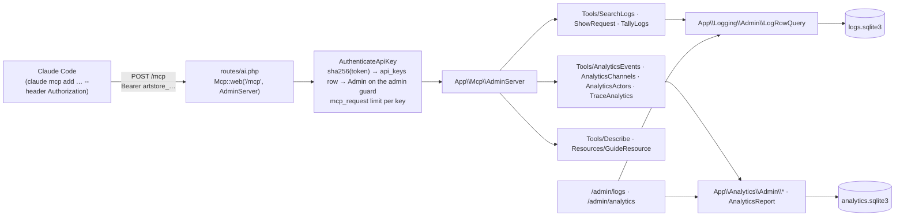

# MCP endpoint

The app hosts a Model Context Protocol server at `POST /mcp`, so an
agent such as Claude Code can query the log store and the analytics
store with the same readers the admin pages call. One api key per
admin opens it; the key's admin is the actor on every line the request
logs. Nothing behind the endpoint writes.

Code: `app/Mcp/{AdminServer,Guide,LogFilterSchema,RangeInput,ToolRows}.php`,
`app/Mcp/Tools/*.php`, `app/Mcp/Resources/GuideResource.php`,
`routes/ai.php`, `app/Http/Middleware/AuthenticateApiKey.php`,
`app/Models/ApiKey.php`, `app/Domain/Auth/ApiKeyToken.php`,
`app/Actions/ApiKeys/MintApiKey.php`, `app/Console/Commands/MintMcpKey.php`,
`app/Logging/Admin/LogFilterInput.php`, `database/migrations/*_create_api_keys_table.php`.
The protocol itself — JSON-RPC over streamable HTTP, `initialize`,
`tools/list`, `tools/call`, `resources/read` — is `laravel/mcp`'s.

Three invariants govern the design:

1. **The tools are the admin pages' readers.** Every tool calls a class
   the admin site already calls — `App\Logging\Admin\LogRowQuery`,
   `App\Analytics\Admin\{EventTotals,ChannelTable,ActorList}`,
   `App\Analytics\AnalyticsReport` — and validates its input with the
   same rules. The filter vocabulary lives once, in
   `App\Logging\Admin\LogFilterInput`, and `LogsQueryRequest` reads it
   from there too.
2. **The key is the admin.** `AuthenticateApiKey` signs the request in
   on the `admin` guard as the key's owner, so a tool's
   `$request->user()` is an `Admin` and the request's `http.request`
   lines carry `actor_type: admin` with that admin's id.
3. **The server describes itself.** The `describe` tool and the
   `artstore://guide` resource answer one text, built by `App\Mcp\Guide`
   from the same enums that validate the filters — every log event
   name, level, phase, domain, analytics event name, id shape, and both
   retention windows — so the description can never drift from what
   the tools accept.

## Shape



The route sits outside the `web` group: no session, no CSRF, one
stateless POST per JSON-RPC message. The package answers GET and DELETE
on the path with 405 and stamps a `WWW-Authenticate` challenge on every
401. The global middleware still applies, so every call opens a request
story with a `req_…` id, and `PageViewCountability` — GET, 2xx, HTML —
keeps MCP traffic out of the page-view roll-up. The endpoint's own
requests are hidden from the log viewer and the log tools by default, the
way the viewer's own requests are (`mcp=1` in the viewer, `include_mcp`
in a tool); `domain=mcp` selects exactly them.

## Every call is logged

`LogMcpCall` wraps the key guard and writes one `mcp.call` line pair per
JSON-RPC message (docs/spec.md §2.3): `will` names the method and the
tool or resource, with a tool's arguments redacted the way a query string
is; `did` carries the HTTP status, the key that opened the call, and the
outcome read off the answer (`ok`, `tool_error`, `rpc_error`, or
`streamed` when the answer went out as an event stream). A missing,
malformed, unknown, revoked, or rate-limited key ends the line `refused`
at `warn`, so an attempt by a stranger is the kind of line
`/admin/logs?level=warn` exists for. The key guard leaves the key id on
the request under `LogMcpCall::KEY_ATTRIBUTE` for the closing line.
`domain=mcp` in the viewer, or `search-logs` with `event: mcp.call`, is
the access record.

## Keys

`api_keys` (docs/spec.md §1 prefix `key`) holds one row per key:
`admin_id`, `name`, `token_hash`, `last_used_at`, `revoked_at`. The
plaintext is `artstore_` followed by forty random alphanumerics
(`App\Domain\Auth\ApiKeyToken`); the row keeps its sha256 digest, the
rule `magic_links` follows. `last_used_at` is written at most once a
minute per key (`ApiKey::USED_AT_GRAIN_SECONDS`), so a burst of tool
calls costs one UPDATE. A revoked row stays as the record of the key
and never authenticates again.

An admin mints and revokes their own keys on `/admin/settings/api-keys`
(`Admin\ApiKeyController`, `Admin\RevokeApiKeyController`,
`ApiKeyPolicy`): the mint form takes a name, the redirect carries the
plaintext in the session under `ApiKeyController::MINTED_KEY`, and the
page that follows shows it once. Another admin's key answers 404, the
site's one ownership refusal. `make mcp-key EMAIL=<admin address>
NAME="<what for>"` (`mcp:key`) mints one from the CLI the same way.

Every call spends the `mcp_request` limit (docs/spec.md §3, default
`600/1h`, keyed by the key's id); a trip answers 429 as JSON with
`Retry-After`.

## Connecting Claude Code

```sh
claude mcp add --transport http art-store http://localhost:8000/mcp \
  --header "Authorization: Bearer artstore_…"
```

The repository root's `.mcp.json` carries the same server at project
scope with the key read from `ART_STORE_MCP_KEY`, so the file is
committed and the secret is not. Point it at the deployed host with
`ART_STORE_MCP_URL`.

## Tools

| Tool                 | Reader                                  | Answers                                                                   |
| -------------------- | --------------------------------------- | ------------------------------------------------------------------------- |
| `describe`           | `Guide`                                 | the guide: every tool and the whole filter vocabulary                     |
| `search-logs`        | `LogRowQuery::rows()` / `count()`       | matching lines newest first, `limit` ≤ 200, `offset`, and the total       |
| `show-request`       | `LogRowQuery::storyRows()`              | one request's lines in order, capped where the story view caps            |
| `tally-logs`         | `LogRowQuery::levelTallies()`           | matching lines per level, `level` itself ignored                          |
| `analytics-events`   | `EventTotals::forRange()`               | every event name over a range against the range before, one count per day |
| `analytics-channels` | `ChannelTable::forRange()`              | every channel's visitors, views, cart adds, orders placed and paid         |
| `analytics-actors`   | `ActorList::forRange()`                 | active customers, sorted and paged, with the scripted-peak flag           |
| `trace-analytics`    | `AnalyticsReport::eventsForSession/Ip()` | everything one session or one ip did in the last `days`                  |

The three log tools take the `/admin/logs` filters by their query-string
names (`domain`, `level`, `phase`, `event`, `request`, `txn`, `session`,
`actor`, `msg`, `from`, `to`, `key`, `value`) plus `include_health` and
`include_viewer`, and `include_mcp`; the analytics tools take `days` (7, 30, or 90) and
`ends_on`. Every answer is `structuredContent` JSON with the same text
in `content`, rows flattened to snake_case by `App\Mcp\ToolRows`. A
value outside the vocabulary answers a tool error naming the field; a
log tool in a process whose store is off answers one saying so.

## Testing

`AdminServer::tool(SearchLogs::class, [...])` runs a tool in-process
against a temp-file `LogStore` or the test transaction's analytics
connection; `AdminServerTest` posts real JSON-RPC through the route
with a factory key. `php artisan mcp:inspector mcp` (inside the
container) opens the MCP Inspector against the running server.

## Next

- A read-only SQL tool over the three SQLite files — engine read-only,
  an authorizer (ext/sqlite3, not in the image today), and a row cap.
- An `mcp.call` log event naming the tool per call, a vocabulary
  addition for docs/spec.md §2.3.
