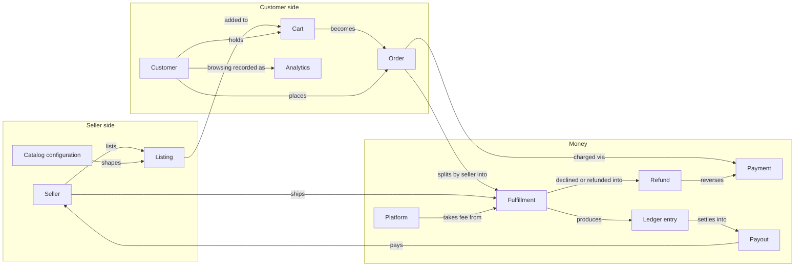

# Domain ontology

A two-sided marketplace for hand-made art: sellers list one-of-a-kind or
limited-quantity pieces, customers browse and buy them. Payment is captured
at checkout but held in escrow per seller until the customer confirms
delivery, then settled into a weekly payout.

Question: what are the entities in the product, and how does value move
between them at the concept level? (Table-level shape:
[`data-model.md`](data-model.md). Sequence and state detail:
[`orders.md`](orders.md), [`escrow.md`](escrow.md),
[`identity.md`](identity.md).)

Smaller catalog and identity concepts (favorite, cart item, order item,
magic link, customer merge, notification) sit off this diagram — they
support the entities shown. So do the seller's own: the store profile and
its sections, the fulfillment flow and its steps, the fulfillment event
log, and the activity feed. "Catalog configuration" stands for the sixteen
tables behind a listing's options, stock, and content; "Analytics" stands
for the analytics event, the visit, and the funnel. Each gets its own
section below.

## Roles

### Seller

**Who/what.** A human who lists art for sale and gets paid out.

**Why it exists.** Supplies the catalog; the platform's other side of the
marketplace.

**Lifecycle.** None — a seller row exists from first sign-in and does not
change state. `email_verified_at` is set the first time they sign in through
a magic link.

**Relates to.**
- owns Listings
- ships Fulfillments
- receives Ledger entries and Payouts
- receives Notifications

**In code.** `App\Models\Seller` (table `sellers`).

### Customer

**Who/what.** A storefront visitor. Every visitor gets a row, verified or
not — see "verified customer" and "guest checkout" in Vocabulary notes.

**Why it exists.** Holds favorites, a cart, and orders across a visit, so
browsing state survives before anyone gives an address.

**Lifecycle.** None as a status field, but a row moves through three
conditions: anonymous (`email` null) → guest with an unverified address
(email set, `email_verified_at` null) → verified (`email_verified_at` set).
`Customer::isAnonymous()` reads the first.

**Relates to.**
- has Favorites, a Cart, and Analytics events
- places Orders
- receives Notifications
- may be the source or the target of a Customer merge

**In code.** `App\Models\Customer` (table `customers`).

**From a seller's side.** A seller's *customer* is a buyer: a customer with
at least one live fulfillment with that seller. Favoriting, viewing, or asking
about a listing does not make someone a seller's customer; those facts join
the buyer's timeline once they have bought. The seller portal's Customers
section lists exactly this set.

### Anonymous visitor

**Who/what.** Not a separate table — a Customer row with `email = null`,
identified by an encrypted `customer_id` cookie rather than sign-in.

**Why it exists.** Lets a visitor favorite, cart, and check out as a guest
before proving an email address.

**Lifecycle.** Ends when the visitor verifies an address: the row is either
claimed in place or merged into an existing verified Customer (see Customer
merge).

**Relates to.**
- is a Customer
- resolved per request by `ResolveCustomerIdentity` (see [`identity.md`](identity.md))

**In code.** No separate model or enum — `Customer::isAnonymous()`,
`App\Domain\Customers\CustomerIdentityPlan`.

### Platform

**Who/what.** The marketplace operator. Not a database row — a role played
by the code that takes a cut of each sale and settles seller payouts.

**Why it exists.** Names who the platform fee belongs to and who runs the
weekly payout job.

**Lifecycle.** None.

**Relates to.**
- takes a Platform fee from each Fulfillment's subtotal
- runs Payouts (`payouts:run`)

**In code.** `App\Domain\Escrow\Fee` (`PLATFORM_PERCENT`); no model — the
platform holds no row of its own.

### Admin

**Who/what.** A platform operator. Seeded, never signed up.

**Why it exists.** Someone has to read the whole platform, moderate what is on
it, and pay sellers. The Platform is the abstraction; an Admin is the person
acting for it.

**Lifecycle.** None — seeded and permanent.

**Relates to.**
- reaches every Seller, Customer, Listing, Order and Fulfillment through the
  admin site
- removes a Listing and blocks a Customer
- issues a Refund on a Fulfillment and cancels an unpaid Order
- runs the weekly Payout
- is one voice of the desk, the shared side of a support Conversation every
  Admin sees; also reads every seller ↔ customer Conversation, read-only

**In code.** `App\Models\Admin`, the `admin` guard, `App\Http\Controllers\Admin\*`
(table `admins`).

## Catalog

### Listing

**Who/what.** One piece (or a small run of identical pieces) a seller has
for sale.

**Why it exists.** The unit of inventory and the storefront's unit of
browsing.

**Lifecycle.** `draft → for_sale → sold`, plus `archived` from `draft` or
`for_sale`, plus `sold → for_sale` (a declined charge restores the stock it
took). Only `for_sale` listings appear in browse and search; a `sold`
listing keeps its page (`isOnStorefront()` is true for both). See "sold" in
Vocabulary notes.

**Relates to.**
- belongs to one Seller
- records Analytics events
- favorited by Customers via Favorite
- held in Cart items, sold as Order items

**In code.** `App\Models\Listing`, `App\Domain\Listings\ListingStatus`
(enum), `ListingAvailability`, `ListingStock`, `ListingSlug`, `ListingDraft`
(table `listings`).

### Analytics event

**Who/what.** One recorded interaction, one of eleven names: a listing
viewed, favorited, unfavorited, or cart-added; a checkout opened; an order
placed, paid, or cancelled; a store's public page viewed; a help article
marked answered or unanswered.

**Why it exists.** Feeds the seller's per-listing activity numbers, the
dashboard's daily activity timeline, the storefront funnel, and the admin
analytics drill-in.

**Lifecycle.** None — write-once, timestamped fact. The timestamp is the
instant the interaction was recorded, not the instant the row was written —
recording only appends to an in-memory buffer, which a later flush turns
into rows.

**Relates to.**
- belongs to one Listing, Order, Cart, Store, or help article, named by
  `subject_type`/`subject_id`
- optionally attributed to one Customer (`actor_id` nullable)

**In code.** `App\Analytics\Analytics` (the one writer),
`App\Analytics\AnalyticsEvent`, `App\Domain\Analytics\AnalyticsEventName`
(enum: `listing.view` | `listing.favorite` | `listing.unfavorite` |
`listing.cart_add` | `checkout.open` | `order.place` | `order.pay` |
`order.cancel` | `store.view` | `help.answered` | `help.unanswered`),
`App\Analytics\AnalyticsReport` (the reader) (table `analytics_events`).
See [`analytics.md`](analytics.md).

### Visit

**Who/what.** The first-touch facts of one browser session: when it
started, where it landed, the `Referer` host, the five `utm_*` values, and
the Customer when the request already carried one.

**Why it exists.** Says which channel brought a session, so the session's
later events group by origin (`Channel::derive()`).

**Lifecycle.** Write-once: `session_id` is the primary key and the flush
writes `INSERT OR IGNORE`, so only a session's first request lands. Pruned
with Analytics events after `ANALYTICS_RETENTION_DAYS`.

**Relates to.**
- keyed by the `sid` cookie, the same `session_id` an Analytics event
  carries
- optionally attributed to one Customer (`actor_id`, no FK)
- read by the admin channel report and the actor page

**In code.** `App\Analytics\AnalyticsVisit`, `App\Analytics\ActorVisitRow`,
`App\Domain\Analytics\Channel` (table `analytics_visits` in the analytics
store; no Eloquent model). See [`analytics.md`](analytics.md) § "Schema".

### Funnel

**Who/what.** An admin-defined path through the analytics vocabulary: a
name, a unique slug, an ordered `steps` list of event names, and a
`position` among the tiles on the analytics home.

**Why it exists.** Shows where sessions drop between one event and the
next, for the whole store, one listing, or one seller.

**Lifecycle.** None — created, edited, reordered, and removed at
`/admin/funnels`. `FunnelSeeder` seeds the "Storefront" funnel on every
`make fresh` and every deploy. Visitors is every funnel's implied first
step and is never stored.

**Relates to.**
- names Analytics event names as its steps; `FunnelDefinition` validates
  the list (two or more names, each known, none repeated)
- read by `App\Analytics\Admin\Funnel` and `FunnelTiles`

**In code.** `App\Models\Funnel`, `App\Domain\Analytics\FunnelDefinition`
(table `funnels` in the app database). See [`analytics.md`](analytics.md)
§ "The funnel".

### Listing removal

**Who/what.** An admin taking a listing off the storefront, with a reason.

**Why it exists.** A piece may need to come down for review or for good,
whatever its seller set its status to. Status is the seller's word; a removal
is the platform's, and it outranks the status.

**Lifecycle.** `temporary` may be lifted; `permanent` may not. At most one
removal is active on a listing at a time.

**Relates to.**
- belongs to one Listing
- while it stands, the listing leaves browse, search, `/art/{slug}` and the
  favorites page, and its seller cannot put it back on sale
- blocks the line at checkout with the `removed` reason

**In code.** `App\Models\ListingRemoval`,
`App\Domain\Listings\ListingRemovalKind`,
`App\Domain\Listings\ListingAvailability` (table `listing_removals`).

### Favorite

**Who/what.** A customer's bookmark on a listing.

**Why it exists.** Lets a customer track pieces of interest without adding
them to the cart.

**Lifecycle.** None — exists or does not; toggled on and off.

**Relates to.**
- belongs to one Customer and one Listing
- toggling one also records an Analytics event (`favorite`/`unfavorite`)

**In code.** `App\Models\Favorite`, `App\Domain\Favorites\FavoriteChange`
(enum: `Added` | `Removed`) (table `favorites`).

## Catalog configuration

The sixteen tables behind a listing's options, stock, and content. The
taxonomy layer (Category, Property, Property value, Category property) is
platform data every listing reads; every other row belongs to one Listing
and carries `seller_id` beside `listing_id`. `App\Models\Listing` reaches
them through `category()`, `optionAxes()`, `variants()`, `modifiers()`,
`quantityBreaks()`, `descriptionSections()`, and `images()`. The full
shape, the price and availability resolution, and the seller and customer
flows are in [`item-configurator.md`](item-configurator.md).

### Category

**Who/what.** One node in the taxonomy tree a seller places a listing in.
`path` is the materialized path (`/jewelry/rings/`); `browsable` says
whether a browse page lists it.

**Why it exists.** Grants Properties to the listings placed in it, through
Category properties.

**Lifecycle.** None.

**Relates to.**
- has one parent Category and many children
- grants Properties through Category properties
- placed on Listings (`listings.category_id`, nullable)

**In code.** `App\Models\Category` (table `categories`, prefix `cat`).
See [`item-configurator.md`](item-configurator.md) §2.1.

### Property

**Who/what.** One catalog property (Metal, Ring Size, Paper Stock) with a
`data_type` (`PropertyDataType`: `enum` | `text` | `number`).

**Why it exists.** Named once, granted to many Categories.

**Lifecycle.** None.

**Relates to.**
- has Property values, ordered by position
- granted by Category properties

**In code.** `App\Models\Property`,
`App\Domain\Configurator\PropertyDataType` (table `properties`, prefix
`prp`). See [`item-configurator.md`](item-configurator.md) §2.1.

### Property value

**Who/what.** One enumerated value of a Property (Gold, Silver for Metal).

**Why it exists.** The value a Listing attribute and an Option value point
at, so a facet and a choice share one label.

**Lifecycle.** None.

**Relates to.**
- belongs to one Property
- named by Listing attributes and Option values

**In code.** `App\Models\PropertyValue` (table `property_values`, prefix
`pvl`). See [`item-configurator.md`](item-configurator.md) §2.1.

### Category property

**Who/what.** One grant: a Category allows a Property on the listings
placed in it, and how — `usable_as_attribute`, `usable_as_axis`,
`required`, `multivalued`.

**Why it exists.** One tree serves the seller's form and the buyer's
facets; the grant says which use a property has in which category.

**Lifecycle.** None. Unique per (category, property).

**Relates to.**
- belongs to one Category and one Property

**In code.** `App\Models\CategoryProperty` (table `category_properties`,
prefix `cpr`). See [`item-configurator.md`](item-configurator.md) §2.1.

### Listing attribute

**Who/what.** One search-facet fact about a listing: a Property paired
with one of its values (Metal: Gold).

**Why it exists.** The row a facet filter reads.

**Lifecycle.** None. Unique per (listing, property, value); a
`multivalued` property holds more than one row on a listing.

**Relates to.**
- belongs to one Listing and one Seller
- names one Property and one Property value

**In code.** `App\Models\ListingAttribute` (table `listing_attributes`,
prefix `lat`). See [`item-configurator.md`](item-configurator.md) §2.1.

### Option axis

**Who/what.** One buyer-facing choice a listing offers (Metal, Size):
a catalog Property, or a custom label-only axis when `property_id` is
null. `pricing_mode` (`PricingMode`: `add_on` | `standalone`) is chosen
at creation.

**Why it exists.** The dimension a Variant is a combination of.

**Lifecycle.** None — added, renamed, reordered, removed from the
configurator.

**Relates to.**
- belongs to one Listing and one Seller
- may name one Property
- has Option values

**In code.** `App\Models\OptionAxis`, `App\Domain\Configurator\PricingMode`
(table `option_axes`, prefix `axs`). See
[`item-configurator.md`](item-configurator.md) §2.2.

### Option value

**Who/what.** One choice on an Option axis (Gold, Silver): a label, a
`surcharge_cents` on an `add_on` axis or a `price_cents` on a `standalone`
one, and `is_default`.

**Why it exists.** The price delta a choice adds, and the value a Variant
option and a Modifier scope point at.

**Lifecycle.** None. At most one default per axis, enforced by the action.

**Relates to.**
- belongs to one Option axis and one Seller
- may name one Property value
- chosen by Variant options
- gates Modifiers through Modifier scopes

**In code.** `App\Models\OptionValue` (table `option_values`, prefix
`ovl`). See [`item-configurator.md`](item-configurator.md) §2.2.

### Variant

**Who/what.** One sellable combination of a listing's option values, with
a sku, a price override, a `quantity` (null when serialized), `is_serialized`,
and `enabled`. `combo_key` is the sorted, `/`-joined option-value ids;
`''` for an axis-free listing.

**Why it exists.** A sparse row: the seller creates only the combinations
that sell.

**Lifecycle.** None. Unique per (listing, combo_key).

**Relates to.**
- belongs to one Listing and one Seller
- has Variant options, one per axis
- has Units when serialized

**In code.** `App\Models\Variant` (table `variants`, prefix `vrt`). See
[`item-configurator.md`](item-configurator.md) §2.2.

### Variant option

**Who/what.** One axis's chosen value within a Variant.

**Why it exists.** The row that says which cell of the cross product a
Variant is.

**Lifecycle.** None. Unique per (variant, axis).

**Relates to.**
- belongs to one Variant and one Seller
- names one Option axis and one Option value

**In code.** `App\Models\VariantOption` (table `variant_options`, prefix
`vop`). See [`item-configurator.md`](item-configurator.md) §2.2.

### Unit

**Who/what.** One serialized, one-of-a-kind piece of stock behind a
Variant: a label, a `state`, a condition note, specs, and a price override.

**Why it exists.** Replaces a numbered-lot axis with one row per piece.

**Lifecycle.** `UnitState`: `available` → `sold`. `reserved` is a case
nothing writes. Unique per (variant, label).

**Relates to.**
- belongs to one Variant and one Seller

**In code.** `App\Models\Unit`, `App\Domain\Configurator\UnitState`
(table `units`, prefix `unt`). See
[`item-configurator.md`](item-configurator.md) §2.2.

### Modifier

**Who/what.** One order-line question a listing asks: a `kind`
(`ModifierKind`: `text` | `select` | `measurement`), a prompt,
instructions, `required`, and its price — `add_on_price_cents` for text,
`rate_cents_per_unit` between `min_value` and `max_value` for measurement,
per option for select.

**Why it exists.** Inventory stays on the Variant; the answer attaches to
the order line.

**Lifecycle.** None — added, edited, reordered, removed from the
configurator.

**Relates to.**
- belongs to one Listing and one Seller
- has Modifier options when `select`
- shown for the Option values its Modifier scopes name

**In code.** `App\Models\Modifier`, `App\Domain\Configurator\ModifierKind`
(table `modifiers`, prefix `mdf`). See
[`item-configurator.md`](item-configurator.md) §2.2.

### Modifier option

**Who/what.** One choice on a `select` Modifier (a font, a paper stock)
with its own `add_on_price_cents`.

**Why it exists.** A select modifier prices per chosen option.

**Lifecycle.** None.

**Relates to.**
- belongs to one Modifier and one Seller

**In code.** `App\Models\ModifierOption` (table `modifier_options`, prefix
`mdo`). See [`item-configurator.md`](item-configurator.md) §2.2.

### Modifier scope

**Who/what.** One Option value a Modifier shows for.

**Why it exists.** Gates a question to the choices it applies to; zero
rows for a modifier means it shows product-wide.

**Lifecycle.** None. Unique per (modifier, option value).

**Relates to.**
- belongs to one Modifier and one Seller
- names one Option value

**In code.** `App\Models\ModifierScope` (table `modifier_scopes`, prefix
`mds`). See [`item-configurator.md`](item-configurator.md) §2.2.

### Quantity break

**Who/what.** One tier: at `min_qty` or more, the resolved unit price
carries a `discount_bps` discount.

**Why it exists.** Volume pricing on a listing.

**Lifecycle.** None. Unique per (listing, min_qty).

**Relates to.**
- belongs to one Listing and one Seller

**In code.** `App\Models\QuantityBreak` (table `quantity_breaks`, prefix
`qbk`). See [`item-configurator.md`](item-configurator.md) §2.2.

### Description section

**Who/what.** One typed slice of a listing's description: a `kind`
(`DescriptionSectionKind`: `text` | `specs` | `size_chart` | `faq` |
`care` | `disclaimer`), a title, and a `body_md` or a `body_json`.

**Why it exists.** A size chart or a care sheet renders from data.

**Lifecycle.** None. Unique position per listing.

**Relates to.**
- belongs to one Listing and one Seller

**In code.** `App\Models\DescriptionSection`,
`App\Domain\Configurator\DescriptionSectionKind` (table
`description_sections`, prefix `dsc`). See
[`item-configurator.md`](item-configurator.md) §2.3.

### Listing image

**Who/what.** One photo on a listing, ordered by `position`.

**Why it exists.** The lowest position is the cover every surface renders
through `Listing::imageUrl()`.

**Lifecycle.** None — added, reordered, removed on the Images screen.
Unique per (listing, position).

**Relates to.**
- belongs to one Listing and one Seller

**In code.** `App\Models\ListingImage`,
`App\Domain\Listings\ListingImageMove` (table `listing_images`, prefix
`img`). See [`item-configurator.md`](item-configurator.md) §2.3.

## Store

### Store profile

**Who/what.** How one seller presents on the site: a name, an address under
`/s/{slug}`, a tagline, where they work, a portrait, a cover, links, and an
ordered list of Store sections. One row per Seller.

**Why it exists.** A buyer who likes one piece asks who made it. The profile
is the page that answers, and the address a seller can hand out.

**Lifecycle.** Minted hidden on the seller's first visit to
`/seller/store`, published when `published_at` is set, hidden again when it
is cleared. A hidden store answers 404 to everyone but its own seller.

**Relates to.**
- belongs to one Seller
- is built from Store sections, ordered by position
- owns Store images, two of which it names as its portrait and its cover
- carries Store links (website, instagram)
- keeps every address it has ever answered to as a `store_slugs` row, the
  retired ones stamped `retired_at`; a retired address redirects to the
  current one for thirty days
- shows the seller's storefront Listings below its sections
- records a `store.view` analytics event per (store, customer, UTC hour)

**In code.** `App\Models\StoreProfile`, `App\Models\StoreSlug`,
`App\Models\StoreImage`, `App\Models\StoreLink`,
`App\Domain\Store\{StoreSlug,RetiredSlugWindow,StoreViewCollapse}`,
`App\Actions\Store\{StartStore,RenameStoreSlug,RemoveStoreImage}`,
`App\Seller\Store\{StoreAddressLookup,StoreFacts,StoreFactsReader}` (tables
`store_profiles`, `store_slugs`, `store_images`, `store_links`). See
[`seller-portal.md`](seller-portal.md).

### Store section

**Who/what.** One block of a store page, of a typed kind: a `story` with a
heading and a body, a `gallery` with a heading and ordered pictures.

**Why it exists.** A store page grows a new kind of content every few
months. A typed, ordered child row means a new kind is a new enum case and a
renderer, never a wider profile row and never a JSON blob the database
cannot index or validate.

**Lifecycle.** None — added, edited, reordered, removed. `position` is
unique per profile.

**Relates to.**
- belongs to one Store profile
- a gallery places Store images through `store_section_images`, ordered by
  position

**In code.** `App\Models\StoreSection`, `App\Models\StoreSectionImage`,
`App\Domain\Store\{StoreSectionKind,StoreSectionField}`,
`App\Http\Requests\Seller\StoreSectionRequest` (tables `store_sections`,
`store_section_images`).

## Buying

### Cart

**Who/what.** A customer's in-progress selection, held until checkout.

**Why it exists.** Lets a customer collect items from multiple sellers
before placing one order.

**Lifecycle.** None as a status; exists per customer, spawns an Order on
checkout. A merge can leave a customer with two cart rows (`carts.customer_id`
is not unique); the one with items is the one in use.

**Relates to.**
- belongs to one Customer
- contains Cart items

**In code.** `App\Models\Cart`, `App\Domain\Cart\CartTotals` (table `carts`).

### Cart item

**Who/what.** One listing and quantity held in a cart.

**Why it exists.** The line the cart totals and the order are built from.

**Lifecycle.** None — created on add, deleted on remove or on checkout.

**Relates to.**
- belongs to one Cart
- references one Listing

**In code.** `App\Models\CartItem`, `App\Domain\Cart\CartLine`,
`CartQuantity` (table `cart_items`).

### Order

**Who/what.** A customer's purchase, possibly spanning several sellers.

**Why it exists.** The record of a transaction from checkout through
delivery; the parent of the per-seller Fulfillments.

**Lifecycle.** `pending_verification` (guest) or `awaiting_payment`
(verified) → `paid` or `payment_failed` → `partially_shipped` / `shipped` →
`delivered`. `cancelled` is reached from any state before payment, by the
customer, an admin, or the stale sweep; `refunded` is reached once every
Fulfillment is declined or refunded. A multi-seller order's status rolls up
from its **live** Fulfillments (`OrderStatus::fromFulfillments()`). Full
diagram: [`orders.md`](orders.md).

**Relates to.**
- placed by one Customer
- contains Order items
- attempts Payments
- splits by seller into Fulfillments
- sends money back through Refunds
- raises `OrderPaid` when it reaches `paid`, which tells each seller their
  item sold, and `OrderCancelled` when it ends unpaid

**In code.** `App\Models\Order`, `App\Domain\Orders\OrderStatus` (enum),
`Purchaser`, `ShippingAddress`, `OrderPayment` (table `orders`).

### Order item

**Who/what.** A snapshot of one purchased listing: title, unit price, and
quantity as they were at checkout.

**Why it exists.** An order reads the same after the seller edits or deletes
the listing behind it.

**Lifecycle.** None — written once at order placement.

**Relates to.**
- belongs to one Order
- references the Listing it was bought from, tagged with the selling Seller

**In code.** `App\Models\OrderItem` (table `order_items`).

### Payment

**Who/what.** One charge attempt against an order's card.

**Why it exists.** Records the outcome (approved or declined) of trying to
collect the order total; a retry after a decline is a new attempt, not an
edit.

**Lifecycle.** `approved` or `declined`, one row per attempt — the order's
current payment is the latest row.

**Relates to.**
- belongs to one Order
- decided by a Card decision

**In code.** `App\Models\Payment`, `App\Domain\Payments\PaymentStatus` (enum)
(table `payments`).

### Refund

**Who/what.** Money sent back to a customer for one Fulfillment, always the
whole subtotal.

**Why it exists.** A decline and a dispute both end the same way — the
customer is made whole — and the platform needs one record of who decided it
and why.

**Lifecycle.** Written once, never edited. There is no gateway behind it: the
row is the refund, and it always succeeds.

**Relates to.**
- belongs to one Order and one Fulfillment (at most one per Fulfillment)
- reverses the approved Payment on that Order
- issued by a Seller (declining) or an Admin (settling a dispute)
- writes a `refunded` Ledger entry for the Fulfillment's net
- raises `RefundIssued`, which tells the counterpart

**In code.** `App\Models\Refund`, `App\Actions\Escrow\IssueRefund` (table
`refunds`).

### Fulfillment

**Who/what.** One seller's slice of an order — what that seller owes to ship
and what they're owed once it's delivered.

**Why it exists.** An order can span sellers; escrow and shipping status are
tracked per (order, seller) pair rather than per order.

**Lifecycle.** `awaiting_shipment → shipped → delivered`, with `declined`
(the seller turning it down before it ships, stock restored) and `refunded`
(an admin settling it, stock unchanged) as the two settled endings. Full
diagram: [`orders.md`](orders.md).

**Relates to.**
- belongs to one Order and one Seller
- produces Ledger entries when the order is paid (`held`), when delivered
  (`released`), when refunded (`refunded`), and when included in a Payout
  (`paid_out`)
- raises `FulfillmentShipped` when it ships, which tells the customer their
  order is on its way
- carries the Platform fee taken from its subtotal

**In code.** `App\Models\Fulfillment`,
`App\Domain\Orders\FulfillmentStatus` (enum) (table `fulfillments`). See
"Orders" in Vocabulary notes for the seller portal's name for this entity.

### Fulfillment flow

**Who/what.** One seller's ordered list of Flow steps between a parcel being
paid for and being shipped.

**Why it exists.** A potter cools a kiln, a framer frames, a printer waits on
ink. The Fulfillment status is the platform's contract and is the same for
everyone; the flow is where a seller's own method is written down.

**Lifecycle.** A seller's first flow is their default: `FulfillmentFlowSeeder`
marks it for a seeded seller, and `CreateFulfillmentFlow` marks the first
flow any seller creates. `/seller/workflows`
adds, edits, and removes flows after that (index, create, edit, make-default,
destroy). One default per seller is a partial unique index, `(seller_id)
where is_default`; the default flow itself cannot be removed, and neither can
a flow a listing names — the seller reassigns the default or the listing
first.

**Relates to.**
- belongs to one Seller
- orders many Flow steps
- may be named by a Listing (`listings.fulfillment_flow_id`); a listing that
  names none ships by its seller's default. `PlaceOrder` stamps the answer
  on `fulfillments.fulfillment_flow_id`, and
  `App\Seller\FulfillmentFlowReader::read()` reads it

**In code.** `App\Models\FulfillmentFlow`,
`App\Domain\Fulfillment\DefaultFlow`,
`App\Actions\Fulfillment\SaveFulfillmentFlow`,
`Database\Seeders\FulfillmentFlowSeeder` (table `fulfillment_flows`).

### Flow step

**Who/what.** One step of a flow: the words the seller gave it, its place in
the order, and what completing it does beyond recording it.

**Why it exists.** The unit the seller ticks off on a parcel, and the thing
the order page's panel and the desk's lanes are read from.

**Lifecycle.** None — added, renamed, reordered, removed, all in one
transaction from the flow editor. `key` and `position` are each unique
inside the flow. A step the seller removes leaves the completions that
named it: the foreign key nulls out and the event keeps the step's words.

**Relates to.**
- belongs to one Fulfillment flow
- carries a `FlowStepAction`: `none`, or `print_label` for the step that
  takes a carrier and a tracking number and answers the printable label page
- is completed as a Fulfillment event

**In code.** `App\Models\FulfillmentFlowStep`,
`App\Domain\Fulfillment\{FlowStep,FlowStepAction,FlowStepDraft}`,
`App\Actions\Fulfillment\CompleteFlowStep` (table
`fulfillment_flow_steps`).

### Fulfillment event

**Who/what.** One appended row saying something happened to a parcel: a step
completed, or the parcel shipped, delivered, declined, refunded.

**Why it exists.** `fulfillments.status` says where a parcel is and holds one
value at a time. The log says what has been done to it and when, which is
what a seller's lanes, an order's activity feed, and a label reprint all
read.

**Lifecycle.** Append-only, never edited. A `step_completed` row copies the
step's label, so the log still reads after the seller renames or removes the
step.

**Relates to.**
- belongs to one Fulfillment and one Seller
- names a Flow step on a `step_completed` row, and none on a transition row
- names its actor by type (`seller` | `customer` | `admin` | `system`) and id
- carries the carrier and tracking number a `print_label` step recorded
- is unique on `(fulfillment_id, fulfillment_flow_step_id)`, so a step is
  completed once; a unique index counts each null as its own value, which
  leaves the transition rows outside the constraint

**In code.** `App\Models\FulfillmentEvent`,
`App\Domain\Fulfillment\{FulfillmentEventKind,NewFulfillmentEvent,FulfillmentProgress,FulfillmentLane}`,
`App\Actions\Fulfillment\AppendFulfillmentEvent` (the one writer) (table
`fulfillment_events`). See [`orders.md`](orders.md) § "The fulfillment event log and
the seller's flow".

### Activity feed

**Who/what.** One ordered list of everything between a seller and one buyer,
or everything on one parcel: what the buyer browsed, the order and its
money, the parcel's events, the messages between them.

**Why it exists.** The facts live in four stores. A seller reading a
conversation or an order wants them in one column, newest first, with no
row told twice.

**Lifecycle.** None — nothing writes a feed row. It is computed per request
from a scope.

**Relates to.**
- reads Analytics events from the analytics store, Orders / Payments / Ledger
  entries / Refunds, Fulfillment events, and Messages
- is scoped to one Fulfillment or to one (seller, customer) pair
- filters by kind: `browse`, `order`, `shipping`, `messages`

**In code.** `App\Domain\Seller\{ActivityFeed,FeedEvent,ActivityKind,FeedIcon}`,
`App\Seller\{ActivityFeedReader,ActivityFeedSource,FeedScope,AnalyticsSource,OrderSource,FulfillmentSource,MessagingSource}`,
`x-seller.feed` (no table). See [`seller-portal.md`](seller-portal.md)
§ "Activity feed".

## Money

### Money

**Who/what.** An integer-cents amount; the type every price, fee, and
balance in the system is expressed in.

**Why it exists.** Avoids float rounding on currency; every arithmetic
operation (add, multiply, percent) works in whole cents.

**Lifecycle.** None — an immutable value.

**Relates to.**
- used by Listing price, Order totals, Payment amount, Fulfillment
  subtotal/fee/net, Ledger entry amount, Payout amount

**In code.** `App\Domain\Money\Money` (value object; no table — stored as
`*_cents` integer columns).

### Platform fee

**Who/what.** The percentage of an item's subtotal the platform keeps.

**Why it exists.** The platform's revenue; the reason "seller net" is less
than the sale subtotal.

**Lifecycle.** None — computed once at order placement, stored on the
Fulfillment row (`fee_cents`, `net_cents`) rather than recomputed later.

**Relates to.**
- computed from a Fulfillment's subtotal (10%, `Fee::PLATFORM_PERCENT`)
- taken by the Platform

**In code.** `App\Domain\Escrow\Fee` (no table — persisted as
`fulfillments.fee_cents`/`net_cents`).

### Ledger entry

**Who/what.** One movement of escrowed money for one seller.

**Why it exists.** An auditable trail of every hold, release, and payout,
rather than a single mutable balance column.

**Lifecycle.** Written once per movement: `held` (order paid), `released`
(fulfillment delivered), `refunded` (fulfillment declined or refunded —
negative amount), `paid_out` (included in a payout run — negative amount). A
seller's balance is the fold of all their entries, grouped by fulfillment so a
refund nets against its own sale (`LedgerBalance::from()`). Flowchart:
[`escrow.md`](escrow.md).

**Relates to.**
- belongs to one Seller
- produced by one Fulfillment (`held`/`released`/`refunded`) or one Payout
  (`paid_out`)

**In code.** `App\Models\LedgerEntry`, `App\Domain\Escrow\LedgerEntryType`
(enum), `LedgerMovement`, `LedgerBalance` (table `ledger_entries`).

### Payout

**Who/what.** One weekly settlement of a seller's released-but-unpaid
escrow.

**Why it exists.** Turns "released" money (owed but sitting in the ledger)
into a single dated disbursement a seller can point to.

**Lifecycle.** Created once per (seller, period) by `payouts:run`; no status
field — its existence is the state. Re-running the same period is a no-op
(the `paid_out` entry it wrote is dated inside the period it settles, so the
balance nets to zero on the next run).

**Relates to.**
- belongs to one Seller
- settles Ledger entries (writes one `paid_out` entry per payout)
- covers one Payout period

**In code.** `App\Models\Payout` (table `payouts`).

### Payout period

**Who/what.** The Monday–Sunday window a payout run settles.

**Why it exists.** Gives `payouts:run` a pure, deterministic window
(`PayoutPeriod::endingBefore(asOf)`) instead of "everything released so
far."

**Lifecycle.** None — a value computed fresh from a moment in time.

**Relates to.**
- bounds which Ledger entries a Payout run settles

**In code.** `App\Domain\Escrow\PayoutPeriod` (value object; persisted as
`payouts.period_start`/`period_end`).

## Identity and messaging

### Magic link

**Who/what.** A one-time, expiring, hashed token that signs someone in
without a password.

**Why it exists.** The product is passwordless for both sellers and
customers.

**Lifecycle.** `Usable` → `Expired` (past `expires_at`) or `Consumed` (used
once). Sequence diagrams: [`identity.md`](identity.md).

**Relates to.**
- matched to a Seller or a Customer by `email` string, not a foreign key
  (a seller and a customer can share an email address)
- carries an `actor_type` and an optional post-verification redirect

**In code.** `App\Models\MagicLink`, `App\Domain\Auth\ActorType`,
`MagicLinkStatus`, `MagicLinkToken`, `EmailNormalizer` (table `magic_links`);
delivered as the `App\Notifications\MagicLinkIssued` notification on the
channel `config/magic_links.php` names.
An address stays a `string` end to end; `EmailNormalizer::normalize()` is the
one place that lowercases and trims it, so a form and a magic-link row match.

### Customer merge

**Who/what.** A record that an anonymous customer row was folded into an
already-verified one.

**Why it exists.** A visitor can browse anonymously on one device, then
verify an address that another device already claimed; the merge lets a
stale cookie on the first device keep resolving to the right account.

**Lifecycle.** None — written once when `CustomerIdentityPlan::decide()`
resolves to `MergeAnonymousInto`; never undone.

**Relates to.**
- points one anonymous Customer at the verified Customer it merged into
- moves what the anonymous customer owned by four paths: Orders, Order
  items, Fulfillments, Payments, Refunds, and Customer blocks by one column
  write (`CustomerOwnedTables::all()`); Favorites and the Cart by a fold
  (`CustomerMergePlan`); Analytics events by `Analytics::reassignActor()`
  after the commerce transaction commits; Conversations by
  `Conversation::moveCustomer()`
- moves the Notifications addressed to it through the morph relation

**In code.** `App\Models\CustomerMerge`,
`App\Domain\Customers\CustomerIdentityPlan`, `CustomerIdentityAction`,
`CustomerOwnedTables` (table `customer_merges`).

### Customer block

**Who/what.** An admin stopping a customer from buying and posting, with a
reason.

**Why it exists.** A customer may need to be stopped from spending and from
messaging without being stopped from reading what they already have.

**Lifecycle.** Active until lifted. At most one active block per customer.

**Relates to.**
- belongs to one Customer
- removes cart add, checkout, pay, and message post; browsing, favorites and
  reading threads stay open

**In code.** `App\Models\CustomerBlock`,
`App\Domain\Customers\CustomerStanding` (table `customer_blocks`).

### Conversation

**Who/what.** One thread, of one of four kinds: a listing question, a
fulfillment thread, seller support (`admin_seller`), customer support
(`admin_customer`). Every kind has exactly two sides; on the two support
kinds one side is the **desk** — every Admin, collectively — rather than one
admin row.

**Why it exists.** Every thread on the platform is the same shape; what
differs is who is in it, what it is about, and who may resolve it.

**Lifecycle.** `Open` → `Resolved` (`resolved_at` set) → `Open` again on a
reopen or on a reply from the side that could not have resolved it. Only the
`fulfillment` kind is found rather than opened, by a `subject_key` unique
index; the other three open a fresh, titled thread on every ask. A thread and
its first message are written in one transaction, so a refused first post
leaves no thread behind. See [`messaging.md`](messaging.md) § "Open and resolved".

**Relates to.**
- names its participants (a Seller, a Customer, or the desk) and, on the
  kinds that carry one, a context row (a Listing, a Fulfillment, or an Order)
- holds many Messages
- one `fulfillment` thread per (seller, customer, fulfillment), held by a
  unique index on `subject_key`; the other three kinds hold no such index
- resolved by a Seller or the desk, never by a Customer (see [`messaging.md`](messaging.md))

**In code.** `App\Models\Conversation`,
`App\Domain\Messaging\ConversationKind`,
`App\Domain\Messaging\ConversationStatus`,
`App\Domain\Messaging\ConversationSubject`,
`App\Domain\Messaging\ThreadOpening`,
`App\Domain\Messaging\ThreadTitle` (table `conversations`).

### Message

**Who/what.** One post in a Conversation, by a Seller, a Customer, or an
Admin, optionally naming the message it replies to.

**Why it exists.** The unit of the messaging centre, and what an unread count
counts.

**Lifecycle.** Sent, then read by its recipient — `read_at` is one column, so
on a desk thread any Admin reading it reads it for the whole desk.

**Relates to.**
- belongs to one Conversation
- has one sender, named by a morph alias rather than a class string
- may name the Message it replies to (`reply_to_message_id`, `nullOnDelete`)
- may be published as a Listing FAQ

**In code.** `App\Models\Message`, `App\Domain\Messaging\MessageBody`
(table `messages`).

### Listing FAQ

**Who/what.** A question and its answer, published by a seller onto a
listing's page for every visitor.

**Why it exists.** One shopper's question is usually every shopper's question;
answering it once in public beats answering it privately many times.

**Lifecycle.** Published from a message, which resolves the source thread
when it is still open; edited; unpublished (the row is deleted).

**Relates to.**
- belongs to one Listing
- may name the Message it was published from

**In code.** `App\Models\ListingFaq`, `App\Domain\Messaging\FaqDraft`
(table `listing_faqs`).

### Notification

**Who/what.** A message shown in a seller's or a customer's header: "Item
sold", "Order shipped", "Purchase cancelled", and the rest of the eight
below.

**Why it exists.** Tells each side of a transaction when the other side has
acted. The in-app inbox is the only channel today; the same message
goes out by email the day `config/notifications.php` names `mail`.

**Lifecycle.** Unread → read (`read_at` set). No other state.

**Relates to.**
- is addressed to exactly one Seller or one Customer, by morph type and id
- seven are raised by five events, each carried to its recipient by one
  listener: `OrderPaid` → `ItemSold` (each seller, `NotifySellerOfSale`);
  `FulfillmentShipped` → `OrderShipped` (customer,
  `NotifyCustomerOfShipment`); `OrderCancelled` → `PurchaseCancelled`
  (customer) and `SaleCancelled` (each seller, `NotifyOfCancellation`);
  `RefundIssued` → `PurchaseRefunded` (customer) and `SaleRefunded`
  (seller, `NotifyOfRefund`); `MessagePosted` → `MessageReceived` (the
  other side, `NotifyOfMessage`)
- the eighth, `ConversationResolved`, is sent by
  `App\Actions\Messaging\ResolveConversation` directly

**In code.** `Illuminate\Notifications\DatabaseNotification` (table
`notifications`), written by the eight classes under
`App\Notifications\`; the words a row carries come from
`App\Domain\Notifications\NotificationMessage`, and the recipient kinds are
`App\Domain\Auth\ActorType` (enum), whose values are the morph aliases stored
in `notifiable_type`.

### Page view count

**Who/what.** How many times a route pattern was served on a site on a day.

**Why it exists.** Traffic has to be readable without the table growing with
traffic. Storing the route's pattern rather than the URL means a thousand
listing pages share one row, so the table grows with routes and days.

**Lifecycle.** The first hit of a day inserts; every later one increments, in
one upsert and no read.

**Relates to.**
- belongs to no one — it counts requests, not people
- a `listing.view` Analytics event is the per-listing counterpart, collapsed
  to at most one per (listing, customer, UTC hour)

**In code.** `App\Models\PageViewCount`, `App\Domain\Analytics\*`,
`App\Http\Middleware\RollUpPageViews`, `App\Analytics\Analytics` (the one
writer, buffered and flushed after the response) (table `page_view_counts`).
See [`analytics.md`](analytics.md).

## Decisions

### Card decision / Fake card

**Who/what.** The outcome of running a submitted card number through the
app's fake payment processor: approved, or declined with a reason.

**Why it exists.** Stands in for a real payment gateway; a fixed set of test
numbers makes every checkout outcome reproducible.

**Lifecycle.** None — computed fresh per attempt from the card number, never
stored as its own row (its outcome becomes a Payment).

**Relates to.**
- decides a Payment's status and a Payment's decline reason
- drives the Order's `paid`/`payment_failed` transition

**In code.** `App\Domain\Payments\FakeCard::decide()`, `CardDecision`,
`DeclineReason`.

### Listing status

**Who/what.** The lifecycle state of a Listing (see Catalog above).

**In code.** `App\Domain\Listings\ListingStatus`. `label()` is the sentence a
page prints; `isOnStorefront()` answers whether the listing has a public page.

### Order status

**Who/what.** The lifecycle state of an Order (see Buying above).

**In code.** `App\Domain\Orders\OrderStatus`. `label()` is the sentence a page
prints; `awaitsPayment()` and `retakesStockOnRetry()` answer what a card
attempt may still do; `releasesStockOnCancel()` and `hasBeenPaid()` answer what
a cancel and a refund may still do.

### Fulfillment status

**Who/what.** The lifecycle state of a Fulfillment (see Buying above).

**In code.** `App\Domain\Orders\FulfillmentStatus`. `label()` is the sentence a
page prints; `isLive()` is what the order roll-up counts, so a declined or
refunded fulfillment no longer holds the order back.

## Vocabulary notes

- The seller portal's "Orders" page (`seller.orders.*`, `OrderController`)
  lists **Fulfillments**, not Orders — a seller's order is the one
  fulfillment that belongs to them.
- "Verified customer" = a `customers` row with `email_verified_at` set.
- "Guest checkout" = an order placed by an anonymous customer
  (`OrderStatus::PendingVerification`); the order is not finalized (charged)
  until that customer verifies an email via magic link.
- "Sold" on a listing = `quantity` reached 0, not "no longer listed" — a
  `sold` listing keeps its storefront page; only `draft`, `archived`, and
  removed listings are unreachable.
- "Seller net" / a Fulfillment's `net_cents` = subtotal minus the Platform
  fee; this is the amount that moves through escrow (`held` → `released` →
  `paid_out`), not the sale's subtotal.
- "Available" (as in a seller's available balance,
  `LedgerBalance::available`) means released and not yet paid out — it does
  not mean "in the seller's bank account."
- "Live" fulfillment = one that is neither `declined` nor `refunded`; it is
  the set an Order's status rolls up from.
- "Declined" on a Fulfillment is the seller turning a parcel down;
  "declined" on a Payment is the card being refused. Different subjects, the
  same word.
- An anonymous customer is not a distinct model — it is a `Customer` row
  with `email = null`; "customer" in prose can mean either the anonymous or
  the verified case unless qualified.
