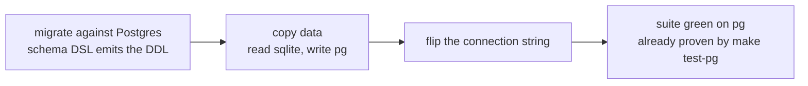

# Database

Written 2026-09-01. Every prototype runs SQLite. Postgres is the named exit:
the day a prototype needs a second app instance, managed backups, or
row-level security with teeth, it moves. This document fixes the rules that
keep that move a data copy and a connection-string change. The rules bind all
three prototypes; idiom stays per stack.

Each stack's dialect layer:

| Prototype | Migrations              | Queries                  |
| --------- | ----------------------- | ------------------------ |
| node      | Kysely schema builder   | Kysely query builder     |
| php       | Laravel schema builder  | Eloquent / query builder |
| rails     | ActiveRecord migrations | ActiveRecord / Arel      |

## 1. Ownership keys

Every row a single seller owns carries `seller_id`. Every row a single
customer owns carries `customer_id`. Admin visibility is platform-wide;
no table carries an admin ownership column.

- The column lives on the row itself, including tables where the owner is
  derivable through a join (a variant's seller, a cart item's customer).
- Orders span sellers — an order is customer-owned, and seller ownership
  lives on `order_items` and `fulfillments`.
- A test enforces the invariant across models, so a new owned table cannot
  omit the column.

Payoff now: scoping any query to its owner is a one-column predicate, with
an index behind it. Payoff at migration: a Postgres RLS policy per table is
one line — `USING (seller_id = current_setting('app.seller_id'))` — layered
under predicates the app already enforces.

## 2. Authorization lives in the application

SQLite has no users, roles, grants, or RLS, so authorization is modeled
where all three stacks can express it and where it survives a migration
unchanged: policies, middleware, and mandatory owner scopes in the app
layer.

- No database users, no GRANTs, nothing security-shaped in the schema
  beyond the ownership columns of §1.
- Roles (seller, customer, admin) are application concepts on their own
  tables.
- Postgres RLS, if adopted later, is defense-in-depth under the same
  predicates. The app-layer rules stay the source of truth.

## 3. Dialect discipline

The migration cost is the sum of every place a query or a column leans on a
SQLite behavior Postgres lacks. Rules:

- **DDL through the migration DSL only.** The framework emits correct DDL
  for both engines. No raw `CREATE TABLE`, no engine pragmas in migrations.
- **Queries through the builder/ORM.** Raw SQL, where a query needs it,
  lives behind a named scope or repository method so it is findable and
  swappable. Raw fragments never appear inline in controllers or views.
- **`LIKE` is a trap.** SQLite's `LIKE` is case-insensitive for ASCII;
  Postgres's is case-sensitive. Any case-insensitive match normalizes both
  sides (`lower(column) like lower(pattern)`) or lives behind the search
  seam of §4.
- **Types are declared and enforced in the app.** SQLite stores whatever it
  is handed; Postgres rejects what the column type forbids. Casts and
  request validation are the guard — bad data that SQLite tolerates
  surfaces as a failed import on migration day.
- **Datetimes are UTC.** Booleans go through casts. JSON columns are
  declared as JSON and queried through the builder's JSON operators.
- **No engine-specific features in application code**: no `rowid`, no
  SQLite-flavored `INSERT OR REPLACE`, no `strftime`. Upserts go through
  the builder's upsert API.

## 4. Search sits behind one seam

Discovery is the product, and search is where the engines diverge most:
SQLite's answer beyond `LIKE` is FTS5, Postgres's is `tsvector` /
`pg_trgm`, and they share no syntax.

- All matching and ranking flows through a single search entry point per
  prototype (php: `ListingSearch` + the `ofSearchTerm` scope). Controllers
  and views never compose a search predicate.
- Upgrading relevance (FTS5 today, `tsvector` after a migration) touches
  that seam and nothing else.

## 5. Verification

The rules above hold on review. If migration ever moves from possible to
planned, the first step is a `make test-pg` target — the suite against a
Postgres compose service, run once per branch alongside `make check` — so
the remaining work surfaces as red tests instead of surprises.

## 6. Migration day

With §1–§5 held, the move is:

Data copy is a small command reading the sqlite connection and writing the
pg connection, or `pgloader`. Ids are prefixed-ULID strings
(`docs/alignment.md` §1) and carry over byte-for-byte.

## 7. Operating SQLite

Where it runs out, so the migration trigger is recognized when it arrives:

- **Writes**: one write transaction at a time; WAL mode keeps reads flowing
  during a write. Hundreds of writes per second fit this workload shape.
- **Reads**: effectively unlimited at prototype scale.
- **Topology is the real limit.** SQLite pins the app to one instance with
  a persistent disk: single node, deploys with downtime, backup and
  point-in-time recovery are on us (snapshots per FEAT-035; Litestream is
  the researched continuous-backup path). "We need a second instance" or
  "we need managed backups" arrives before a performance cliff.
- The process is the security boundary. Anything that can open the file
  reads everything, which is why §2 puts authorization in the app and why
  per-tenant isolation with teeth means Postgres RLS or a file per tenant.
