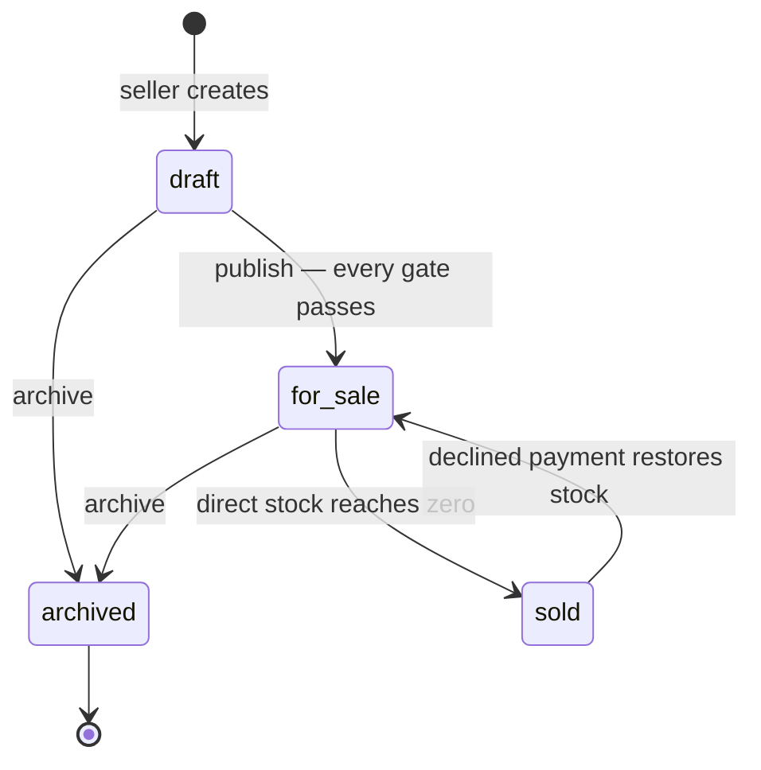
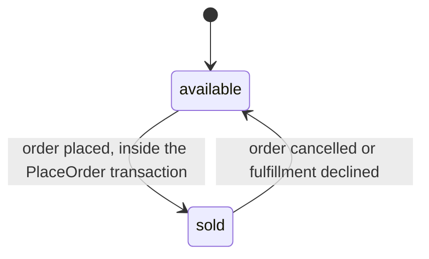
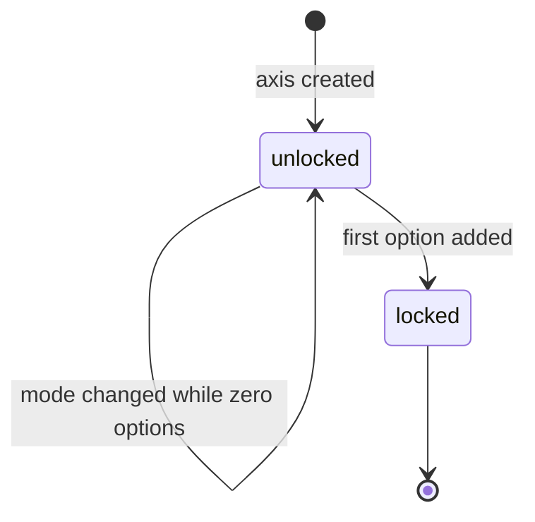
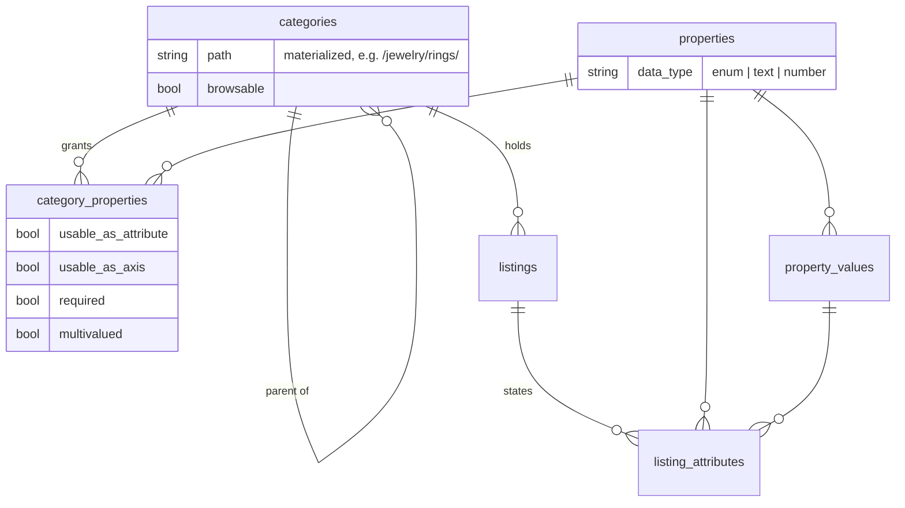
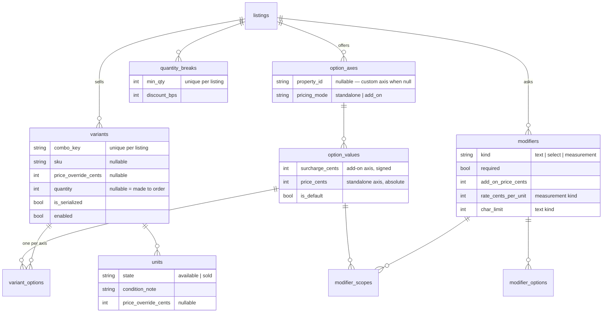

# Seller item configuration

Written 2026-08-29. Elevates the PHP prototype's item configurator
(FEAT-025..029, DSGN-002, DSGN-003; beta) to a project decision: how a
seller describes, configures, prices, and stocks a listing, and how a buyer
configures one on `/art/{slug}`. The vocabulary lives in
[ontology.md](ontology.md); the full mechanics live in
`prototype/php/docs/item-configurator.md`. This document fixes the state
machines, the data model, and the structural UI/UX decisions the other
prototypes adopt.

## Rooted in research

The model comes from two documents in `research/product-configuration/`:

- [`etsy-product-configuration.md`](../research/product-configuration/etsy-product-configuration.md)
  — Etsy's configuration model from primary sources, plus case studies of
  live listings where sellers hack around it. Its §2.1 gap table pairs each
  observed hack with the primitive the seller actually needed.
- [`seller-user-stories.md`](../research/product-configuration/seller-user-stories.md)
  — those needs restated as seller stories (A–E), with an Appendix A map
  from every story to the mechanism that covers it. (An identical copy sits
  at `prototype/php/__local__/seller-user-stories.md`.)

The hacks and the primitives that answer them:

| Observed hack on Etsy                                           | Primitive here        |
| --------------------------------------------------------------- | --------------------- |
| Compound option strings ("Gold - Inside", "3 US - 4mm")          | Uncapped option axes  |
| Full option matrix materialized, then cells disabled by hand     | Sparse variants       |
| A 52-option dropdown of numbered one-of-a-kind pieces            | Serialized units      |
| Personalization box shown to every buyer, needed by some         | Scoped modifiers      |
| Quantity tiers modeled as variation options                      | Quantity breaks       |
| Emoji headers and pasted size charts in one description field    | Typed description sections |

Each structural decision below carries its story ids.

## Lifecycle

### Listing

- The storefront shows `for_sale` and `sold`. A sold listing keeps its page
  so links a buyer already followed still resolve.
- `for_sale → sold` belongs to the axis-free path, where stock lives on the
  listing row. A configured listing keeps availability on its variants and
  units, so its own row stays `for_sale` even with every variant exhausted.

**The publish gate.** `draft → for_sale` is refused until every gate
passes, and a refusal lists every failing gate at once, each linking to the
screen that owns it — the same shape as `OrderPlacementRefused` (story E2):

- every required attribute grant (`required && usable_as_attribute`) has a
  value on the listing;
- every enabled variant resolves to a price ≥ 0, and holds exactly one
  option per axis;
- every serialized variant holds at least one `available` unit;
- every standalone-axis option carries an absolute price ≥ 0;
- every count cap is respected.

### Unit

A unit stays `available` until an order places — carts hold no reservation.
Two shoppers can cart the same unit; placement resolves who claims it (see
Open items).

### Option-axis pricing mode

An axis's pricing mode (`standalone` | `add_on`, default `add_on`) is
chosen at creation and locks the moment its first option exists:

## Data model

Every table takes a prefixed ULID primary key per
[alignment.md](alignment.md) §1. Prefixes: `cat` categories, `prp`
properties, `pvl` property_values, `cpr` category_properties, `lat`
listing_attributes, `axs` option_axes, `ovl` option_values, `vrt` variants,
`vop` variant_options, `unt` units, `mdf` modifiers, `mdo` modifier_options,
`mds` modifier_scopes, `qbk` quantity_breaks, `dsc` description_sections,
`img` listing_images. (Entry in alignment.md §1's prefix table is pending —
see Open items.)

### Taxonomy layer

The category tree gates which properties a listing may use, and how: as a
stated attribute, as a buyer-facing axis, or both.

### Configuration layer

- Variants are sparse: the seller creates only the combinations they make,
  one row at a time (stories A3, A5). A variant is available when it is
  enabled and — serialized — holds an `available` unit, or — counted — has
  `quantity` null (made to order) or above zero (A6, A7).
- A modifier with zero scope rows is always shown; each scope row names an
  option value that must be selected for it to appear (B6).

### Content layer

- `description_sections` — a listing's description is an ordered set of
  typed blocks: `text | specs | size_chart | faq | care | disclaimer`
  (D1, D3).
- `listing_images` — an ordered photo set, capped at 8; the lowest position
  is the cover, rendered everywhere a single image used to be.

### Cart and order

`cart_items` gains nullable `variant_id` and `unit_id`, plus
`configuration_json` and `answers_json`; its unique key widens to
`(cart_id, listing_id, fingerprint)` so an identical configuration merges
into the existing line. A cart line stores zero prices — price re-resolves
live on every render.

`order_items` gains the same references plus `price_breakdown_json`, all
frozen once at placement (E1, B9): later listing edits leave placed orders
untouched, and the itemized panel the buyer saw is the one the order keeps.

## Structural UI/UX decisions

1. **The editor is a hub of rows.** Each concern — Your item, Images,
   Choices, Combinations & Stock, Individual Pieces, Questions, Quantity
   Discounts, Listing Page Sections — is a row with a summary and its own
   Edit affordance; an empty row reads as an invitation ("Comes in more
   than one version? Offer choices"). DSGN-002 retired the flat form that
   sat above the rows: its price and quantity fields lost their meaning
   the moment a listing grew choices.
2. **A live buyer preview sits beside the hub**, built from the same view
   model and partials `/art/{slug}` uses. It is a working form — changing
   an option re-renders availability and total — with add-to-cart inert.
3. **Creating a listing starts from three pricing on-ramps** (DSGN-003), in
   the seller's own words: "one thing, one price" / "it comes in versions,
   each with its own price" / "one price, with extras that add to it" —
   mapping onto no axis / a standalone axis / an add-on axis. Each ramp
   collects only what its shape needs, creates the draft, and opens the
   hub. Ramps route; any listing can grow the other shapes later.
4. **Pricing mode is chosen mode-first and locks at the first option**
   (A1, A2, A9, A10). "Add another choice" opens on the two mode buttons
   before any property picker; option rows label "Price" (absolute) or
   "Price difference" (signed) accordingly, and a pill repeats the mode on
   the card and the hub row.
5. **Price and stock live in exactly one place.** They sit on Your item
   while the listing has zero axes and zero serialized pieces; the first
   choice or piece moves them to the Choices/Combinations screens. Once a
   standalone axis exists, the listing price is derived — `ListingPriceSync`
   sets it to the default configuration's sum after every option write
   (A10).
6. **Made to order is an explicit checkbox.** Checked stores a null count;
   unchecked with a blank count is a validation error.
7. **Catalog axes are offered ahead of custom ones.** The axes screen leads
   with the category's `usable_as_axis` grants, and a catalog-backed add-on
   axis pre-fills its options from the property's values — the nudge toward
   search-meaningful axes the research called for (D5).
8. **The variant grid is the contract.** Each sparse row shows its derived
   price beside the override cell, so the seller sees what the buyer pays
   before typing; bulk actions work by axis value (A3, A5, A8).
9. **Modifier scoping is a picker over the listing's option values**, with
   empty meaning always shown (B6).
10. **Publish validation lists every issue at once**, each linked to the
    owning screen, recomputed on the hub whenever the listing is a draft
    (E2).
11. **The buyer configurator on `/art/{slug}` is a server-rendered GET
    form** — the JS-off constraint holds. Defaults are preselected so a
    price is concrete at first paint; each axis shows its price deltas
    inline; unavailable combinations grey out with a reason; modifiers
    appear per scope; the quantity-break table is visible; the itemized
    price panel is the exact shape frozen onto the order.
12. **A serialized variant renders a card grid of its units** — photo,
    label, condition, price — so the buyer picks a piece from one place
    (C1, C2; the candlestick case study's fix).

## Open items

- **Alignment prefixes.** The sixteen new table prefixes above are absent
  from alignment.md §1's prefix table; recording them there is the open
  decision.
- **Rollout.** PHP only, beta. Node and Rails owe the model when their
  seller portals grow configuration.
- **Cart-time reservation.** Units have zero `reserved` state; two shoppers
  can cart one piece and placement decides. Held as a product decision.
- **Publish-gate wording.** The design doc's "every `required` grant"
  phrasing is unsatisfiable for an axis-only required grant (Ring Size);
  the implemented and intended gate is `required && usable_as_attribute`,
  as stated above (FEAT-029).
- **Deferred by design** (`item-configurator.md` §9): cross-scale size
  equivalence, digital delivery, linked add-on products, bespoke
  post-checkout workflow, `file_upload`/`date` modifier kinds, property
  facets beyond Medium, property-value hierarchy, private quotes, formula
  pricing. Bulk repricing beyond by-axis-value actions (A8) stays partial.

## Design docs and records

- `prototype/php/docs/item-configurator.md` — the full design: pricing and
  availability resolution, seller and customer flows, limits, traceability.
- `prototype/php/work/3-done/DSGN-002-retire-legacy-form-unify-editor-into-rows.md`
  — the hub-of-rows and pricing-mode decisions.
- `prototype/php/work/3-done/DSGN-003-guided-new-listing-three-pricing-on-ramps.md`
  — the create flow and the made-to-order checkbox.
- `prototype/php/work/3-done/FEAT-025…FEAT-029` — schema and domain, seller
  UI, buyer configurator and cart, checkout snapshot, categorization and
  highlights.
- `prototype/php/src/app/Domain/Listings/ListingStatus.php` — the listing
  state machine in code.
