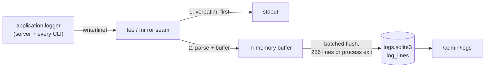

# Logging

This document is the canonical definition of the log store and the admin
log viewer the app implements: what happens to a log line after it leaves
the process. The log line format and event vocabulary live in
[spec.md](spec.md) §2.

Every JSON line the app logs — server and CLI runs alike — is also
written to a queryable SQLite store, and the admin site reads it back: a
filterable time series at `/admin/logs` and a per-request story view. Stdout
stays exactly as spec.md §2 specifies; the store is a mirror of it.
`sweep:logs` (`make sweep-logs`) prunes lines older than the retention window.

Three invariants govern the design:

1. **Stdout is canonical.** The line reaches stdout before anything else,
   byte for byte. Every other step is best-effort.
2. **The store is a mirror; the store validates nothing.** It stores what
   was emitted, including lines it cannot parse and events added to the
   vocabulary after the store's schema was written. The vocabulary is
   enforced at the emitter.
3. **The store's failure is never the app's failure.** Any store error
   degrades to stdout-only logging; no error from the store propagates into
   the application.

## The second database

The store lives in its own SQLite file, separate from the commerce
database. `LOG_DATABASE_FILE` names it (default `storage/logs.sqlite3`,
beside the commerce file; `off` disables the store). Two hazards make the
separate file load-bearing:

- A log INSERT issued on the commerce connection inside a business
  transaction joins that transaction — a rollback would erase the
  `failed` line that explains it.
- Rebuilding the commerce database (`make fresh`) must not erase log
  history. Retention is the one sanctioned way log rows die.

Schema creation is ensure-on-open, versioned by `PRAGMA user_version`. The
commerce migrator owns nothing here. `BEGIN IMMEDIATE` plus `IF NOT EXISTS`
makes two processes racing to bootstrap safe: one bootstraps, the other
waits out the busy timeout and finds the schema present. A file whose
version is ahead of the code, or any open failure (missing directory, disk
full, corrupt file), disables the store for that process: the app boots,
one warning goes to stdout, and logging is stdout-only for the process's
life. The store sets four pragmas at open: `journal_mode = WAL`;
`busy_timeout = 250` (milliseconds), so a contended flush fails fast and
re-buffers; `auto_vacuum = INCREMENTAL`, so the retention prune hands pages
back; `synchronous = NORMAL`.

## Table

One table, `log_lines`:

```sql
CREATE TABLE IF NOT EXISTS log_lines (
  id          INTEGER PRIMARY KEY,  -- rowid: arrival order, the tiebreak within one ts millisecond
  ts          TEXT NOT NULL,        -- the line's ts; receive time when the line would not parse
  level       TEXT,
  event       TEXT,
  phase       TEXT,
  msg         TEXT,
  request_id  TEXT,
  session_id  TEXT,
  actor_type  TEXT,
  actor_id    TEXT,
  txn_id      TEXT,
  duration_ms INTEGER,
  data        TEXT,                 -- JSON text of the line's data, NULL when absent
  error       TEXT,                 -- JSON text of the line's error, NULL when absent
  raw         TEXT NOT NULL         -- the stdout line, verbatim
);

CREATE INDEX IF NOT EXISTS log_lines_ts         ON log_lines (ts);
CREATE INDEX IF NOT EXISTS log_lines_event_ts   ON log_lines (event, ts);
CREATE INDEX IF NOT EXISTS log_lines_level_ts   ON log_lines (level, ts);
CREATE INDEX IF NOT EXISTS log_lines_request_id ON log_lines (request_id) WHERE request_id IS NOT NULL;
CREATE INDEX IF NOT EXISTS log_lines_txn_id     ON log_lines (txn_id)     WHERE txn_id     IS NOT NULL;
CREATE INDEX IF NOT EXISTS log_lines_actor_id   ON log_lines (actor_id)   WHERE actor_id   IS NOT NULL;
```

Field-to-column mapping: the §2.1 payload fields map to the same-named
columns; `data` and `error` are stored re-serialized as JSON text;
everything else on the line (framework-native extras, any future field) is
reachable through `raw`. A line that fails to parse as JSON is stored as
`raw` plus a receive-time `ts` with every other column NULL — mirror, per
invariant 2.

Three deliberate departures from the commerce-table idiom, each an
application of invariant 2:

- **Rowid primary key.** Log rows are telemetry: nothing references them,
  no URL carries their id (the story view keys on `request_id`), and the
  rowid gives `ORDER BY ts, id` its tiebreak with zero minting on the write
  path. Stated exception to spec.md §1.
- **No CHECK constraints from the vocabularies.** A CHECK would refuse —
  lose — the first line of any event added to §2.3 before this DDL catches
  up. The viewer's filters still answer 400 for an unrecognised filter
  value (below).
- **Nullable mirror columns.** §2.1 marks most fields conditional, and a
  malformed line still gets a row.

Stored `raw` is capped at 64 KiB; the mirrored columns are extracted from
the full line first, so a pathological payload loses tail bytes of `raw`
and keeps its queryable facts.

## Ingest



The store taps the logger's single destination — one seam every server and
CLI line flows through, so one integration point covers the server and
every CLI. A store failure never reaches the logger. Writing a line, in
order:

1. The chunk goes to stdout verbatim, per invariant 1.
2. The store splits the chunk on newlines and carries a trailing partial
   forward.
3. The store parses each line and pushes its column values onto a buffer.
   A parse failure pushes the malformed-line row instead.
4. The buffer flushes when it reaches 256 lines and when the process exits.

The flush is one transaction, one prepared multi-row INSERT — one durable
write per batch. A logger call happens synchronously inside a request, so
an unbatched insert per line would put database work, worst case a full
busy-timeout stall, inside every request; batching bounds that to one
small insert per flush. 256 rows also keeps one multi-row INSERT's bound
parameters under SQLite's variable limit. A flush failure re-buffers the
batch for the next flush. Past the buffer's cap of 10,000 lines, new lines
are dropped from the store while stdout still carries them, and one notice
goes to stderr.

A process flushes its buffer on exit, so a short-lived CLI's last lines
survive without any CLI needing its own flush call; a hard kill loses at
most one buffered batch from the store, with stdout keeping those lines
regardless.

The store never logs through the application logger — its own failures go
to stderr, since stdout is the §2 surface — so it cannot feed itself, per
invariant 3. Whatever the configured log level lets the logger emit is
stored, `debug` included; retention bounds size, so a second level filter
inside the store would only make the mirror disagree with stdout.

## Viewer

Two routes, behind the admin site's existing authentication guard.
`GET /admin/logs` — the time series, newest first, paginated at 50 rows,
filters carried through the pager. A visit with no query string redirects
to `?domain=shop&group=1`. Empty value means all; unrecognised value
answers 400. Filters:

- `domain` — a select, placed first, over the three sites (`shop`,
  `seller`, `admin`);
- `level`, `phase`, `event` — selects;
- `request`, `txn`, `session`, `actor` — text inputs, equality on indexed
  or mirrored columns;
- `msg` — substring match; a scan, acceptable at a retention-bounded
  table's size;
- `from` / `to` — ISO instants, compared lexically against `ts` (fixed
  ISO-8601 UTC text sorts chronologically), labelled UTC;
- `key` / `value` — the any-attribute filter, below;
- `group=1` — one row per request, below;
- `health=1` — includes health-check lines, hidden by default, below;
- `viewer=1` — includes the viewer's own requests, hidden by default,
  below.

Four stat tiles (Errors / Warnings / Info / Debug) tally the current filter
set minus `level`, health-check lines excluded the same as the list; each
tile links to the same query with `level` set, doubling as the level
filter's fast path. Rows show `ts` (full ISO — milliseconds matter here),
level, `event · phase`, the `msg` rendered with its severity prefix
intact (⚠️ on `warn`, ❌ on `failed`, per spec.md §2.4), the
`request_id`, the actor, and `duration_ms`. A line's own ids — request,
transaction, session, actor — are filter links: tapping one applies that
filter, carrying the other current filters and landing on page 1; ids the
row itself has no column for sit as the same links in the row's
disclosure. A compact chevron beside the request id opens the story view,
and a `sel` or `cus` actor gets the same chevron to the record, its
accessible name naming the actor ("View customer <id>", "View seller
<id>"); an `adm` actor has no detail page. A row whose
`data` or `error` is present discloses it in a collapsible block — the
page works with JavaScript absent, like every admin page.

### Severity tint

A log row tints yellow when its line is `warn` level, red when it is a
`failed` line (error level). A request is a conversation: the `group=1`
group row and the story view's header tint from the worst line the request
contains — yellow when any line in the request warns, red when any line
fails, red winning over yellow. The tint marks trouble without opening a
row.

### The domain filter

A stored line carries no site field of its own. `?domain=` derives one from
the line's request: a query correlated on `request_id` against that
request's opening `http.request` line, prefix-matching `data.path` —
`/admin*` and `/seller*` claim their site, `/mcp` (the MCP endpoint,
docs/spec.md §5.1) is its own bucket, the storefront claims the unprefixed
root. The health-probe path (below) and `/mcp` are excluded from the
storefront bucket by name.
A line with no `request_id` matches no domain.

### The health filter

The container orchestrator polls the app's health probe on an interval; its
will/did pairs otherwise bury the traffic a founder came to read. The probe
lives at Laravel's built-in `/up`, which the viewer names. `/admin/logs`
hides a health-check request's lines by default —
the request whose opening line's path is the probe path, exact, the pair
and every line sharing the request id — via the same correlation
`?domain=` uses. The
`health` checkbox is unchecked by default, so an unchecked submit and a
fresh visit read the same; `health=1` shows them again. Empty reads as
hidden, an unrecognised value answers 400, and the state round-trips
through the form, the pager, and the level tiles, whose tallies exclude
health-check lines the same as the list.

The health filter always applies, composing with every other filter,
independent of `?domain=`: `domain=shop` already excludes the probe path
by name, so `health=1` under `domain=shop` shows nothing new. A line with no
`request_id` is never treated as a health check.

### The viewer's own requests

Reading logs writes logs: every visit to `/admin/logs` logs its own
request, and that traffic otherwise fills the list being read.
`/admin/logs` hides the viewer's own requests by default — the request
whose opening line's path is `/admin/logs` exact or anything under
`/admin/logs/` (the story view included), via the same correlation the
health filter uses. The `viewer` checkbox is unchecked by default;
`viewer=1` shows them again. Empty reads as hidden, an unrecognised value
answers 400, and the state round-trips through the form, the pager, and
the level tiles, whose tallies exclude viewer requests the same as the
list. The filter always applies, composing with every other filter,
independent of `?domain=` — `domain=admin` with `viewer` unset still hides
them. The story view ignores it, so a viewer request stays addressable by
id. A line with no `request_id` is never treated as viewer traffic; a
lookalike path (`/admin/logs-export`) is never hidden.

The MCP endpoint's own requests (opening path `/mcp`, exact) are hidden
the same way — an agent session's tool calls are the viewer's kind of
noise — with one difference: `domain=mcp` asks for exactly those requests,
so it shows them without `mcp=1`.

### Grouped by request

The `group=1` checkbox switches the list from one row per line to one row
per request, newest activity first, composing with every other filter: a
filter narrows which requests appear (any one matching line is enough), and
opening a group shows that request's whole story, every line it logged. A
page counts groups rather than lines. The group row summarizes the
request's root `http.request` will/did pair — method, path, status,
duration — plus its line count and last activity time, tinted per the
severity rule above. A line with no `request_id` groups alone rather than
by `txn_id`: grouping orphan CLI or boot lines by a shared transaction
would fold unrelated invocations into one row.

### The any-attribute filter

`?key=<path>&value=<text>` filters on any attribute of the stored line.
The key is a dotted identifier path, up to four segments (400 otherwise),
compiled to a JSON path and executed against the stored `raw` line:

```sql
WHERE json_extract(log_lines.raw, ?) = ?
```

Path and value are bound parameters, giving one code path for `data.*`,
`error.*`, and top-level extras. A key naming a mirrored column
(`event`, `request_id`, …) short-circuits to the column equality. `key`
without `value` is an existence filter — every line naming a
`data.refund_id`, say. A numeric-looking value matches both a JSON number
and a matching string, since JSON extraction is typed; booleans compare as
`1`/`0`. The filter scans within whatever the other filters bound. The
scan is bounded by retention. A hot key can get a generated column and
index.

### The story view

`GET /admin/logs/requests/:requestId` renders one request's lines in `ts`
order, capped at 1,000 with a visible notice: a header with first/last
timestamps, line count, the root `did` line's `duration_ms`, and the
session and actor from the first line carrying them, tinted per the
severity rule above; then each line with its `msg` rendered with its
prefix intact, level badge, `event · phase`, and `data`/`error` fully
expanded. A well-formed id with no stored lines renders the empty state at
200 ("outside the retention window?"); a malformed id answers the site's
standard 404. `?txn=` on the list covers the transaction story — no second
route is needed.

Two rules govern id links. A line's own ids — request, transaction,
session, actor — are filter links, per the list view's rule above, with
the actor's record chevron beside them. Prefixed ids inside a
disclosed `data` or `error` block link where a detail page exists — an
order, customer, seller, listing, fulfillment, or conversation id
alike; a transaction or session id there links back into
`/admin/logs` as a filter — one mapping from prefix to route, drawn from
the admin site's own page table so a link never 404s. A message id renders
plain: messages have no detail page of their own.

## Retention

`LOG_RETENTION_DAYS` (default `14`, `off` disables, malformed refuses
boot). The prune runs inside `sweep:logs`, its own scheduled command: silent
when retention is off or the store is disabled, `--as-of` honoured (cutoff =
as-of minus the window), a failure sets the command's exit code. The delete
runs in bounded batches —

```sql
DELETE FROM log_lines
WHERE id IN (SELECT id FROM log_lines WHERE ts < ? LIMIT 5000)
```

— looped until no rows change, so the write lock is held for milliseconds
per batch and a concurrently flushing process re-buffers at most one
flush. After the last batch the store runs `PRAGMA incremental_vacuum(1000)`. The schema's upgrade path follows from the same fact
that governs retention — every row is expendable by design — so evolving
the DDL means bumping the stored schema version, and the escape hatch for
a mismatched file is deleting it.

## Testing

The ingest path tests in-process against a temporary SQLite file: passthrough
order (stdout before parsing, and on every failure), the §2.1 field
mapping, the malformed-line row, batched flush and flush-on-exit,
re-buffer on a write failure, bootstrap idempotence, and the
disabled-store degradations. The viewer tests exercise `/admin/logs` and
the story route against a temporary SQLite file shared by writer and reader,
signed in as an admin, with a filter matrix asserting each filter narrows
the result set, round-trips through the form and pager, and 400s on an
unrecognised value. Retention tests sit beside the app's existing prune
tests, asserting the same batching and failure-isolation behavior.

## Reference

This document is the reference definition spec.md §2.5 names for the
log store and the admin log viewer: the table shape, the rowid exception to
§1, `LOG_DATABASE_FILE` and `LOG_RETENTION_DAYS`, the `/admin/logs` and
story-view rows in §5.
[app/docs/log-store.md](../app/docs/log-store.md) describes the
implementation.
