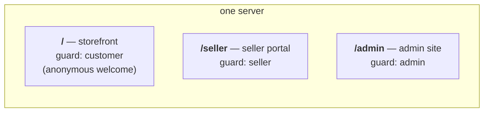
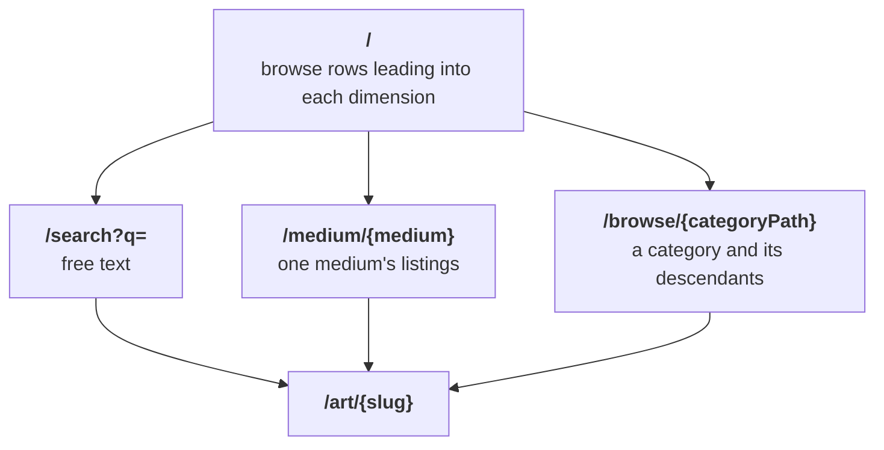

# Routing and URL strategy

Written 2026-08-29. Elevates the URL decisions made in the PHP prototype
(FEAT-034, PR #37) to project decisions. Node and Rails owe these shapes when
their storefronts grow the equivalent surfaces. The identifier rules and the
admin route table are fixed in [alignment.md](alignment.md) §1 and §5; this
document covers everything above them — the site split, the storefront path
scheme, query-parameter conventions, and miss behavior.

## Three sites, one prefix each

One server serves three sites, split by path prefix. Each site has its own
authentication guard, applied once to the whole route group, its own layout,
and its own theme.

- The guard lives on the route group. A per-route check is one the next page
  added forgets.
- A sign-in link minted for one actor works only on that actor's site: a
  customer's or seller's magic link followed to `/admin` is refused, and the
  reverse. Admins are seeded; the admin site has no sign-up.
- Each site carries its own `/events` unread-count stream under its prefix
  (`/events`, `/seller/events`, `/admin/events`).
- `GET /health` is the orchestrator's probe. It and `/events` are system
  paths: the log viewer's `domain=shop` bucket excludes both by name
  ([logging.md](logging.md)).

## Identifiers in URLs

[alignment.md](alignment.md) §1 fixes this; summarized:

- URLs carry the full prefixed id: `/orders/ord_…`, `/admin/customers/cus_…`.
- Storefront listing pages are the one slug route: `/art/{slug}`.
- A wrong prefix, a bare ULID, and an unknown id all answer the same 404.

## Storefront browse and search: one dimension, one path prefix

Each way of narrowing the catalog owns a path prefix. Future dimensions
(tags, say) copy the scheme.

- `/search?q=` — free text, the header search form's target. A blank `q`
  renders a search prompt with zero query run.
- `/medium/{medium}` — the lowercased medium value; an unknown value 404s.
- `/browse/{categoryPath}` — one or two slug segments matched against the
  category tree's materialized `path` column (`/browse/jewelry`,
  `/browse/jewelry/rings`). Lists the category's and its descendants'
  for-sale listings, links only `browsable` children; an unknown path or a
  category with `browsable = false` 404s.
- Search stands alone. `q` combined with a browse dimension redirects to
  `/search?q=` with the dimension dropped, and the browse pages build their
  links without carrying `q` — the composed state is unrepresentable.
- `/` takes zero filter parameters; it renders browse rows leading into the
  pages above. Legacy `/?q=` redirects to `/search?q=`; legacy `/?medium=`
  redirects to `/medium/{medium}`.

## Query parameters

Query parameters hold state within a page; paths hold the dimension.

- Pagination is `?page=N`, with the current filter set carried through every
  pager link.
- On admin filter routes, an empty filter value means "all" and an
  unrecognised value answers 400 (alignment.md §5). The full admin filter
  vocabulary lives in the §5 table.
- Every `http.request` log line carries `data.query` (alignment.md §2.2), so
  any parameter is queryable after the fact:
  `/admin/logs?key=data.query.q` lists every search.

## Misses and redirects

- A legacy URL shape redirects to its canonical replacement.
- An unknown value 404s: unknown slug, unknown medium, unknown category
  path, id-prefix mismatch. The storefront renders one 404 page for every
  miss — unknown slug, draft, and removed listing read the same.
- Ownership refusals answer 404 everywhere, so an id outside the actor's own
  is never confirmed to exist.
- A removed listing leaves every storefront surface: browse, search,
  `/art/{slug}`, favorites, and an existing cart line (alignment.md §5).

## Open items

- PHP serves its probe at `/up` (Laravel's built-in), while this contract,
  the log viewer's health filter, and Node all name `/health`. PHP owes the
  move to `/health`.
- PHP's admin filter routes outside `/admin/logs` still treat an
  unrecognised value as absent; §5 says 400 (alignment.md §8, 2026-08-29
  entry).

## References

- `prototype/php/src/routes/{shop,seller,admin,auth}.php` — the route table
  itself (`make routes` prints it).
- `prototype/php/docs/architecture.md` — the sites table and the
  route-binding/authorization flow.
- `prototype/php/work/3-done/FEAT-034-first-class-browse-and-search-paths.md`
  — the browse/search decision record.
- [alignment.md](alignment.md) §1 (identifiers), §5 (admin routes and filter
  rules), §8 (reconciliation log).
