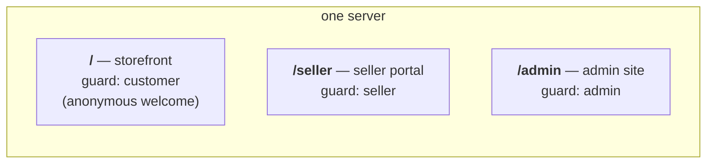
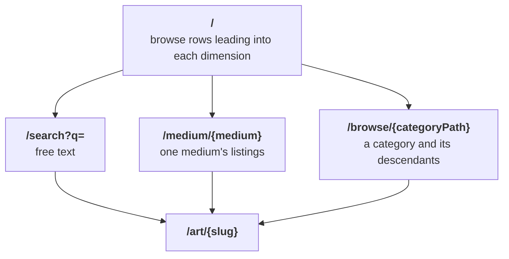

# Routing and URL strategy

The identifier rules and the admin route table are fixed in
[spec.md](spec.md) §1 and §5; this document covers everything above them —
the site split, the storefront path scheme, query-parameter conventions, and
miss behavior.

## Three sites, one prefix each

One server serves three sites, split by path prefix. Each site has its own
authentication guard, its own layout, and its own theme. The seller and
admin sites apply their guard once to the whole route group. The storefront
applies `customer.identity` to the whole group and `auth.customer` to the
signed-in sub-group.

- The guard lives on the route group. A per-route check is one the next page
  added forgets.
- One endpoint, `/auth/magic/{token}`, verifies every link. The link row
  names its actor; the sign-in lands on that actor's guard, so a customer's
  link never opens an admin session. Admins are seeded; the admin site has
  no sign-up.
- The orchestrator's health probe lives at Laravel's built-in `/up`. It is a
  system path: the log viewer's `domain=shop` bucket excludes it by name ([logging.md](logging.md)).

## Identifiers in URLs

[spec.md](spec.md) §1 fixes this; summarized:

- URLs carry the full prefixed id: `/orders/ord_…`, `/admin/customers/cus_…`.
- Two storefront routes take a slug: `/art/{slug}` (a listing) and
  `/s/{slug}` (a store).
- A wrong prefix, a bare ULID, and an unknown id all answer the same 404.

## Storefront browse and search: one dimension, one path prefix

Each way of narrowing the catalog owns a path prefix. Future dimensions
(tags, say) copy the scheme.

- `/search?q=` — free text, the header search form's target. A blank `q`
  renders a search prompt with zero query run.
- `/medium/{medium}` — the lowercased medium value; an unknown value 404s.
- `/browse/{categoryPath}` — one or two slug segments matched against the
  category tree's materialized `path` column (`/browse/jewelry`,
  `/browse/jewelry/rings`). Lists the category's and its descendants'
  for-sale listings, links only `browsable` children; an unknown path or a
  category with `browsable = false` 404s.
- Search stands alone. `/medium` and `/browse` ignore `q`, and the browse
  pages build their links without `q`. Only `/?q=` redirects to
  `/search?q=`.
- `/` takes zero filter parameters; it renders browse rows leading into the
  pages above. Legacy `/?q=` redirects to `/search?q=`; legacy `/?medium=`
  redirects to `/medium/{medium}`.

## Query parameters

Query parameters hold state within a page; paths hold the dimension.

- Pagination is `?page=N`, with the current filter set carried through every
  pager link.
- On admin filter routes, an empty filter value means "all". spec.md §5
  says an unrecognised value answers 400. Today `/admin/logs` and the admin
  inbox do; the other admin lists treat it as absent. The full admin filter
  vocabulary lives in the §5 table.
- Every `http.request` log line carries `data.query` (spec.md §2.2), so
  any parameter is queryable after the fact:
  `/admin/logs?key=data.query.q` lists every search.

## Misses and redirects

- A legacy URL shape redirects to its canonical replacement.
- An unknown value 404s: unknown slug, unknown medium, unknown category
  path, id-prefix mismatch. The storefront renders one 404 page for every
  miss — unknown slug, draft, and removed listing read the same.
- Ownership refusals answer 404 everywhere, so an id outside the actor's own
  is never confirmed to exist.
- A removed listing leaves every storefront surface: browse, search,
  `/art/{slug}`, favorites, and an existing cart line (spec.md §5).

## Open items

- The admin filter routes outside `/admin/logs` and the admin inbox still
  treat an unrecognised value as absent; §5 says 400.

## References

- `app/src/routes/{shop,seller,admin,auth}.php` — the route table itself
  (`make routes` prints it).
- [app/docs/architecture.md](../app/docs/architecture.md) — the sites table
  and the route-binding/authorization flow.
- [spec.md](spec.md) §1 (identifiers), §5 (admin routes and filter
  rules).
