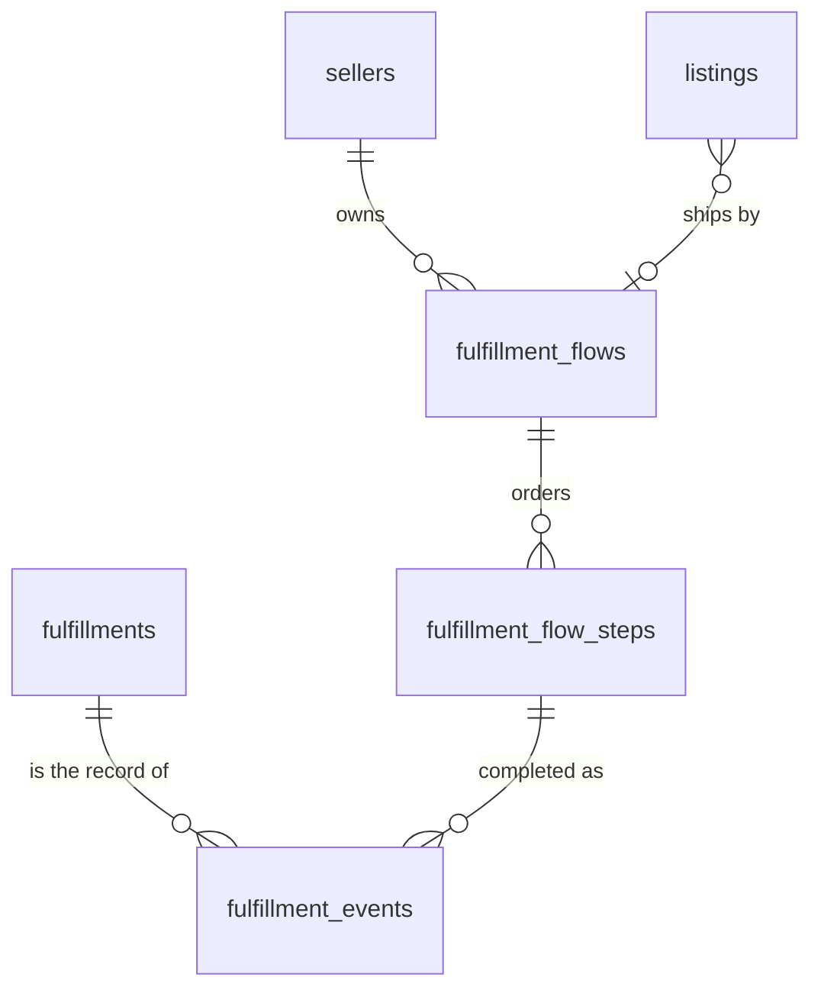

# Application spec

This document fixes the shapes the app relies on: identifiers, the log
payload and event vocabulary, rate limits, the order/fulfillment/refund
lifecycle, the admin feature set, and the make-target vocabulary and commit
gate.

## 1. Identifiers

Every table's primary key is a prefixed ULID stored as text. The public id is
the primary key; there is no second column.

Format: `<prefix>_<ulid>` — a 3-letter lowercase prefix, one underscore, then
the 26-character Crockford base32 ULID (uppercase, as the ULID spec renders
it). Example: `ord_01J5X3M9A2K8YB7Q4R6T1V0WZE`. Total length 30.

Rules:

- Foreign keys hold the same string as the referenced primary key.
- The id is minted in the shell (action / model layer) when the row is
  created, from the application's freezable clock, so seeds on a fixed clock
  stay reproducible in time order. Random bits stay random; within one
  millisecond the generator is monotonic.
- Ordering by creation uses the creation timestamp with the id as tiebreak
  (second-resolution timestamps tie), never the id alone.
- URLs carry the full prefixed id (`/orders/ord_…`, `/admin/customers/cus_…`).
  Storefront listing pages keep `/art/:slug`.
- An id whose prefix does not match the route's table answers 404, the same
  page as an unknown id. An unprefixed ULID is never accepted.
- The order number shown to customers and sellers is the order id, rendered
  bare — no `#` sigil before a prefixed id anywhere in copy.
- Fixtures and seeds may use hand-written ids of the right shape
  (`ord_00000000000000000000000001` is a valid ULID).
- Framework-owned tables (Laravel `sessions`, `cache`, `jobs`, `failed_jobs`,
  `job_batches`; migration bookkeeping) keep the framework's keys.
- Every rendered timestamp shows UTC. Per-user timezone rendering is
  deferred — an open decision, not yet needed.

Prefix table (one prefix per domain table):

| Table                                     | Prefix |
| ----------------------------------------- | ------ |
| admins                                    | `adm`  |
| api_keys                                  | `key`  |
| sellers                                   | `sel`  |
| customers                                 | `cus`  |
| customer_merges                           | `cmg`  |
| customer_blocks                           | `blk`  |
| magic_links                               | `mlk`  |
| listings                                  | `lst`  |
| analytics_events                          | `aev`  |
| listing_faqs                              | `faq`  |
| listing_removals                          | `rmv`  |
| categories                                | `cat`  |
| properties                                | `prp`  |
| property_values                           | `pvl`  |
| category_properties                       | `cpr`  |
| listing_attributes                        | `lat`  |
| listing_images                            | `img`  |
| option_axes                               | `axs`  |
| option_values                             | `ovl`  |
| variants                                  | `vrt`  |
| variant_options                           | `vop`  |
| units                                     | `unt`  |
| modifiers                                 | `mdf`  |
| modifier_options                          | `mdo`  |
| modifier_scopes                           | `mds`  |
| quantity_breaks                           | `qbk`  |
| description_sections                      | `dsc`  |
| carts                                     | `crt`  |
| cart_items                                | `cti`  |
| favorites                                 | `fav`  |
| orders                                    | `ord`  |
| order_items                               | `oit`  |
| payments                                  | `pay`  |
| refunds                                   | `rfd`  |
| fulfillments                              | `ful`  |
| fulfillment_flows                         | `ffl`  |
| fulfillment_flow_steps                    | `ffs`  |
| fulfillment_events                        | `fev`  |
| ledger_entries                            | `led`  |
| payouts                                   | `pyt`  |
| conversations                             | `cnv`  |
| messages                                  | `msg`  |
| notifications                             | `ntf`  |
| funnels                                   | `fnl`  |
| store_profiles                            | `sto`  |
| store_slugs                               | `ssl`  |
| store_images                              | `sim`  |
| store_sections                            | `sse`  |
| store_section_images                      | `ssi`  |
| store_links                               | `slk`  |
| page_view_counts                          | `pvc`  |
| seed_runs                                 | `sdr`  |
| requests (the `request_id` log field, §2) | `req`  |
| sessions (the `sid` cookie value, §2)     | `ses`  |
| transactions (the `txn_id` log field, §2) | `txn`  |

Generation: `Str::ulid()` (Symfony Uid ships with Laravel) with a prefix, via
the `HasPrefixedUlid` trait. Every model uses the trait and declares
`idPrefix()`. One function parses `"<prefix>_<ulid>"` and refuses the wrong
prefix; routes use it at the boundary.

Migrations: until the app has a live seller, edit migrations in place;
`make fresh` rebuilds the database. Keep one migration file per table so
the schema stays readable. Once the app has a live seller, migrations are
immutable and append-only.

## 2. Logging

Every log line is one JSON object on stdout, in every environment. No prose
logs, no per-environment format switch.

### 2.1 Payload

| Field         | Type   | Always                                                | Meaning                                                           |
| ------------- | ------ | ----------------------------------------------------- | ----------------------------------------------------------------- |
| `ts`          | string | yes                                                   | ISO-8601 UTC with milliseconds, `Z` suffix                        |
| `level`       | string | yes                                                   | `debug` \| `info` \| `warn` \| `error`                            |
| `event`       | string | yes                                                   | dotted name from §2.3, e.g. `order.place`                         |
| `phase`       | string | yes                                                   | `will` \| `doing` \| `did` \| `refused` \| `failed`               |
| `msg`         | string | yes                                                   | one human sentence, present tense for `will`/`doing`, past for    |
|               |        |                                                       | `did`; prefixed per §2.4 when the line warns or fails             |
| `request_id`  | string | on requests                                           | one per HTTP request; echoed as `X-Request-Id` response header;   |
|               |        |                                                       | honoured from an incoming `X-Request-Id` only when it matches     |
|               |        |                                                       | `^[A-Za-z0-9_-]{1,64}$`                                           |
| `session_id`  | string | on requests                                           | value of the `sid` cookie (`ses_<ulid>`), minted on the first     |
|               |        |                                                       | response a browser gets and kept for a year, unchanged by         |
|               |        |                                                       | sign-in/out; carried from the point the session is available — a  |
|               |        |                                                       | framework's outermost request line may carry `request_id` alone   |
| `actor_type`  | string | when known                                            | `seller` \| `customer` \| `admin` \| `system`                     |
| `actor_id`    | string | when known                                            | the actor's prefixed id; an anonymous customer's `cus_…` counts   |
|               |        |                                                       | as known                                                          |
| `txn_id`      | string | inside a unit of work                                 | `txn_<ulid>` minted when an action's transaction opens; every     |
|               |        |                                                       | line inside it carries the same value                             |
| `data`        | object | when useful                                           | entity ids and the small facts the line is about (`order_id`,     |
|               |        |                                                       | `amount_cents`, `status_from`, `status_to`, …). Ids are prefixed  |
|               |        |                                                       | ids.                                                              |
| `error`       | object | on `failed`                                           | `{ "type": "<class or code>", "message": "<text>" }`; `"reason"`  |
|               |        |                                                       | (the sub-category within the type) and `"data"` (entity ids and   |
|               |        |                                                       | facts) when the exception carries them; `"stack"` in development  |
| `duration_ms` | number | on `did`/`refused`/`failed` when a `will` preceded it | wall time since the `will` line                                   |

Additional keys are allowed at the top level for framework-native fields the
logger adds, but nothing in the table may be renamed, nested, or omitted
where marked always.

Redaction: no cookie values, magic-link tokens, card numbers, or email
addresses in `data`. An actor's id identifies them; the address does not
appear. A line the framework writes with no event of its own uses the event
`app.log`.

### 2.2 The story

Every action that writes goes through `will` → `did` (or `refused` / `failed`).

`refused` is a domain refusal — an expected "no": a stale form, a declined
card, a rate limit, a validation failure. The world is unchanged, the line is
`info`, and `data.reason` names the refusal within the event's category (e.g.
`order.pay` refused with `reason: "card_declined"`). The app models the
refusal its own way — a returned result or a thrown refusal class — but the
line is the same. A refusal routes the person who hit it to a defined flow:
retry, wait, or stop (see `docs/principles.md`).

`failed` is an exception the action did not expect — a defect — at `error`
level with the `error` object from §2.1.

`doing` is optional and marks a long step inside the unit of work (a drain
loop, a sweep over N orders). Requests log `will` on entry (`http.request`)
carrying `method`, `path`, and — when the URL has one — the query string as
`data.query`, an object of the request's query parameters; `did` on response
carries `status` and `duration_ms` in `data`, and also
`data.db = {queries: <int>, total_ms: <number>}` — how many queries the
request ran and their summed time in milliseconds (rounded to two decimal
places), zero of each when none ran. A request with a body carries it on
the `will` line as `data.body`, an object of every field a form or a JSON
client sent: the framework's `_token` and `_method` left out, the card
fields (`card_number`, `card_expiry`, `card_cvc`) dropped by name, each
upload reduced to `{file, bytes}`, and every string value capped at 500
characters with a trailing `…`. `POST /mcp` carries no body — its
`mcp.call` line (§2.3) already carries the arguments. `data.path` stays the bare path, so
path-prefix rules (the log viewer's domain buckets) read one field.
The §2.1 redaction rule applies to `data.query` and `data.body` the way it
applies to every `data` field. Every request story closes exactly once, however the connection ends.

Example, one checkout:

```json
{"ts":"2026-08-23T18:00:00.001Z","level":"info","event":"http.request","phase":"will","msg":"POST /checkout","request_id":"req_1","session_id":"ses_01J…","actor_type":"customer","actor_id":"cus_01J…","data":{"method":"POST","path":"/checkout"}}
{"ts":"2026-08-23T18:00:00.004Z","level":"info","event":"order.place","phase":"will","msg":"placing an order from the cart","request_id":"req_1","session_id":"ses_01J…","actor_type":"customer","actor_id":"cus_01J…","txn_id":"txn_01J…","data":{"cart_id":"crt_01J…","line_count":2}}
{"ts":"2026-08-23T18:00:00.019Z","level":"info","event":"order.place","phase":"did","msg":"placed the order","request_id":"req_1","session_id":"ses_01J…","actor_type":"customer","actor_id":"cus_01J…","txn_id":"txn_01J…","duration_ms":15,"data":{"order_id":"ord_01J…","total_cents":12000,"status":"awaiting_payment","fulfillment_ids":["ful_01J…","ful_01K…"]}}
{"ts":"2026-08-23T18:00:00.021Z","level":"info","event":"http.request","phase":"did","msg":"POST /checkout 303","request_id":"req_1","session_id":"ses_01J…","actor_type":"customer","actor_id":"cus_01J…","duration_ms":20,"data":{"status":303}}
```

### 2.3 Event vocabulary

`<subject>.<verb>` in the imperative; the `phase` field carries tense. The
app emits every event below that its features support.

| Event                                                                   | Emitted by                                                               |
| ----------------------------------------------------------------------- | ------------------------------------------------------------------------ |
| `http.request`                                                          | every request (will on entry, did on response), including 404s and CSRF  |
|                                                                         | refusals (419)                                                           |
| `magic_link.request`                                                    | sign-in form submit; `refused` when the address is not admitted or the   |
|                                                                         | rate limit trips                                                         |
| `magic_link.consume`                                                    | verification; `refused` on expired/used/foreign token                    |
| `customer.merge`                                                        | anonymous → verified fold                                                |
| `listing.create`, `listing.update`, `listing.publish`,                  | seller portal; `transition` carries `status_from`/`status_to`            |
| `listing.transition`                                                    |                                                                          |
| `listing.view`                                                          | the storefront listing page, once per (listing, customer, hour) collapse |
|                                                                         | — log the collapse as `refused` at `debug`                               |
| `store.start`, `store.save`, `store.slug.rename`,                       | seller portal's Store screen; `slug.rename` only on an address change,   |
| `store.section.write`, `store.image.write`                              | `section.write`/`image.write` carry `data.op` naming which write         |
| `cart.add`, `cart.update`, `cart.remove`                                | storefront                                                               |
| `order.place`                                                           | checkout; `refused` carries the blocked lines                            |
| `order.pay`                                                             | card submit; `did` on approval, `refused` on decline with                |
|                                                                         | `decline_reason`                                                         |
| `order.cancel`                                                          | customer cancel, admin cancel, and the stale sweep (`actor_type` says    |
|                                                                         | which)                                                                   |
| `order.sweep`                                                           | the stale-order sweep run (`doing` per order, `did` with the count)      |
| `fulfillment.ship`, `fulfillment.deliver`, `fulfillment.decline`        | seller / customer / seller                                               |
| `refund.issue`                                                          | seller decline and admin refund; `data` names `refund_id`,               |
|                                                                         | `fulfillment_id`, `amount_cents`, `reason`                               |
| `ledger.write`                                                          | every ledger entry (`debug`)                                             |
| `payout.run`, `payout.pay`                                              | the weekly payout: one `run` with the period, one `pay` per seller       |
| `conversation.open`, `conversation.resolve`, `conversation.reopen`,     | messaging                                                                |
| `message.post`, `faq.publish`, `faq.unpublish`                          |                                                                          |
| `notification.write`, `notification.deliver`                            | in-app write and transport delivery                                      |
| `moderation.remove_listing`, `moderation.lift_listing_removal`,         | admin                                                                    |
| `moderation.block_customer`, `moderation.lift_customer_block`           |                                                                          |
| `rate_limit.exceed`                                                     | any limit trip (`warn`), `data` carries `limit`, `key`,                  |
|                                                                         | `retry_after_seconds`                                                    |
| `mcp.call`                                                              | every JSON-RPC message `POST /mcp` receives (§5.1): `will` before the    |
|                                                                         | key is checked, `data` carrying `method`, `rpc_id`, `tool` or            |
|                                                                         | `resource`, and a tool's `arguments` (redacted per §2.1); `did` with     |
|                                                                         | `status`, `key_id`, and `outcome` (`ok` \| `tool_error` \| `rpc_error`   |
|                                                                         | \| `streamed` \| `unreadable`); `refused` at `warn` when the key was     |
|                                                                         | missing, malformed, unknown, revoked, or over its limit                  |
| `query.exceed`                                                          | any DB query slower than `LOG_SLOW_QUERY_MS` (`warn`), `data` carries    |
|                                                                         | `source`, `duration_ms`, `sql`, `threshold_ms`                           |
| `migrate.run`, `migrate.apply`, `seed.run`                              | CLI                                                                      |
| `app.boot`, `app.shutdown`                                              | console process lifecycle; a request's is its `http.request` pair        |

The vocabulary is closed. To add an event, agree the name with the user,
then add it here and to `StoryEvent`.

### 2.4 Emoji prefixes

The `msg` prefix makes warnings and failures stand out to a person reading
plain stdout. Every `warn`-level line is prefixed ⚠️, every `failed` line is
prefixed ❌, and every other line's `msg` is bare. The prefix is derived from
the line's level and phase in one place; no call site picks an emoji.

| Line              | Prefix |
| ----------------- | ------ |
| any `warn` line   | ⚠️     |
| any `failed` line | ❌      |
| everything else   | none   |

Emoji lives in the log `msg` only. Text shown to a person — flash messages,
error pages, form errors — carries none.

### 2.5 Log store

Every stdout line is also written to a `log_lines` store in a SQLite file of
its own, separate from the commerce database. Stdout stays exactly as this
section specifies; the store is a mirror of it. The §2.1 payload fields map
to same-named columns, with `data` and `error` stored as JSON text and the
verbatim line beside them as `raw`. The store's primary key is the integer
rowid: log rows are telemetry that nothing references, an exception to §1.
A store failure degrades to stdout-only logging; the store's failure is
never the app's failure.

`LOG_DATABASE_FILE` names the file (default `storage/logs.sqlite3`, `off`
disables the store). `LOG_RETENTION_DAYS` (default `14`, `off` disables)
bounds its history: the maintenance sweep prunes stored lines older than the
window. `docs/logging.md` is the reference definition — schema, ingest
semantics, retention, and the viewer.

### 2.6 Analytics store

`page_view_counts` and `analytics_events` live in a SQLite file of their own,
separate from the commerce database. `ANALYTICS_DATABASE_FILE` names it
(default `storage/analytics.sqlite3`). The store's rows reference commerce
rows — a listing, a seller, a customer — by id only; no foreign key crosses
the two files.

One entry point writes it: recording a page view or an event appends to an
in-memory buffer and does no I/O, so nothing a shopper or seller is waiting
on ever waits on the analytics connection. Each buffered event carries the
`occurred_at` instant it was recorded with, so the stored order is the order
things happened rather than the order they were written. The buffer flushes
in one transaction after the HTTP response has gone back or an artisan
command has ended, with a process-exit fallback and an early flush once the
buffer passes a row cap. A failed flush logs one `warn` line and drops the
batch — a store outage loses buffered rows, never blocks the request.

`analytics_events` holds one row per occurrence, named from a closed
vocabulary (today: `listing.view`, `listing.favorite`, `listing.unfavorite`,
`listing.cart_add`, `checkout.open`, `order.place`, `order.pay`,
`order.cancel`, `store.view`, `help.answered`, `help.unanswered`), with a
nullable `dedupe_key` unique index. A
listing view collapses to one row per (listing, customer, UTC hour) by
expressing that window as a dedupe key and inserting with `INSERT OR
IGNORE` — no read happens in the request to decide whether the write is a
duplicate. `store.view` carries `subject_type = 'store'` and the store
profile's `sto_` id, and collapses to the same hour window; a seller
previewing their own hidden page records nothing.
`page_view_counts` stays the roll-up the flush maintains, one upsert per
(site, path pattern, day) carrying the buffered hit count.

The storefront funnel's four steps beyond the cart carry `subject_type =
'cart'` (`checkout.open`, before an order exists to name) or `subject_type
= 'order'` (`order.place`, `order.pay`, `order.cancel`), each `data`
carrying `listing_ids` — the listings the cart or order spans, so a
per-listing funnel reads it without a join — and `order.pay` additionally
carrying `total_cents`. Every recording happens after the commerce write
that caused it commits, never inside that write's own transaction and
never itself a commerce write, so a rolled-back order or payment leaves no
event behind; `order.pay` is recorded only on an approved payment, not a
decline.

Every row also carries the request that produced it: `ip` and `session_id`
as their own indexed columns, so "everything from this ip" and "everything
in this session" are index hits, and the request id folded into `data` as
`request_id` — a cross-link to the log store (§2.5), never a filter on its
own. The one entry point fills all three in from whatever request is
current when it is called; a CLI run (a seeder, an artisan command) carries
none of them, and the columns stay null.

A store failure never fails the request: a write that cannot commit logs one
`warn` line and the response completes regardless. Readers (§5 admin analytics
and dashboard, seller and admin listing detail) query the store directly and
are unguarded — an unavailable store surfaces there as an error, the way any
missing data source would.

`analytics_visits` holds one row per browser session, keyed by the `sid`
cookie's value (`session_id`, primary key): `first_seen_at`, `landing_path`,
`referrer_host` (a foreign host only — absent on a direct visit and on
same-site navigation), the five UTM fields (`utm_source`, `utm_medium`,
`utm_campaign`, `utm_content`, `utm_term`, stored as given and capped at
255 characters), and `actor_id` (filled when the first request already
resolved one). A visit is first-touch: the row is written `INSERT OR
IGNORE` on `session_id`, so only the session's first request — of the
cookie's whole year-long life — ever changes it. A channel derives from a
visit's raw columns: a campaign named by `utm_source`/`utm_medium`/`utm_campaign`
wins, then `referrer_host` mapped to a search engine, a social network, or
a bare referral, then direct — the one precedence every channel reader
goes through, so two readers of the same rows never disagree on what
channel they belong to.

An `ip` and a `session_id` are personal data, so the store does not keep
them forever: `ANALYTICS_RETENTION_DAYS` (default `30`, `off` disables)
bounds `analytics_events`' and `analytics_visits`' history the way
`LOG_RETENTION_DAYS` bounds the log store's — the maintenance sweep prunes
`analytics_events` rows whose `occurred_at` and `analytics_visits` rows
whose `first_seen_at` are older than the window. `page_view_counts` carries
no personal data and is never pruned.

## 3. Rate limits

Every limit has a name, an env variable, and a key. Values are
`<count>/<window>` where window is `<n>s`, `<n>m`, or `<n>h`. Setting a
variable to `off` disables that limit. Defaults apply when the variable is
unset. Limits are read at boot; a malformed value refuses to boot.

| Name                 | Env                             | Default  | Keyed by                              | Guards                                 |
| -------------------- | ------------------------------- | -------- | ------------------------------------- | -------------------------------------- |
| `magic_link_request` | `RATE_LIMIT_MAGIC_LINK_REQUEST` | `5/15m`  | email address (lowercased) and,       | every sign-in POST on all three sites, |
|                      |                                 |          | separately, client ip                 | and guest checkout's implicit link     |
| `magic_link_consume` | `RATE_LIMIT_MAGIC_LINK_CONSUME` | `20/15m` | client ip                             | the verification GET                   |
| `message_post`       | `RATE_LIMIT_MESSAGE_POST`       | `30/1h`  | actor id                              | every message POST                     |
| `conversation_open`  | `RATE_LIMIT_CONVERSATION_OPEN`  | `10/1h`  | actor id                              | every thread open                      |
| `checkout`           | `RATE_LIMIT_CHECKOUT`           | `10/1h`  | customer id                           | POST checkout                          |
| `payment_attempt`    | `RATE_LIMIT_PAYMENT_ATTEMPT`    | `5/15m`  | order id                              | POST pay                               |
| `listing_write`      | `RATE_LIMIT_LISTING_WRITE`      | `60/1h`  | seller id                             | every seller write to a listing:       |
|                      |                                 |          |                                       | create, update, image upload, and      |
|                      |                                 |          |                                       | every configurator write               |
| `store_write`        | `RATE_LIMIT_STORE_WRITE`        | `60/1h`  | seller id                             | every seller write to the store:       |
|                      |                                 |          |                                       | save, section add/save/remove/move,    |
|                      |                                 |          |                                       | and picture add/remove                 |

Behavior on trip: HTTP 429, `Retry-After: <seconds>` header, the site's own
HTML page ("Too many requests — try again in N minutes"; for a form, the form
re-renders with that sentence as a field-less error), one `rate_limit.exceed`
log line, no side effect performed. A POST that came from a form re-renders
that form — every form, including the storefront question box and the
fulfillment message form. An email-keyed `rate_limit.exceed` line logs
`sha256:<first 16 hex>` of the address, never the address.

Storage: a fixed-window counter per (name, key, window_start) that survives a
process restart, via Laravel's `RateLimiter` over the database cache store.
Client ip comes from the socket in development and from the first trusted
proxy header only when `TRUSTED_PROXIES` is set.

## 4. Transaction lifecycle

### 4.1 States

Order:

```
pending_verification ─verify─▶ awaiting_payment ─approve─▶ paid
        │                          │  ▲                     │
        │                     decline  retry                ├─▶ partially_shipped ─▶ shipped ─▶ delivered
        │                          ▼  │                     │
        │                     payment_failed                └─▶ refunded  (every fulfillment declined or refunded)
        └──────────── cancel ──────┴─────────▶ cancelled
```

- `cancelled` is reachable from `pending_verification`, `awaiting_payment`,
  and `payment_failed`, by the customer, by an admin, or by the stale sweep.
  Stock is restored. A cancelled order cannot be paid.
- `refunded` is reached when every fulfillment on a paid order is `declined`
  or `refunded`. A mixed order (one shipped, one declined) rolls up from its
  live fulfillments only: `paid` / `partially_shipped` / `shipped` /
  `delivered` are computed over fulfillments that are neither declined nor
  refunded. `orders.refunded_cents` carries the sum of its refunds.
- Design, not built: an admin cancel records a reason, as decline and
  refund do.
- The stale sweep cancels `pending_verification` orders strictly older than
  `STALE_ORDER_HOURS` (default `24`). It runs from `make sweep` (an artisan
  command) and is idempotent.

Fulfillment:

```
awaiting_shipment ─ship─▶ shipped ─deliver─▶ delivered
        │                    │                  │
     decline              refund             refund
        ▼                    ▼                  ▼
     declined            refunded           refunded
```

- `decline` is the seller's, allowed only from `awaiting_shipment`, with a
  reason (1–500 chars). It restores that fulfillment's stock (`sold →
  for_sale` where the listing was sold out) and issues a refund for the
  fulfillment's `subtotal_cents`.
- `refund` is the admin's, allowed from `shipped` and `delivered` (a dispute
  outcome) and also from `awaiting_shipment` (admin acting for a silent
  seller), with a reason. It does not restore stock. It issues a refund for
  the fulfillment's `subtotal_cents`.
- Decline or refund on a fulfillment already `declined`/`refunded` is refused.
  Ship after decline is refused. Both checks run inside the transaction that
  writes.
- The column above is the contract. Beside it runs an append-only log of what
  happened to the parcel, including the seller's own steps between paid and
  shipped: §4.5.

Payment (unchanged): `payments` rows record each card attempt, `approved` or
`declined` with `decline_reason`. The fake card table stays: `4242…`
approved, `…0002` declined, `…9995` declined (insufficient funds), other
numbers invalid at the form. The customer may retry after a decline or cancel.

Refund: a `refunds` row per issue — `id` (`rfd_`), `order_id`,
`fulfillment_id`, `payment_id`, `amount_cents`, `reason`, `issued_by_type`
(`seller` | `admin`), `issued_by_id`, `created_at`, with `fulfillment_id`
unique — one refund per fulfillment. `issued_by_type` is a plain enum plus an
id, never a framework polymorphic association. Refunds always succeed
(no gateway); the amount is always the whole fulfillment subtotal (no partial
line refunds in this cut).

### 4.2 Ledger

Entry types: `held`, `released`, `paid_out`, `refunded`. The balance is still a
fold, and the fold groups by `(fulfillment_id, entry_type)` — a flat per-type
fold cannot reproduce the timings below. "Refund after release" means that
fulfillment's `released` entry exists. A `refunded` entry carries
`-net_cents` for the fulfillment:

- Refund before release: `held` +net, `refunded` −net → the seller's held
  balance returns to zero for that fulfillment; nothing releases.
- Refund after release (shipped/delivered): `held` +net, `released` moves it
  to available, `refunded` −net → available balance drops; a negative
  available balance is carried and netted against the seller's next payout.
- Refund after payout: `refunded` −net against the seller; the next payout
  period settles the negative (a payout of ≤ 0 writes no `paid_out` row and
  the negative carries forward).

The platform fee on a refunded fulfillment is forgone. `PlatformMoney`
carries `feesEarned`, the fee summed over live fulfillments, and
`feesRefunded`, the fee summed over declined and refunded fulfillments.
`/admin` and `/admin/accounting` show them as "Fees earned" and "Fees
refunded".

### 4.3 Sad paths covered by tests

- Pay a cancelled / refunded / already-paid order → refused.
- Cancel a paid order → refused (the path is refund).
- Decline after ship → refused. Ship after decline → refused.
- Refund twice → refused. Refund an unpaid order's fulfillment → refused.
- Seller declines another seller's fulfillment → 404.
- Customer cancels another customer's order → 404.
- Sweep never touches `awaiting_payment` or anything younger than the cutoff.
- Stock: decline restores exactly the declined quantities; a listing that was
  `sold` because of this order returns to `for_sale`; admin refund restores
  nothing.
- Balance fold after each of the three refund timings matches the table in
  §4.2.

### 4.4 Surfaces

- Customer: Cancel button on unpaid orders; order page shows declined /
  refunded fulfillments with the reason and the refund amount.
- Seller: Decline form (reason) on `awaiting_shipment` fulfillments; earnings
  page shows `refunded` movements; the parcel's own page draws the flow of
  §4.5 with a control on the step in front, and the step whose action is
  `print_label` takes a carrier and a tracking number and answers a printable
  label page; an editor for the seller's own flow (add, rename, reorder,
  remove a step, and choose which one prints the label).
- Admin: order detail and fulfillment detail pages with a Cancel (unpaid) and
  Refund (per fulfillment, with reason) action; refund rows listed on the
  order; `refunded` filter values on orders/fulfillments lists; ledger browser
  filters by `refunded`.
- Notifications: the counterpart is notified in-app on decline, refund, and
  cancel (customer ← seller decline; seller ← admin refund/cancel; customer ←
  admin refund/cancel).

### 4.5 The fulfillment event log and the seller's flow

`fulfillments.status` in §4.1 stays the state machine the app enforces.
`fulfillment_events` is an append-only log of what happened to one
parcel, and it holds what the column has no room for: the steps a seller
takes between paid and shipped.



A **flow** (`ffl`) is a seller's ordered list of **steps** (`ffs`) — label
printed, packed, kiln cooled, framed. A step carries a key and a position,
both unique inside the flow, the words the seller gave it, and an action:
`none`, or `print_label` for the one step that answers a printable label. A
seller has one default flow, seeded with *Label printed* (`print_label`) then
*Packed*. A listing may name a flow (`listings.fulfillment_flow_id`,
nullable); a listing that names none ships by its seller's default. One
default flow per seller is a database constraint.

An **event** (`fev`) names its fulfillment, its seller, a kind, an actor
(`seller` | `customer` | `admin` | `system`) and id, and the instant it
happened. `step_completed` also names the step and copies the step's label,
so a step the seller later renames or removes leaves the log reading as it
did; a `print_label` completion also carries the carrier and the tracking
number. Two kinds of writer:

- The transitions of §4.1 — ship, deliver, decline, refund — append
  `shipped`, `delivered`, `declined`, `refunded` **inside the transaction
  that writes `fulfillments.status`**, so a status that moved without its
  event cannot commit.
- The seller's steps append `step_completed`. A step is completed only from
  `awaiting_shipment`, only when it is the step in front, and only by the
  seller who owns the parcel. `(fulfillment_id, fulfillment_flow_step_id)` is
  unique, so a step completed twice is one row; a unique index counts each
  null as its own value, which leaves the transition rows outside the
  constraint.

Reading the log is pure. Which steps are behind a parcel is read against the
flow as it stands, so a removed step leaves the steps after it where they
were; whether a parcel has started is read from the completions, so removing
a step the seller had already done never walks the parcel back to the top.
The seller's desk sorts parcels into three lanes from the status and that
progress together:

| Lane          | Status                                  | Progress               |
| ------------- | --------------------------------------- | ---------------------- |
| `To ship`     | `awaiting_shipment`                     | no step completed      |
| `In progress` | `awaiting_shipment`                     | at least one completed |
| `In progress` | `shipped`                               | any                    |
| `Done`        | `delivered` \| `declined` \| `refunded` | any                    |

A flow with no steps is allowed: the parcel sits in `To ship` until it is
marked shipped. §2.3's vocabulary is closed, so a step completion and a flow
edit write no log line; the appended row is the record.

## 5. Admin feature set

| Path                                                                    | Content                                                                  |
| ----------------------------------------------------------------------- | ------------------------------------------------------------------------ |
| `/admin`                                                                | tallies for every listing / order / fulfillment status (zero rows still  |
|                                                                         | listed), platform money (held, available, paid out, fees earned, fees    |
|                                                                         | refunded, refunded), page views this week                                |
| `/admin/sellers`, `/admin/sellers/:id`                                  | list with balances folded once; detail with listings, fulfillments,      |
|                                                                         | payouts, ledger balance                                                  |
| `/admin/customers?standing=all\|verified\|anonymous\|blocked`,          | anonymous rows included; detail with orders, favorites, cart, block      |
| `/admin/customers/:id`                                                  | history, merge history                                                   |
| `/admin/listings?status=&seller=&removed=any\|removed\|visible`,        | across sellers                                                           |
| `/admin/listings/:id`                                                   |                                                                          |
| `/admin/orders?status=&customer=`, `/admin/orders/:id`                  | detail with items, payments, fulfillments, refunds, actions (§4.4)       |
| `/admin/fulfillments?status=&seller=`, `/admin/fulfillments/:id`        | detail with refund action                                                |
| `/admin/accounting`                                                     | per-seller reconciliation (held / available / paid out / refunded), fees |
|                                                                         | earned and refunded                                                      |
| `/admin/ledger?seller=&type=`                                           | ledger browser with folded totals for the filtered set                   |
| `/admin/payouts?seller=`, `POST /admin/payouts`                         | payout history; run the weekly payout for every seller (`as_of`          |
|                                                                         | optional)                                                                |
| `/admin/stats`                                                          | permanent redirect to `/admin/analytics`                                 |
| `/admin/analytics?range=7\|30\|90&actors=all\|anonymous\|verified&q=`   | one tile per funnel (end-to-end conversion, change vs the range before,  |
|                                                                         | `position` order) above every event name compared with the range before  |
|                                                                         | it, a daily bar strip, distinct subject/actor counts, and the actors     |
|                                                                         | with the highest events-per-hour peak; `q` narrows both tables and a     |
|                                                                         | pasted listing or customer id or a shared ip jumps straight to it        |
| `/admin/analytics/events/:name?range=&by=listing\|actor\|pattern\|article` | one event name's range tiles, daily bars, and a breakdown by listing,    |
|                                                                         | actor, route pattern (`page.view` only), or help article                 |
|                                                                         | (`help.answered` and `help.unanswered` only)                             |
| `/admin/analytics/actors?range=&sort=active\|recent&actors=&q=&page=`   | every actor that carried an event in the range, paged, sorted by most    |
|                                                                         | active or most recent                                                    |
| `/admin/analytics/actors/:customer?range=&event=`                       | the actor's identity, range tiles, a daily or (once flagged) hourly      |
|                                                                         | strip, its own visits (channel, landing path, referrer), and its event   |
|                                                                         | feed newest first; links to the customer, the log viewer, and the block  |
|                                                                         | form                                                                     |
| `/admin/analytics/listings/:listing?range=&event=`                      | the listing's identity, range tiles, a daily strip, and its event feed   |
|                                                                         | newest first; links to the listing                                       |
| `/admin/analytics/stores/:store?range=&event=`                          | the store's identity, range tiles, a daily strip, and its event feed     |
|                                                                         | newest first; links to the seller                                        |
| `/admin/analytics/funnels/:funnel?range=`                               | one funnel's own steps (visitors through its last named step), the       |
|                                                                         | range control; linked from its tile above and from `/admin/funnels`      |
| `/admin/analytics/channels?range=`                                      | every channel — visitors, listing views, cart adds, orders placed, and   |
|                                                                         | orders paid, against the range before — ordered by visitors              |
| `/admin/analytics/channels/:key?range=&page=`                           | one channel's own visits in the range, paged, newest first               |
| `/admin/funnels`, `/admin/funnels/create`, `POST /admin/funnels`,       | admin-defined funnels: a name and an ordered list of two or more event   |
| `/admin/funnels/:funnel/edit`, `PUT /admin/funnels/:funnel`,            | names, validated against the analytics vocabulary; a built-in            |
| `/admin/funnels/:funnel/delete`, `DELETE /admin/funnels/:funnel`        | "Storefront" funnel is seeded; `/delete` confirms before the DELETE      |
| `/admin/logs?domain=&level=&phase=&event=&request=&txn=&session=`       | every stored log line, newest first, with level tallies and filters;     |
| `&actor=&msg=&key=&value=&from=&to=&group=&health=&viewer=`             | `key`/`value` filters on any attribute of the stored line; `group=1`     |
|                                                                         | collapses to one summarized row per request; health checks and the       |
|                                                                         | viewer's own requests hidden by default; a visit with no query string    |
|                                                                         | redirects to `?domain=shop&group=1`                                      |
| `/admin/logs/requests/:requestId`                                       | one request's lines in `ts` order — the story view                       |
| `/admin/settings/api-keys`, `POST /admin/settings/api-keys`,            | the signed-in admin's own MCP api keys, newest first; mint one by name   |
| `POST /admin/settings/api-keys/:id/revoke`                              | (the plaintext shown once, on the page after the redirect); revoke one   |
|                                                                         | (another admin's answers 404)                                            |
| `POST /admin/listings/:id/removals`, `…/removals/lift`                  | temporary / permanent removal with reason; lift refused for permanent    |
| `POST /admin/customers/:id/blocks`, `…/blocks/lift`                     | block with reason; block removes cart add, checkout, pay, message post   |
| `/admin/messages`, `/admin/messages/:id`, `.../resolve`, `.../reopen`,  | shared desk: every admin sees every thread, filtered by `domain=`        |
| `POST /admin/sellers/:id/messages`, `/admin/customers/:id/messages`     | (`messaging.md`); open a titled thread from the seller/customer detail   |
|                                                                         | page                                                                     |

Decisions carried by this table:

- Payouts are a platform action; sellers see balances and payout history
  only, not a control that runs one.
- Page views roll up into `page_view_counts (site, path_pattern, day,
  count)`; a `listing.view` analytics event is collapsed to one row per
  (listing, customer, UTC hour) via a unique `dedupe_key`. Both tables live
  in the analytics store (§2.6).
- Ownership refusals answer 404 everywhere; admin pages are behind one guard
  middleware, never per route.
- An empty filter value means "all"; an unrecognised value answers 400.
- `/admin/logs`'s `key` is a dotted path into the stored line
  (`data.order_id`); alone it filters for the attribute's existence, with
  `value` for equality on it.
- `/admin/logs`'s `domain` selects one site's requests — `shop` | `seller` |
  `admin` | `mcp`, derived from the request's opening line's path at segment
  boundaries, the shop bucket excluding the health-probe path and `/mcp`. The health
  probe lives at Laravel's built-in `/up`, which the
  viewer names. `group=1` renders one summarized row
  per request and pages count groups. Health-check requests (the probe
  path, exact) are hidden unless `health=1`, the viewer's own requests
  (path `/admin/logs` at a segment boundary, the story view included) are
  hidden unless `viewer=1`, and the MCP endpoint's own requests (path
  `/mcp`, exact) are hidden unless `mcp=1` or `domain=mcp`; the level
  tallies count the visible set. The
  story view ignores all of it — a request stays addressable by id.
- `/admin/logs` ids are filter links: a line's request, transaction,
  session, and actor ids apply that filter in place, carrying the other
  current filters; a compact chevron opens the story view; an actor whose
  prefix has a detail page gets a chevron control to the record, its
  accessible name naming the actor ("View customer <id>", "View seller
  <id>"). Ids inside disclosed `data`/`error` blocks keep linking to
  detail pages.
- `/admin/logs` tints by severity: a line's row tints yellow when the line
  is `warn`, red when it is `failed`. A request is a conversation — its
  `group=1` row and its story view tint from the request's worst line:
  yellow when any line warns, red when any fails.
- `path_pattern` is stored bare (`/art/:slug`, no format suffix); HEAD
  requests are not counted as page views.
- A removed listing leaves every storefront surface: browse, search,
  `/art/:slug`, the favorites page, and an existing cart line (the row stays,
  the card is marked unavailable and excluded from the total).
- An actor's busiest UTC hour past `ActorVelocity::THRESHOLD_PER_HOUR` (100
  events) flags it on the leaderboard and on its own page, in the admin
  analytics drill-in; the leaderboard and the actor page share the one
  threshold, so the two never disagree about who is flagged.
- A funnel step counts distinct sessions that produced its own event name,
  never a raw event count, so a session acting on the same subject twice
  still counts once and no step's count can exceed the one before it. A
  tile's end-to-end conversion is the last step's sessions over visitors,
  "—" rather than a division when the range held no visitors.

### 5.1 MCP endpoint

`POST /mcp` hosts a Model Context Protocol server (`laravel/mcp`) over the
same readers the admin pages call, read-only: the `/admin/logs` filters as
`search-logs`, `show-request`, and `tally-logs`; the `/admin/analytics`
tables as `analytics-events`, `analytics-channels`, `analytics-actors`, and
`trace-analytics`; and `describe` (also the `artstore://guide` resource),
which answers every tool and the whole filter vocabulary from the enums that
validate it. Rules:

- One bearer api key per row of `api_keys` (prefix `key`), owned by an
  admin; the plaintext is `artstore_` plus forty alphanumerics, stored as
  its sha256 digest and shown once, when minted — on `/admin/settings/api-keys`
  by the admin themself, or by `mcp:key` (`make mcp-key`) from the CLI. An
  admin sees and revokes their own keys alone. A revoked key stays as a
  record and never authenticates again.
- The key's admin is the request's actor: signed in on the `admin` guard
  for the request, named on its log lines. An admin's key reads everything
  the admin site reads.
- A missing, malformed, unknown, or revoked key answers 401 as JSON with a
  bearer challenge; GET and DELETE on the path answer 405. The route sits
  outside the `web` group: no session, no CSRF.
- Every call spends `mcp_request` (§3).
- Every message is an `mcp.call` line pair (§2.3), a refused key a `warn`,
  so every access — and every attempt — is on the record.
- The endpoint's own requests are hidden from the log viewer and the log
  tools by default (`mcp=1` / `include_mcp`, or `domain=mcp`), the way the
  viewer's own requests are.
- A tool answers `structuredContent` JSON with the same text in `content`;
  a value outside the vocabulary answers a tool error naming the field.

See `app/docs/mcp.md`.

## 6. Workflows

### 6.1 Make vocabulary

`app/Makefile` answers these targets:

| Target                         | Meaning                                                                                     |
| ------------------------------ | ------------------------------------------------------------------------------------------- |
| `help`                         | list every target with its one-line description; what bare `make` runs                      |
| `up`, `down`, `build`, `shell` | the compose stack                                                                           |
| `logs`                         | follow the server output                                                                    |
| `assets`                       | build CSS/JS                                                                                |
| `test`                         | the full suite, ungated                                                                     |
| `smoke`                        | the smoke walk only (Pest's `Smoke` testsuite)                                              |
| `coverage`                     | the suite under pcov, gated at the coverage floor, with the text summary and HTML report    |
| `lint`                         | style + static analysis, read-only (`pint --test`, then `phpstan`)                          |
| `lint-fix`                     | the auto-fixable subset applied (`pint`)                                                    |
| `analyse`                      | PHPStan alone, against the file tree                                                        |
| `precommit`                    | the commit gate: `lint` + the ungated `test` suite, one container spawn                     |
| `ci`                           | `lint` → the ungated `test` suite; what CI runs on every push and PR                        |
| `check`                        | `lint` → `assets` → `coverage`; the full gate, run locally once per branch before a PR      |
| `migrate`, `fresh`, `seed`     | schema and data                                                                             |
| `seed-activity`                | fill a `make fresh`-seeded database with a deterministic ninety-plus day ramp of store      |
|                                | activity, local dev only                                                                    |
| `routes`                       | print the route table                                                                       |
| `mcp-key`                      | mint an MCP api key for an admin and print it once (`EMAIL=` required, `NAME=` optional)    |
| `payouts`, `sweep`             | the scheduled jobs, by hand (`AS_OF=` for `payouts`)                                        |
| `outbox`                       | prints that the app has no outbox — notifications are in-app, rendered from the database    |
|                                | channel                                                                                     |
| `image`, `run-image`           | build the production image (the Dockerfile's `runtime` target); run it standalone on a host |
|                                | port that does not collide with `up`'s                                                      |

The root `Makefile` answers `hooks` (`git config core.hooksPath .githooks`),
and forwards `check` and `precommit` to `app/`. `COMPOSE_PROJECT_NAME` is
exported as `<checkout-dir>-app` so a worktree and the main checkout never
share a container. Published ports still collide; `make up` in two
checkouts is refused by Docker, as intended.

### 6.2 Commit gate

`.githooks/pre-commit` at the repository root runs `make -C app precommit`
(lint + the ungated suite, one container) for every commit with staged
changes under `app/` outside `app/docs/` and `app/README.md`; `make hooks`
at the root installs it. `make check` — lint → assets → the coverage-gated
suite — runs once per branch instead, at PR time, by hand: whoever opens the
PR runs it and the coverage floor is theirs to hold.

CI (`.github/workflows/check.yml`) runs `make ci` — lint and the ungated
suite — on every push and pull request. Coverage stays out of CI:
instrumenting the suite is the slowest step of the gate, and the floor is
checked locally. A red test suite blocks a commit either way.
