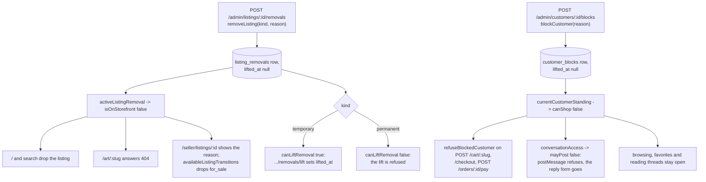
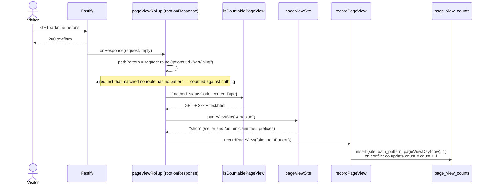

# Admin site

What a platform operator does: read every seller, customer, listing, order,
fulfillment, refund, payout and ledger entry; moderate listings and customers;
cancel an unpaid order and refund a fulfillment; run the weekly payout; and read
site traffic.

Code: `app/sites/admin/`, `app/actions/moderation/`, `app/core/moderation/`,
`app/actions/refunds/issue-refund.ts`,
`app/actions/orders/cancel-order-as-admin.ts`,
`app/plugins/page-views.ts`, `app/actions/analytics/record-page-view.ts`,
`app/core/analytics/`.

Admins are seeded, never created: `adminSite` passes `admits` to
`signInRoutes`, so an address with no `admins` row is never sent a link at all
(see [`identity.md`](identity.md)). Every page except sign-in lives inside
`adminConsoleRoutes`, whose only job is one `requireAdmin` hook — a guard on
each route would let the next page forget it.

## Pages

| Path                                                                    | Reads                                                                    |
| ----------------------------------------------------------------------- | ------------------------------------------------------------------------ |
| `GET /admin`                                                            | `platformTallies`, `platformMoney`, `pageViewTotals`                     |
| `GET /admin/sellers`, `/admin/sellers/:id`                              | `sellerRows`, `sellerDetail`                                             |
| `GET /admin/customers?standing=`, `/admin/customers/:id`                | `customerRows` (`all` \| `verified` \| `anonymous` \| `blocked`),        |
|                                                                         | `customerDetail`                                                         |
| `GET /admin/listings?status=&seller=&removed=`, `/admin/listings/:id`   | `listingRows` (`removed` is `any` \| `removed` \| `visible`),            |
|                                                                         | `listingDetail`                                                          |
| `GET /admin/orders?status=&customer=`, `/admin/orders/:id`              | `orderRows`, `orderDetail` (items, payments, fulfillments, refunds)      |
| `GET /admin/fulfillments?status=&seller=`, `/admin/fulfillments/:id`    | `fulfillmentRows`, `fulfillmentDetail`                                   |
| `GET /admin/accounting`                                                 | `sellerAccounts`, `platformMoney`                                        |
| `GET /admin/payouts?seller=`, `POST /admin/payouts`                     | `payoutRows`, `runWeeklyPayout`                                          |
| `GET /admin/ledger?seller=&type=`                                       | `ledgerRows` plus the folded totals for the filtered set                 |
| `GET /admin/stats`                                                      | `pageViewsByDay`, `pageViewsByPattern`, `listingEventTallies`            |
| `GET /admin/logs?level=&phase=&event=&request=&txn=&session=&actor=`    | `logRows`, `logLevelTallies` over the log store                          |
| `&msg=&from=&to=&key=&value=`                                           | (see [`log-store.md`](log-store.md))                                     |
| `GET /admin/logs/requests/:requestId`                                   | `requestStoryRows` — one request's lines in order, capped at 1,000       |
| `GET\|POST /admin/messages`, `/admin/messages/:id`                      | the admin inbox (see [`messaging.md`](messaging.md))                     |
| `POST /admin/sellers/:id/messages`,                                     | `openConversation` — opens or reuses the admin's thread with that seller |
| `POST /admin/customers/:id/messages`                                    | or customer and redirects to it                                          |
| `GET /admin/outbox`, `/admin/outbox/:id`, `POST /admin/outbox/drain`    | `outboxRows`, `outboxRow`, `drainOutbox`                                 |
| `GET /admin/events`                                                     | the admin's unread-count stream (`text/event-stream`)                    |
| `POST /admin/listings/:id/removals`, `.../removals/lift`                | `removeListing`, `liftListingRemoval`                                    |
| `POST /admin/customers/:id/blocks`, `.../blocks/lift`                   | `blockCustomer`, `liftCustomerBlock`                                     |
| `POST /admin/orders/:id/cancel`                                         | `cancelOrderAsAdmin` — unpaid orders only, with a reason                 |
| `POST /admin/fulfillments/:id/refund`                                   | `issueRefund` — any live fulfillment, with a reason                      |

Every filter is optional and an empty value means "all": the console submits
`seller=` for "All sellers", which `optionalFilter`
(`app/http/request-schema.ts`) reads as absent before the handler sees it.

Reads live in `app/sites/admin/queries/`, one module per table a page shows,
each taking `Pick<ActionContext, 'db'>` and returning cents and ISO strings;
`adminPage(title, data)` hands the templates `formatCents`, `formatMoment`, and
`statusLabel`, so no route builds a display string.

The `status` filters on `/admin/orders` and `/admin/fulfillments` and the
`type` filter on `/admin/ledger` are built from `ORDER_STATUSES`,
`FULFILLMENT_STATUSES`, and `LEDGER_ENTRY_TYPES`, so `refunded` (and
`declined`) appear as filter values without a second list to keep in step.

Balances are folded, never queried per seller: the sellers list, the accounting
page, and the ledger page each read `ledgerMovements` once and fold with
`ledgerBalance` rather than calling `sellerBalance` N times. `/admin` and
`/admin/accounting` show `feesEarnedCents` beside `feesRefundedCents` —
`feeTotals` splits the fee on every settled fulfillment by whether it was
reversed, so the platform's forgone fees are a figure rather than an absence.
`tallyOver(keys, counted)` puts states nobody has reached back on the dashboard,
because a `group by` answers only for the states that have rows and a dashboard
that hides `payment_failed` is lying about the state machine.

All four moderation writes go through one `moderationRoute` factory
(`app/sites/admin/routes/moderation.ts`). They differ only in their zod form,
the action they call, and what they say afterwards; the shared shape is read
the id off the route's `params` schema (404 if it is not one) and the form off
its `body` schema (400 if it does not hold together), resolve a local
`redirect_to` through `resolveLocalRedirect`, call the action, and turn a
`TransitionError` into a flashed alert. The route never asks whether the move
is allowed — that answer is the action's.

The two lifecycle writes follow the same shape without sharing the factory:
each reads its subject (404 if the id names nothing), parses the reason through
`parseRefundReason` (1–500 characters), calls the action, and turns a
`TransitionError` — a paid order, a fulfillment already reversed — into a
flashed alert. The refund form carries `redirect_to`, because the order page
offers one per fulfillment and the fulfillment page offers its own.

## What a removal or a block actually does

Question: an admin removes a listing or blocks a customer — what changes, and
where?

Caveats: a listing with an active removal is off the storefront **whatever its
status** — `isOnStorefront(status, hasActiveRemoval)` takes the removal as its
second argument, and every page that turns a slug into a visible listing goes
through `findListingOnStorefront`, which asks it. The storefront's 404 is one
page for every miss (unknown slug, draft, removed, someone else's order), so
nothing reveals whether a thing exists.

The seller keeps their own page for a removed listing and reads the reason
there. `availableListingTransitions(status, hasActiveRemoval)`
(`app/core/listings/listing-status.ts`) is `LISTING_STATUS_TRANSITIONS` with
`for_sale` filtered out while a removal stands, and it feeds both the status
buttons and the status-change route's refusal — so a seller cannot put a
removed piece back on the storefront.

At most one active removal per listing and one active block per customer.
Raising a temporary removal to a permanent one is lift then remove, which leaves
the seller one reason to read rather than two overlapping ones. Each refusal is
a `TransitionError`: `removeListing` on an already-removed listing,
`liftListingRemoval` on a listing with nothing active or a `permanent` removal,
`blockCustomer` on an already-blocked customer, `liftCustomerBlock` on an
unblocked one.

Both lifts key off the **subject**, not the removal or block row, so a page that
knows the listing or the customer needs nothing else, and "which one is active"
stays a single answer in `activeRemoval` / `activeBlock`.

A blocked customer can still browse, favorite, and read their threads. What a
block removes is adding to a cart, checking out, paying, and sending messages —
which is why the predicate is named `canShop` rather than after the block.

## Page views, rolled up

Question: how does a request become a row on `/admin/stats`?

Caveats: the hook is registered once at the root of `buildApp`, because a hook
added there runs for every site, and the site a hit belongs to is read back off
the route's own pattern rather than the request's host or a per-site
registration. The pattern is what is stored — `/art/:slug`, not the concrete
URL — so a thousand listing pages share one row and the table grows with routes
and days, not with traffic. The unique index on
`(site, path_pattern, day)` is what makes the first hit of a day an insert and
every later one an increment, in one statement and no read.

`pageViewSite` treats the storefront as what a path is when no portal claims it,
which also keeps a future `/sellers-guide` on the storefront where it belongs.

"This week" on the dashboard is the seven days ending today (`pageViewWeek`),
not Monday-to-Sunday: a calendar week reads as almost nothing every Monday, and
the number exists to be compared with the day before it. The payout period is a
calendar week and is a different question — see [`escrow.md`](escrow.md).

`listing_events` are the other half of `/admin/stats`
(`listingEventTallies`): per-listing `view`, `favorite`, `unfavorite`, and
`cart_add`, with a `view` collapsed to at most one per (listing, customer, hour)
by `isRecordedOncePerHour` and `viewWindowStart`.

## The outbox as the platform's mailbox

Sign-in links and notifications queue in `outbox_messages` (see
[`architecture.md`](architecture.md)). `/admin/outbox` lists them newest first
with a Pending/Sent column; `/admin/outbox/:id` shows one as it would be sent,
with its link clickable — which is how a reviewer signs in once
`MAGIC_LINK_DELIVERY=outbox` turns the debug alert off. **Drain the outbox**
on that page posts to `/admin/outbox/drain` and calls the same `drainOutbox`
`npm run outbox` and `make outbox` call, writing each pending message to
`<OUTBOX_DIR>/<id>.eml` and stamping `delivered_at`.

## Running a payout from the admin site

`POST /admin/payouts` parses its own `as_of` field and calls the same
`runWeeklyPayout` the CLI calls, for every seller rather than one. The seller
portal shows a seller their held / available / paid-out balance and their payout
history on `/seller/earnings` and offers no control that runs one. The full
sequence and the re-run rule are in [`escrow.md`](escrow.md).
