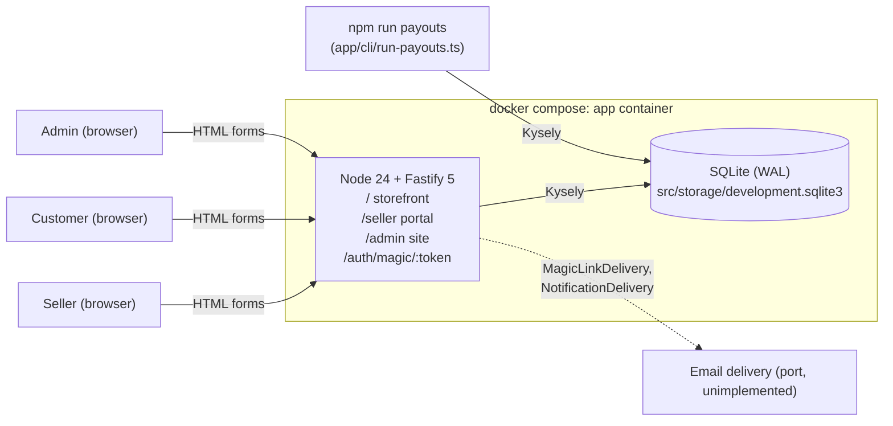
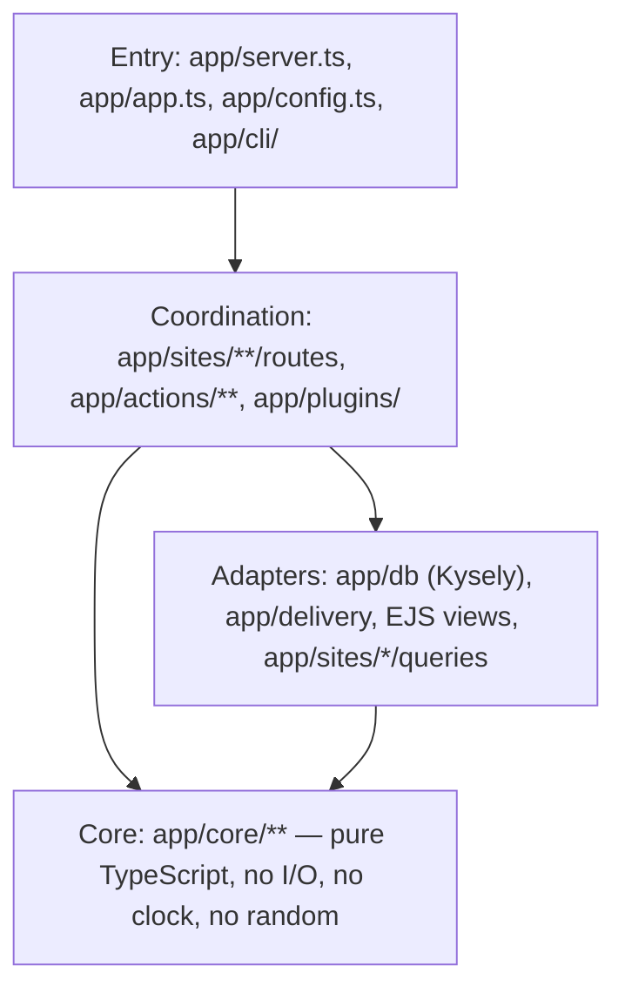
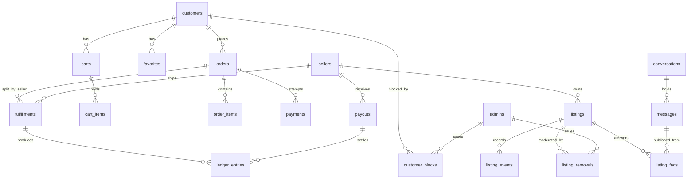
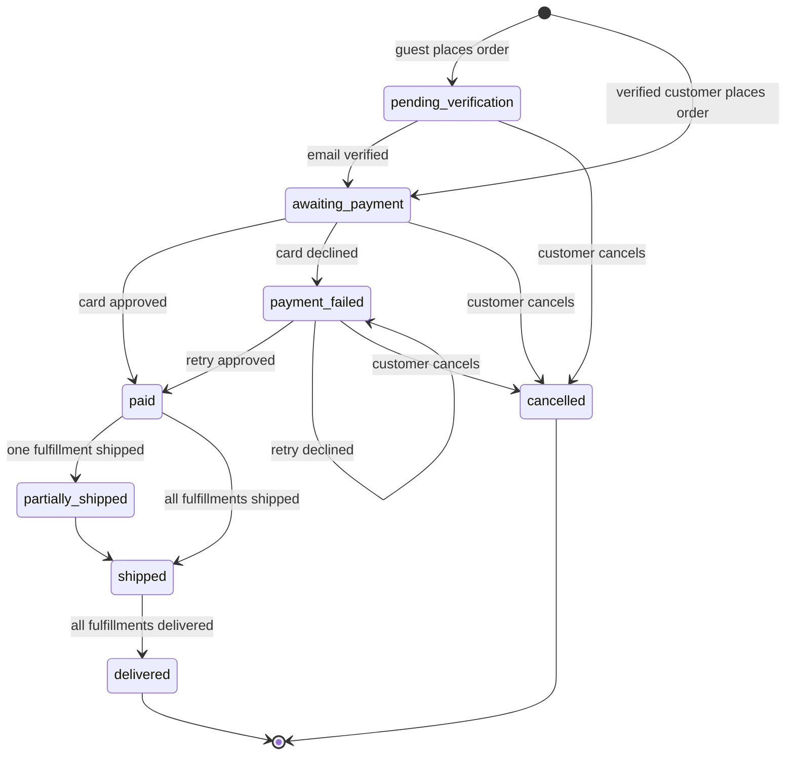

# Art Store prototype (Node) — system architecture

Prototype of a three-sided art marketplace: a **seller portal** (back office), a
**customer storefront**, and an **admin site** for the platform operators, plus a
**messaging center** that spans all three. One Node deployable, one SQLite
file, server-rendered HTML, no client-side JavaScript required. Every agent
working in `prototype/node/` reads this doc first and follows the conventions
in it. The Rails spike in `prototype/rails/` (and the PHP spike in
`prototype/php/`) solved the seller/customer half of the same product; its
domain decisions carry over unless stated otherwise here.

This doc is the system-altitude map. The feature docs beside it carry the
sequences and state machines: [`identity.md`](identity.md),
[`orders.md`](orders.md), [`escrow.md`](escrow.md),
[`messaging.md`](messaging.md), [`admin.md`](admin.md),
[`data-model.md`](data-model.md), [`ontology.md`](ontology.md).

## Stack (installed versions, 2026-08-22)

| Concern | Choice | Version |
| --- | --- | --- |
| Runtime | Node, native type stripping (`node app/server.ts`, no build step, no `tsx`) | `node:24-bookworm-slim` |
| Language | TypeScript, `erasableSyntaxOnly` (no `enum`, no parameter properties, no namespaces), `verbatimModuleSyntax`, `tsc --noEmit` for type checking only | 5.9.3 |
| HTTP | Fastify | 5.12.1 |
| Views | EJS via `@fastify/view` | ejs 6.0.1, @fastify/view 12.0.0 |
| Forms, cookies, static, uploads | `@fastify/formbody`, `@fastify/cookie` (signed cookies), `@fastify/static`, `@fastify/multipart` | 9.0.0, 11.1.2, 10.1.3, 10.1.1 |
| Database | better-sqlite3 + Kysely (`SqliteDialect`, `CamelCasePlugin`) + Kysely `Migrator` with `FileMigrationProvider`, both imported from `kysely/migration` | better-sqlite3 13.0.3, kysely 0.29.5 |
| Validation at the edge | zod (`parse, don't validate`) | 4.4.3 |
| CSS | Tailwind CLI, stock theme | @tailwindcss/cli 4.3.3 |
| Tests | `node:test` + `node:assert/strict`, sidecar files, `--experimental-test-coverage` with line/branch thresholds | built in |
| Complexity | eslint + typescript-eslint with `complexity` and `max-depth` rules as a gate | eslint 9.39.5, typescript-eslint 8.67.0 |

Kysely 0.29 moved `Migrator` and `FileMigrationProvider` out of its root
export; importing them from `kysely` fails at runtime.

Everything runs in the `app` container (`docker compose`). Nothing is installed
on the host; `node_modules/` lives inside the bind mount so it survives
restarts. The container serves port 4000.

## Deployables

Question: what runs, and what talks to what?



The payout CLI is a second entry point onto the same database, not a second
service: it opens its own connection, runs one action, and exits. Email is a
port with no live implementation — `mailMagicLinkDelivery` throws
`NotImplementedError`.

## Layers inside the deployable

Functional core / imperative shell. Dependencies point inward only.



| Layer | Lives in | Rules |
| --- | --- | --- |
| Core | `app/core/<concept>/` | Pure functions and types. Receives `now: Date` and ids as parameters — never a `Clock`. Enumerations are `as const` string unions; state machines are a `TRANSITIONS` table plus `canTransition<Thing>(from, to)` and a throwing `transition<Thing>`. Unit tested with `node:test` and no database. |
| Adapters | `app/db/`, `app/delivery/`, `app/sites/*/views/`, `app/views/`, `app/sites/*/queries/` | `app/db/`: the Kysely factory (`openDatabase`), `migrations/`, `migrator.ts`, `schema.ts` + `commerce-schema.ts` (row types), `timestamp.ts`, the `seed-*.ts` modules. `app/delivery/`: the `MagicLinkDelivery` port and its two implementations. `queries/`: read-only Kysely per site, one module per table a page shows, no domain logic. Views are EJS. |
| Coordination | `app/actions/<concept>/`, `app/sites/<site>/`, `app/plugins/` | Actions are verbs (`placeOrder`, `runWeeklyPayout`) that take an `ActionContext` (`{ db, clock, notificationDelivery? }`) and sequence core + adapters inside one transaction. Routes parse with zod, call actions, render views. `app/plugins/` holds the cross-cutting Fastify wiring — flash, identity, page-view rollup, unread counts, the per-site render decorator, and `formBody`, which reads an absent request body as an empty form. None of them owns a domain `if`; if one appears, it moves to `app/core`. Covered by integration tests (`app.inject`). |
| Entry | `app/app.ts` (`buildApp(deps)`), `app/server.ts` (listen), `app/config.ts` (env → typed config), `app/cli/` | Wiring only. `buildApp` is the composition root and the thing tests construct. |

Two single-concept files sit at the root of `app/` rather than in a layer:
`app/clock.ts` (the `Clock` type, `systemClock`, `fixedClock` — core takes a
`Date`, so `Clock` has no reason to live in `app/core/`) and
`app/not-implemented-error.ts`.

Naming follows the `naming` skill: actions are verb phrases, core enums name
states (`OrderStatus`), events are past tense. Files are kebab-case and named
for their primary export (`order-status.ts` exports `OrderStatus` and
`canTransitionOrder`). Database tables are snake_case plural; `CamelCasePlugin`
exposes them to TypeScript as camelCase (`price_cents` → `priceCents`).

## Sites

| Site | URL prefix | Plugin | Identity cookie | Theme |
| --- | --- | --- | --- | --- |
| Storefront | `/` | `shopSite` (`app/sites/shop/`) | signed `customer_id` (anonymous or verified) | Bright, open, white space, large imagery, one amber accent, brand recedes. |
| Seller portal | `/seller` | `sellerSite` (`app/sites/seller/`) | signed `seller_id` | Stock Tailwind, system font, vanilla controls, dense and tool-focused. |
| Admin site | `/admin` | `adminSite` (`app/sites/admin/`) | signed `admin_id` | Same as the seller portal: tools, tables, filters. |
| Magic links | `/auth/magic/:token` | `authSite` (`app/sites/auth/`) | writes whichever cookie the link names | No pages of its own; every answer is a redirect. |

Each site is one Fastify plugin registered in `buildApp`. It calls
`addSiteRender(site, { pages, layout })` for its own
`app/sites/<site>/views/layout.ejs`, adds `countUnreadMessages(<actorType>)`,
registers `signInRoutes({ actorType, ... })`, and registers its own routes
behind whatever guard it needs:

- `sellerSite` registers `@fastify/multipart` (`attachFieldsToBody: true`) and
  puts every page except sign-in inside a child plugin carrying `requireSeller`.
- `adminSite` puts its pages inside `adminConsoleRoutes`, which carries
  `requireAdmin`. The sign-in pages stay outside it, or a signed-out admin
  would be redirected in a circle.
- `shopSite` puts its browsing pages inside `storefrontRoutes`, which carries
  `resolveCustomerIdentity` — the hook that mints an anonymous customer row.
  The sign-in pages stay outside it, so asking for a link leaves no row behind.

The three identity cookies are independent, so one browser can be a seller, a
customer, and an admin at the same time — the demo needs that. All three are
signed, `httpOnly`, `sameSite=lax`, and last a year. Every layout renders the
shared `app/views/partials/debug-alert.ejs`, which prints a flashed magic link.
Flash is a signed, one-request cookie set on the reply (`reply.setFlash`,
`reply.takeFlash`).

`/auth/magic/:token` is shared by all three sites: it consumes the link, claims
the identity for the link's `actorType`, sets that site's cookie, and redirects
to the link's `redirectTo` or that actor's `ACTOR_SITES[...].homePath`.

## Identity

See [`identity.md`](identity.md) for the sequences.

- Passwordless for sellers, customers, and admins. `magic_links` holds a hashed
  token (`digestMagicLinkToken`, sha256 hex), `email`, `actor_type`
  (`seller` | `customer` | `admin`), `expires_at`, `consumed_at`, optional
  `redirect_to`. A link lasts `MAGIC_LINK_LIFETIME_MINUTES` (15) and works
  once — enforced by the UPDATE (`set consumed_at = ? where id = ? and
  consumed_at is null`), not by the read, so two requests arriving together
  cannot both spend it.
- `signInRoutes({ actorType, admits?, refusal?, accountView? })` is a plugin
  factory: `GET/POST /login`, `POST /logout`, `GET /account`, registered inside
  whichever site wants them, so all three share one implementation and keep
  their own layout and templates.
- Delivery is a port: `MagicLinkDelivery` (`app/delivery/`) with
  `flashMagicLinkDelivery` (prototype: flash the URL so the layout prints it in
  the debug alert) and `mailMagicLinkDelivery` (the hook for real email; throws
  `NotImplementedError`). `selectMagicLinkDelivery` reads
  `MAGIC_LINK_DELIVERY` (`flash` | `mail`).
- Sellers: the first link for an address creates the seller row
  (`claimSellerIdentity`). No separate sign-up.
- Admins: `admins` rows are **seeded only** (Jonathan Beebe
  `jonathan-beebe@outlook.com`, Anna Schmunk `annaschmunk@pm.me`). `adminSite`
  passes `admits`, so an address with no `admins` row is never sent a link at
  all.
- Customers: every storefront visitor gets a `customers` row with `email = null`
  on first request; its id is in the signed `customer_id` cookie. A cookie alone
  is a browsing history — `signedInActorId(request, 'customer')` counts a
  customer as signed in only once `email` is set.
- Verifying an address runs a **discriminated-union plan**,
  `planCustomerIdentity` (`app/core/customers/identity-plan.ts`), over the
  anonymous row the cookie names and the row that already owns the address:
  `createVerified`, `claimAnonymous`, `signInExisting`, or `mergeAnonymousInto`.
  Each variant carries exactly the ids that case needs, so the action reads them
  with no null assertions.
- The merge is a **fold**, planned by `planCustomerMerge`
  (`app/core/customers/customer-merge-plan.ts`): cart quantities sum (clamped to
  stock), favorites de-duplicate. `REPOINTED_CUSTOMER_TABLES` — `orders`,
  `listing_events`, `notifications`, `conversations` — move wholesale. Carts and
  favorites are deliberately not in that list; re-pointing a cart would leave a
  customer with two. The anonymous row survives, and a `customer_merges` row
  records `anonymous_customer_id -> customer_id` so a stale cookie on another
  device resolves forward.
- Guest checkout = place the order as the anonymous customer, verify by link,
  then pay on `/orders/:id/pay`. The card is entered after verification and
  never stored. Verifying moves the order `pending_verification ->
  awaiting_payment` (`markAwaitingPayment`); it never pays.

## Commerce domain

Money is integer cents (`app/core/money.ts`, type `Cents`). Orders may span
sellers; fulfillment and escrow are tracked **per (order, seller)** in
`fulfillments`.

Question: which tables carry the marketplace, and how do they connect?



Twenty-three tables in nine migrations. `notifications`, `magic_links`,
`customer_merges`, and `page_view_counts` are left off this overview: the first
three hang off the identity tables and the fourth stands alone. Columns, the
identity half, and the caveats are in [`data-model.md`](data-model.md).

### Listing status

`draft → for_sale → sold`, `sold → for_sale` (stock restored after a declined
card), `archived` from `draft`/`for_sale`. Browse and search show only
`for_sale` listings with **no active removal**; a listing's own page
(`/art/:slug`) stays reachable through `sold` so a followed link keeps working
(`isOnStorefront`). `draft`, `archived`, and removed listings answer 404.
Quantity defaults to 1; a purchase decrements at placement and `sold` is
reached at 0 (`stockAfterSale`).

Seller input (title, description, medium, dimensions, price, quantity, image)
is parsed by a zod schema at the route and checked by the pure
`listingDraftErrors`, so the rule stays out of the database layer. The image is
a path column (`listings.image_path`) written by an upload to
`public/uploads/<uuid>.<ext>`; `listingImageSource` falls back to an SVG
generated from the title.

### Moderation (admin)

See [`admin.md`](admin.md).

- `listing_removals`: one row per admin action on a listing — `kind`
  (`temporary` | `permanent`), `reason`, `admin_id`, `created_at`, `lifted_at`
  (null while active). A listing with an active removal is off the storefront
  whatever its status; the seller sees the removal and reason in the portal.
  `temporary` can be lifted by an admin; `permanent` cannot (`canLiftRemoval`).
- `customer_blocks`: same shape for customers (`reason`, `admin_id`,
  `created_at`, `lifted_at`). A blocked customer can browse but cannot add to
  cart, check out, pay, or send messages; the storefront says so.
- At most one active removal per listing and one active block per customer.
  Raising a temporary removal to a permanent one is lift then remove.
- Visibility and standing are pure core predicates —
  `app/core/listings/listing-availability.ts` (`isOnStorefront`,
  `isPurchasable`) and `app/core/moderation/` (`activeRemoval`,
  `canLiftRemoval`, `activeBlock`, `customerStanding`, `canShop`). The admin
  site writes the rows; the storefront and portal read the predicates through
  `activeListingRemoval` / `currentCustomerStanding`. **`customerStanding` lives
  in `app/core/moderation/`, beside the removal predicate — not in
  `app/core/customers/`, which belongs to identity.**

### Order status

Question: what are the legal `OrderStatus` transitions?



Source of truth: `ORDER_STATUS_TRANSITIONS` in
`app/core/orders/order-status.ts`. `cancelled` is reachable: `cancelOrder`
(action + `POST /orders/:id/cancel`) covers the three `isCancellable` statuses
and restores the stock `placeOrder` took. A multi-seller order's status rolls up
from its fulfillments (`orderStatusFromFulfillments`).

### Fulfillment status (per order × seller)

`awaiting_shipment → shipped → delivered`
(`FULFILLMENT_STATUS_TRANSITIONS`). Seller marks shipped (carrier + tracking);
customer confirms delivery from the order page. A seller's "order" **is a
fulfillment** — the portal's orders pages take a `fulfillments.id`, and UI copy
says "fulfillment" where the row is one.

### Escrow and payouts

See [`escrow.md`](escrow.md).

- Platform fee: `PLATFORM_FEE_PERCENT` is 10% of the fulfillment subtotal,
  computed once at order placement (`placeOrder`) and stored on `fulfillments`
  (`fee_cents`, `net_cents`). Later steps move the stored `net_cents`; they
  never re-price.
- `ledger_entries.entry_type`: `held` (+net, when the order pays), `released`
  (+net, when the fulfillment is delivered), `paid_out` (−amount, when included
  in a payout). `ledgerBalance` folds a seller's entries:
  `held = heldTotal − releasedTotal`, `available = releasedTotal + paidOutTotal`
  (adding a negative nets it down), `paidOut = −paidOutTotal`.
- Payout period = Monday–Sunday, the most recently completed one
  (`payoutPeriodEndingBefore`). `npm run payouts -- --as-of=DATE`
  (`app/cli/run-payouts.ts`, wrapped as `make payouts AS_OF=…`) calls
  `runWeeklyPayout` and writes one `payouts` row per seller with released and
  unpaid money. The `paid_out` entry is dated at `payoutPeriodEndsAt`
  (`T23:59:59.999Z` of the last day), so a re-run of the same period pays
  nothing. Period math is pure. The admin site exposes the run
  (`POST /admin/payouts`); the seller portal does not.

### Fake payment

`decideCard(number)` in `app/core/payments/fake-card.ts`:

| Number | Decision |
| --- | --- |
| `4242 4242 4242 4242` | approved |
| `4000 0000 0000 0002` | declined: `generic_decline` |
| `4000 0000 0000 9995` | declined: `insufficient_funds` |
| anything else | declined: `invalid_card_number` |

Every non-digit is stripped, so spaces and dashes are ignored. Only the last
four digits are stored, one `payments` row per attempt.

### Notifications

`notifications` rows with exactly one recipient FK set (`seller_id`,
`customer_id`, or `admin_id`, held by a check constraint): `subject`, `body`,
`url`, `read_at`. `notify` is the one write point —
`itemSoldMessage` to the seller when the order pays, `orderShippedMessage` to
the customer when a fulfillment ships, `newMessageMessage` to the other side of
a conversation. `NotificationDelivery`
(`app/core/notifications/notification-delivery.ts`) is the port for carrying one
out of the application; `ActionContext.notificationDelivery` is optional and
unset in the running app, so the prototype's notifications are the rows
themselves.

## Messaging

See [`messaging.md`](messaging.md). One model serves every pairing: a
`conversations` row names its `kind` and its participants; `messages` rows hang
off it.

| `kind` | Participants | Opened from | Subject column |
| --- | --- | --- | --- |
| `admin_seller` | admin ↔ seller | `/seller/support`, or `POST /admin/sellers/:id/messages` | — |
| `admin_customer` | admin ↔ customer | `/support`, or `POST /admin/customers/:id/messages` | — |
| `fulfillment` | seller ↔ customer | `POST /seller/orders/:id/messages`, or `POST /orders/:id/fulfillments/:fulfillmentId/messages` | `fulfillment_id` |
| `listing_question` | customer ↔ seller | `POST /art/:slug/questions` | `listing_id` |

- `conversations`: `id`, `kind`, `seller_id?`, `customer_id?`, `admin_id?`,
  `listing_id?`, `fulfillment_id?`, `created_at`, `last_message_at`.
- `messages`: `id`, `conversation_id`, `sender_type` (`seller` | `customer` |
  `admin`), `sender_id`, `body`, `sent_at`, `read_at?`. A conversation has
  exactly two participants, so **one `read_at` per message** is unambiguous: the
  reader is always the participant who did not send it (`isUnreadBy`).
- `listing_faqs`: `id`, `listing_id`, `question`, `answer`,
  `source_message_id?`, `published_at`. **A row exists only while the entry is
  published** — unpublishing deletes it, `published_at` is `not null`, and the
  storefront reads the table with no predicate. Re-publishing is one click from
  the thread the answer came from, so there is no draft state to model. A seller
  answering a `listing_question` publishes the question + answer as an FAQ
  entry; the storefront listing page lists them. The seller can also edit or
  unpublish one.
- Find-or-open is a pure plan, `planConversation`
  (`app/core/messaging/conversation-plan.ts`), over the rows that already match
  the kind and the five id columns — the same shape as the identity plan. One
  thread per subject is what makes "message this seller" reach the same place
  every time.
- Who may read or post is a pure predicate, `conversationAccess`
  (`app/core/messaging/conversation-access.ts`), answering `mayRead` and
  `mayPost` separately: reading is being named in the participant column,
  posting is that plus standing. `postMessage` enforces it, so all three sites
  refuse a blocked sender with the same words.
- The support counterpart on both `/support` routes is the first admin by id.
  Admin rows are seeded and this prototype has no assignment model; with no
  admin row at all the route flashes and goes back.
- Each site has an inbox (`/messages`, `/seller/messages`, `/admin/messages`)
  listing its conversations by `last_message_at`, and a thread page that posts a
  reply. `conversationPath(actorType, id)` is core, because the same thread has
  three URLs. Anonymous customers can ask a listing question; the conversation
  re-points on merge.
- `addUnreadMessages` decorates `request.unreadMessageCount` and
  `countUnreadMessages(actorType)` is one `preHandler` per site, so
  `addSiteRender` hands every layout its badge beside the flash and the
  identity.

## Site analytics

- `listing_events` (per listing: `view` | `favorite` | `unfavorite` |
  `cart_add`, optional `customer_id`, `occurred_at`) feed the seller's activity
  numbers. A `view` is recorded at most once per (listing, customer, hour) —
  `isRecordedOncePerHour` and `viewWindowStart` decide that, and
  `recordListingEvent` returns `null` when it collapses a repeat.
- Page views are rolled up, not logged per hit. `addPageViewRollup`
  (`app/plugins/page-views.ts`) adds one root `onResponse` hook, so it reaches
  every site; `isCountablePageView` keeps successful HTML GETs;
  `pageViewSite(pathPattern)` derives the site from the URL prefix (`/seller`
  and `/admin` claim theirs, everything else is `shop`); and `recordPageView`
  upserts `page_view_counts(site, path_pattern, day, count)` against the unique
  index on those three columns, so the first hit of a day inserts and every
  later one increments in one statement. The pattern is the route's
  (`/art/:slug`), not the concrete URL, so a thousand listing pages share one
  row. A request that matched no route has no pattern and is counted against
  nothing. The admin site reads this table on `/admin/stats`.

## Testing

- `node:test` with `node:assert/strict`. Tests are **sidecars**: `foo.ts` →
  `foo.test.ts` in the same directory.

| Command | What it runs |
| --- | --- |
| `npm test` | `node --test 'app/**/*.test.ts'` |
| `npm run coverage` | adds `--experimental-test-coverage --test-coverage-include='app/**' --test-coverage-exclude='app/**/*.test.ts' --test-coverage-lines=90 --test-coverage-branches=80` |
| `npm run typecheck` | `tsc --noEmit` |
| `npm run lint` | `eslint app` — `complexity` ≤ 8, `max-depth` ≤ 3 |
| `npm run check` | typecheck, then lint, then the suite. `make test` runs this. |

- Core tests (`app/core/**`) import only the file under test. No database, no
  doubles.
- Coordination tests (actions, routes) build the whole app through
  `buildTestApp()` (`app/test/build-test-app.ts`) over
  `openDatabase(':memory:')` with migrations run and `fixedClock(TEST_INSTANT)`,
  drive it with `app.inject(...)`, and assert on rendered HTML and rows. The
  same file signs in each actor type without walking the link flow —
  `signInAsSeller`, `signInAsCustomer`, `signInAsAdmin`,
  `browseAsAnonymousCustomer`, each returning `{ id, cookies }` — and
  `takeDebugMagicLink` reads back the URL a response flashed for a test that
  does want to walk it.
- `app/test/commerce-world.ts` builds an action-level world (no HTTP) with a
  `TravellingClock`, so `app/actions/orders/order-lifecycle.test.ts` can walk
  place → pay → ship → deliver → payout across simulated days.
- Each site has its own fixtures beside its routes:
  `app/sites/seller/test-fixtures.ts` and
  `app/sites/shop/storefront-fixtures.ts`. Both build through the real actions
  rather than inserting rows, so a fixture cannot drift from what the
  application writes.
- `app/test/smoke.test.ts` holds the cross-site walks: all three sites serving
  their own layout off one stylesheet; a listing question answered and published
  as an FAQ that then shows on the storefront; an admin messaging a seller who
  reads it.
- TDD: failing sidecar test, make it pass, refactor. A feature ticket is done
  when its flow has an integration test that walks it end to end.
- `make docs-check` renders every Mermaid block under `docs/` through
  `minlag/mermaid-cli` in Docker (`docker/docs-check.sh`) and fails on any
  diagram that does not parse.

## Repository layout

```
prototype/node/
  README.md            how to run, serve, test
  docker-compose.yml   one service: app, port 4000
  Dockerfile           node:24-bookworm-slim + build tools for better-sqlite3
  docker/              entrypoint.sh, docs-check.sh
  Makefile             host-side wrappers over docker compose
  docs/                architecture + feature docs (this folder)
  work/                tickets and journal (orchestration only)
  src/                 the Node project: package.json, tsconfig.json, eslint.config.js, node_modules/
    app/               all TypeScript source
      server.ts        entry: builds the app from config and listens
      app.ts           buildApp(deps): composition root
      config.ts        env → typed config, parsed by zod
      clock.ts         Clock, systemClock, fixedClock
      not-implemented-error.ts
      core/            functional core: analytics, auth, cart, customers, escrow,
                       listings, messaging, moderation, notifications, orders,
                       payments, reports, shop, plus money.ts and transition-error.ts
      actions/         verbs over ActionContext: analytics, auth, carts, customers,
                       escrow, favorites, fulfillments, listings, messaging,
                       moderation, notifications, orders, plus transaction.ts
      db/              database.ts, schema.ts + commerce-schema.ts (row types),
                       migrations/, migrator.ts, migrate.ts, timestamp.ts, seed*.ts
      delivery/        MagicLinkDelivery port + flash and mail implementations
      plugins/         flash, form-body, identity, page-views, site-render,
                       unread-messages
      sites/           shop/, seller/, admin/, auth/ — each a plugin with
                       routes/, views/, queries/, and its own helpers
      views/partials/  shared partials: debug-alert.ejs, flash.ejs
      cli/             run-payouts.ts, parse-as-of.ts
      test/            build-test-app.ts, commerce-world.ts, smoke.test.ts
      assets/app.css   Tailwind source
    public/            app.css (built, not committed), uploads/
    storage/           development.sqlite3 (not committed)
```

## Mapping the project skills onto this stack

| Skill says | Here it means |
| --- | --- |
| `npm run test:run -- <pattern>` | `docker compose run --rm app node --test app/path/to/file.test.ts` |
| Vitest unit test | `node:test` sidecar importing only the file under test |
| React Testing Library integration test | `node:test` sidecar that builds the app with `buildTestApp` and uses `app.inject` |
| `src/` | `prototype/node/src/app/` |
