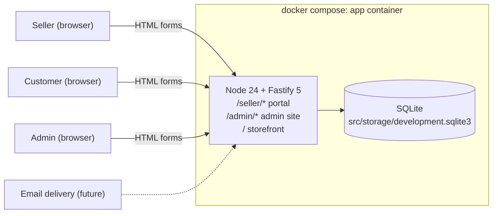
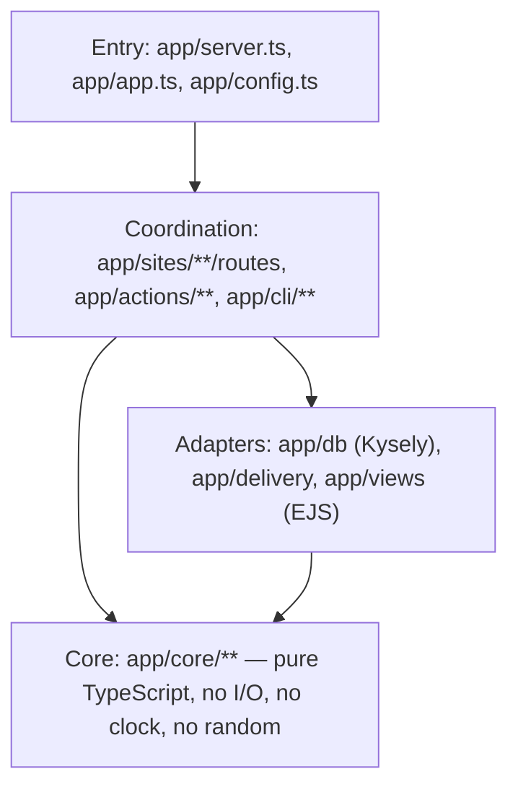
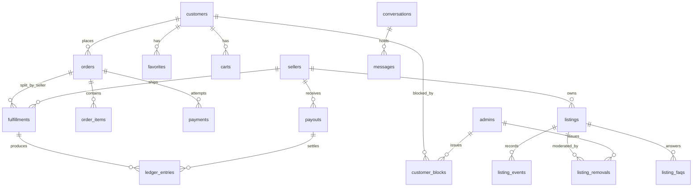
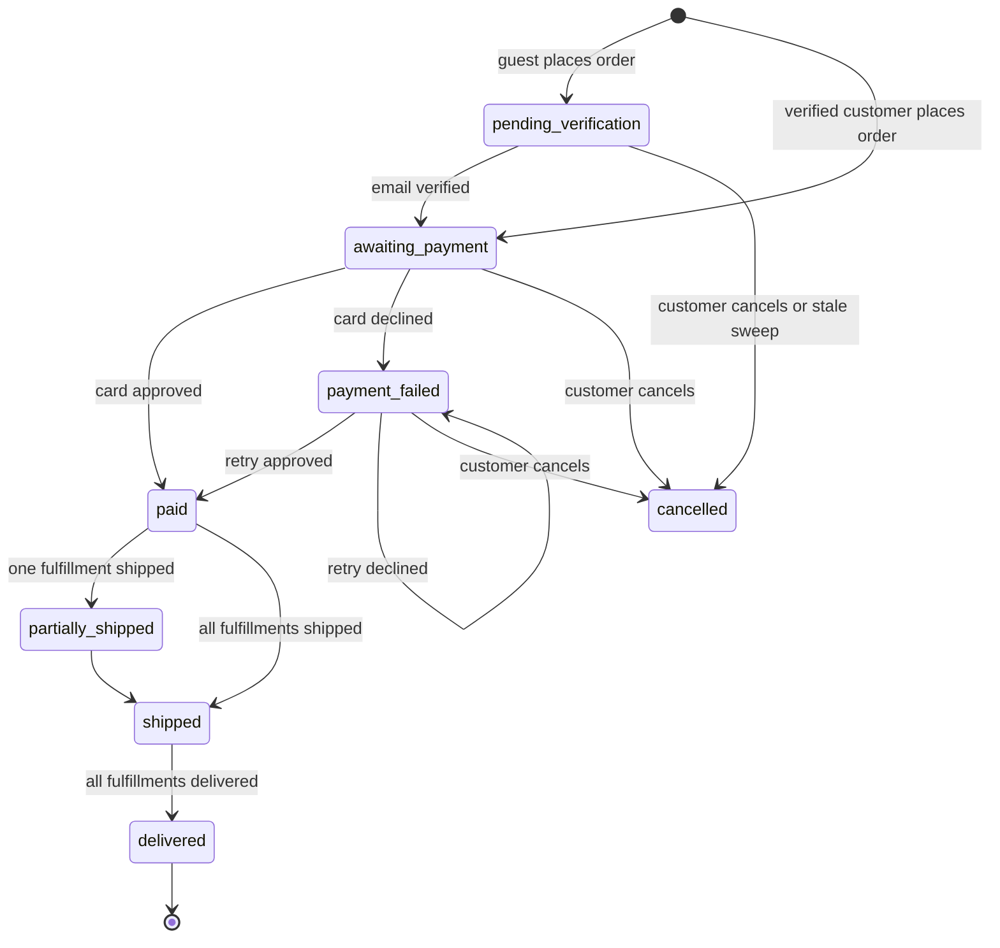

# Art Store prototype (Node) — system architecture

Prototype of a three-sided art marketplace: a **seller portal** (back office), a
**customer storefront**, and an **admin site** for the platform operators, plus a
**messaging center** that spans all three. One Node deployable, one SQLite
file, server-rendered HTML, no client-side JavaScript required. Every agent
working in `prototype/node/` reads this doc first and follows the conventions
in it. The Rails spike in `prototype/rails/` (and the PHP spike in
`prototype/php/`) solved the seller/customer half of the same product; its
domain decisions carry over unless stated otherwise here, and its
`src/app/domain/**` plus sidecar tests are the reference implementation to port.

## Stack (pinned 2026-08-22)

| Concern | Choice | Version |
| --- | --- | --- |
| Runtime | Node, native type stripping (`node app/server.ts`, no build step, no `tsx`) | 24.19 (`node:24-bookworm-slim`) |
| Language | TypeScript, `erasableSyntaxOnly` (no `enum`, no parameter properties, no namespaces), `tsc --noEmit` for type checking only | ^5.9 |
| HTTP | Fastify | ^5.12 |
| Views | EJS via `@fastify/view` | ejs ^6, @fastify/view ^12 |
| Forms, cookies, static, uploads | `@fastify/formbody` ^9, `@fastify/cookie` ^11 (signed cookies), `@fastify/static` ^10, `@fastify/multipart` ^10 | |
| Database | better-sqlite3 + Kysely (`SqliteDialect`, `CamelCasePlugin`) + Kysely `Migrator` with `FileMigrationProvider` | better-sqlite3 ^13, kysely ^0.29 |
| Validation at the edge | zod (`parse, don't validate`) | ^4 |
| CSS | Tailwind CLI, stock theme | @tailwindcss/cli ^4 |
| Tests | `node:test` + `node:assert/strict`, sidecar files, `--experimental-test-coverage` with line/branch thresholds | built in |
| Complexity | eslint + typescript-eslint with `complexity` and `max-depth` rules as a gate | eslint ^9 |

Everything runs in the `app` container (`docker compose`). Nothing is installed
on the host; `node_modules/` lives inside the bind mount so it survives
restarts.

## Deployables

Question: what runs, and what talks to what?



## Layers inside the deployable

Functional core / imperative shell. Dependencies point inward only.



| Layer | Lives in | Rules |
| --- | --- | --- |
| Core | `app/core/<concept>/` | Pure functions and types. Receives `now: Date` and ids as parameters. Enumerations are `as const` string unions; state machines are a `TRANSITIONS` table plus `canTransition(from, to)`. Unit tested with `node:test` and no database. |
| Adapters | `app/db/`, `app/delivery/`, `app/views/`, `app/sites/*/views/` | Kysely database factory + migrations + typed schema, the magic-link and notification delivery ports and their implementations, EJS templates. |
| Coordination | `app/actions/<concept>/`, `app/sites/<site>/`, `app/cli/` | Actions are verbs (`placeOrder`, `runWeeklyPayout`) that take `{ db, clock }` and sequence core + adapters inside one transaction. Routes parse with zod, call actions, render views. Own no domain `if`s — if one appears, extract it to `app/core`. Covered by integration tests (`app.inject`). |
| Entry | `app/app.ts` (`buildApp(deps)`), `app/server.ts` (listen), `app/config.ts` | Wiring only. `buildApp` is the composition root and the thing tests construct. |

Naming follows the `naming` skill: actions are verb phrases, core enums name
states (`OrderStatus`), events are past tense. Files are kebab-case and named
for their primary export (`order-status.ts` exports `OrderStatus` and
`canTransitionOrder`). Database tables are snake_case plural; `CamelCasePlugin`
exposes them to TypeScript as camelCase (`price_cents` → `priceCents`).

## Sites

| Site | URL prefix | Identity cookie | Theme |
| --- | --- | --- | --- |
| Seller portal | `/seller` | signed `seller_id` | Stock Tailwind, system font, vanilla controls, dense and tool-focused. |
| Admin site | `/admin` | signed `admin_id` | Same as the seller portal: tools, tables, filters. |
| Storefront | `/` | signed `customer_id` (anonymous or verified) | Bright, open, white space, large imagery, brand recedes. |

Each site is one Fastify plugin under `app/sites/<site>/` that registers its
routes and owns its layout (`app/sites/<site>/views/layout.ejs`). The three
identity cookies are independent so one browser can be a seller, a customer,
and an admin at the same time — the demo needs that. Every layout renders the
shared `app/views/partials/debug-alert.ejs`, which prints a flashed magic link.
Flash is a signed, one-request cookie.

`/auth/magic/:token` (under `app/sites/auth/`) is shared: it consumes the link,
claims the identity for the link's `actorType`, sets that site's cookie, and
redirects to the link's `redirectTo` or the site's home.

## Identity

- Passwordless for sellers, customers, and admins. `magic_links` holds a hashed
  token, `email`, `actor_type` (`seller` | `customer` | `admin`), `expires_at`,
  `consumed_at`, optional `redirect_to`. A link lasts 15 minutes and works once.
- Delivery is a port: `MagicLinkDelivery` (`app/delivery/`) with
  `FlashMagicLinkDelivery` (prototype: flash the URL so the layout prints it in
  the debug alert) and `MailMagicLinkDelivery` (the hook for real email; throws
  `NotImplementedError`). Selected by `MAGIC_LINK_DELIVERY` (`flash` | `mail`).
- Sellers: the first link for an address creates the seller row. No separate
  sign-up.
- Admins: `admins` rows are **seeded only** (Jonathan Beebe
  `jonathan-beebe@outlook.com`, Anna Schmunk `annaschmunk@pm.me`). A magic link
  for an address with no `admins` row is refused at request time.
- Customers: every storefront visitor gets a `customers` row with `email = null`
  on first request; its id is in the signed `customer_id` cookie. Verifying an
  email either claims that row, or **merges** the anonymous row into the
  existing verified customer. The merge is a **fold**, planned by a pure
  function (`app/core/customers/customer-merge-plan.ts`): cart quantities sum
  (clamped to stock), favorites de-duplicate, orders / listing events /
  notifications / conversations re-point; a `customer_merges` row records
  `anonymous_customer_id -> customer_id` so a stale cookie resolves forward.
- Guest checkout = place the order as the anonymous customer, verify, then pay
  on `/orders/:id/pay`. The card is entered after verification and never stored.
  Verifying moves the order `pending_verification -> awaiting_payment`; it never
  pays.

## Commerce domain

Money is integer cents (`app/core/money.ts`, type `Cents`). Orders may span
sellers; fulfillment and escrow are tracked **per (order, seller)** in
`fulfillments`.



### Listing status

`draft → for_sale → sold`, `sold → for_sale` (stock restored after a declined
card), `archived` from `draft`/`for_sale`. Browse and search show only
`for_sale` listings with **no active removal**; a listing's own page
(`/art/:slug`) stays reachable through `sold` so a followed link keeps working.
`draft`, `archived`, and removed listings are unreachable on the storefront.
Quantity defaults to 1; a purchase decrements at placement and `sold` is
reached at 0.

Seller input (title, description, medium, dimensions, price, quantity, image)
is parsed by a zod schema at the route and checked by a pure
`listingDraftErrors` function in the core, so the rule stays out of the
database layer.

### Moderation (admin)

- `listing_removals`: one row per admin action on a listing — `kind`
  (`temporary` | `permanent`), `reason`, `admin_id`, `created_at`, `lifted_at`
  (null while active). A listing with an active removal is off the storefront
  whatever its status; the seller sees the removal and reason in the portal.
  `temporary` can be lifted by an admin; `permanent` cannot.
- `customer_blocks`: same shape for customers (`reason`, `admin_id`,
  `created_at`, `lifted_at`). A blocked customer can browse but cannot add to
  cart, check out, or send messages; the storefront says so.
- Visibility and purchasability are pure core predicates
  (`app/core/listings/listing-availability.ts`, `app/core/customers/customer-standing.ts`)
  that every site reads. The admin site writes the rows; the storefront and
  portal read the predicates.

### Order status



`cancelled` is reachable: `cancelOrder` (action + route on the order page) for
the three cancellable statuses restores the stock `placeOrder` took. A
multi-seller order's status rolls up from its fulfillments.

### Fulfillment status (per order × seller)

`awaiting_shipment → shipped → delivered`. Seller marks shipped (carrier +
tracking). Customer confirms delivery from the order page. A seller's "order"
**is a fulfillment** — the portal's orders pages take a `fulfillments.id`, and
UI copy says "fulfillment" where the row is one.

### Escrow and payouts

- Platform fee: 10% of the fulfillment subtotal, computed once at order
  placement (`placeOrder`) and stored on `fulfillments` (`fee_cents`,
  `net_cents`). Later steps move the stored `net_cents`; they never re-price.
- `ledger_entries.entry_type`: `held` (+net, when the order pays), `released`
  (+net, when the fulfillment is delivered), `paid_out` (−amount, when included
  in a payout). A seller's balance folds their entries: `held = heldTotal −
  releasedTotal`, `available = releasedTotal + paidOutTotal`, `paidOut =
  −paidOutTotal`.
- Payout period = Monday–Sunday. `npm run payouts -- --as-of=DATE`
  (`app/cli/run-payouts.ts`) creates one `payouts` row per seller with released
  and unpaid money as of the most recently completed week; the `paid_out`
  entry is dated at the period end so a re-run is a no-op. Period math is pure.
  The admin site exposes the payout run; the seller portal does not.

### Fake payment

`decideCard(number)` in `app/core/payments/fake-card.ts`:

| Number | Decision |
| --- | --- |
| `4242 4242 4242 4242` | approved |
| `4000 0000 0000 0002` | declined: generic decline |
| `4000 0000 0000 9995` | declined: insufficient funds |
| anything else | declined: invalid card number |

Spaces and dashes are ignored. Only the last four digits are stored, one
`payments` row per attempt.

### Notifications

`notifications` rows with exactly one recipient FK set (`seller_id`,
`customer_id`, or `admin_id`): subject, body, url, read_at. Seller receives
"Item sold" on paid; customer receives "Order shipped" on shipped; a message
recipient receives "New message". `NotificationDelivery` is the port with an
in-app implementation and a mail hook, same shape as `MagicLinkDelivery`.

## Messaging

One model serves every pairing: a `conversations` row names its `kind` and its
participants; `messages` rows hang off it.

| `kind` | Participants | Opened from | Subject row |
| --- | --- | --- | --- |
| `admin_seller` | admin ↔ seller | admin's seller page, or seller's "Support" page | — |
| `admin_customer` | admin ↔ customer | admin's customer page, or customer's account page | — |
| `fulfillment` | seller ↔ customer | either side's fulfillment/order page | `fulfillment_id` |
| `listing_question` | customer ↔ seller | the storefront listing page | `listing_id` |

- `conversations`: `id`, `kind`, `seller_id?`, `customer_id?`, `admin_id?`,
  `listing_id?`, `fulfillment_id?`, `created_at`, `last_message_at`.
- `messages`: `id`, `conversation_id`, `sender_type` (`seller` | `customer` |
  `admin`), `sender_id`, `body`, `sent_at`, `read_at?`.
- `listing_faqs`: `id`, `listing_id`, `question`, `answer`,
  `source_message_id?`, `published_at`. A seller answering a
  `listing_question` can **publish** the question + answer as an FAQ entry; the
  storefront listing page lists published FAQs. The seller can also edit or
  unpublish an FAQ.
- Who may read or post in a conversation is a pure predicate
  (`app/core/messaging/conversation-access.ts`) over the conversation's
  participant columns and the actor; every route reads it.
- Each site has an inbox (`/seller/messages`, `/messages`, `/admin/messages`)
  listing its conversations by `last_message_at`, and a thread page that posts
  a reply. Anonymous customers can ask a listing question; the conversation
  re-points on merge.

## Site analytics

- `listing_events` (per listing: `view` | `favorite` | `unfavorite` |
  `cart_add`, optional `customer_id`, `occurred_at`) feed the seller's activity
  numbers. A `view` is recorded at most once per (listing, customer, hour).
- `page_views` are rolled up, not logged per hit: an `onResponse` hook upserts
  `page_view_counts(site, path_pattern, day, count)` for successful HTML GETs
  (`path_pattern` is the route's pattern, `/art/:slug`, not the concrete URL).
  The admin site reads this table for its site-stats page.

## Testing

- `node:test` with `node:assert/strict`. Tests are **sidecars**: `foo.ts` →
  `foo.test.ts` in the same directory. `npm test` runs
  `node --test 'app/**/*.test.ts'`; `npm run coverage` adds
  `--experimental-test-coverage --test-coverage-include='app/**'
  --test-coverage-exclude='app/**/*.test.ts' --test-coverage-lines=90
  --test-coverage-branches=80`.
- Core tests (`app/core/**`) import only the file under test. No database, no
  doubles.
- Coordination tests (actions, routes) construct the app through
  `buildApp({ db: openDatabase(':memory:'), clock, ... })` with migrations run,
  drive it with `app.inject(...)`, and assert on rendered HTML and rows. A
  shared helper in `app/test/` builds the app and signs in each actor type.
- `npm run typecheck` (`tsc --noEmit`) and `npm run lint` (eslint with
  `complexity` ≤ 8, `max-depth` ≤ 3) are part of `make test`.
- `app/test/smoke.test.ts` walks the whole product in one test: seller signs
  in and lists; anonymous customer views, favorites, carts, checks out as a
  guest, verifies, pays with 4242; seller ships; customer confirms; admin runs
  payouts; customer asks a question and the seller publishes the FAQ; admin
  removes a listing and it leaves the storefront.
- TDD: failing sidecar test, make it pass, refactor. A feature ticket is done
  when its flow has an integration test that walks it end to end.

## Repository layout

```
prototype/node/
  README.md            how to run, serve, test
  docker-compose.yml   one service: app
  Dockerfile           node:24-bookworm-slim + build tools for better-sqlite3
  docker/              entrypoint.sh
  Makefile             host-side wrappers over docker compose
  docs/                architecture + feature docs (this folder)
  work/                tickets and journal (orchestration only)
  src/                 the Node project: package.json, tsconfig.json, node_modules/
    app/               all TypeScript source
      server.ts        entry: builds the app from config and listens
      app.ts           buildApp(deps): composition root
      config.ts        env → typed config
      core/            functional core, one folder per concept, sidecar tests
      actions/         verbs over { db, clock }, one folder per concept
      db/              database.ts (Kysely factory), schema.ts (table types), migrations/, migrate.ts, seed.ts
      delivery/        MagicLinkDelivery, NotificationDelivery ports + implementations
      sites/           seller/, shop/, admin/, auth/ — each a plugin with routes/ and views/
      views/           shared partials (debug alert, flash, money)
      cli/             run-payouts.ts, other commands
      test/            build-test-app helper, smoke.test.ts
      assets/app.css   Tailwind source
    public/            app.css (built, not committed), uploads/
    storage/           development.sqlite3 (not committed)
```

## Mapping the project skills onto this stack

| Skill says | Here it means |
| --- | --- |
| `npm run test:run -- <pattern>` | `docker compose run --rm app npm test -- <path>` (or `node --test <file>`) |
| Vitest unit test | `node:test` sidecar importing only the file under test |
| React Testing Library integration test | `node:test` sidecar that builds the app with `buildApp` and uses `app.inject` |
| `src/` | `prototype/node/src/app/` |
