# Data model

Twenty-five tables, created across eleven of the twelve migrations in
`src/app/db/migrations/` (the first turns on write-ahead logging and creates
nothing). Row types live beside them in `src/app/db/schema.ts` (identity) and
`src/app/db/commerce-schema.ts` (everything else); Kysely's `CamelCasePlugin`
exposes every snake_case column to TypeScript as camelCase, so `price_cents`
reads as `priceCents`. `src/app/db/schema-fidelity.test.ts` reads the applied
schema back and asserts the row types match it, so a column that changes shape
in a migration fails the suite rather than a page.

Every column holding a string union carries a `CHECK` constraint built from the
same `as const` array TypeScript reads — `status in ('draft', 'for_sale',
'sold', 'archived')` and the like — so a value the union does not admit cannot
reach the file. One exception: `page_view_counts.site` is typed `PageViewSite`
but has no constraint, because nothing outside `pageViewSite(pathPattern)` ever
writes it. Those constraints live in the original `create` migrations
rather than in later ones, so **a development database created before them is
not upgraded by `make migrate`; it needs `make fresh`**, which deletes the file,
re-applies every migration, and re-seeds.

SQLite has two storage classes in play here: `integer` and `text`. Every
timestamp is ISO-8601 UTC **text** (`app/db/timestamp.ts`), because that format
sorts lexicographically — an expiry check or a payout window is a plain `<` and
needs no date functions. `payouts.period_start` / `period_end` and
`page_view_counts.day` are `YYYY-MM-DD` text for the same reason. Money is
always integer cents.

## Identifiers

Every primary key is a prefixed ULID stored as text: a three-letter table
prefix, an underscore, and the 26-character Crockford base32 ULID —
`ord_01J5X3M9A2K8YB7Q4R6T1V0WZE`, thirty characters. A foreign key holds the
same string as the key it references. `docs/alignment.md` §1 fixes the prefix
per table for all three prototypes; `app/core/ids/entity-ids.ts` is that table
in TypeScript, and every id type (`OrderId`, `ListingId`, …) is derived from
it, so a `ListingId` will not go where an `OrderId` belongs.

The application mints the id, not the database: `newId(prefix, at)`
(`app/ids.ts`) draws the random bits and hands them with the clock's
millisecond to the pure `encodeUlid` in `app/core/ids/prefixed-id.ts`. Actions
mint from the clock they already receive, so seeds on a fixed clock produce the
same time order every run. Within one millisecond the draw is stepped by one —
the ULID spec's monotonic mode — so ids written in sequence read back in
sequence.

Queries order by the row's own creation column (`created_at`, `placed_at`,
`occurred_at`, `sent_at`, …) with the id as a secondary key, never by the id
alone. `cart_items`, `order_items`, and `fulfillments` carry a `created_at`
for exactly that reason.

Untrusted text becomes an id only through `parsePrefixedId(prefix, value)`,
which refuses a wrong prefix or a malformed body. Routes reach it through
`idParams('ord')` (`app/http/request-schema.ts`), so `/orders/lst_…` and
`/orders/42` both answer the site's 404 page rather than reaching a query.

Question: what tables exist, what does each row mean, and how do they connect?

```mermaid
erDiagram
    sellers {
        text id PK
        text email UK
        text name "nullable"
        text shop_name "nullable"
        text email_verified_at "nullable"
        text created_at
    }
    customers {
        text id PK
        text email UK "nullable — an anonymous row has none"
        text name "nullable"
        text email_verified_at "nullable"
        text created_at
    }
    admins {
        text id PK
        text email UK
        text name
        text created_at
    }
    magic_links {
        text id PK
        text token_digest UK "sha256 hex, never the token"
        text email
        text actor_type "seller|customer|admin"
        text redirect_to "nullable"
        text expires_at
        text consumed_at "nullable — set once, by the UPDATE"
        text created_at
    }
    customer_merges {
        text id PK
        text anonymous_customer_id FK "UK, to customers"
        text customer_id FK "to customers, the verified survivor"
        text created_at
    }
    listings {
        text id PK
        text seller_id FK
        text title
        text slug UK
        text description "nullable"
        text medium "nullable"
        text dimensions "nullable"
        integer price_cents "check >= 0"
        integer quantity "default 1, check >= 0"
        text status "draft|for_sale|sold|archived"
        text image_path "nullable — falls back to a generated SVG"
        text created_at
        text updated_at
    }
    listing_events {
        text id PK
        text listing_id FK
        text customer_id FK "nullable"
        text event_type "view|favorite|unfavorite|cart_add"
        text occurred_at
    }
    favorites {
        text id PK
        text customer_id FK "UK with listing_id"
        text listing_id FK
        text created_at
    }
    listing_removals {
        text id PK
        text listing_id FK
        text admin_id FK
        text kind "temporary|permanent"
        text reason
        text created_at
        text lifted_at "nullable — null means active"
    }
    carts {
        text id PK
        text customer_id FK "not unique — a merge can leave two"
        text created_at
    }
    cart_items {
        text id PK
        text cart_id FK "UK with listing_id"
        text listing_id FK
        integer quantity "check >= 1"
        text created_at
    }
    orders {
        text id PK
        text customer_id FK
        text email "nullable"
        text status "see orders.md"
        text shipping_name
        text shipping_line1
        text shipping_line2 "nullable"
        text shipping_city
        text shipping_region
        text shipping_postal_code
        text shipping_country
        integer subtotal_cents
        integer total_cents
        integer refunded_cents "sum of this order's refunds"
        text placed_at
        text finalized_at "nullable — set when paid"
        text cancelled_at "nullable"
    }
    order_items {
        text id PK
        text order_id FK
        text listing_id FK
        text seller_id FK
        text title "snapshot"
        integer unit_price_cents "snapshot"
        integer quantity
        text created_at
    }
    payments {
        text id PK
        text order_id FK "one row per attempt"
        text status "approved|declined"
        integer amount_cents
        text card_last_four
        text decline_reason "nullable"
        text processed_at
    }
    fulfillments {
        text id PK
        text order_id FK "UK with seller_id"
        text seller_id FK
        text status "awaiting_shipment|shipped|delivered|declined|refunded"
        text carrier "nullable"
        text tracking_number "nullable"
        integer subtotal_cents
        integer fee_cents "priced once at placement"
        integer net_cents "priced once at placement"
        text created_at
        text shipped_at "nullable"
        text delivered_at "nullable"
    }
    refunds {
        text id PK
        text order_id FK
        text fulfillment_id FK "UK — one reversal per fulfillment"
        text payment_id FK "the approved charge it goes back against"
        integer amount_cents "the whole fulfillment subtotal"
        text reason "1-500 chars"
        text issued_by_type "seller|admin"
        text issued_by_id "sel_ or adm_"
        text created_at
    }
    payouts {
        text id PK
        text seller_id FK "UK with period_start"
        text period_start "YYYY-MM-DD"
        text period_end "YYYY-MM-DD"
        integer amount_cents
        text paid_at
    }
    ledger_entries {
        text id PK
        text seller_id FK
        text fulfillment_id FK "nullable"
        text payout_id FK "nullable"
        text entry_type "held|released|paid_out"
        integer amount_cents "signed"
        text occurred_at
    }
    notifications {
        text id PK
        text seller_id FK "nullable"
        text customer_id FK "nullable"
        text admin_id FK "nullable — check: exactly one is set"
        text subject
        text body
        text url "nullable"
        text created_at
        text read_at "nullable"
    }
    customer_blocks {
        text id PK
        text customer_id FK
        text admin_id FK
        text reason
        text created_at
        text lifted_at "nullable — null means active"
    }
    page_view_counts {
        text id PK
        text site "shop|seller|admin, by convention — no check"
        text path_pattern "the route pattern, /art/:slug"
        text day "UK with site and path_pattern"
        integer count "default 0, incremented on conflict"
    }
    outbox_messages {
        text id PK
        text recipient "an email address, not an FK"
        text subject
        text body
        text url "nullable"
        text created_at
        text delivered_at "nullable — null means pending"
    }
    conversations {
        text id PK
        text kind "admin_seller|admin_customer|fulfillment|listing_question"
        text subject_key UK "kind + every filled participant/subject id"
        text seller_id FK "nullable"
        text customer_id FK "nullable"
        text admin_id FK "nullable"
        text listing_id FK "nullable"
        text fulfillment_id FK "nullable"
        text created_at
        text last_message_at
    }
    messages {
        text id PK
        text conversation_id FK
        text sender_type "seller|customer|admin"
        text sender_id "no FK — read through sender_type"
        text body
        text sent_at
        text read_at "nullable"
    }
    listing_faqs {
        text id PK
        text listing_id FK
        text question
        text answer
        text source_message_id FK "nullable, UK with listing_id"
        text published_at "a row exists only while published"
    }

    sellers ||--o{ listings : owns
    sellers ||--o{ order_items : sold_via
    sellers ||--o{ fulfillments : ships
    sellers ||--o{ ledger_entries : earns
    sellers ||--o{ payouts : receives
    sellers ||--o{ notifications : receives
    sellers ||--o{ conversations : joins
    customers ||--o{ listing_events : records
    customers ||--o{ favorites : has
    customers ||--o{ carts : has
    customers ||--o{ orders : places
    customers ||--o{ notifications : receives
    customers ||--o{ customer_blocks : blocked_by
    customers ||--o{ conversations : joins
    customers ||--o{ customer_merges : merged_from
    customers ||--o{ customer_merges : merged_into
    admins ||--o{ listing_removals : issues
    admins ||--o{ customer_blocks : issues
    admins ||--o{ notifications : receives
    admins ||--o{ conversations : joins
    listings ||--o{ listing_events : has
    listings ||--o{ favorites : favorited_in
    listings ||--o{ cart_items : held_in
    listings ||--o{ order_items : sold_as
    listings ||--o{ listing_removals : moderated_by
    listings ||--o{ listing_faqs : answers
    listings ||--o{ conversations : asked_about
    carts ||--o{ cart_items : contains
    orders ||--o{ order_items : contains
    orders ||--o{ payments : attempts
    orders ||--o{ fulfillments : split_by_seller
    orders ||--o{ refunds : reversed_by
    payments ||--o{ refunds : charged_on
    fulfillments ||--o| refunds : reversed_by
    fulfillments ||--o{ ledger_entries : produces
    fulfillments ||--o{ conversations : discussed_in
    payouts ||--o{ ledger_entries : settles
    conversations ||--o{ messages : holds
    messages ||--o{ listing_faqs : published_from
```

`magic_links`, `page_view_counts`, and `outbox_messages` carry no foreign key
and are drawn without a relationship line: the first matches by `email` plus
`actor_type`, the second counts route patterns, and the third addresses a
recipient who is outside the system.

## Caveats

- **`magic_links` has no FK to any actor table.** It matches on `email` string
  plus `actor_type`, so one address can hold a seller row, a customer row, and
  an admin row at once, and one link names exactly one of them. Only the sha256
  digest of the token is stored.
- **`customers.email` is nullable and unique.** Every storefront visitor gets a
  row before anyone gives an address, and SQLite treats nulls as distinct, so
  the unique index still holds one address to one customer.
- **`carts.customer_id` is not unique.** A merge can leave a verified customer
  with two carts; `currentCart` returns whichever holds the most items. The
  merge folds cart lines rather than re-pointing the row — carts, favorites,
  and conversations all fold rather than blindly re-point on a merge; see
  `docs/identity.md`.
- **`customer_merges.anonymous_customer_id` is unique.** An anonymous row folds
  forward exactly once, so a stale cookie has one answer however many times it
  comes back. The anonymous row itself is never deleted.
- **`payments` is one row per charge attempt**, not one per order. Two declines
  followed by an approval leave three rows; the order's current payment is the
  latest by id.
- **`fulfillments` is unique on `(order_id, seller_id)`** — one per seller in
  an order. `fee_cents` and `net_cents` are written once by `placeOrder` and
  never recomputed.
- **`refunds` is unique on `fulfillment_id`.** One reversal per fulfillment.
  The state machine refuses the second one and this index is the same rule
  where two writers could race it. `issued_by_id` holds a `sel_` id when the
  seller declined and an `adm_` id when the platform refunded, which is what
  `issued_by_type` says; it carries no foreign key for the same reason
  `messages.sender_id` does not.
- **`orders.refunded_cents` is derived**, rewritten from the order's `refunds`
  rows after each reversal rather than incremented.
- **`ledger_entries.amount_cents` is signed.** `held` and `released` are
  positive, `paid_out` and `refunded` are negative, which is what lets a balance
  fold the ledger by adding. A `refunded` entry names its fulfillment, and the
  fold reads that to decide whether the reversal comes out of held or out of
  available. See [`escrow.md`](escrow.md).
- **`notifications` has three real foreign keys, not a polymorphic pair**, with
  a check constraint that exactly one is set. That keeps every key real and lets
  a customer merge re-point rows by `customer_id` the way it re-points `orders`.
- **`messages.sender_id` has no foreign key.** A sender is one of three tables,
  and `sender_type` says which — the one place in the schema where a
  polymorphic reference beat three nullable columns, because a message has
  exactly one sender. A customer merge still re-points it, filtered on
  `sender_type = 'customer'`, by name rather than by constraint: it holds a
  customer id like any other owned row, just with nothing to enforce it.
- **`conversations` fills two of its three participant columns and at most one
  subject column**, decided by `kind`. `participantColumnsOf(kind)` and
  `subjectColumnOf(kind)` (`app/core/messaging/conversation-kind.ts`) are the
  pure readers of which; the index on `(kind, listing_id, fulfillment_id)` serves the
  find-or-open lookup, and one index per participant column paired with
  `last_message_at` serves the three inboxes. **`subject_key` is unique** and is
  the invariant those other indexes cannot be: `kind` plus a `<letter>:<id>`
  token for every filled column, computed once by the pure `subjectKey`
  (`app/core/messaging/conversation-subject.ts`) and written back to the row
  on open and on every merge fold, so app-side equality and the database's
  uniqueness are the same rule. See `docs/messaging.md`.
- **A `listing_faqs` row exists only while it is published.** `published_at` is
  `not null` and unpublishing deletes the row, so the storefront reads the table
  with no predicate. **`(listing_id, source_message_id)` is unique**, so a
  second publish of the same message is refused rather than duplicated; a row
  with no source carries a null there, which the index does not count as a
  collision.
- **`listing_removals.lifted_at` and `customer_blocks.lifted_at` null means
  active.** At most one active row per subject; `activeRemoval` and
  `activeBlock` are the pure readers.
- **`page_view_counts` is unique on `(site, path_pattern, day)`**, which is what
  makes the rollup one upsert with no read.
- **`outbox_messages.delivered_at` null means pending**, and the index on
  `(delivered_at, id)` is what the drain selects against. The row is written in
  the transaction that caused it and stamped in a separate step outside any
  transaction, because a synchronous SQLite connection must not be held across a
  file write. `recipient` is an address rather than a foreign key: a message
  that has left the application is addressed to a mailbox, not a row.
- **Only `created_at` is stored, and there is no `updated_at` anywhere except
  `listings`.** Times that mean something have names: `email_verified_at`,
  `consumed_at`, `finalized_at`, `cancelled_at`, `shipped_at`, `delivered_at`,
  `lifted_at`, `read_at`, `published_at`, `last_message_at`.
- **Foreign keys point at tables the migration that creates them may not have
  seen.** The commerce migrations reference `sellers`, `customers`, and `admins`
  before the identity migration necessarily ran, because SQLite resolves a
  foreign key when a row is written, not when the table is created. Foreign key
  enforcement is per-connection and switched on in `openDatabase`.
