# Data model

Twenty-three tables, created by the nine migrations in
`src/app/db/migrations/`. Row types live beside them in
`src/app/db/schema.ts` (identity) and `src/app/db/commerce-schema.ts`
(everything else); Kysely's `CamelCasePlugin` exposes every snake_case column
to TypeScript as camelCase, so `price_cents` reads as `priceCents`.

SQLite has two storage classes in play here: `integer` and `text`. Every
timestamp is ISO-8601 UTC **text** (`app/db/timestamp.ts`), because that format
sorts lexicographically — an expiry check or a payout window is a plain `<` and
needs no date functions. `payouts.period_start` / `period_end` and
`page_view_counts.day` are `YYYY-MM-DD` text for the same reason. Money is
always integer cents.

Question: what tables exist, what does each row mean, and how do they connect?

```mermaid
erDiagram
    sellers {
        integer id PK
        text email UK
        text name "nullable"
        text shop_name "nullable"
        text email_verified_at "nullable"
        text created_at
    }
    customers {
        integer id PK
        text email UK "nullable — an anonymous row has none"
        text name "nullable"
        text email_verified_at "nullable"
        text created_at
    }
    admins {
        integer id PK
        text email UK
        text name
        text created_at
    }
    magic_links {
        integer id PK
        text token_digest UK "sha256 hex, never the token"
        text email
        text actor_type "seller|customer|admin"
        text redirect_to "nullable"
        text expires_at
        text consumed_at "nullable — set once, by the UPDATE"
        text created_at
    }
    customer_merges {
        integer id PK
        integer anonymous_customer_id FK "UK, to customers"
        integer customer_id FK "to customers, the verified survivor"
        text created_at
    }
    listings {
        integer id PK
        integer seller_id FK
        text title
        text slug UK
        text description "nullable"
        text medium "nullable"
        text dimensions "nullable"
        integer price_cents "check >= 0"
        integer quantity "default 1, check >= 0"
        text status "draft|for_sale|sold|archived"
        text image_path "nullable — falls back to a generated SVG"
        text created_at
        text updated_at
    }
    listing_events {
        integer id PK
        integer listing_id FK
        integer customer_id FK "nullable"
        text event_type "view|favorite|unfavorite|cart_add"
        text occurred_at
    }
    favorites {
        integer id PK
        integer customer_id FK "UK with listing_id"
        integer listing_id FK
        text created_at
    }
    listing_removals {
        integer id PK
        integer listing_id FK
        integer admin_id FK
        text kind "temporary|permanent"
        text reason
        text created_at
        text lifted_at "nullable — null means active"
    }
    carts {
        integer id PK
        integer customer_id FK "not unique — a merge can leave two"
        text created_at
    }
    cart_items {
        integer id PK
        integer cart_id FK "UK with listing_id"
        integer listing_id FK
        integer quantity "check >= 1"
    }
    orders {
        integer id PK
        integer customer_id FK
        text email "nullable"
        text status "see orders.md"
        text shipping_name
        text shipping_line1
        text shipping_line2 "nullable"
        text shipping_city
        text shipping_region
        text shipping_postal_code
        text shipping_country
        integer subtotal_cents
        integer total_cents
        text placed_at
        text finalized_at "nullable — set when paid"
        text cancelled_at "nullable"
    }
    order_items {
        integer id PK
        integer order_id FK
        integer listing_id FK
        integer seller_id FK
        text title "snapshot"
        integer unit_price_cents "snapshot"
        integer quantity
    }
    payments {
        integer id PK
        integer order_id FK "one row per attempt"
        text status "approved|declined"
        integer amount_cents
        text card_last_four
        text decline_reason "nullable"
        text processed_at
    }
    fulfillments {
        integer id PK
        integer order_id FK "UK with seller_id"
        integer seller_id FK
        text status "awaiting_shipment|shipped|delivered"
        text carrier "nullable"
        text tracking_number "nullable"
        integer subtotal_cents
        integer fee_cents "priced once at placement"
        integer net_cents "priced once at placement"
        text shipped_at "nullable"
        text delivered_at "nullable"
    }
    payouts {
        integer id PK
        integer seller_id FK "UK with period_start"
        text period_start "YYYY-MM-DD"
        text period_end "YYYY-MM-DD"
        integer amount_cents
        text paid_at
    }
    ledger_entries {
        integer id PK
        integer seller_id FK
        integer fulfillment_id FK "nullable"
        integer payout_id FK "nullable"
        text entry_type "held|released|paid_out"
        integer amount_cents "signed"
        text occurred_at
    }
    notifications {
        integer id PK
        integer seller_id FK "nullable"
        integer customer_id FK "nullable"
        integer admin_id FK "nullable — check: exactly one is set"
        text subject
        text body
        text url "nullable"
        text created_at
        text read_at "nullable"
    }
    customer_blocks {
        integer id PK
        integer customer_id FK
        integer admin_id FK
        text reason
        text created_at
        text lifted_at "nullable — null means active"
    }
    page_view_counts {
        integer id PK
        text site "shop|seller|admin"
        text path_pattern "the route pattern, /art/:slug"
        text day "UK with site and path_pattern"
        integer count "default 0, incremented on conflict"
    }
    conversations {
        integer id PK
        text kind "admin_seller|admin_customer|fulfillment|listing_question"
        integer seller_id FK "nullable"
        integer customer_id FK "nullable"
        integer admin_id FK "nullable"
        integer listing_id FK "nullable"
        integer fulfillment_id FK "nullable"
        text created_at
        text last_message_at
    }
    messages {
        integer id PK
        integer conversation_id FK
        text sender_type "seller|customer|admin"
        integer sender_id "no FK — read through sender_type"
        text body
        text sent_at
        text read_at "nullable"
    }
    listing_faqs {
        integer id PK
        integer listing_id FK
        text question
        text answer
        integer source_message_id FK "nullable"
        text published_at "a row exists only while published"
    }

    sellers ||--o{ listings : owns
    sellers ||--o{ order_items : sold_via
    sellers ||--o{ fulfillments : ships
    sellers ||--o{ ledger_entries : earns
    sellers ||--o{ payouts : receives
    sellers ||--o{ notifications : receives
    sellers ||--o{ conversations : joins
    customers ||--o{ listing_events : records
    customers ||--o{ favorites : has
    customers ||--o{ carts : has
    customers ||--o{ orders : places
    customers ||--o{ notifications : receives
    customers ||--o{ customer_blocks : blocked_by
    customers ||--o{ conversations : joins
    customers ||--o{ customer_merges : merged_from
    customers ||--o{ customer_merges : merged_into
    admins ||--o{ listing_removals : issues
    admins ||--o{ customer_blocks : issues
    admins ||--o{ notifications : receives
    admins ||--o{ conversations : joins
    listings ||--o{ listing_events : has
    listings ||--o{ favorites : favorited_in
    listings ||--o{ cart_items : held_in
    listings ||--o{ order_items : sold_as
    listings ||--o{ listing_removals : moderated_by
    listings ||--o{ listing_faqs : answers
    listings ||--o{ conversations : asked_about
    carts ||--o{ cart_items : contains
    orders ||--o{ order_items : contains
    orders ||--o{ payments : attempts
    orders ||--o{ fulfillments : split_by_seller
    fulfillments ||--o{ ledger_entries : produces
    fulfillments ||--o{ conversations : discussed_in
    payouts ||--o{ ledger_entries : settles
    conversations ||--o{ messages : holds
    messages ||--o{ listing_faqs : published_from
```

`magic_links` and `page_view_counts` carry no foreign key and are drawn without
a relationship line: the first matches by `email` plus `actor_type`, the second
counts route patterns.

## Caveats

- **`magic_links` has no FK to any actor table.** It matches on `email` string
  plus `actor_type`, so one address can hold a seller row, a customer row, and
  an admin row at once, and one link names exactly one of them. Only the sha256
  digest of the token is stored.
- **`customers.email` is nullable and unique.** Every storefront visitor gets a
  row before anyone gives an address, and SQLite treats nulls as distinct, so
  the unique index still holds one address to one customer.
- **`carts.customer_id` is not unique.** A merge can leave a verified customer
  with two carts; `currentCart` returns whichever holds the most items. The
  merge folds cart lines rather than re-pointing the row, so this is the
  exception rather than the rule.
- **`customer_merges.anonymous_customer_id` is unique.** An anonymous row folds
  forward exactly once, so a stale cookie has one answer however many times it
  comes back. The anonymous row itself is never deleted.
- **`payments` is one row per charge attempt**, not one per order. Two declines
  followed by an approval leave three rows; the order's current payment is the
  latest by id.
- **`fulfillments` is unique on `(order_id, seller_id)`** — one per seller in
  an order. `fee_cents` and `net_cents` are written once by `placeOrder` and
  never recomputed.
- **`ledger_entries.amount_cents` is signed.** `held` and `released` are
  positive, `paid_out` is negative, which is what lets a balance fold the ledger
  by adding. See [`escrow.md`](escrow.md).
- **`notifications` has three real foreign keys, not a polymorphic pair**, with
  a check constraint that exactly one is set. That keeps every key real and lets
  a customer merge re-point rows by `customer_id` the way it re-points `orders`.
- **`messages.sender_id` has no foreign key.** A sender is one of three tables,
  and `sender_type` says which — the one place in the schema where a
  polymorphic reference beat three nullable columns, because a message has
  exactly one sender and the column is never joined for a merge.
- **`conversations` fills two of its three participant columns and at most one
  subject column**, decided by `kind`. `missingConversationParts` is the pure
  check; the index on `(kind, listing_id, fulfillment_id)` serves the
  find-or-open lookup, and one index per participant column paired with
  `last_message_at` serves the three inboxes.
- **A `listing_faqs` row exists only while it is published.** `published_at` is
  `not null` and unpublishing deletes the row, so the storefront reads the table
  with no predicate.
- **`listing_removals.lifted_at` and `customer_blocks.lifted_at` null means
  active.** At most one active row per subject; `activeRemoval` and
  `activeBlock` are the pure readers.
- **`page_view_counts` is unique on `(site, path_pattern, day)`**, which is what
  makes the rollup one upsert with no read.
- **Only `created_at` is stored, and there is no `updated_at` anywhere except
  `listings`.** Times that mean something have names: `email_verified_at`,
  `consumed_at`, `finalized_at`, `cancelled_at`, `shipped_at`, `delivered_at`,
  `lifted_at`, `read_at`, `published_at`, `last_message_at`.
- **Foreign keys point at tables the migration that creates them may not have
  seen.** The commerce migrations reference `sellers`, `customers`, and `admins`
  before the identity migration necessarily ran, because SQLite resolves a
  foreign key when a row is written, not when the table is created. Foreign key
  enforcement is per-connection and switched on in `openDatabase`.
