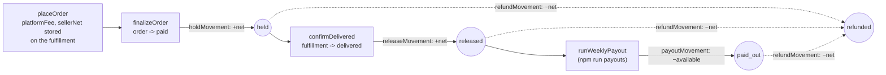
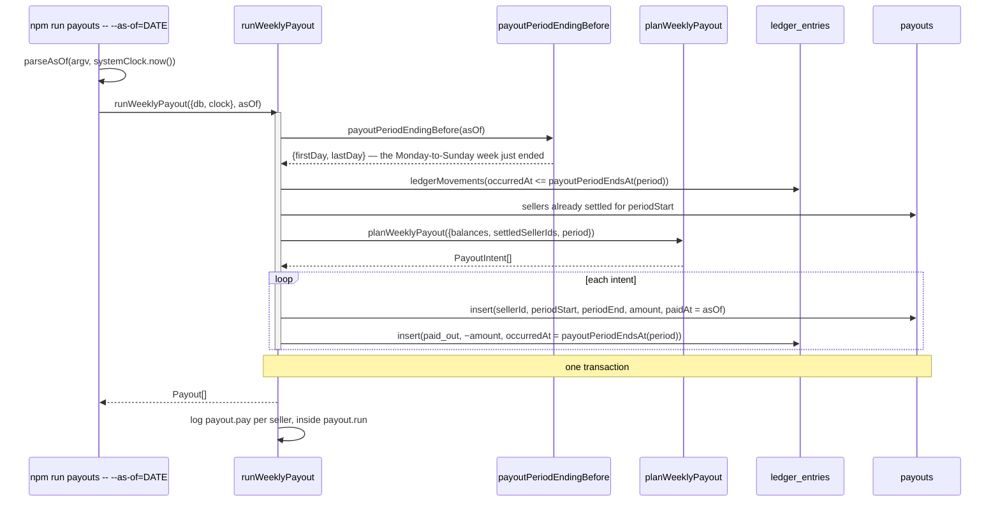

# Escrow and payouts

Per-seller money in `ledger_entries`, settled weekly into `payouts`. The
platform takes a 10% fee, priced once at order placement; the rest sits in
escrow until the customer confirms delivery, then waits for the next weekly
run.

Code: `app/core/escrow/`, `app/core/money.ts`,
`app/actions/orders/place-order.ts`, `app/actions/orders/finalize-order.ts`,
`app/actions/fulfillments/confirm-delivered.ts`,
`app/actions/escrow/run-weekly-payout.ts`,
`app/actions/escrow/ledger-movements.ts`,
`app/actions/escrow/seller-balance.ts`, `app/actions/refunds/issue-refund.ts`,
`app/cli/run-payouts.ts`.

Money is integer cents everywhere (`Cents`). `percentOfCents` is the only place
anything divides, and it rounds half away from zero so a fee and its reversal
land on the same amount. `formatCents` is the only place anything renders.

## Ledger entry types through hold → release → payout

Question: what writes each `ledger_entries.entry_type`, and what does each one
do to a seller's balance?

Caveats: `amount_cents` is signed. `held` and `released` are positive;
`paid_out` and `refunded` are negative, because `payoutMovement` and
`refundMovement` negate the amount — which is what lets `ledgerBalance` fold
the whole ledger by adding.

`ledgerBalance` walks the movements once. `held` adds to held; `released` moves
its amount from held to available; `paid_out` nets available down and adds to
paid out. A `refunded` entry reverses whichever bucket the money is actually
sitting in, which is why the fold reads `fulfillment_id`: a fulfillment that has
a `released` entry has already moved to available, so its refund comes out of
available; one that has not comes out of held.

Only a seller with `available > 0` (`isPayable`) gets a payout row. A `held`,
`released`, or `refunded` entry names the fulfillment that produced it; a
`paid_out` entry names the payout that settled it, and no fulfillment.

## The three refund timings

Question: where does a `refunded` entry land, and what happens when it lands
after the money is already gone?

| Timing                | Entries for that fulfillment                                   | Held | Available | Paid out |
| --------------------- | -------------------------------------------------------------- | ---- | --------- | -------- |
| Refund before release | `held +net`, `refunded −net`                                   | 0    | 0         | 0        |
| Refund after release  | `held +net`, `released +net`, `refunded −net`                  | 0    | 0         | 0        |
| Refund after payout   | `held +net`, `released +net`, `paid_out −net`, `refunded −net` | 0    | −net      | +net     |

A negative `available` is carried rather than clamped. `isPayable` is false
while it stands, so `planWeeklyPayout` writes no `paid_out` row for that seller
and no negative payout is ever sent — the next weeks' released sales net against
it until it comes back above zero, and only then does the seller get paid again.

The platform's fee on a reversed fulfillment is forgone, not clawed back:
`feeTotals` (`app/core/escrow/fee-totals.ts`) splits the fee on every settled
fulfillment into `earnedCents` for the live ones and `refundedCents` for the
declined and refunded ones, which `/admin` and `/admin/accounting` show side by
side.

The fee itself is never recomputed. `placeOrder` writes `fee_cents` and
`net_cents` onto each `fulfillments` row from `platformFee(subtotal)` and
`sellerNet(subtotal)` (`PLATFORM_FEE_PERCENT` is 10), and `finalizeOrder` and
`confirmDelivered` move that stored `net_cents` through escrow. A change to the
fee rate cannot re-price an order already placed.

## A payout run

Question: how does the weekly run turn released escrow into `payouts` rows, and
why is running it twice safe?

Caveats: the `paid_out` entry is dated at `payoutPeriodEndsAt(period)` —
`T23:59:59.999Z` of the period's last day — not the moment the run happens.
That is what makes a second run of the same period a no-op: the negative entry
is inside `occurred_at <= period end` on the next read, so the balance nets to
zero and `isPayable` is false. Timestamps here carry milliseconds, so the period
has to close after the last of them; second precision would leave a gap.
`payouts` also has a unique index on `(seller_id, period_start)`.

Who gets paid is decided in core. `planWeeklyPayout`
(`app/core/escrow/payout-plan.ts`) takes the balances, the sellers already
settled for this period, and the period itself, and returns a `PayoutIntent[]`;
the action reads rows, calls it, and writes what it returns. So there are two
independent reasons a second run pays nothing — the dated `paid_out` entry, and
a `payouts` row already standing for that `period_start`.

`runWeeklyPayout` takes `asOf` as an argument rather than reading a clock, so
the period is a pure function of what the caller passed. Without `--as-of` the
CLI passes `systemClock.now()`. The whole run is one transaction.

Two entry points call the same action: the CLI, and `POST /admin/payouts` on
the admin site. The seller portal shows a seller their balance and payout
history on `/seller/earnings` and offers no control that runs one.

| Way in            | Command                                              |
| ----------------- | ---------------------------------------------------- |
| CLI, current week | `npm run payouts` — settles the week that just ended |
| CLI, a named week | `npm run payouts -- --as-of=2026-08-24`              |
| Make              | `make payouts`, or `make payouts AS_OF=2026-08-24`   |
| Admin site        | `POST /admin/payouts` with an `as_of` field          |

## Worked example

One $100.00 listing, one unit, one seller, no other activity that period.
`placeOrder` prices it once: `platformFee(10000)` is `1000`,
`sellerNet(10000)` is `9000`, both stored on the `fulfillments` row.

| Step                      | Action                                     | Entry written               | Seller balance                              |
| ------------------------- | ------------------------------------------ | --------------------------- | ------------------------------------------- |
| Card approved             | `finalizeOrder` → `holdMovement(9000)`     | `held +9000`                | held $90.00, available $0.00, paid out      |
|                           |                                            |                             | $0.00                                       |
| Delivery confirmed        | `confirmDelivered` →                       | `released +9000`            | held $0.00, available $90.00, paid out      |
|                           | `releaseMovement(9000)`                    |                             | $0.00                                       |
| Payout run, period closed | `runWeeklyPayout` → `payoutMovement(9000)` | `paid_out −9000`            | held $0.00, available $0.00, paid out       |
|                           |                                            |                             | $90.00                                      |
| Same period run again     | `runWeeklyPayout`                          | none                        | unchanged                                   |
| Dispute upheld            | `issueRefund` → `refundMovement(9000)`     | `refunded −9000`            | held $0.00, available −$90.00, paid out     |
|                           |                                            |                             | $90.00                                      |
| Next period run           | `runWeeklyPayout`                          | none — `isPayable` is false | unchanged; the −$90.00 carries              |

Reading the third row through `ledgerBalance`: the per-type totals are `held`
9000, `released` 9000, `paid_out` −9000, so `heldCents = 9000 − 9000 = 0`,
`availableCents = 9000 + (−9000) = 0`, and `paidOutCents = −(−9000) = 9000`.
The platform keeps the $10.00 difference, which `platformMoney` on
`/admin/accounting` sums from `fulfillments.fee_cents` over fulfillments that
have a `held` entry — so an unpaid order's fee is not counted and the figure
reconciles with the ledger. The last two rows give the $10.00 back: the
fulfillment is `refunded`, so its fee moves out of `feesEarnedCents` and into
`feesRefundedCents`.

A multi-seller order behaves as several of these side by side: one fulfillment,
one fee, and one `held` entry per seller, each releasing when that seller's own
fulfillment is confirmed delivered.
