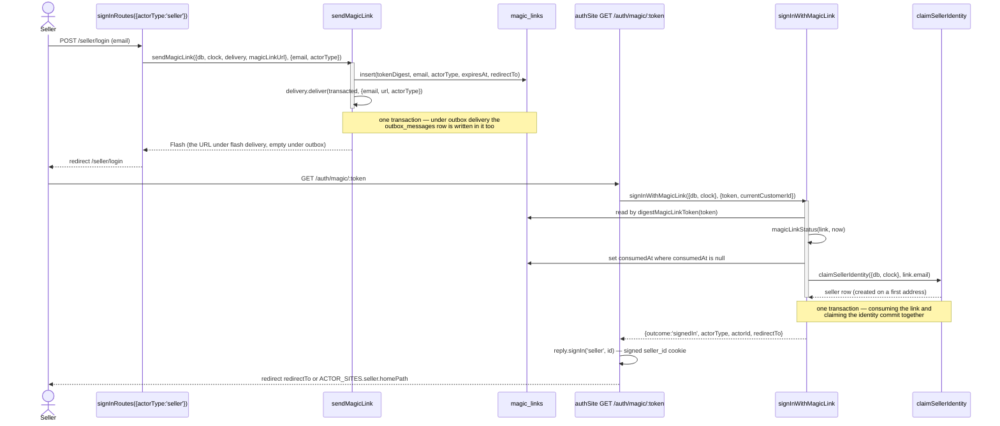
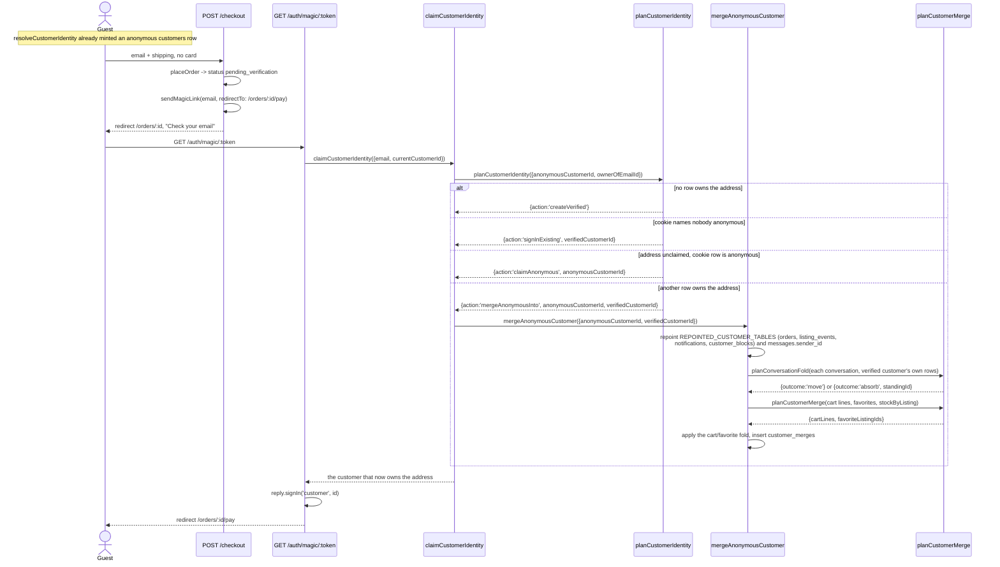
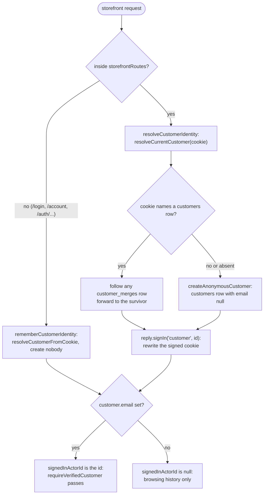

# Identity

Passwordless sign-in for all three sides of the marketplace, plus the anonymous
customer row the storefront hangs favorites, carts, guest orders, and listing
questions on before anyone gives an address.

Code: `app/core/auth/`, `app/core/customers/`, `app/actions/auth/`,
`app/actions/customers/`, `app/plugins/identity.ts`,
`app/sites/auth/sign-in-routes.ts`, `app/sites/auth/index.ts`.

One `magic_links` row serves every actor type. `actor_type`
(`seller` | `customer` | `admin`) is what tells `/auth/magic/:token` which side
it is signing in, so the link itself carries the routing and no site owns the
verification page.

| Actor | Cookie | Sign-in creates a row? |
| --- | --- | --- |
| Seller | `seller_id` | Yes — `claimSellerIdentity` on the first link for an address. |
| Customer | `customer_id` | Yes — but on the first storefront request, not at sign-in. |
| Admin | `admin_id` | No. `admins` rows are seeded; `adminSite` passes `admits`, so an unseeded address is never sent a link. |

All three cookies are signed, `httpOnly`, `sameSite=lax`, and last a year
(`app/plugins/identity.ts`). They are independent, so one browser can be all
three at once.

`POST /login` on every site and guest checkout's implicit link sit behind the
`magic_link_request` limit (`RATE_LIMIT_MAGIC_LINK_REQUEST`, default `5/15m`),
keyed by the lowercased address and, separately, the client ip — either can
trip it. `GET /auth/magic/:token` sits behind `magic_link_consume`
(`RATE_LIMIT_MAGIC_LINK_CONSUME`, default `20/15m`), keyed by client ip. A trip
answers `429` before either route's own logic runs, so a tripped sign-in
writes no `magic_links` row. `app/plugins/rate-limit.ts`; `docs/alignment.md`
§3.

## Seller magic-link sign-in

Question: what happens between a seller submitting an email and landing on the
dashboard?

Caveats: the token itself is never stored — only `digestMagicLinkToken` of it
(sha256 hex), so the moment inside `sendMagicLink` is the only time it exists.
A link lasts `MAGIC_LINK_LIFETIME_MINUTES` (15). One use is enforced by the
UPDATE's `consumed_at is null` clause and the row count it returns, not by the
read before it, so two requests arriving together cannot both spend a link.
`magicLinkStatus` answers `usable` | `expired` | `consumed`; a refusal names the
`actorType`, which is how `/auth/magic/:token` sends the visitor back to the
right sign-in page. An unknown token has no actor type and falls back to the
storefront's.

Delivery is a port with two implementations, chosen by `MAGIC_LINK_DELIVERY`
(`flash` | `outbox`) through `selectMagicLinkDelivery`. `flashMagicLinkDelivery`
returns a `Flash` carrying `debugMagicLink`, which every layout prints through
`app/views/partials/debug-alert.ejs`. `outboxMagicLinkDelivery` returns an empty
flash and enqueues a row in `outbox_messages` **inside `sendMagicLink`'s own
transaction**, so a link and the row that carries it are written together or not
at all; the reader finds it on `/admin/outbox`, or as an `.eml` file after
`npm run outbox`. A production boot refuses `flash`, because it prints the link
into the page that asked for it. There is no SMTP; a real transport is a third
implementation of the same port.

## Guest verification, folding the anonymous row in

Question: when a guest verifies an address after checkout, which customer row
ends up owning the order, and what happens to the anonymous one?

Caveats: the order was placed by the anonymous row, so the merge is what carries
it across — `orders` is one of `REPOINTED_CUSTOMER_TABLES`, alongside
`listing_events`, `notifications`, and `customer_blocks` (a block follows the
person, not the cookie). `messages.sender_id` re-points too, where
`sender_type = 'customer'` — it holds a customer id with no foreign key to lean
on, since the same column holds a seller's or an admin's id depending on
`sender_type`.

Carts, favorites, and conversations are deliberately **not** in
`REPOINTED_CUSTOMER_TABLES`: a blind repoint would leave the verified customer
with two of the row a fold instead collapses into one.
`customer-owned-tables-manifest.test.ts` reads the schema itself — every table
with a `customer_id` column — and fails if one is not in
`REPOINTED_CUSTOMER_TABLES`, `FOLDED_CUSTOMER_TABLES`, or
`LEFT_BEHIND_CUSTOMER_TABLES` (`app/actions/customers/repointed-customer-tables.ts`),
so a new customer-owned table has to be classified before it can merge silently
wrong.

`planCustomerMerge` sums cart quantities per listing, clamps each to the
listing's stock, drops anything that lands at zero, and de-duplicates
favorites; `mergeAnonymousCustomer` applies the result with UPDATEs and DELETEs
only, never an INSERT, so it needs no knowledge of columns it is not touching.
Conversations fold through `planConversationFold`
(`app/core/customers/conversation-fold-plan.ts`): a thread the verified
customer holds no match for is re-pointed in place (`customer_id` and
`subject_key` move together, since the key names the participant); a thread on
a subject the verified customer already has a thread for is absorbed into that
standing thread instead — its messages move onto the standing thread by
`conversation_id` alone, which is what leaves each message's own `read_at`
untouched, the now-empty duplicate is deleted, and the standing thread's
`last_message_at` is read back as the newest `sent_at` across the merged
messages rather than carried over. This is the same shape `docs/messaging.md`'s
`subject_key` section describes for an ordinary open — one thread per subject
survives a merge the same way it survives two concurrent opens.

Every statement goes through the typed Kysely builder, so a renamed table or
column stops compiling. The anonymous row is never deleted — the
`customer_merges` row (unique on `anonymous_customer_id`) is what lets a stale
cookie on another device resolve forward. `customer_merges.customer_id` is the
one column the manifest test finds and deliberately leaves untouched, named in
`LEFT_BEHIND_CUSTOMER_TABLES`: it is the trail record of the merge itself, so
re-pointing it on a later merge would erase what it exists to remember.
`customer_merges.anonymous_customer_id` is not a column literally named
`customer_id`, so it sits outside the manifest's schema scan entirely — the
same position `messages.sender_id` is in, and left alone for its own reason
just as `sender_id` is repointed for its own.
`claimCustomerIdentity` also settles a guest's `email_verified_at` when
checkout left an address on the row without verifying it, and leaves an
earlier verification alone.

`planCustomerIdentity` is a discriminated union rather than a record of four
nullable ids, so each branch of the switch reads exactly the ids that case has
and the action needs no null assertions.

## Which customer a storefront request resolves to

Question: given a request, who is `request.currentCustomer`, and when is a row
created?

Caveats: `resolveCustomerIdentity` runs as a `preHandler` on
`storefrontRoutes` only. Asking for a sign-in link must not mint a row, so
`signInRoutes` is registered as a sibling of that plugin and adds
`rememberCustomerIdentity` to itself — Fastify's encapsulation keeps the
creating hook out. `/auth/magic/:token` reads the cookie the same way, through
`identityCookieValue` and `resolveCustomerFromCookie`, so a seller clicking a
seller link cannot leave a customer row behind. Rewriting the cookie on every
storefront request is what rolls a merged id forward.

The cookie alone is a browsing history. `signedInActorId(request, 'customer')`
counts a customer as signed in only once `email` is set
(`isVerifiedCustomer`), which is what `requireVerifiedCustomer` guards
`/account`, `/orders/:id/pay`, and `POST /account/notifications/:id/read` with.
A customer signing out lands on `/` (`ACTOR_SITES.customer.signedOutPath`) and
the next request hands them a fresh anonymous identity.

## Non-revealing admin sign-in

`signInRoutes({actorType, admits?, accountView?})` (`app/sites/auth/sign-in-routes.ts`)
takes an optional `admits` predicate; only `adminSite` passes one, since admin
rows are seeded rather than opened to anyone who asks. A probe for who runs the
platform must learn nothing from the response, so `admits` refusing an address
answers exactly the way an admitted address does: the same `notice` flash
(`Sign-in link sent to <email>.`), the same redirect to `site.loginPath`, the
same status. `SignInRoutesOptions` no longer accepts a `refusal` message —
one existed before this, and a distinct string was the leak. The one place
this still differs is `debugMagicLink`: under `MAGIC_LINK_DELIVERY=flash`
there is no link to print for a refused address, so the debug bar shows
nothing where an admitted address would show one. That is a development-only
surface (`showsDebugMagicLinks` is `false` outside it, and a production boot
already refuses `flash` delivery — see the delivery paragraph above), not a
gap in the production-facing response `docs/alignment.md` §7 decision 3 cares
about; `sign-in-routes.test.ts` pins the byte-identical case under
`outboxMagicLinkDelivery`, where neither branch prints anything.

`admits` still runs before `sendMagicLink`, so an admitted and a refused
request do genuinely different work — one extra indexed `SELECT` against
`admins` either way, one `INSERT` and a delivery call only when admitted. That
timing difference is not equalised: this is a demo-grade prototype, PHP's own
non-revealing test (`IMPRV-002`, `prototype/php`) asserts response bodies are
identical and says nothing about timing either, and closing a timing side
channel would mean doing constant, dummy work on every refusal — machinery
disproportionate to what a prototype's sign-in page defends. A refusal still
writes one line server-side, `magic_link.request` `refused` at `info` with
`reason: 'not_admitted'` and a `redactedEmail` digest in place of the address
(`docs/alignment.md` §2.1) — a log line is not a response, so it carries no
authority over what the requester sees.

## Cross-site redirect refusal

`redirect_to` rides three paths: the sign-in form (`keepLocalRedirect` in
`GET/POST /login`), the magic link itself (stored on `sendMagicLink`, read
back on `GET /auth/magic/:token`), and a handful of admin/seller actions that
carry a return path (`moderation.ts`, `fulfillments.ts`, `faqs.ts`). Every one
of them used to check only that the target stayed on this origin —
`keepLocalRedirect`/`resolveLocalRedirect` (`app/core/auth/local-redirect.ts`)
— which let a seller-site sign-in's `redirect_to=/admin/...` pass, since
`/admin/...` is on-origin too.

`allowsPath(actorType, path)` (same file) closes that: a pure lookup, borrowed
from PHP's `ActorType::allowsPath` (`prototype/php`), naming the path prefixes
each actor type holds no guard for —

| Actor | Refused |
| --- | --- |
| `seller` | `/admin` and anything under it |
| `customer` | `/seller` and `/admin`, and anything under either |
| `admin` | `/seller` and anything under it |

— so a seller may still be sent to `/orders/7` (no site owns that prefix) but
never to `/admin/orders`, and an admin may be sent to a customer path but
never a seller one. The path `allowsPath` checks comes from `pathOf` (same
file), which resolves the target through `URL` before the prefix check —
collapsing a `.`/`..` segment, including its percent-encoded form (`%2e`),
the same way a browser collapses one from a `Location` header before it
requests the redirected page — so `/./admin/orders` and
`/seller/../admin/orders` refuse exactly as `/admin/orders` does.
`keepLocalRedirect(requested, actorType, origin)` now
takes the actor alongside the origin and refuses a target `allowsPath` refuses,
on top of everything it already refused (control characters, `//`, `/\`, a
foreign host). Every call site names the actor already in scope: the site
being signed into for the sign-in form and the magic link's own
`sendMagicLink`, the actor who signed in for `GET /auth/magic/:token`
(`resolveLocalRedirect(signIn.redirectTo, {actorType: signIn.actorType, ...})`
in `app/sites/auth/index.ts`), and the fixed actor a moderation or fulfillment
route already runs behind. The check runs at both ends — refusing a
cross-site target when the sign-in form submits it, and again when the stored
link is consumed — so a `magic_links` row that reached the database holding
one some other way still cannot carry a visitor off their own site.

## CSRF tokens

`docs/alignment.md` §7 decision 3 adopts CSRF tokens on every POST form.
Node has no session store to hang a synchronizer token on, so the token is a
double-submit derived rather than stored: `csrfToken(sessionId, secret)`
(`app/core/security/csrf-token.ts`) is an HMAC-SHA256 of the browser's `sid`
cookie (`app/plugins/request-log.ts`, one per browser, unsigned, a year long)
under `COOKIE_SECRET` — the same secret that already signs the identity and
flash cookies. A page renders it as a hidden `_csrf_token` field
(`app/views/partials/csrf-field.ejs`), included from every `<form method="post">`
this app has; a same-origin submission carries the `sid` cookie back on its
own, so the server recomputes the same HMAC and compares it to the submitted
field (`isValidCsrfToken`, constant-time). A cross-site page cannot read the
victim's `sid` cookie to compute a matching value, and cannot guess one either,
since the secret never leaves the server — the whole defence needs no cookie
beyond the one `sid` already is.

`csrfProtection` (`app/plugins/csrf.ts`) is one `preValidation` hook —
registered inside each site (`admin`, `seller`, `shop`), not once at the root
— checked ahead of Fastify's own schema validation, which is what matters:
`submittedForm` (`app/http/request-schema.ts`) strips a field a route's
schema does not declare, so a token forgotten from a route's schema would
already be gone by the time a `preHandler` saw it. Checking any later than
`preValidation` would silently let such a request through; checking here, a
missing schema entry cannot matter, since the guard never looks past the raw
body Fastify parsed. It is registered per site rather than at the root because
`@fastify/multipart`'s `attachFieldsToBody` (the seller site's own image
upload) populates `request.body` through a `preValidation` hook of its own —
a hook the root adds always runs ahead of one a child registers, so registered
at the root the guard would run before multipart had attached anything at
all; registered inside seller's own site, after `multipart`, it runs once
multipart's hook already has. The guard covers POST, PUT, PATCH, and DELETE;
this app has no PUT, PATCH, or DELETE route today, so in practice every
state-changing request it protects is a POST. `csrf.test.ts`'s completeness
test reads the app's own route table (`onRoute`) rather than a hand-kept
list, and asserts every state-changing route answers 403 with no token unless
named, with why, in `csrf.ts`'s own allowlist — empty today, since every
state-changing route this app registers is a plain HTML form submission with
nowhere else a token could come from.

A missing, foreign, or stale token answers 403 in the requesting site's own
layout (`errorPageView`'s `FORBIDDEN` branch, `app/plugins/error-pages.ts`) —
the same `error.ejs` a 429 or a 500 renders, so a rejected submission reads
like the rest of the app rather than a bare status code.
