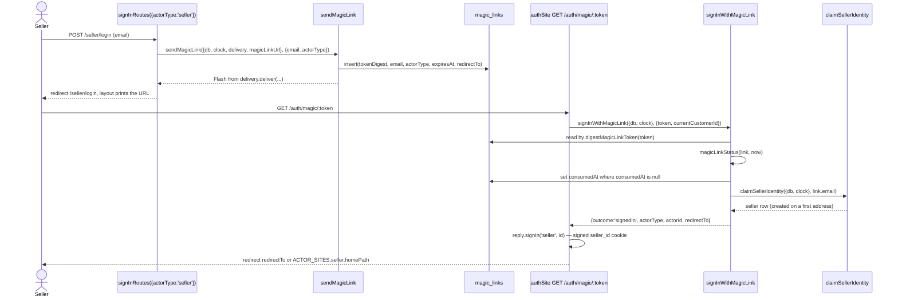
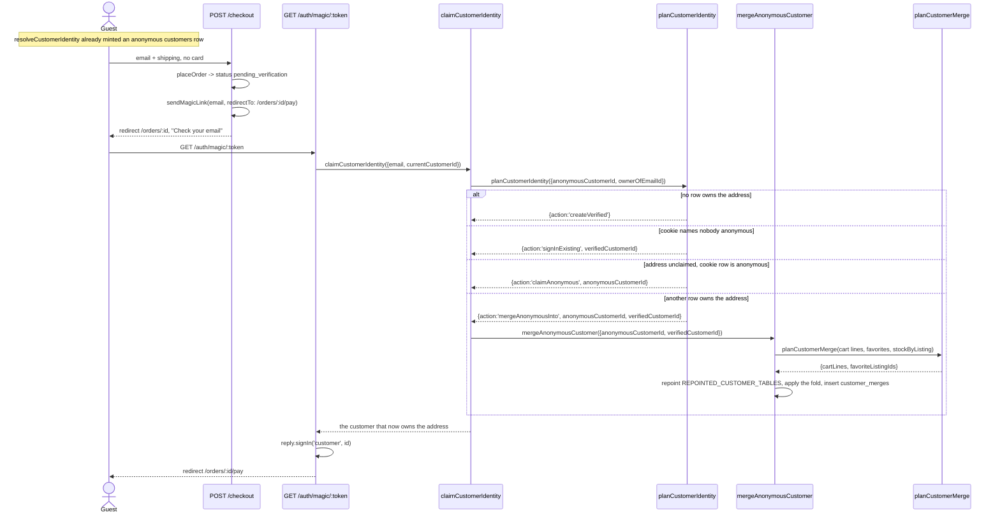

# Identity

Passwordless sign-in for all three sides of the marketplace, plus the anonymous
customer row the storefront hangs favorites, carts, guest orders, and listing
questions on before anyone gives an address.

Code: `app/core/auth/`, `app/core/customers/`, `app/actions/auth/`,
`app/actions/customers/`, `app/plugins/identity.ts`,
`app/sites/auth/sign-in-routes.ts`, `app/sites/auth/index.ts`.

One `magic_links` row serves every actor type. `actor_type`
(`seller` | `customer` | `admin`) is what tells `/auth/magic/:token` which side
it is signing in, so the link itself carries the routing and no site owns the
verification page.

| Actor | Cookie | Sign-in creates a row? |
| --- | --- | --- |
| Seller | `seller_id` | Yes — `claimSellerIdentity` on the first link for an address. |
| Customer | `customer_id` | Yes — but on the first storefront request, not at sign-in. |
| Admin | `admin_id` | No. `admins` rows are seeded; `adminSite` passes `admits`, so an unseeded address is never sent a link. |

All three cookies are signed, `httpOnly`, `sameSite=lax`, and last a year
(`app/plugins/identity.ts`). They are independent, so one browser can be all
three at once.

## Seller magic-link sign-in

Question: what happens between a seller submitting an email and landing on the
dashboard?

Caveats: the token itself is never stored — only `digestMagicLinkToken` of it
(sha256 hex), so the moment inside `sendMagicLink` is the only time it exists.
A link lasts `MAGIC_LINK_LIFETIME_MINUTES` (15). One use is enforced by the
UPDATE's `consumed_at is null` clause and the row count it returns, not by the
read before it, so two requests arriving together cannot both spend a link.
`magicLinkStatus` answers `usable` | `expired` | `consumed`; a refusal names the
`actorType`, which is how `/auth/magic/:token` sends the visitor back to the
right sign-in page. An unknown token has no actor type and falls back to the
storefront's. `flashMagicLinkDelivery` returns a `Flash` carrying
`debugMagicLink`, which every layout prints through
`app/views/partials/debug-alert.ejs`; `mailMagicLinkDelivery` throws
`NotImplementedError`.

## Guest verification, folding the anonymous row in

Question: when a guest verifies an address after checkout, which customer row
ends up owning the order, and what happens to the anonymous one?

Caveats: the order was placed by the anonymous row, so the merge is what carries
it across — `orders` is one of `REPOINTED_CUSTOMER_TABLES` (with
`listing_events`, `notifications`, and `conversations`). Carts and favorites are
deliberately **not** in that list: re-pointing a cart would leave the verified
customer with two, so they are folded instead. `planCustomerMerge` sums cart
quantities per listing, clamps each to the listing's stock, drops anything that
lands at zero, and de-duplicates favorites; `mergeAnonymousCustomer` applies the
result with UPDATEs and DELETEs only, never an INSERT, so it needs no knowledge
of columns it is not touching. Every statement goes through the typed Kysely
builder, so a renamed table or column stops compiling. The anonymous row is
never deleted — the `customer_merges`
row (unique on `anonymous_customer_id`) is what lets a stale cookie on another
device resolve forward. `claimCustomerIdentity` also settles a guest's
`email_verified_at` when checkout left an address on the row without verifying
it, and leaves an earlier verification alone.

`planCustomerIdentity` is a discriminated union rather than a record of four
nullable ids, so each branch of the switch reads exactly the ids that case has
and the action needs no null assertions.

## Which customer a storefront request resolves to

Question: given a request, who is `request.currentCustomer`, and when is a row
created?

Caveats: `resolveCustomerIdentity` runs as a `preHandler` on
`storefrontRoutes` only. Asking for a sign-in link must not mint a row, so
`signInRoutes` is registered as a sibling of that plugin and adds
`rememberCustomerIdentity` to itself — Fastify's encapsulation keeps the
creating hook out. `/auth/magic/:token` reads the cookie the same way, through
`identityCookieValue` and `resolveCustomerFromCookie`, so a seller clicking a
seller link cannot leave a customer row behind. Rewriting the cookie on every
storefront request is what rolls a merged id forward.

The cookie alone is a browsing history. `signedInActorId(request, 'customer')`
counts a customer as signed in only once `email` is set
(`isVerifiedCustomer`), which is what `requireVerifiedCustomer` guards
`/account`, `/orders/:id/pay`, and `POST /account/notifications/:id/read` with.
A customer signing out lands on `/` (`ACTOR_SITES.customer.signedOutPath`) and
the next request hands them a fresh anonymous identity.
