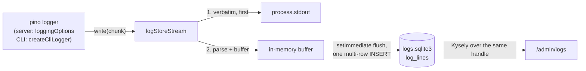

# Log store

Every JSON line the prototype logs — server and CLI runs alike — is also
written to a queryable SQLite store, and the admin site reads it back: a
filterable time series at `/admin/logs` and a per-request story view. Stdout
stays exactly as `docs/alignment.md` §2 specifies; the store is a mirror of
it. Lines older than a retention window are pruned by the sweep.

Code: `app/log-store.ts` (store, ingest stream, prune), `app/db/logs-schema.ts`,
`app/sites/admin/queries/log-rows.ts`, `app/sites/admin/routes/logs.ts`,
`app/sites/admin/views/logs.ejs`, `app/sites/admin/views/log-story.ejs`.

Three invariants govern the design:

1. **Stdout is canonical.** The ingest stream writes each chunk to stdout
   before anything else, byte for byte. Every other step is best-effort.
2. **The store is a mirror, a validator lives at the emitter.** It stores
   what was emitted — including lines it cannot parse and events added to the
   vocabulary after the DDL was written. The TypeScript const types on
   `logLine` are where the §2 vocabulary is enforced.
3. **The store's failure is never the app's failure.** Any store error
   degrades to stdout-only logging; no exception escapes the stream's
   `write()`.

## The second database

The store is its own SQLite file, opened on its own `DatabaseSync` handle.
`LOG_DATABASE_FILE` names it (default `storage/logs.sqlite3`, beside the
commerce file; the runtime image pins it beside `production.sqlite3` in the
same `storage/` directory; `off` disables the store). Log history shares
the commerce database's durability: on a host with no persistent disk —
the free Render tier — both reset on deploy, and that is accepted for the
prototype.
Two hazards make the separate file load-bearing rather than tidy:

- A log INSERT on the commerce connection issued inside `begin immediate`
  joins the business transaction — a rollback would erase the very `failed`
  line that explains it.
- `make fresh` deletes the commerce file. Log history survives a rebuild;
  retention is the one sanctioned way log rows die.

Schema creation is ensure-on-open, versioned by `PRAGMA user_version` — the
Kysely migrator belongs to the commerce database and its migrations
directory admits nothing else. On open: `journal_mode = WAL`,
`synchronous = NORMAL`, `busy_timeout = 250` (a contended flush must fail
fast and re-buffer; the commerce 5000ms would stall the event loop), and
when `user_version < 1`, inside `BEGIN IMMEDIATE`: `auto_vacuum =
INCREMENTAL`, the DDL below, `user_version = 1`. `BEGIN IMMEDIATE` plus
`IF NOT EXISTS` makes a simultaneous server-and-CLI first boot safe: one
process bootstraps, the other waits out the busy timeout and no-ops. A file
whose `user_version` is ahead of the code, or any open failure (missing
directory, disk full, corrupt file), disables the store for that process:
the app boots, one `app.log` warn line goes to stdout, and the stream
becomes a passthrough.

The server process holds one logs handle: the ingest writer uses it through
prepared statements, and the admin reader wraps the same handle in a
`Kysely<LogsDatabase>` via `NodeSqliteDialect`, which accepts an existing
`DatabaseSync` for exactly this. One handle means reads and the batch writer
serialize instead of racing, and a test's `:memory:` store is visible to
both sides.

## Table

One table, `log_lines`:

```sql
CREATE TABLE IF NOT EXISTS log_lines (
  id          INTEGER PRIMARY KEY,  -- rowid: arrival order, the tiebreak within one ts millisecond
  ts          TEXT NOT NULL,        -- the line's ts; receive time when the line would not parse
  level       TEXT,
  event       TEXT,
  phase       TEXT,
  msg         TEXT,
  request_id  TEXT,
  session_id  TEXT,
  actor_type  TEXT,
  actor_id    TEXT,
  txn_id      TEXT,
  duration_ms INTEGER,
  data        TEXT,                 -- JSON text of the line's data, NULL when absent
  error       TEXT,                 -- JSON text of the line's error, NULL when absent
  raw         TEXT NOT NULL         -- the stdout line, verbatim
);

CREATE INDEX IF NOT EXISTS log_lines_ts         ON log_lines (ts);
CREATE INDEX IF NOT EXISTS log_lines_event_ts   ON log_lines (event, ts);
CREATE INDEX IF NOT EXISTS log_lines_level_ts   ON log_lines (level, ts);
CREATE INDEX IF NOT EXISTS log_lines_request_id ON log_lines (request_id) WHERE request_id IS NOT NULL;
CREATE INDEX IF NOT EXISTS log_lines_txn_id     ON log_lines (txn_id)     WHERE txn_id     IS NOT NULL;
CREATE INDEX IF NOT EXISTS log_lines_actor_id   ON log_lines (actor_id)   WHERE actor_id   IS NOT NULL;
```

Field-to-column mapping: the eleven §2.1 payload fields map to the
same-named columns; `data` and `error` are stored re-serialized as JSON
text; everything else on the line (`pid`, `hostname`, any future extras)
is reachable through `raw`. A line that fails `JSON.parse` is stored as
`raw` plus a receive-time `ts` with every other column NULL — mirror, per
invariant 2.

Three deliberate departures from the commerce-table idiom, each an
application of invariant 2:

- **Rowid primary key.** Log rows are telemetry: nothing references them,
  no URL carries their id (the story view keys on `request_id`), and the
  rowid gives `ORDER BY ts, id` its tiebreak with zero minting on the write
  path. This is a stated exception to alignment §1, the way §1 already
  excepts the `request_id` UUID.
- **No CHECK constraints from the vocabularies.** A CHECK would refuse —
  that is, lose — the first line of any event added to §2.3 before this DDL
  catches up. The viewer's zod selects still answer 400 for an unrecognised
  filter value.
- **Nullable mirror columns.** §2.1 marks most fields conditional, and a
  malformed line still gets a row.

Stored `raw` is capped at 64 KiB; the mirrored columns are extracted from
the full line first, so a pathological payload loses tail bytes of `raw`
and keeps its queryable facts.

## Ingest



The stream is a `pino.DestinationStream` — `{ write(chunk) }` — installed as
the default destination at the two choke points every line flows through:
`loggingOptions` (the server) and `createCliLogger` (every CLI). One edit
covers migrate, seed, drain-outbox, payouts, and the sweep, and any CLI
added later; a test that injects `loggerStream` keeps exactly the stream it
injected.

`write(chunk)`, in order, with the whole body guarded so nothing propagates
to pino:

1. `process.stdout.write(chunk)` — invariant 1.
2. Split on newlines, carrying a trailing partial in a remainder buffer.
3. Parse each line and push its column values onto the buffer; a parse
   failure pushes the malformed-line row instead.
4. Schedule a flush with `setImmediate` when the buffer goes from empty to
   non-empty; flush immediately at 256 buffered lines.

The flush is one `BEGIN IMMEDIATE`, one prepared multi-row INSERT, one
`COMMIT` — one WAL append for the batch, off the request path. pino calls
`write()` synchronously, so an unbatched insert would put DB work — and up
to a full busy-timeout stall — inside every request; the macrotask flush
bounds that to one small insert per event-loop turn. On `SQLITE_BUSY` or
any other flush error the batch re-buffers for the next tick. The buffer is
capped at 10,000 lines; past the cap new lines are dropped from the store
(stdout still carried them) and one notice goes to stderr.

The store registers `process.once('exit', flushSync)` when it opens:
`DatabaseSync` is synchronous, so the final flush runs even in an `'exit'`
handler. That is what makes a fast-exiting CLI's last lines — `migrate.run
did`, `seed.run did` — survive without touching any CLI's own code. A
SIGKILL loses at most one macrotask of buffered lines from the store, with
stdout keeping them; WAL at `synchronous = NORMAL` keeps the file
uncorrupted.

The store never logs through pino — its own failures go to stderr (stdout
is the §2 surface) — so it cannot feed itself, per invariant 3. Level
policy stays where it lives: whatever `LOG_LEVEL` lets pino emit is stored,
`debug` included — `ledger.write` at `debug` is precisely the money trail
"what happened to this order?" needs. Retention bounds size; a second
level filter would make the mirror disagree with stdout.

## Viewer

Two GET routes inside `adminConsoleRoutes`, behind the existing
`requireAdmin` guard.

`GET /admin/logs` — the time series, newest first (`ts desc, id desc`),
50 rows per page through `listPage`, filters carried through the pager by
`filterQuery`. Filters follow the console's rules — empty means all,
unrecognised answers 400 — and split by value space:

- selects, built from the const arrays: `level`, `phase`, `event`;
- text inputs, equality on indexed or mirrored columns: `request`, `txn`,
  `session`, `actor`;
- `msg` — substring match (`LIKE`, escaped); a scan, fine at a
  retention-bounded table's size;
- `from` / `to` — ISO instants, compared lexically against `ts` (fixed
  ISO-8601 UTC text sorts chronologically), labelled UTC in the form;
- `key` / `value` — the any-attribute filter, below.

The page opens with four stat tiles (Errors / Warnings / Info / Debug)
tallied over the current filter set minus `level`; each tile links to the
same query with `level` set, so the tiles double as the level filter's fast
path. Rows show `ts` (full ISO — milliseconds matter here), level, `event ·
phase`, the `msg` with its §2.4 emoji intact, `request_id` linked to the
story view, the actor, and `duration_ms`. A row whose `data` or `error` is
present discloses it in a `<details>` block — the page works with
JavaScript absent, like every admin page. A live tail is out of this cut;
the newest-first list plus a browser refresh covers it, and the sanctioned
future upgrade is client-side polling of the same filtered URL rather than
a stream.

### The any-attribute filter

`?key=<path>&value=<text>` filters on any attribute of the stored line.
The key is a dotted identifier path (`^[A-Za-z0-9_]+(\.[A-Za-z0-9_]+){0,3}$`,
400 otherwise) compiled to a JSON path with every segment quoted
(`data.order_id` → `$."data"."order_id"`) and executed against `raw`:

```sql
WHERE json_extract(log_lines.raw, ?) = ?
```

Path and value are both bound parameters. Running against `raw` gives one
code path for `data.*`, `error.*`, and top-level extras like `pid`. Three
refinements:

- A key naming a mirrored column (`event`, `request_id`, …) short-circuits
  to the column equality, so the indexes serve it.
- `key` without `value` is an existence filter
  (`json_extract(...) IS NOT NULL`) — "every line that names a
  `data.refund_id`".
- A numeric-looking value compiles to `IN (<text>, <number>)`, matching a
  JSON number and a string that looks like one; `json_extract` returns
  SQLite-typed values, so binding both sides beats casting. Booleans
  compare as `1`/`0`.

The filter scans within whatever the other filters bound. Retention keeps
the table small enough that this measures in milliseconds; if one path ever
becomes hot, the escape hatch is a stored generated column plus index.

### The story view

`GET /admin/logs/requests/:requestId` renders one request's lines in
`ts asc, id asc` order, capped at 1,000 with a visible notice: a header
with first/last timestamps, line count, the root `did` line's
`duration_ms`, and the session and actor from the first line carrying them;
then each line with its emoji `msg` prominent, level badge, `event ·
phase`, and its `data`/`error` fully expanded — a founder on this page
wants everything open. A well-formed id with no stored lines renders the
empty state at 200 ("outside the retention window?") — a request id is
correlation, and the 404 rule in alignment §5 covers ownership. A
malformed id is a url segment the route's `params` schema refused, and
answers the site's 404 page the way every refused segment does. The
transaction story needs no second route: `?txn=` on the list is the same
lines.

Prefixed ids rendered anywhere in the viewer link where a detail page
exists — `ord_` to `/admin/orders/:id`, `cus_`, `sel_`, `lst_`, `ful_`,
`obx_`, `cnv_` likewise; `txn_` and `ses_` link back into `/admin/logs`
as filters — one pure helper mapping prefix to route, drawn from the
pages table in [`admin.md`](admin.md) so a link never 404s. A `msg_` id
renders plain: messages have no detail page of their own.

## Retention

`LOG_RETENTION_DAYS` (default `14`, `off` disables, malformed refuses boot
— the §3 shape). The prune runs inside the existing sweep CLI beside the
rate-limit-window prune it copies: silent, `--as-of` honoured (cutoff =
as-of minus the window), a failure sets the exit code and leaves the
stale-order sweep's result standing. The delete runs in bounded batches —

```sql
DELETE FROM log_lines
WHERE id IN (SELECT id FROM log_lines WHERE ts < ? LIMIT 5000)
```

— looped until no rows change, so the write lock is held for milliseconds
per batch and a concurrently flushing server re-buffers at most one tick.
The sweep ends with `PRAGMA incremental_vacuum(1000)` to hand pages back
(the bootstrap's `auto_vacuum = INCREMENTAL` is what makes that work).
Fourteen days answers "what happened to this order?" after a long weekend
and bounds every scanning filter. The schema's upgrade path is the same
mechanism: every row is expendable by design, so evolving the DDL means
bumping `user_version` in `ensureLogSchema`, and the escape hatch for a
mismatched file is deleting it.

## Testing

The stream and store test in-process against `:memory:` — passthrough
order (stdout before parsing, and on every failure), the §2.1 field
mapping, the malformed-line row, batch flush and `flushSync`, re-buffer on
a closed handle, bootstrap idempotence, the disabled-store degradations.
The viewer tests ride `buildTestApp` with an in-memory store shared by
writer and `logsDb` reader, `signInAsAdmin`, and the `data-cell` marker
idiom; the filter matrix (each filter narrows, round-trips, 400s) lives in
query-module tests mirroring `order-rows.test.ts`. Retention tests mirror
the rate-limit prune's.

## Alignment

This store and viewer are additions to the cross-prototype contract:
`docs/alignment.md` gains a §2.5 naming this document as the reference
definition (store every stdout line, the column mapping, the rowid
exception to §1, `LOG_DATABASE_FILE` / `LOG_RETENTION_DAYS`) and §5 rows
for `/admin/logs` and the story route. The amendment lands with the final
phase, once the behaviour it fixes is real; PHP and Rails then owe the same
store and pages.
