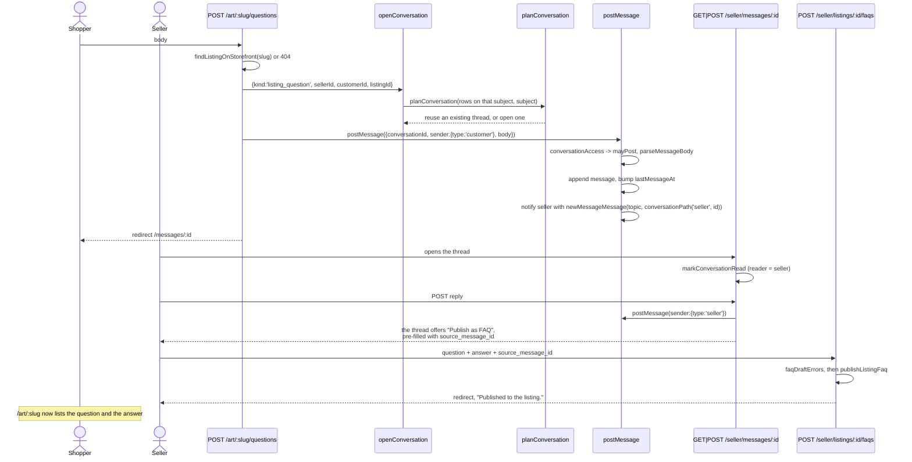
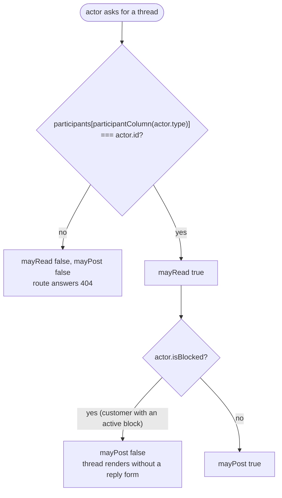
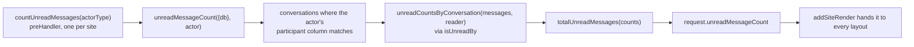

# Messaging

One conversation model serves every pairing on the marketplace, and one of the
four kinds carries the product feature that pays for it: a customer's question
on a listing, answered by the seller, published as an FAQ entry the whole
storefront can read.

Code: `app/core/messaging/`, `app/actions/messaging/`,
`app/plugins/unread-messages.ts`, `app/sites/shop/routes/messages.ts`,
`app/sites/seller/routes/messages.ts`, `app/sites/seller/routes/faqs.ts`,
`app/sites/admin/routes/messages.ts`. Tables:
`app/db/migrations/20260823000008-create-messaging.ts`.

Four tables would repeat the same message store four times, so there is one:
`conversations.kind` says which two participant columns are filled and which
subject column, if any, names what the thread is about
(`KIND_SHAPES` in `conversation-kind.ts`).

## Conversation kinds

| `kind` | Participants | Subject column | Opened by |
| --- | --- | --- | --- |
| `admin_seller` | `adminId` ↔ `sellerId` | — | `GET /seller/support`, `POST /admin/sellers/:id/messages` |
| `admin_customer` | `adminId` ↔ `customerId` | — | `GET /support`, `POST /admin/customers/:id/messages` |
| `fulfillment` | `sellerId` ↔ `customerId` | `fulfillmentId` | `POST /seller/orders/:id/messages`, `POST /orders/:id/fulfillments/:fulfillmentId/messages` |
| `listing_question` | `sellerId` ↔ `customerId` | `listingId` | `POST /art/:slug/questions` |

Every kind has exactly two participants. That is the invariant the rest of the
design rests on: one `read_at` per message is unambiguous, because the reader is
always the participant who did not send it.

Each site reads the same threads through its own paths — `/messages`,
`/seller/messages`, `/admin/messages` for the inbox, and `.../messages/:id` for
one thread. `conversationPath(actorType, id)` and `inboxPath(actorType)` are
core functions, because `postMessage` needs the *recipient's* path for the
notification URL and each site needs its own for links.

Both support routes open the thread against **the first admin by id**. Admin
rows are seeded and this prototype has no assignment model; with no admin row at
all the route flashes and goes back rather than opening a half-formed thread.

## A question becomes a published FAQ

Question: what runs between a shopper asking about a listing and that answer
appearing on the listing page for everyone?

Caveats: an **anonymous** customer can ask — the question route sits inside
`storefrontRoutes` with no verified-customer guard, so the row the identity hook
minted is the participant. If that visitor later verifies an address,
`conversations` is one of `REPOINTED_CUSTOMER_TABLES` and the thread moves with
them.

Find-or-open is `planConversation`, a pure match over the rows that already
carry the same kind and the same five id columns — the same shape as the
identity plan. The action narrows in SQL and the plan decides, so "one thread
per subject" has a single definition and "message this seller" reaches the same
place every time.

A `listing_faqs` row exists **only while it is published**. `published_at` is
`not null`, unpublishing deletes the row, and the storefront reads the table
with no predicate of its own. There is no draft state and no fourth route,
because re-publishing is one click from the thread the answer came from, which
is still there. `source_message_id` records which answer an entry was lifted
from. The seller can also edit (`POST /seller/listings/:id/faqs/:faqId`) or
unpublish (`.../unpublish`) from `/seller/listings/:id/faqs`.

`messageBodyError` caps a message at `MESSAGE_BODY_MAX_LENGTH` (2000);
`faqDraftErrors` caps a question at 500 and an answer at 2000.

## Who may read, who may post

Question: given an actor and a conversation, what is that actor allowed to do?

Caveats: `conversationAccess` (`app/core/messaging/conversation-access.ts`)
answers both questions in one pure call over the conversation's participant
columns and the actor. Reading is being named in the column for your side;
posting is that plus standing. Only a customer can carry `isBlocked` —
`conversationActor` fills it in from `activeCustomerBlock` and skips the read
for a seller or an admin.

`postMessage` enforces the predicate rather than re-deciding it, so all three
sites refuse a blocked sender with the same words ("This account is blocked and
cannot send messages."). The block is refused by the action, not by a
`preHandler`: `refuseBlockedCustomer` exists for the paths that buy something
and sends the visitor to a page that fits, while a message refusal belongs with
the message rules.

A thread the actor is not in answers 404, not 403 — the reply routes read the
thread through `conversationThread` before posting, which is what turns "not
yours" into "not found" without the route holding the rule. A non-numeric id
answers 404 the same way.

## Unread counts

Question: where does the number on every layout's Messages link come from?

Caveats: `isUnreadBy` is the single definition — a message is unread for a
reader when `readAt` is null and that reader did not send it. The same fold
feeds the per-thread badge in an inbox row (`inboxConversations` returns
`unreadCount` per conversation) and the total in the nav, so the two cannot
disagree, and `markConversationRead` filters through it as well rather than
repeating the rule in SQL.

The count rides on the request rather than being fetched by each route, for the
same reason the flash and the identity do: a layout has to render it on every
page, including pages that require nobody. The storefront's resolver reads the
`customer_id` cookie itself through `identityCookieValue` and
`resolveCustomerFromCookie`, so `/account` and `/login` — which sit outside the
hook that resolves a customer — still count without minting a row.
