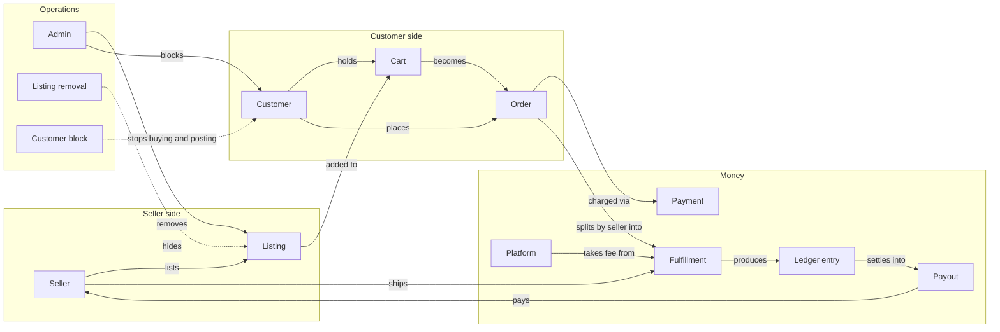

# Domain ontology

A three-sided marketplace for hand-made art. **Sellers** list one-of-a-kind or
limited-quantity pieces; **customers** browse, ask about, and buy them;
**admins** operate the platform — moderating what is on sale and who may shop,
running payouts, and reading traffic. Payment is captured at checkout but held
in escrow per seller until the customer confirms delivery, then settled into a
weekly payout.

Question: what are the entities in the product, and how does value move between
them at the concept level? (Table-level shape:
[`data-model.md`](data-model.md). Sequences and state machines:
[`orders.md`](orders.md), [`escrow.md`](escrow.md),
[`identity.md`](identity.md), [`messaging.md`](messaging.md),
[`admin.md`](admin.md).)

Conversations run alongside all of this — every pairing on the diagram can hold
a thread — and the smaller supporting concepts (listing event, favorite, cart
item, order item, magic link, customer merge, notification, listing FAQ,
page-view count) sit off it. Each gets its own section below.

## Roles

### Seller

**Who/what.** A person or studio who lists art for sale and gets paid out.

**Why it exists.** Supplies the catalog; one side of the marketplace.

**Lifecycle.** None. A `sellers` row exists from first sign-in and does not
change state; `email_verified_at` is set the first time a magic link is spent.

**Relates to.** Owns Listings. Ships Fulfillments. Earns Ledger entries and
receives Payouts. Receives Notifications. Joins `admin_seller`, `fulfillment`,
and `listing_question` Conversations.

**In code.** `SellerTable` (`sellers`), `claimSellerIdentity`,
`app/sites/seller/`.

### Customer

**Who/what.** A storefront visitor. Every visitor gets a row, verified or not.

**Why it exists.** Holds favorites, a cart, orders, and threads across a visit,
so browsing state survives before anyone gives an address.

**Lifecycle.** No status column, but a row passes through three conditions:
anonymous (`email` null) → guest with an unverified address (`email` set,
`email_verified_at` null, set by checkout) → verified (`email_verified_at`
set). `isAnonymousCustomer` and `isVerifiedCustomer` read the ends of it.

**Relates to.** Has Favorites, Carts, and Listing events. Places Orders.
Receives Notifications. May be blocked by a Customer block. Joins
`admin_customer`, `fulfillment`, and `listing_question` Conversations. May be
the source or the target of a Customer merge.

**In code.** `CustomerTable` (`customers`), `claimCustomerIdentity`,
`app/sites/shop/`.

### Anonymous visitor

**Who/what.** Not a separate table — a `customers` row with `email = null`,
identified by a signed `customer_id` cookie rather than by signing in.

**Why it exists.** Lets a visitor favorite, cart, ask a listing question, and
check out as a guest before proving an address.

**Lifecycle.** Created by `resolveCustomerIdentity` on the first storefront
request. Ends when the visitor verifies an address: the row is claimed in place
or merged into the row that already owns it.

**Relates to.** Is a Customer. Resolved per request inside `storefrontRoutes`.

**In code.** No separate type — `isAnonymousCustomer`,
`createAnonymousCustomer`, `planCustomerIdentity`.

### Admin

**Who/what.** A platform operator with an `admins` row. Two are seeded
(Jonathan Beebe, Anna Schmunk).

**Why it exists.** Somebody has to moderate the catalog and the customer base,
run the weekly payout, answer support, and read the numbers. Naming them as
rows is what lets a removal, a block, and a support thread say who acted.

**Lifecycle.** None, and the row is never created by the application: an
address with no `admins` row is refused a magic link at request time
(`admits`), so the admin site is unreachable without a seed.

**Relates to.** Issues Listing removals and Customer blocks. Receives
Notifications. Joins `admin_seller` and `admin_customer` Conversations. Runs
Payouts.

**In code.** `AdminTable` (`admins`), `seedAdmins`, `findAdminByEmail`,
`requireAdmin`, `app/sites/admin/`.

### Platform

**Who/what.** The marketplace itself. Not a row — a role played by the code
that takes a cut of each sale and settles seller payouts.

**Why it exists.** Names who the platform fee belongs to and who runs the
weekly payout.

**Relates to.** Takes a Platform fee from every Fulfillment. Runs Payouts.

**In code.** `PLATFORM_FEE_PERCENT`, `platformFee`, `runWeeklyPayout`,
`platformMoney`.

## Catalog

### Listing

**Who/what.** One piece of art offered for sale, with a price, a quantity, a
medium, dimensions, and an image.

**Why it exists.** The thing being sold.

**Lifecycle.** `draft → for_sale → sold`, `sold → for_sale` when a declined
card hands the stock back, `archived` from `draft` or `for_sale`
(`LISTING_STATUS_TRANSITIONS`). `sold` means quantity reached 0.

**Relates to.** Owned by a Seller. Records Listing events. Favorited. Held in
Cart items and sold as Order items. Answered by Listing FAQs. Asked about in
`listing_question` Conversations. Hidden by a Listing removal.

**In code.** `Listing` (`listings`), `app/core/listings/`,
`app/actions/listings/`.

### Listing event

**Who/what.** One recorded interaction with a listing: `view`, `favorite`,
`unfavorite`, or `cart_add`, with the customer who did it when there is one.

**Why it exists.** Feeds the seller's activity numbers and the admin's tallies
without a page-hit log.

**Lifecycle.** Append-only. A `view` collapses to at most one per (listing,
customer, hour) — `recordListingEvent` returns `null` when it collapses a
repeat.

**Relates to.** Belongs to a Listing, optionally to a Customer.

**In code.** `ListingEvent` (`listing_events`), `LISTING_EVENT_TYPES`,
`isRecordedOncePerHour`, `viewWindowStart`.

### Favorite

**Who/what.** A customer's mark on a listing.

**Why it exists.** The lightest possible "come back to this", and the storefront
page that lists them.

**Lifecycle.** Toggled — `toggleFavorite` creates or deletes, and records the
matching Listing event. Unique per (customer, listing).

**Relates to.** Joins a Customer and a Listing. De-duplicated by a Customer
merge rather than re-pointed.

**In code.** `FavoritesTable` (`favorites`), `toggleFavorite`,
`favoriteChangeFor`, `listingEventForFavoriteChange`.

### Listing FAQ

**Who/what.** One question and its answer, published on a listing page for
everyone, usually lifted from a thread.

**Why it exists.** An answer given once to one shopper is worth more shown to
all of them; it is what makes the messaging center pay for itself.

**Lifecycle.** A row exists **only while it is published**. Publishing inserts;
unpublishing deletes; editing updates. There is no draft state, because
re-publishing is one click from the thread the answer came from.

**Relates to.** Belongs to a Listing. Optionally names the Message it was
lifted from (`source_message_id`).

**In code.** `ListingFaq` (`listing_faqs`), `publishListingFaq`,
`updateListingFaq`, `unpublishListingFaq`, and the pure `parseFaqDraft`
(`app/core/messaging/faq-draft.ts`), which returns
`{ ok: true; value } | { ok: false; errors }`.

### Listing removal

**Who/what.** An admin's moderation record on one listing: a kind
(`temporary` | `permanent`), a reason, who issued it, and when it was lifted.

**Why it exists.** Taking a piece off the storefront is not the same as the
seller archiving it — the reason has to survive, the seller has to see it, and
a permanent one has to be unliftable.

**Lifecycle.** Created active (`lifted_at` null). A `temporary` removal can be
lifted; a `permanent` one cannot (`canLiftRemoval`). At most one active removal
per listing, so raising temporary to permanent is lift then remove.

**Relates to.** Issued by an Admin against a Listing. Read by
`isOnStorefront` through `activeRemoval`.

**In code.** `ListingRemoval` (`listing_removals`), `REMOVAL_KINDS`,
`removeListing`, `liftListingRemoval`, `activeListingRemoval`.

## Buying

### Cart

**Who/what.** A customer's in-progress selection.

**Why it exists.** Holds a selection across requests before an order exists.

**Lifecycle.** Created on demand by `currentCart`. Emptied by `placeOrder`,
which deletes its items and leaves the row. A customer may end up with more than
one after a merge; `currentCart` returns whichever holds the most items.

**Relates to.** Belongs to a Customer, contains Cart items.

**In code.** `Cart` (`carts`), `currentCart`, `cartContents`.

### Cart item

**Who/what.** One listing and a quantity inside a cart.

**Why it exists.** A cart with quantities needs a line per listing; the pair is
unique so adding twice sums rather than duplicating.

**Lifecycle.** Added, quantity clamped to stock (`quantityWithinStock`),
removed, or folded into another cart by a merge.

**Relates to.** Joins a Cart and a Listing.

**In code.** `CartItem` (`cart_items`), `addToCart`, `removeFromCart`,
`planCustomerMerge`.

### Order

**Who/what.** One purchase by one customer, possibly spanning several sellers,
with a shipping address and a snapshot of what was bought.

**Why it exists.** The commitment. Everything after checkout keys off it.

**Lifecycle.** Nine states — see [`orders.md`](orders.md). A guest's order
starts `pending_verification`; a verified customer's starts
`awaiting_payment`. Above `paid`, the status is rolled up from the fulfillments
that are neither declined nor refunded, and never set directly; an order with
none of those left is `refunded`.

**Relates to.** Placed by a Customer. Contains Order items. Attempts Payments.
Splits into Fulfillments. Reversed by Refunds.

**In code.** `Order` (`orders`), `ORDER_STATUSES`, `placeOrder`,
`finalizeOrder`, `cancelOrder`, `cancelOrderAsAdmin`, `sweepStaleOrders`,
`rollUpOrderStatus`.

### Order item

**Who/what.** One line of an order: listing, seller, title, unit price, and
quantity.

**Why it exists.** The title and price are **snapshots**, so an order reads the
same after the seller edits the listing behind it.

**Lifecycle.** Written once by `placeOrder`, never changed.

**Relates to.** Belongs to an Order; names a Listing and a Seller.

**In code.** `OrderItem` (`order_items`).

### Payment

**Who/what.** One charge attempt against an order: approved or declined, the
amount, the card's last four digits, and a decline reason.

**Why it exists.** A prototype still has to show what happened on each try. One
row per attempt, so two declines and an approval leave three.

**Lifecycle.** Written once by `finalizeOrder` per attempt, never changed.

**Relates to.** Belongs to an Order.

**In code.** `Payment` (`payments`), `paymentAttemptFor`, `PAYMENT_STATUSES`,
`DECLINE_REASONS`.

### Fulfillment

**Who/what.** One seller's slice of one order: their items, their subtotal,
their fee and net, and the shipment.

**Why it exists.** An order may span sellers, and shipping, escrow, and the
seller's whole view of the sale are per seller. A seller's "order" **is** a
fulfillment.

**Lifecycle.** `awaiting_shipment → shipped → delivered`
(`FULFILLMENT_STATUS_TRANSITIONS`), or out sideways to `declined` (the seller,
before shipping) or `refunded` (the platform, from any live state). Created by
`placeOrder`, unique per (order, seller).

**Relates to.** Belongs to an Order and a Seller. Produces Ledger entries.
Carries the Platform fee. Subject of `fulfillment` Conversations. Reversed by
at most one Refund.

**In code.** `Fulfillment` (`fulfillments`), `markShipped`, `confirmDelivered`,
`declineFulfillment`, `hasDeparted`, `isReversed`.

### Refund

**Who/what.** One reversal of one fulfillment: the whole subtotal handed back
to the customer, the reason, and who issued it — the seller who declined or the
admin who refunded.

**Why it exists.** A sale that goes wrong has to be recorded, not undone. The
row is the audit trail behind the customer's money, the seller's negative
ledger entry, and the platform's forgone fee.

**Lifecycle.** Written once by `issueRefund`, never changed. At most one per
fulfillment; the state machine refuses the second and a unique index backs it.

**Relates to.** Belongs to an Order and a Fulfillment. Names the approved
Payment it goes back against. Produces the `refunded` Ledger entry.

**In code.** `Refund` (`refunds`), `issueRefund`, `planRefund`,
`refundMovement`, `REFUND_ISSUER_TYPES`.

## Identifiers

### Prefixed id

**Who/what.** What names every row: a three-letter table prefix, an underscore,
and a 26-character Crockford base32 ULID — `ord_01J5X3M9A2K8YB7Q4R6T1V0WZE`,
thirty characters. There is no second column; the primary key is the public id
and it appears in the URL.

**Why it exists.** A sequential integer leaks how many orders the platform has
taken and lets anyone walk the next one. A prefixed id says what it names in a
log line or a URL without a lookup, and the same prefixes across the three
prototypes let a reader compare their logs directly (`docs/alignment.md` §1).

**Lifecycle.** Minted in the shell when the row is written, from the clock the
action already holds, so a seed on a fixed clock mints the same time order
every run. The random draw is fresh per millisecond and stepped by one for each
id after the first inside it.

**Relates to.** Every table. Every foreign key holds the referenced table's own
id, and the types say so: `OrderId` will not go where a `ListingId` belongs.

**In code.** `PrefixedId`, `encodeUlid`, `parsePrefixedId`
(`app/core/ids/prefixed-id.ts`); the prefix table and the named id types
(`app/core/ids/entity-ids.ts`); `newId` (`app/ids.ts`); `idParams` and
`idValue` (`app/http/request-schema.ts`); `fixtureId` for tests that name their
rows (`app/test/fixture-ids.ts`).

## Money

### Money

**Who/what.** Integer cents, branded:
`type Cents = number & { readonly __brand: 'Cents' }`. Not a value object — a
`number` the compiler will not accept a bare `number` for.

**Why it exists.** Floating-point dollars are wrong; a wrapper class buys
nothing in a codebase where every signature is already typed. The brand costs
nothing at runtime and makes an unconverted dollar figure a type error rather
than a discrepancy that only shows up in a total.

**Relates to.** Every price, subtotal, fee, net, ledger amount, and payout.
Money columns are typed `ColumnType<Cents, number, number>`: reads are branded,
writes still take the plain integer.

**In code.** `app/core/money.ts`. Three constructors and no others: `cents`,
`parseDollars`, `centsFromColumn`. Arithmetic goes through `addCents`,
`subtractCents`, `negateCents` (`-a` on a branded number is a plain `number`),
`multiplyCents`, and `percentOfCents` (rounds half away from zero).
`formatCents` and `dollarsInputValue` render; `isDollarAmount` and
`parseDollars` share one `DOLLAR_AMOUNT_PATTERN`, so `$249` and `1,234.00` are
accepted on both sides and `12.345` refused on both.

### Platform fee

**Who/what.** The platform's cut: 10% of a fulfillment's subtotal, taken off
the top. `net = subtotal − fee`.

**Why it exists.** How the marketplace earns.

**Lifecycle.** Computed once, in `placeOrder`, and stored on the fulfillment
(`fee_cents`, `net_cents`). Never recomputed, so a rate change cannot re-price
an order already placed.

**Relates to.** Belongs to a Fulfillment; owed to the Platform.

**In code.** `PLATFORM_FEE_PERCENT`, `platformFee`, `sellerNet`,
`platformMoney`.

### Ledger entry

**Who/what.** One signed movement of a seller's money: `held`, `released`, or
`paid_out`.

**Why it exists.** An auditable entry per movement rather than one mutable
balance column — a balance is a fold, so it cannot drift from its history.

**Lifecycle.** Append-only. `held` when the order pays, `released` when the
fulfillment is delivered, `paid_out` when a payout run settles the period.

**Relates to.** Belongs to a Seller; names the Fulfillment that produced it or
the Payout that settled it.

**In code.** `LedgerEntry` (`ledger_entries`), `LEDGER_ENTRY_TYPES`,
`holdMovement`, `releaseMovement`, `payoutMovement`, `ledgerBalance`.

### Payout

**Who/what.** One settlement to one seller for one period.

**Why it exists.** Escrow has to leave the platform on a schedule, and the
record of it has to be idempotent.

**Lifecycle.** Written by `runWeeklyPayout` for a seller whose balance is
`isPayable` (available > 0). Unique per (seller, period start), and the
`paid_out` entry it writes is dated at the period's close, so a re-run of the
same period pays nothing.

**Relates to.** Belongs to a Seller; settled by a Ledger entry.

**In code.** `Payout` (`payouts`), `runWeeklyPayout`, `app/cli/run-payouts.ts`.

### Payout period

**Who/what.** A Monday-to-Sunday week — the most recently completed one as of a
given moment.

**Why it exists.** Names what a run settles, and its close is what makes a
re-run safe.

**Lifecycle.** None; pure math over a `Date`.

**In code.** `PayoutPeriod`, `payoutPeriodEndingBefore`, `payoutPeriodEndsAt`
(`T23:59:59.999Z`), `payoutPeriodLabel`.

## Identity

### Magic link

**Who/what.** A single-use, 15-minute sign-in link for one address on one side
of the marketplace, stored as a sha256 digest.

**Why it exists.** Passwordless sign-in for all three actor types with one
table and one verification route.

**Lifecycle.** Issued by `sendMagicLink`, spent once by `signInWithMagicLink`
(the UPDATE's `consumed_at is null` clause is the lock), then `usable →
expired | consumed`.

**Relates to.** Names an actor type and an address; has no foreign key.
Optionally carries a `redirect_to`.

**In code.** `MagicLinkTable` (`magic_links`), `magicLinkStatus`,
`digestMagicLinkToken`, `MAGIC_LINK_LIFETIME_MINUTES`.

### Customer merge

**Who/what.** The record that one anonymous customer folded into a verified
one.

**Why it exists.** The anonymous row is never deleted, so a stale cookie on
another device has to resolve forward to the survivor.

**Lifecycle.** Written once, unique per anonymous customer.

**Relates to.** Names two Customers.

**In code.** `CustomerMergeTable` (`customer_merges`),
`mergeAnonymousCustomer`, `planCustomerMerge`, `REPOINTED_CUSTOMER_TABLES`,
`resolveCustomerFromCookie`.

### Customer block

**Who/what.** An admin's block on a customer: a reason, who issued it, and when
it was lifted.

**Why it exists.** A misbehaving shopper has to stop buying and posting without
losing the account or their history.

**Lifecycle.** Created active (`lifted_at` null), lifted by an admin. At most
one active block per customer.

**Relates to.** Issued by an Admin against a Customer. Read by `canShop` and
`conversationAccess` through `activeBlock`.

**In code.** `CustomerBlock` (`customer_blocks`), `blockCustomer`,
`liftCustomerBlock`, `customerStanding`, `currentCustomerStanding`.

## Messaging and notifications

### Conversation

**Who/what.** One thread between exactly two participants, of one of four
kinds: `admin_seller`, `admin_customer`, `fulfillment`, `listing_question`.

**Why it exists.** One table serves every pairing; `kind` says which two
participant columns are filled and which subject column, if any, names what the
thread is about.

**Lifecycle.** Opened by `openConversation`, which reuses an existing thread on
the same subject (`planConversation`). `last_message_at` moves on every post,
which is the inbox order. No archive and no close in this prototype.

**Relates to.** Names two of Seller / Customer / Admin, and optionally a
Listing or a Fulfillment. Holds Messages. Re-pointed by a Customer merge.

**In code.** `Conversation` (`conversations`), `CONVERSATION_KINDS`,
`conversationSubject`, `conversationAccess`, `conversationPath`.

### Message

**Who/what.** One post in a thread: sender type, sender id, body, when it was
sent, and when it was read.

**Why it exists.** The content. `read_at` is per message and not per
participant, because a conversation has exactly two sides — the reader is
always the participant who did not send it.

**Lifecycle.** Appended by `postMessage` (which enforces `mayPost`, notifies
the other side, and bumps the thread), then marked read by
`markConversationRead`. Never edited or deleted.

**Relates to.** Belongs to a Conversation. May be the source of a Listing FAQ.

**In code.** `Message` (`messages`), `isUnreadBy`, `MESSAGE_BODY_MAX_LENGTH`.

### Notification

**Who/what.** A message in one actor's own inbox: subject, body, an optional
url, and `read_at`.

**Why it exists.** Tells a seller their item sold, a customer their order
shipped, and either side that a message arrived, without leaving the
application.

**Lifecycle.** Written by `notify` — the single write point — and marked read
by `markNotificationRead`.

**Relates to.** Exactly one recipient: a Seller, a Customer, or an Admin, held
by a check constraint.

**In code.** `Notification` (`notifications`), `itemSoldMessage`,
`orderShippedMessage`, `newMessageMessage`, `NotificationDelivery`
(`app/delivery/`), whose live implementation queues an Outbox message.

### Outbox message

**Who/what.** One message waiting to leave the application: `recipient`,
`subject`, `body`, an optional `url`, `created_at`, and `delivered_at` (null
while pending). Both sign-in links and notifications queue here.

**Why it exists.** The row is written in the same transaction as the change
that caused it, so a sale that rolls back sends nothing, and nothing reaches
outside the process while a synchronous SQLite connection is held open.

**Lifecycle.** Enqueued by `outboxMagicLinkDelivery` or
`outboxNotificationDelivery` inside the caller's transaction; drained by
`drainOutbox` outside any transaction, which renders the row as RFC-5322 and
writes `<OUTBOX_DIR>/<id>.eml` before stamping `delivered_at`.

**Relates to.** Nothing. It carries no foreign key — the recipient is an
address, because whoever reads it is outside the system.

**In code.** `OutboxMessage` (`outbox_messages`), `enqueueOutboxMessage`,
`renderMailMessage`, `drainOutbox`, `/admin/outbox`.

## Analytics

### Page-view count

**Who/what.** A tally: one row per site, route pattern, and day.

**Why it exists.** Traffic that answers the admin's questions without a table
that grows per hit. The pattern is the route's (`/art/:slug`), so a thousand
listing pages share one row.

**Lifecycle.** Upserted by a root `onResponse` hook — the first hit of a day
inserts, every later one increments, in one statement and no read.

**Relates to.** Nothing. It carries no foreign key.

**In code.** `PageViewCountsTable` (`page_view_counts`), the `pageViewRollup`
plugin, `isCountablePageView`, `pageViewSite`, `pageViewDay`, `recordPageView`.

## Decisions

### Card decision / fake card

`decideCard(number)` is the prototype's stand-in for a processor: the number
decides the answer, and nothing but the last four digits is ever kept.
`4242 4242 4242 4242` is approved; `4000 0000 0000 0002` and
`4000 0000 0000 9995` are declined with `generic_decline` and
`insufficient_funds`; anything else is `invalid_card_number`. Every non-digit is
stripped first. `app/core/payments/fake-card.ts`.

### The enumerated states

Every enumeration is an `as const` string union with a `TRANSITIONS` table
where it has a lifecycle, plus `canTransition<Thing>` and a throwing
`transition<Thing>` that raises `TransitionError`.

| Type | Values | Where |
| --- | --- | --- |
| `ListingStatus` | `draft`, `for_sale`, `sold`, `archived` | `core/listings/listing-status.ts` |
| `OrderStatus` | `pending_verification`, `awaiting_payment`, `paid`, `payment_failed`, `partially_shipped`, `shipped`, `delivered`, `cancelled`, `refunded` | `core/orders/order-status.ts` |
| `FulfillmentStatus` | `awaiting_shipment`, `shipped`, `delivered`, `declined`, `refunded` | `core/orders/fulfillment-status.ts` |
| `PaymentStatus` | `approved`, `declined` | `core/payments/payment-status.ts` |
| `DeclineReason` | `generic_decline`, `insufficient_funds`, `invalid_card_number` | `core/payments/decline-reason.ts` |
| `LedgerEntryType` | `held`, `released`, `paid_out`, `refunded` | `core/escrow/ledger-entry-type.ts` |
| `RefundIssuerType` | `seller`, `admin` | `core/orders/refund.ts` |
| `StockChange` | `take`, `restore`, `keep` | `core/listings/stock-change.ts` |
| `ListingEventType` | `view`, `favorite`, `unfavorite`, `cart_add` | `core/listings/listing-event-type.ts` |
| `RemovalKind` | `temporary`, `permanent` | `core/moderation/listing-removal.ts` |
| `ActorType` | `seller`, `customer`, `admin` | `core/auth/actor-type.ts` |
| `ConversationKind` | `admin_seller`, `admin_customer`, `fulfillment`, `listing_question` | `core/messaging/conversation-kind.ts` |
| `PageViewSite` | `shop`, `seller`, `admin` | `core/analytics/page-view-site.ts` |
| `MagicLinkStatus` | `usable`, `expired`, `consumed` | `core/auth/magic-link-status.ts` |

### The plans

Two decisions in the product are made by a pure function returning a
discriminated union, rather than by branching in the action:
`planCustomerIdentity` (what verifying an address does to the rows in play) and
`planConversation` (whether a thread on this subject already exists).
`planCustomerMerge` is the third of the family, returning the folded cart and
favorites rather than a variant.

## Vocabulary notes

- **A seller's "order" is a Fulfillment.** `/seller/orders` and
  `/seller/orders/:id` take a `fulfillments.id`, and the copy says
  "fulfillment" where the row is one.
- **"Verified customer"** = a `customers` row with `email` set.
  `signedInActorId(request, 'customer')` counts nobody else, so a cookie alone
  never reaches `/account`.
- **"Guest checkout"** = an order placed by a customer whose address is not yet
  verified (`pending_verification`). It is not charged until a magic link
  verifies the address; verifying moves it to `awaiting_payment` and never pays.
- **"Sold"** on a listing means `quantity` reached 0, not "no longer listed" —
  a `sold` listing keeps its storefront page. Only `draft`, `archived`, and
  removed listings are unreachable.
- **"Seller net"** / a fulfillment's `net_cents` = subtotal minus the platform
  fee. That is the amount that moves through escrow (`held` → `released` →
  `paid_out`), not the sale's subtotal.
- **"Available"** (a seller's available balance) means released and not yet
  paid out. It does not mean "in the seller's bank account".
- **"Removed"** (a listing) is an admin's act and is separate from `archived`,
  which is the seller's. A removal hides a listing whatever its status.
- **"Blocked"** (a customer) removes buying and posting, not browsing —
  `canShop` names what a block actually takes away.
- **"Site"** has two meanings that do not overlap: a Fastify plugin
  (`shopSite`, `sellerSite`, `adminSite`, `authSite`) and a `PageViewSite`
  value (`shop`, `seller`, `admin`). The storefront's plugin is `shopSite` and
  its analytics value is `shop`; the URL prefix is `/`.
- **`customerStanding` lives in `app/core/moderation/`**, not
  `app/core/customers/` — it belongs with the removal predicate it mirrors, and
  `app/core/customers/` is identity's.
- **Actions are named for the verb, folders for the plural concept**
  (`app/actions/orders/place-order.ts` exports `placeOrder`). A file is named
  for its primary export.
- **A "query" is a read with no domain logic**, living under
  `app/sites/<site>/queries/` beside the pages that render it. An "action" is a
  write, or a read that composes core rules, living under `app/actions/` and
  shared by every site.
