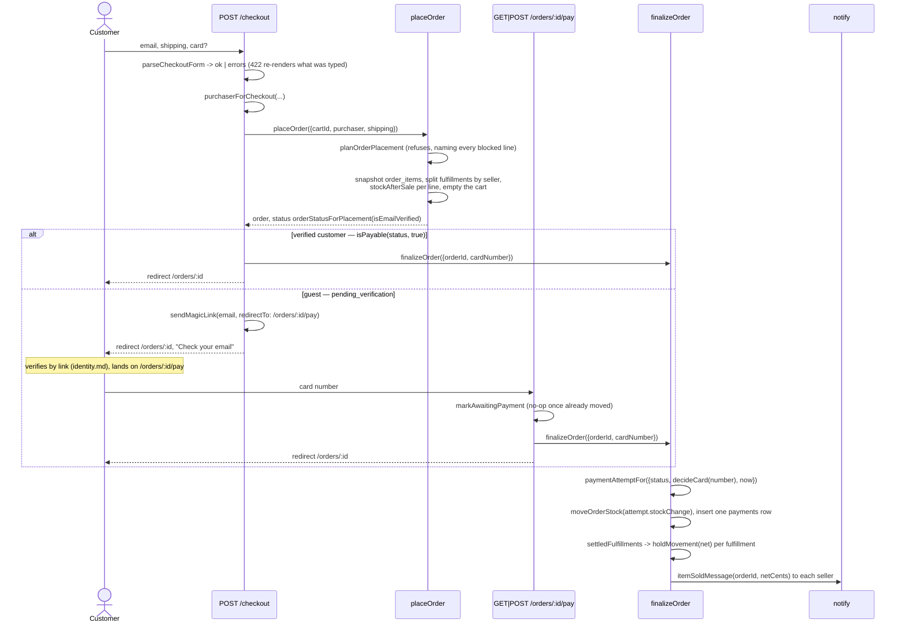
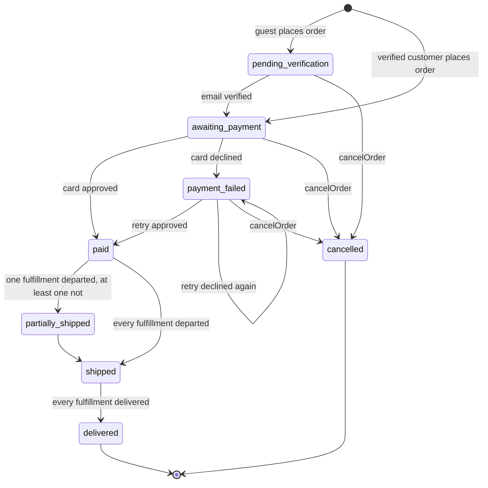
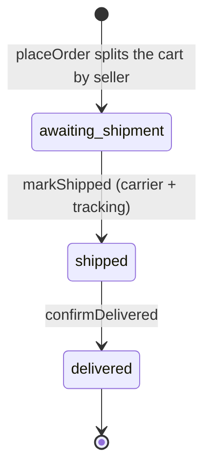

# Orders

Cart to checkout, the card, the split into per-seller fulfillments, shipping,
delivery, and cancellation.

Code: `app/core/orders/`, `app/core/cart/`, `app/core/shop/checkout-form.ts`,
`app/actions/orders/`, `app/actions/fulfillments/`,
`app/sites/shop/routes/checkout.ts`, `app/sites/shop/routes/order-payments.ts`,
`app/sites/shop/routes/orders.ts`, `app/sites/shop/routes/fulfillments.ts`,
`app/sites/seller/routes/orders.ts`.

An order belongs to a customer; a **fulfillment** belongs to one (order,
seller) pair and carries that seller's subtotal, fee, and net. `placeOrder`
creates one fulfillment per distinct seller in the cart
(`checkoutTotals(...).subtotalsBySeller`), and everything downstream —
shipping, escrow, the seller's view of the sale — keys off the fulfillment
rather than the order.

## Checkout to a paid, seller-notified order

Question: from a submitted checkout form to a seller's "Item sold"
notification, what runs, and where does a guest diverge from a verified
customer?

Caveats: `purchaserForCheckout` refuses to take an address off the form for a
signed-in customer — a verified account buys under the address on the account,
so a submitted field cannot move an order onto someone else's identity. A guest
buys under the address typed and verifies afterwards.

A declined card sets `payment_failed`, and `stockChangeBetween` reads `restore`
out of that move, so `moveOrderStock` hands the stock back and a sold-out
listing returns `sold → for_sale` (`stockAfterRestock`). A retry — guest or
signed in — posts back to the same `POST /orders/:id/pay`, which is why both pay
routes call `markAwaitingPayment` before `finalizeOrder` on every hit: the call
is a no-op once the order has already moved
(`orderStatusAfterVerification` only moves what can move). `finalizeOrder`
writes one `payments` row per attempt, so two declines followed by an approval
leave three. A declined attempt settles nothing: `settledFulfillments` returns
an empty list, so no ledger entry and no notification.

A cart that went stale between the page and the submit is refused, not
half-placed. `placeOrder` runs `planOrderPlacement`
(`app/core/orders/order-placement.ts`) **inside its own transaction**, against
the listing rows as they stand at that moment plus their active removals; a
refusal comes back as `{ ok: false, unavailable }` naming every blocked line
with an `UnavailableReason` (`removed`, `off_sale`, `sold_out`,
`short_stock`), and checkout re-renders with the whole list rather than a 500.
Reading the cart, deciding, and taking the stock are one transaction, so two
shoppers cannot both take the last piece.

A guest order cannot jump `pending_verification → paid`: the transition table
has no such edge, so `finalizeOrder` on an unverified order throws
`TransitionError` from `transitionOrder`. `GET /orders/:id/pay` and
`POST /orders/:id/pay` both sit behind `requireVerifiedCustomer`, and the POST
also behind `refuseBlockedCustomer`.

## Order status

Question: what are the legal `OrderStatus` transitions?

Source of truth: `ORDER_STATUS_TRANSITIONS` in
`app/core/orders/order-status.ts`, verified by `order-status.test.ts`.

`payment_failed → payment_failed` is a real edge, not a drawing artefact: a
retry that is declined again leaves the order where it was, and
`transitionOrder` would throw without it.

`cancelled` is reachable, unlike the Rails spike where the transition existed
with no caller. `isCancellable` covers `pending_verification`,
`awaiting_payment`, and `payment_failed`; `POST /orders/:id/cancel` calls
`cancelOrder`, which restores stock through
`stockChangeBetween({ from, to: 'cancelled' })` rather than a literal — so
cancelling a `payment_failed` order restores nothing, because the decline
already handed the stock back. A paid order has no route here; the table refuses
it.

The status above `paid` is never set directly. `rollUpOrderStatus` reads every
fulfillment and asks `orderStatusFromFulfillments`: all delivered is
`delivered`, all departed (`shipped` or `delivered`) is `shipped`, any departed
is `partially_shipped`, otherwise `paid`. A delivered fulfillment mixed with an
unshipped one still reads `partially_shipped`.

## Fulfillment status (per order × seller)

Question: what are the legal `FulfillmentStatus` transitions, and what does each
one set off?

Source of truth: `FULFILLMENT_STATUS_TRANSITIONS` in
`app/core/orders/fulfillment-status.ts`.

- `markShipped` (`POST /seller/orders/:id/ship`, where `:id` is a
  `fulfillments.id`) records carrier and tracking, calls `rollUpOrderStatus`,
  and notifies the customer with `orderShippedMessage`.
- `confirmDelivered`
  (`POST /orders/:id/fulfillments/:fulfillmentId/delivered`) writes the
  `released` ledger entry for that fulfillment's `net_cents` (see
  [`escrow.md`](escrow.md)) and rolls the order status up. Delivery confirmation
  is the customer pressing a button on the order page — the prototype's stand-in
  for carrier tracking.
- `hasDeparted(status)` is the predicate the order roll-up reads; there is no
  separate "in transit" state.

A seller's "order" **is a fulfillment**. `/seller/orders` groups fulfillments by
status and `/seller/orders/:id` shows one — the seller's own items, the shipping
address, their net, and either the mark-shipped form or the shipment record. A
fulfillment id belonging to another seller answers 404 on read and on write.
