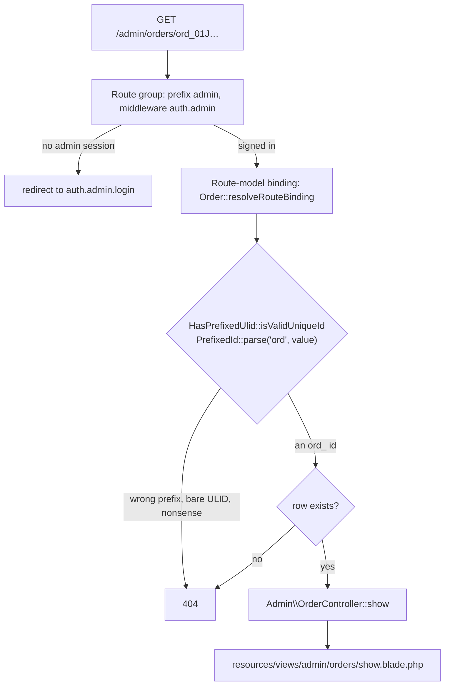
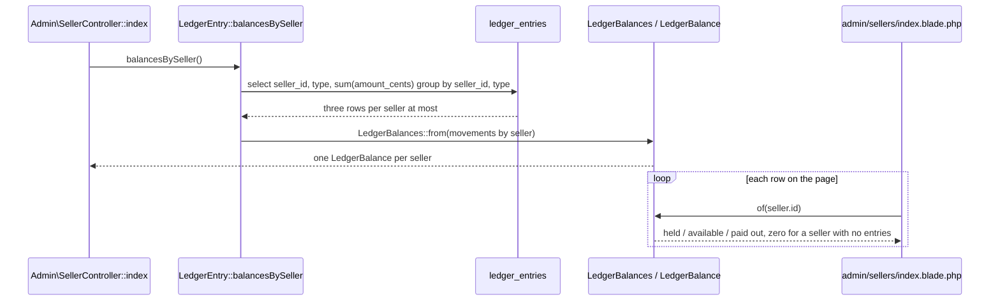
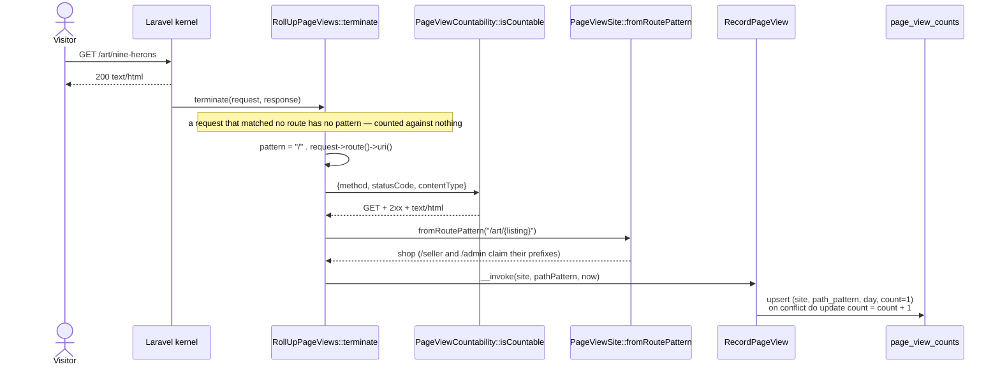
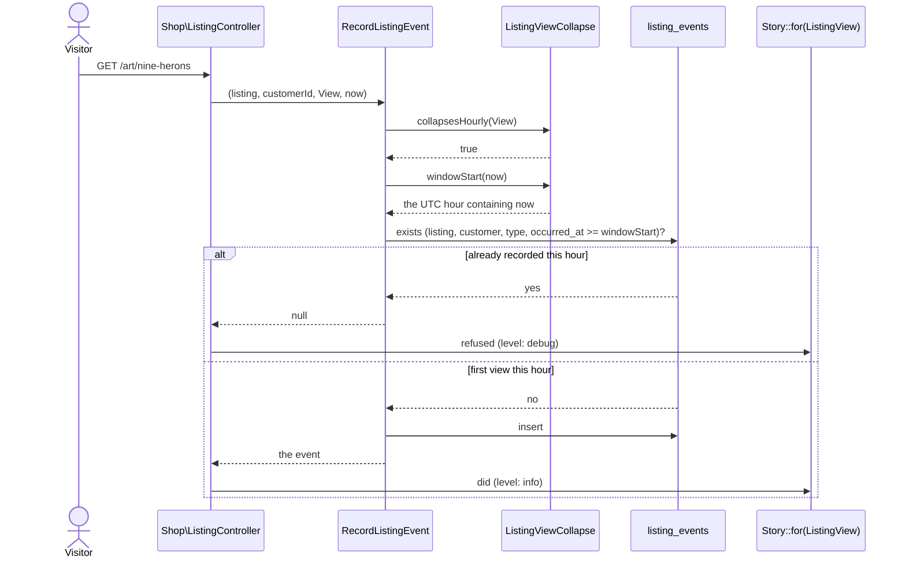

# Admin site

What a platform operator does: read every seller, customer, listing, order and
fulfillment on the platform, moderate a customer they need to stop, settle the
money — cancel an unpaid order, refund a fulfillment — and read what the
platform's state, money, and traffic look like from the front door.
Code: `app/Http/Controllers/Admin/`, `routes/admin.php`,
`resources/views/admin/`, `resources/views/components/admin/`,
`app/View/Composers/AdminLayoutComposer.php`, `app/Http/Middleware/
RollUpPageViews.php`, `app/Actions/Analytics/`, `app/Domain/Analytics/`.

Admins are seeded, never created — `database/seeders/AdminSeeder.php` — and
sign in through the same magic link sellers and customers use
([`identity.md`](identity.md)).

## Pages

| Path | Reads |
| --- | --- |
| `GET /admin` | tallies for every listing / order / fulfillment status (zero rows still listed), platform money, page views this week |
| `GET /admin/sellers` | every seller with listing and fulfillment counts, and the balance folded from one read of the ledger |
| `GET /admin/sellers/{seller}` | the seller's listings, fulfillments, payouts, and escrow balance |
| `GET /admin/customers?standing=all\|verified\|anonymous\|blocked` | every customer, anonymous rows included, with order, favorite and cart-line counts |
| `GET /admin/customers/{customer}` | orders, favorites, cart, block history, merge history, and the block / lift form |
| `GET /admin/listings?status=&seller=` | every listing across every seller |
| `GET /admin/listings/{listing}` | the listing, its view / favorite / cart-add counts, and every order line it sold on |
| `GET /admin/orders?status=&customer=` | every order with its customer, item count and total |
| `GET /admin/orders/{order}` | items, payment attempts, fulfillments, refunds, the cancel action and a refund form per fulfillment |
| `GET /admin/fulfillments?status=&seller=` | every fulfillment with its order and seller |
| `GET /admin/fulfillments/{fulfillment}` | the shipment, the lines it carries, its money, its ledger entries, and the refund or the form to issue one |
| `GET /admin/accounting` | per-seller reconciliation (held / available / paid out / refunded), fees earned and refunded at the platform level |
| `GET /admin/ledger?seller=&type=` | every ledger entry matching the filter, folded totals for that filtered set |
| `GET /admin/stats` | page views by day (7-day window) and by route pattern, listing event tallies |
| `GET\|POST /admin/messages`, `/admin/messages/{conversation}` | the admin inbox ([`messaging.md`](messaging.md)) |
| `POST /admin/orders/{order}/cancel` | cancel an order nothing has been charged for; the stock goes back on the storefront |
| `POST /admin/fulfillments/{fulfillment}/refund` | refund one fulfillment with a reason; stock stays sold |
| `POST /admin/customers/{customer}/blocks`, `.../blocks/lift` | block with a reason; lift it |
| `POST /admin/sellers/{seller}/messages`, `POST /admin/customers/{customer}/messages` | open a thread from the directory |
| `GET /admin/events` | the admin's unread-count stream (`text/event-stream`) |

Every filter is optional and an empty value means "all": the console submits
`seller=` for "All sellers", and the controller reads it back with
`$request->filled(...)` (a string filter) or `$request->enum(...)` (a status),
both of which answer null for an absent, empty, or unrecognised value — so a
hand-typed `?status=nonsense` shows everything rather than an error page.

The `status` selects on the orders and fulfillments lists are driven by
`OrderStatus::cases()` and `FulfillmentStatus::cases()`, so `cancelled`,
`refunded`, and `declined` appear as filter values with no console change.

`StandingFilter` (`app/Domain/Customers/StandingFilter.php`) is the one filter
whose "all" is a value of its own, because the customers list offers it as a
choice: `standing=all`, `standing=` and no `standing` at all are the same page.

## One guard, one 404

Question: what stands between a request for an admin page and the row it names?

Caveats: the guard is on the group in `routes/admin.php`, never on a route — a
per-route check is one the next page added forgets. Every miss answers the same
404: an unknown id, an id carrying another table's prefix, and a value of no
shape at all are one page, so nothing reveals whether a thing exists. That
falls out of the route binding, which is why no admin page looks a model up by
hand.

## Balances are folded, never queried per seller

Question: how does `/admin/sellers` show a balance on every row without a
query per row?

Caveats: the database sums each `(seller, type)` pair, so the fold sees three
rows per seller rather than the whole table, and the page costs one ledger read
whatever the seller count — `SellerControllerTest` counts the reads and holds
it to one. `LedgerBalances::of()` answers a zero balance for a seller with no
entries at all, which is what keeps the page from asking. The per-seller
`Seller::escrowBalance()` is still what the seller detail page reads: one
seller, one balance, one query.

Counts come from the database the same way — `withCount(['listings',
'fulfillments'])` on the sellers list, `withCount(['orders', 'favorites',
'cartItems'])` on the customers list, `withCount('items')` on the orders
list — rather than from counting a loaded collection in PHP.

## Filters as query scopes, tables as components

Each filter is a scope on the model it narrows, taking the filter value as
nullable and adding no clause when it is null: `Listing::ofStatus` /
`ofSeller`, `Order::ofStatus` / `ofCustomer`, `Fulfillment::ofStatus` /
`ofSeller`, `Customer::inStanding`. A controller passes what it read off the
request straight through, so "empty means all" is one answer in one place per
model rather than an `if` in every controller.

The repeated tables are anonymous Blade components under
`resources/views/components/admin/` — `listings-table`, `orders-table`,
`fulfillments-table`, plus the `filters` form and its three selects. Each
takes a `showSeller` / `showOrder` / `showCustomer` prop, because the column
that names the owner is noise on the owner's own page.

## Tallies with nothing hidden

`/admin`'s listing, order, and fulfillment tallies come from `*::platformCountsByStatus()`
(`Listing`, `Order`, `Fulfillment`), each a `group by status` folded through
`*StatusTally::from()` (`App\Domain\Reports`) against the enum's full
`cases()`. A `group by` only answers for the statuses that have rows, and a
dashboard that hid `payment_failed` because nobody has hit it yet would be
lying about the state machine — so every status the enum names appears, at
zero if that is the true count. `/admin/stats`'s listing-event tally
(`ListingEventTally`) and the `admin.balance` tiles on the seller and platform
money sections follow the same rule.

Platform money — held, available, paid out, fees earned, fees refunded,
refunded — is `App\Domain\Escrow\PlatformMoney`, built from
`LedgerEntry::balancesBySeller()->total()` (every seller's balance folded
into one, free of a second ledger read — see `LedgerBalance::combine()`
below) and `Fulfillment::platformFees()` (`App\Domain\Escrow\PlatformFees`:
`isLive()` fulfillments have earned their fee, a declined or refunded one
forwent it). `/admin` and `/admin/accounting`'s totals row read the same
object. `/admin/ledger`'s totals are different on purpose: `LedgerBalance::from()`
over whatever rows the seller/type filter left, so a partial ledger reads as
a partial balance rather than the platform's.

## Page views, rolled up

Question: how does a request become a row on `/admin/stats`?

Caveats: `RollUpPageViews` is appended to the **global** middleware stack in
`bootstrap/app.php`, not the `web` group, because a middleware added there
runs for every site regardless of which group's guard it sits behind, and the
site a hit belongs to is read back off the route's own pattern rather than
the request's host. It is terminable — `terminate()` runs after the response
has already gone back to the browser — so the roll-up costs the request it
counts nothing.

The pattern stored is `Route::uri()` with a leading slash, `/art/{listing}`
and never the concrete `/art/nine-herons`, so a thousand listing pages share
one row and the table grows with routes and days, not with traffic. The
unique index on `(site, path_pattern, day)` is what makes the first hit of a
day an insert and every later one an increment, in one upsert and no read
(`RecordPageView`).

"This week" on the dashboard is the seven days ending today
(`PageViewWeek::endingOn`), not Monday-to-Sunday: a calendar week reads as
almost nothing every Monday, and the number exists to be compared with the
day before it. The payout period is a calendar week and is a different
question — see [`escrow.md`](escrow.md).

## A view, collapsed to one per hour

Question: why does refreshing a listing page twenty times not write twenty
`listing_events` rows?

Caveats: `favorite`, `unfavorite`, and `cart_add` are never collapsed — each
is a deliberate click, and `ListingViewCollapse::collapsesHourly()` answers
`true` for `view` alone. The window is the UTC hour containing the moment, not
a rolling hour from the first view — `ListingViewCollapse::windowStart()`
floors to the top of the hour, so a view at `14:59` and one at `14:01` share a
window but one at `15:01` does not. `StoryEvent::ListingView->refusalLevel()`
is `debug` rather than `info` (docs/alignment.md §2.3): an ordinary browsing
session would otherwise write an `info` refusal on every repeat view within
the hour and drown the story at the level an operator actually reads.

## Not here yet

| What | Ticket |
| --- | --- |
| `removed=any\|removed\|visible` on the listings list, the removal reason on a listing, `POST /admin/listings/{listing}/removals` and the lift | FEAT-024 |
| `/admin/payouts` and the platform payout run | FEAT-024 |
