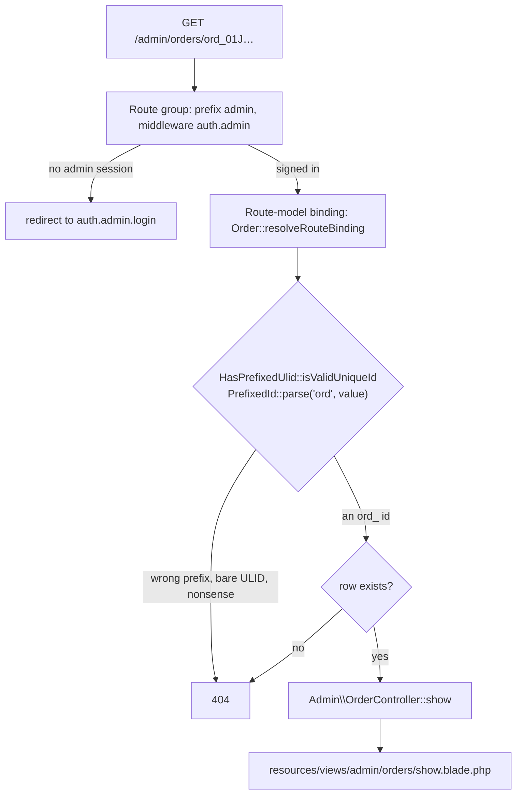
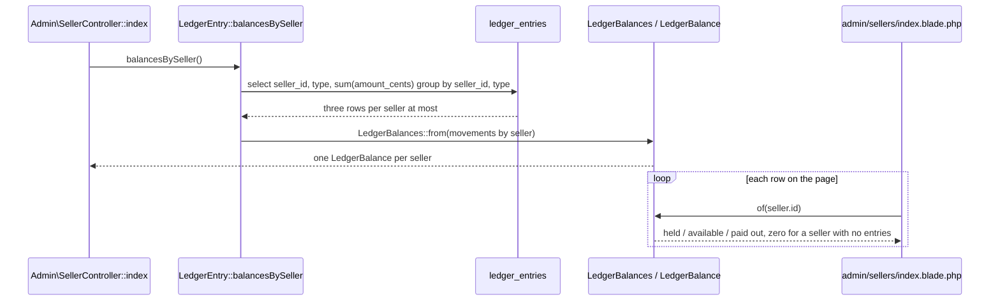

# Admin site

What a platform operator does: read every seller, customer, listing, order and
fulfillment on the platform, and moderate a customer they need to stop.
Code: `app/Http/Controllers/Admin/`, `routes/admin.php`,
`resources/views/admin/`, `resources/views/components/admin/`,
`app/View/Composers/AdminLayoutComposer.php`.

Admins are seeded, never created — `database/seeders/AdminSeeder.php` — and
sign in through the same magic link sellers and customers use
([`identity.md`](identity.md)).

## Pages

| Path | Reads |
| --- | --- |
| `GET /admin` | the console's front door; its tallies and platform money land with FEAT-023 |
| `GET /admin/sellers` | every seller with listing and fulfillment counts, and the balance folded from one read of the ledger |
| `GET /admin/sellers/{seller}` | the seller's listings, fulfillments, payouts, and escrow balance |
| `GET /admin/customers?standing=all\|verified\|anonymous\|blocked` | every customer, anonymous rows included, with order, favorite and cart-line counts |
| `GET /admin/customers/{customer}` | orders, favorites, cart, block history, merge history, and the block / lift form |
| `GET /admin/listings?status=&seller=` | every listing across every seller |
| `GET /admin/listings/{listing}` | the listing, its view / favorite / cart-add counts, and every order line it sold on |
| `GET /admin/orders?status=&customer=` | every order with its customer, item count and total |
| `GET /admin/orders/{order}` | items, payment attempts, fulfillments |
| `GET /admin/fulfillments?status=&seller=` | every fulfillment with its order and seller |
| `GET /admin/fulfillments/{fulfillment}` | the shipment, the lines it carries, its money, and its ledger entries |
| `GET\|POST /admin/messages`, `/admin/messages/{conversation}` | the admin inbox ([`messaging.md`](messaging.md)) |
| `POST /admin/customers/{customer}/blocks`, `.../blocks/lift` | block with a reason; lift it |
| `POST /admin/sellers/{seller}/messages`, `POST /admin/customers/{customer}/messages` | open a thread from the directory |
| `GET /admin/events` | the admin's unread-count stream (`text/event-stream`) |

Every filter is optional and an empty value means "all": the console submits
`seller=` for "All sellers", and the controller reads it back with
`$request->filled(...)` (a string filter) or `$request->enum(...)` (a status),
both of which answer null for an absent, empty, or unrecognised value — so a
hand-typed `?status=nonsense` shows everything rather than an error page.

`StandingFilter` (`app/Domain/Customers/StandingFilter.php`) is the one filter
whose "all" is a value of its own, because the customers list offers it as a
choice: `standing=all`, `standing=` and no `standing` at all are the same page.

## One guard, one 404

Question: what stands between a request for an admin page and the row it names?

Caveats: the guard is on the group in `routes/admin.php`, never on a route — a
per-route check is one the next page added forgets. Every miss answers the same
404: an unknown id, an id carrying another table's prefix, and a value of no
shape at all are one page, so nothing reveals whether a thing exists. That
falls out of the route binding, which is why no admin page looks a model up by
hand.

## Balances are folded, never queried per seller

Question: how does `/admin/sellers` show a balance on every row without a
query per row?

Caveats: the database sums each `(seller, type)` pair, so the fold sees three
rows per seller rather than the whole table, and the page costs one ledger read
whatever the seller count — `SellerControllerTest` counts the reads and holds
it to one. `LedgerBalances::of()` answers a zero balance for a seller with no
entries at all, which is what keeps the page from asking. The per-seller
`Seller::escrowBalance()` is still what the seller detail page reads: one
seller, one balance, one query.

Counts come from the database the same way — `withCount(['listings',
'fulfillments'])` on the sellers list, `withCount(['orders', 'favorites',
'cartItems'])` on the customers list, `withCount('items')` on the orders
list — rather than from counting a loaded collection in PHP.

## Filters as query scopes, tables as components

Each filter is a scope on the model it narrows, taking the filter value as
nullable and adding no clause when it is null: `Listing::ofStatus` /
`ofSeller`, `Order::ofStatus` / `ofCustomer`, `Fulfillment::ofStatus` /
`ofSeller`, `Customer::inStanding`. A controller passes what it read off the
request straight through, so "empty means all" is one answer in one place per
model rather than an `if` in every controller.

The repeated tables are anonymous Blade components under
`resources/views/components/admin/` — `listings-table`, `orders-table`,
`fulfillments-table`, plus the `filters` form and its three selects. Each
takes a `showSeller` / `showOrder` / `showCustomer` prop, because the column
that names the owner is noise on the owner's own page.

## Not here yet

| What | Ticket |
| --- | --- |
| `removed=any\|removed\|visible` on the listings list, the removal reason on a listing, `POST /admin/listings/{listing}/removals` and the lift | FEAT-024 |
| `/admin/payouts` and the platform payout run | FEAT-024 |
| The refunds section and the `refunded` statuses on an order, and the cancel / refund actions on the order and fulfillment detail pages | FEAT-020 |
| `/admin` money tallies, `/admin/accounting`, `/admin/ledger`, `/admin/stats`, the page-view roll-up | FEAT-023 |
