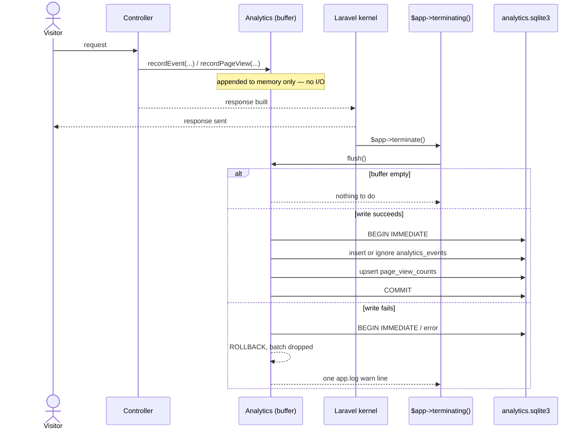

# Analytics store

Page views and listing interactions (views, favorites, unfavorites, cart
adds) are counted in a SQLite file of their own, separate from the commerce
database, so analytics load can never make a shopper's or seller's page
slower. `App\Analytics\Analytics` is the one entry point: every recording
call appends to an in-memory buffer and does no I/O; a later flush is what
turns the buffer into rows.

Code: `app/Analytics/{Analytics,AnalyticsEvent,AnalyticsReport,ListingEventCounts}.php`,
`app/Domain/Analytics/AnalyticsEventName.php`,
`app/Providers/AnalyticsServiceProvider.php`, the `analytics` connection in
`config/database.php`, `database/migrations/*_create_analytics_events_table.php`,
`database/migrations/*_create_page_view_counts_table.php`,
`app/Models/PageViewCount.php`, `app/Domain/Listings/ListingViewCollapse.php`,
`app/Domain/Analytics/{PageViewCountability,PageViewDay,PageViewSite,PageViewWeek}.php`,
`app/Http/Middleware/RollUpPageViews.php`.

Four invariants govern the design:

1. **One entry point.** Every analytics emission in the code calls
   `App\Analytics\Analytics::recordEvent()` or `recordPageView()`. There is
   no second writer, and no reader ever writes.
2. **Recording does no I/O.** `recordEvent()` and `recordPageView()` only
   append to an in-memory buffer and return. Nothing a shopper or seller is
   waiting on ever waits on the analytics connection.
3. **An event's timestamp is the moment it was recorded, not the moment it
   was written.** Every buffered row carries the `occurred_at` instant its
   caller handed in, so the stored sequence is the order things happened,
   independent of when the buffer happened to flush.
4. **The store's failure is never the request's failure.** A flush that
   cannot commit logs one `warn` line and drops the batch; the request or
   command that triggered it has already finished by the time that happens.

## The second database

The store is its own SQLite file: the `analytics` connection in
`config/database.php`, named by `ANALYTICS_DATABASE_FILE` (default
`storage/analytics.sqlite3`, beside the log store). WAL, `synchronous =
off` (losing a buffered count on a crash is acceptable), `busy_timeout =
250` (a fifth of the commerce connection's, so a contended flush fails fast
rather than stalling the request behind it), and foreign keys off — the
store's rows reference commerce rows by id only, across two separate SQLite
files.

The two tables' migrations run on the `analytics` connection and drop their
table before creating it: the migrations ledger lives in the app database,
so rebuilding it (`make fresh`, a deleted `database.sqlite`) re-runs every
migration, including these, against an analytics file that may still hold
the table from before.

## Flush lifecycle

`App\Providers\AnalyticsServiceProvider` binds the process's one `Analytics`
handle as a container singleton and registers the flush against
`$app->terminating()`. `handleRequest()` sends the HTTP response before
calling `$kernel->terminate()`, and `handleCommand()` calls
`$kernel->terminate()` after an artisan command's `handle()` returns the same
way — both kernels' `terminate()` end by calling `$this->app->terminate()`,
which runs every `terminating()` callback, the one mechanism the HTTP and
console kernels share. The callback flushes only a store the request or
command actually resolved: a request that never calls `recordEvent()` or
`recordPageView()` never constructs an `Analytics` instance, so most
requests pay nothing here.

`Analytics::__construct()` also registers a `register_shutdown_function`
fallback flush, for a process that exits without `terminating()` ever
firing. A buffer that reaches 256 rows (`Analytics::FLUSH_AT`) flushes
immediately rather than waiting for either hook, the same cap `App\Logging\LogStore`
uses for its own chunked inserts. A flush that already ran leaves the buffer
empty, so a second call — the shutdown fallback running after `terminating()`
already flushed — finds nothing to do.

Every write in one flush runs inside a single `BEGIN IMMEDIATE` transaction:
`IMMEDIATE` so a concurrent flush fails fast against `busy_timeout` rather
than blocking on a lock upgrade mid-write. Inside `Tests\TestCase`'s
`RefreshDatabase` wrapper, the connection is already inside a transaction, so
the writes join that transaction instead of opening their own, and its own
commit or rollback decides their fate.

`Analytics::reassignActor()` is the one write outside the buffer-and-flush
path: an immediate `UPDATE` on `analytics_events.actor_id`, called by
`App\Actions\Customers\MergeAnonymousCustomer` after the commerce merge
transaction commits, to re-point every row an anonymous customer already
owns onto the verified customer they merged into. It never throws — a
failure logs the same one warning shape `flush()` does, and the merge's
commerce writes stand regardless.

## Schema

`analytics_events`:

| Column         | Type                     | Notes                                             |
| -------------- | ------------------------ | -------------------------------------------------- |
| `id`           | text(30) PK               | prefix `aev`                                       |
| `name`         | string                    | closed vocabulary — see below                      |
| `occurred_at`  | timestamp                 | UTC; the instant recorded, not the instant written |
| `subject_type` | string, nullable          | e.g. `listing`                                     |
| `subject_id`   | text(30), nullable        | references e.g. `listings.id`, no FK               |
| `actor_id`     | text(30), nullable        | references e.g. `customers.id`, no FK               |
| `dedupe_key`   | string, nullable, unique  | the listing-view hour collapse                     |
| `data`         | text (JSON)               | event-specific payload                             |

Indexes: `(subject_id, name)`, `(name, occurred_at)`, `actor_id`.

`page_view_counts` is unchanged by this ticket: `id` (prefix `pvc`), `site`,
`path_pattern`, `day`, `count`, unique on `(site, path_pattern, day)`.

## Vocabulary

`App\Domain\Analytics\AnalyticsEventName` is the closed enum every `recordEvent()`
call names: `listing.view`, `listing.favorite`, `listing.unfavorite`,
`listing.cart_add`. A reader greps this one file for every name the store
accepts.

A `listing.view` carries a `dedupe_key`
(`listing:{listingId}:customer:{customerId|"anonymous"}:hour:{UTC hour}`,
built by `App\Domain\Listings\ListingViewCollapse`) so that refreshing a
listing page repeatedly within one UTC hour writes at most one row: the
insert is `INSERT OR IGNORE`, and a second event carrying a dedupe key
already written collides on the unique index and is silently discarded — no
read happens in the request to decide whether the write is a duplicate.
`favorite`, `unfavorite`, and `cart_add` carry no dedupe key and are recorded
every time; each is a deliberate click, not a page load.

## Readers

`App\Analytics\AnalyticsReport` is the query layer over `analytics_events`:

- `countsForListing($listingId)` — one listing's view/favorite/cart-add
  tally, for the seller and admin listing-detail pages.
- `dailyCountsForListingSince($listingId, $from)` — the same, grouped by day
  and name, for the seller listing-detail page's activity timeline.
- `platformCountsByName()` — every event name's tally across the whole
  platform, for `/admin/stats`.

`App\Models\PageViewCount`'s own static methods (`totalForWeek`,
`totalsByDay`, `totalsByPattern`) read `page_view_counts` directly and are
unchanged.

Every reader here is unguarded: an unavailable store surfaces as whatever
error the connection throws, the way a missing data source reads anywhere
else in the app. Only the write path is guarded — see invariant 4 above.

`Listing` and `Customer` no longer expose an `events()` relation or event
counts as model attributes; a controller that needs them calls
`AnalyticsReport` directly and hands the result to the view as its own
variable (`eventCounts`). The admin listing page's "Favorited" figure is the
count of standing `favorites` rows in the app database
(`loadCount('favorites')`), not an analytics tally — a favorite un-favorited
and re-favorited writes two analytics events but the standing table still
holds at most one row.

## Test isolation

`phpunit.xml` sets `ANALYTICS_DATABASE_FILE=:memory:`. `Tests\TestCase` lists
`analytics` in `$connectionsToTransact` alongside the default connection, so
`RefreshDatabase` migrates the in-memory analytics connection once and wraps
every test in its own transaction on it — left off that list, the analytics
connection would migrate on the first test that touches it and every test
after would see whatever that first test committed. Parallel-safe by
construction: an in-memory SQLite database is per PHP process.

`Tests\AnalyticsStoreFixtures::withUnwritableStore()` points the connection
at an unwritable path for the duration of one closure, purging and later
restoring the cached PDO — the shared fixture behind every test that asserts
on the guarded-failure branch (`AnalyticsTest`, `MergeAnonymousCustomerTest`,
`Shop\ListingControllerTest`, `RollUpPageViewsTest`).

## Open items

- **Retention.** The store has no prune. `analytics_events` grows with
  traffic; `page_view_counts` grows with routes × days. `App\Logging\LogStore`
  has `LOG_RETENTION_DAYS` and a sweep step (`docs/log-store.md`); analytics
  has no equivalent yet.
- **Node and Rails parity.** `docs/alignment.md` §2.6 fixes the shape; PHP
  ships the one-entry-point, buffered-and-flushed version on FEAT-039. Node
  and Rails still write analytics inline in the request and owe the same
  subsystem — tickets not yet filed.
