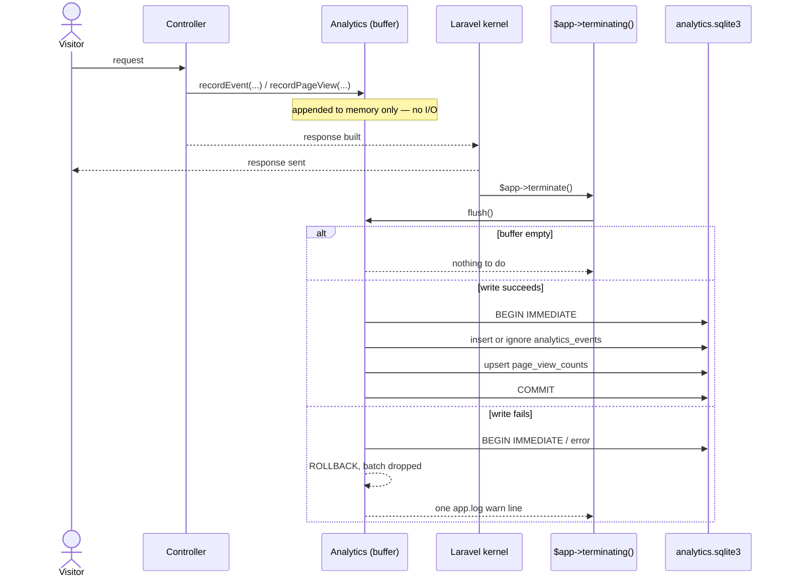

# Analytics store

Page views and listing interactions (views, favorites, unfavorites, cart
adds) are counted in a SQLite file of their own, separate from the commerce
database, so analytics load can never make a shopper's or seller's page
slower. `App\Analytics\Analytics` is the one entry point: every recording
call appends to an in-memory buffer and does no I/O; a later flush is what
turns the buffer into rows.

Code: `app/Analytics/{Analytics,AnalyticsEvent,AnalyticsEventRow,AnalyticsReport,ListingEventCounts,RequestFacts}.php`,
`app/Domain/Analytics/AnalyticsEventName.php`,
`app/Providers/AnalyticsServiceProvider.php`, the `analytics` connection in
`config/database.php`, `config/analytics.php`, `app/Support/RequestMarks.php`,
`app/Support/RetentionDays.php`, `database/migrations/*_create_analytics_events_table.php`,
`database/migrations/*_create_page_view_counts_table.php`,
`app/Models/PageViewCount.php`, `app/Domain/Listings/ListingViewCollapse.php`,
`app/Domain/Analytics/{PageViewCountability,PageViewDay,PageViewSite,PageViewWeek}.php`,
`app/Http/Middleware/RollUpPageViews.php`, `App\Console\Commands\SweepOrders`'s
analytics step; the admin drill-in reads through `app/Analytics/Admin/`,
`app/Domain/Analytics/` (the rest of it — velocity, range, breakdown, and
change value objects), `app/Http/Controllers/Admin/Analytics/`,
`app/Http/Requests/Admin/Analytics*QueryRequest.php`, and
`resources/views/admin/analytics/`.

Four invariants govern the design:

1. **One entry point.** Every analytics emission in the code calls
   `App\Analytics\Analytics::recordEvent()` or `recordPageView()`. There is
   no second writer, and no reader ever writes.
2. **Recording does no I/O.** `recordEvent()` and `recordPageView()` only
   append to an in-memory buffer and return. Nothing a shopper or seller is
   waiting on ever waits on the analytics connection.
3. **An event's timestamp is the moment it was recorded, not the moment it
   was written.** Every buffered row carries the `occurred_at` instant its
   caller handed in, so the stored sequence is the order things happened,
   independent of when the buffer happened to flush.
4. **The store's failure is never the request's failure.** A flush that
   cannot commit logs one `warn` line and drops the batch; the request or
   command that triggered it has already finished by the time that happens.

## The second database

The store is its own SQLite file: the `analytics` connection in
`config/database.php`, named by `ANALYTICS_DATABASE_FILE` (default
`storage/analytics.sqlite3`, beside the log store). WAL, `synchronous =
off` (losing a buffered count on a crash is acceptable), `busy_timeout =
250` (a fifth of the commerce connection's, so a contended flush fails fast
rather than stalling the request behind it), and foreign keys off — the
store's rows reference commerce rows by id only, across two separate SQLite
files.

The two tables' migrations run on the `analytics` connection and drop their
table before creating it: the migrations ledger lives in the app database,
so rebuilding it (`make fresh`, a deleted `database.sqlite`) re-runs every
migration, including these, against an analytics file that may still hold
the table from before.

## Flush lifecycle

`App\Providers\AnalyticsServiceProvider` binds the process's one `Analytics`
handle as a container singleton and registers the flush against
`$app->terminating()`. `handleRequest()` sends the HTTP response before
calling `$kernel->terminate()`, and `handleCommand()` calls
`$kernel->terminate()` after an artisan command's `handle()` returns the same
way — both kernels' `terminate()` end by calling `$this->app->terminate()`,
which runs every `terminating()` callback, the one mechanism the HTTP and
console kernels share. The callback flushes only a store the request or
command actually resolved: a request that never calls `recordEvent()` or
`recordPageView()` never constructs an `Analytics` instance, so most
requests pay nothing here.

`Analytics::__construct()` also registers a `register_shutdown_function`
fallback flush, for a process that exits without `terminating()` ever
firing. A buffer that reaches 256 rows (`Analytics::FLUSH_AT`) flushes
immediately rather than waiting for either hook, the same cap `App\Logging\LogStore`
uses for its own chunked inserts. A flush that already ran leaves the buffer
empty, so a second call — the shutdown fallback running after `terminating()`
already flushed — finds nothing to do.

Every write in one flush runs inside a single `BEGIN IMMEDIATE` transaction:
`IMMEDIATE` so a concurrent flush fails fast against `busy_timeout` rather
than blocking on a lock upgrade mid-write. Inside `Tests\TestCase`'s
`RefreshDatabase` wrapper, the connection is already inside a transaction, so
the writes join that transaction instead of opening their own, and its own
commit or rollback decides their fate.

`Analytics::reassignActor()` is the one write outside the buffer-and-flush
path: an immediate `UPDATE` on `analytics_events.actor_id`, called by
`App\Actions\Customers\MergeAnonymousCustomer` after the commerce merge
transaction commits, to re-point every row an anonymous customer already
owns onto the verified customer they merged into. It never throws — a
failure logs the same one warning shape `flush()` does, and the merge's
commerce writes stand regardless.

## Schema

`analytics_events`:

| Column         | Type                     | Notes                                                         |
| -------------- | ------------------------ | ------------------------------------------------------------- |
| `id`           | text(30) PK              | prefix `aev`                                                  |
| `name`         | string                   | closed vocabulary — see below                                 |
| `occurred_at`  | timestamp                | UTC; the instant recorded, not the instant written            |
| `subject_type` | string, nullable         | `listing`, `cart`, or `order`                                 |
| `subject_id`   | text(30), nullable       | references e.g. `listings.id`, `carts.id`, `orders.id`, no FK |
| `actor_id`     | text(30), nullable       | references e.g. `customers.id`, no FK                         |
| `ip`           | string(45), nullable     | the request's ip; null for a CLI run                          |
| `session_id`   | string, nullable         | the `sid` cookie's value; null for a CLI run                  |
| `dedupe_key`   | string, nullable, unique | the listing-view hour collapse                                |
| `data`         | text (JSON)              | event-specific payload; `request_id` when there was a request |

Indexes: `(subject_id, name)`, `(name, occurred_at)`, `actor_id`, `ip`, `session_id`.

`page_view_counts` is unchanged by this ticket: `id` (prefix `pvc`), `site`,
`path_pattern`, `day`, `count`, unique on `(site, path_pattern, day)`.

## Vocabulary

`App\Domain\Analytics\AnalyticsEventName` is the closed enum every `recordEvent()`
call names: `listing.view`, `listing.favorite`, `listing.unfavorite`,
`listing.cart_add`, `checkout.open`, `order.place`, `order.pay`,
`order.cancel`. A reader greps this one file for every name the store
accepts.

A `listing.view` carries a `dedupe_key`
(`listing:{listingId}:customer:{customerId|"anonymous"}:hour:{UTC hour}`,
built by `App\Domain\Listings\ListingViewCollapse`) so that refreshing a
listing page repeatedly within one UTC hour writes at most one row: the
insert is `INSERT OR IGNORE`, and a second event carrying a dedupe key
already written collides on the unique index and is silently discarded — no
read happens in the request to decide whether the write is a duplicate.
`favorite`, `unfavorite`, and `cart_add` carry no dedupe key and are recorded
every time; each is a deliberate click, not a page load.

The four steps beyond the cart carry no dedupe key either and are recorded
by the code that already announces each step in the story
(`docs/logging.md`), each through a constructor-injected `Analytics`:
`Shop\CheckoutController::show` records `checkout.open` once per request,
`subject_type = 'cart'`, `subject_id` the visitor's cart id, `data.listing_ids`
the listings the cart holds. `App\Actions\Orders\PlaceOrder` records
`order.place`, `FinalizeOrder` records `order.pay` (only on an approved
payment — a decline records nothing), and `CancelOrder` records
`order.cancel`, all three `subject_type = 'order'`, `subject_id` the order
id, `data.listing_ids` the listings the order spans; `order.pay` also
carries `data.total_cents`, so a revenue report reads the paid amount
without a join back to the commerce database. Every recording happens
after the action's own commerce transaction commits, so an order placement
or payment that rolls back leaves no event behind — recording never runs
inside the commerce transaction and adds no write to the commerce database.
`App\Actions\Orders\SweepStaleOrders` cancels stale orders through
`CancelOrder`, so a swept order records `order.cancel` the same way a
customer- or admin-initiated cancellation does, with no ip or session since
the sweep runs from the console.

## Readers

`App\Analytics\AnalyticsReport` is the query layer over `analytics_events`:

- `countsForListing($listingId)` — one listing's view/favorite/cart-add
  tally, for the seller and admin listing-detail pages.
- `dailyCountsForListingSince($listingId, $from)` — the same, grouped by day
  and name, for the seller listing-detail page's activity timeline.
- `eventsForIp($ip, $from)` / `eventsForSession($sessionId, $from)` —
  everything one ip or one session did since `$from`, newest first, as a
  list of `AnalyticsEventRow` (name, `occurredAt`, subject, actor, ip,
  session, and the request id read back out of `data`). How an operator
  isolates what a scripted or abusive visitor did, and steps from a row to
  the request that produced it via its `request_id`.

`App\Models\PageViewCount`'s own static methods (`totalForWeek`,
`totalsByDay`, `totalsByPattern`) read `page_view_counts` directly and are
unchanged.

Every reader here is unguarded: an unavailable store surfaces as whatever
error the connection throws, the way a missing data source reads anywhere
else in the app. Only the write path is guarded — see invariant 4 above.

`Listing` and `Customer` no longer expose an `events()` relation or event
counts as model attributes; a controller that needs them calls
`AnalyticsReport` directly and hands the result to the view as its own
variable (`eventCounts`). The admin listing page's "Favorited" figure is the
count of standing `favorites` rows in the app database
(`loadCount('favorites')`), not an analytics tally — a favorite un-favorited
and re-favorited writes two analytics events but the standing table still
holds at most one row.

## Reading the store: the admin drill-in

`/admin/analytics` and the four pages under it (`docs/admin.md` § "Analytics
drill-in") read `analytics_events` and `page_view_counts` through a second
query layer, `App\Analytics\Admin\`, kept apart from `AnalyticsReport` the
way the log viewer keeps `App\Logging\Admin\` apart from `App\Logging\LogStore`.
Every class in it is a static, stateless reader — no writer lives here.

- `EventTotals::forRange()` — every event name's current-vs-previous totals,
  distinct subject/actor counts, and daily series, plus the `page.view`
  roll-up; the entry page's events table.
- `ActorAggregates::forRange()` — every actor that carried an event in the
  range, aggregated once (totals, busiest UTC hour, first-seen-ever, ips);
  an internal collaborator, not read by a page directly.
- `ActorLeaderboard::forRange()` — `ActorAggregates`' result sorted by peak
  events per hour and capped to six; the entry page's leaderboard.
- `ActorList::forRange()` — the same aggregation sorted by the all-actors
  page's own `ActorSort` and paged; the all-actors page.
- `ActorIdentity::of()` — a customer read as `anonymous`/`verified` plus what
  to call them; shared by `ActorAggregates`, `AnalyticsJump`, and
  `EntityActivity`'s listing-page feed, so the same actor never reads two
  different ways on two different pages.
- `AnalyticsJump::for()` — a pasted search string read as a jump to exactly
  one listing or actor: a `lst_`/`cus_` id prefix, or an ip every event in
  the store agrees belongs to one actor; the entry page's jump row.
- `EventDetail::forRange()` — one event name's range tiles, daily series, and
  breakdown by listing, actor, or (`page.view`) route pattern; the event
  page.
- `EntityActivity::forListing()` / `forActor()` — one listing's or one
  actor's identity facts, range tiles, strip, and event feed, sharing every
  query and formatting helper between the two; the listing and actor pages.
- `SqlInstant::format()` — the one place a moment is formatted the way
  `occurred_at` compares against it; every query class above that bounds a
  range by that column goes through it.

The pure values these assemble from live in `App\Domain\Analytics\`:
`AnalyticsRange` (a window of whole UTC days, its previous window, day
labels, and the caption comparing the two), `RangeChange` (a signed
percentage and its `ChangeDirection`, "new" for a zero previous count, flat
under 0.5%), `BarStrip` (scales a daily or hourly series onto bar heights,
never shorter than 2px), `EventBreakdown` (which breakdowns an event name
allows and its default), `ActorKindFilter` and `ActorSort` (the actor
segmented controls), `JumpKind` (which route a `Jump` links to), and
`ActorVelocity`/`FlaggedActorSummary` below.

**The velocity flag.** `ActorVelocity::THRESHOLD_PER_HOUR` (100) is the one
number that decides whether an actor reads as scripted or abusive:
`ActorAggregates::forRange()` computes every actor's busiest UTC hour in the
range once for the leaderboard, `EntityActivity::forActor()` computes the
same actor's own busiest hour again for its own page, and both call
`ActorVelocity::flags($peakPerHour)` — the one shared predicate, so the
leaderboard and the actor's own page never disagree about who is flagged. A
flagged actor's page swaps its daily strip for an hourly one on the peak day
(`EntityActivity::hourlyStripBars()`, each bar's own hour tinted hot at or
past the threshold) and shows a banner built by
`FlaggedActorSummary::text()`: the peak count, the hour window, the busiest
ip in that hour, the count of distinct listings touched in it, one-event
rate in seconds, and whether the actor ever favorited or cart-added in the
range at all.

**The first request's session.** `RequestFacts::current()` reads a
returning browser's `sid` off the request cookie; a browser's first request
carries none yet, since `NameRequestVisitor` mints the cookie and queues it
on the response without rewriting the request in hand. `RequestFacts` falls
back to `Cookie::queued(RequestMarks::SESSION_COOKIE)?->getValue()` for that
case, so the very first event a new visitor causes carries the session id
they were just given; without the fallback it lands null, a gap on an
actor's own feed.

**Query-count tests.** Each of the five pages carries a test that seeds a
growing number of actors, listings, or feed events and asserts a fixed query
count on both the default and the analytics connections, so none of them
regresses into a query per row:

| Page                                 | Fixture                 | Default | Analytics |
| ------------------------------------ | ----------------------- | ------- | --------- |
| `/admin/analytics`                   | 12 actors               | 2       | 8         |
| `/admin/analytics/events/:name`      | 8 listings (by-listing) | 4       | 5         |
| `/admin/analytics/actors`            | 15 actors               | 2       | 4         |
| `/admin/analytics/actors/:customer`  | 15 feed events          | 4       | 11        |
| `/admin/analytics/listings/:listing` | 15 feed events          | 7       | 8         |

## Test isolation

`phpunit.xml` sets `ANALYTICS_DATABASE_FILE=:memory:` and
`ANALYTICS_RETENTION_DAYS=off`, so an ordinary test never has `orders:sweep`
prune rows out from under it; `SweepOrdersTest` overrides
`config(['analytics.retention_days' => …])` per test the way it already
does for the log store. `Tests\TestCase` lists
`analytics` in `$connectionsToTransact` alongside the default connection, so
`RefreshDatabase` migrates the in-memory analytics connection once and wraps
every test in its own transaction on it — left off that list, the analytics
connection would migrate on the first test that touches it and every test
after would see whatever that first test committed. Parallel-safe by
construction: an in-memory SQLite database is per PHP process.

`Tests\AnalyticsStoreFixtures::withUnwritableStore()` points the connection
at an unwritable path for the duration of one closure, purging and later
restoring the cached PDO — the shared fixture behind every test that asserts
on the guarded-failure branch (`AnalyticsTest`, `MergeAnonymousCustomerTest`,
`Shop\ListingControllerTest`, `RollUpPageViewsTest`).

## Request facts

Every event also carries the request that produced it: `ip` and
`session_id` as their own indexed columns, and the request id folded into
`data.request_id` — a cross-link to the log store (`docs/logging.md`),
never a filter on its own. `App\Analytics\RequestFacts::current()` reads
all three from whatever request is current in the container, and
`Analytics::recordEvent()` calls it once per event before buffering — the
caller (`ToggleFavorite`, `AddToCart`, the shop listing page) hands over
what happened and never mentions the request at all. A CLI run (a seeder,
an artisan command) has no tracked request, and all three columns stay
null: `RequestFacts` gates on the request-id attribute
`App\Http\Middleware\LogRequestStory` stamps, present only on a real HTTP
request and never on the synthetic request the console kernel binds for
an artisan run.

## Retention

An `ip` is personal data, and a `session_id` joins a browser's visits
together whether or not anyone signs in — keeping either forever turns a
usage log into a standing record of who visited what. `ANALYTICS_RETENTION_DAYS`
(default `30`, `off` disables) bounds `analytics_events`' history:
`App\Analytics\Analytics::prune($cutoff)` deletes rows whose `occurred_at`
is before the cutoff, batched and looped until none change — the same
shape `App\Logging\LogStore::prune()` uses (`docs/log-store.md`).
`orders:sweep` runs it as a third step alongside the stale-order sweep and
the log-store prune, each independent of the others' success. `page_view_counts`
carries no personal data (a route pattern and a day, never an ip or a
session) and is never pruned.

## Open items

- **Node and Rails parity.** `docs/alignment.md` §2.6 fixes the shape; PHP
  ships the one-entry-point, buffered-and-flushed version on FEAT-039, and
  the request-facts columns and retention window on FEAT-044. Node and
  Rails still write analytics inline in the request, carry no request
  facts, and prune nothing — tickets not yet filed.
