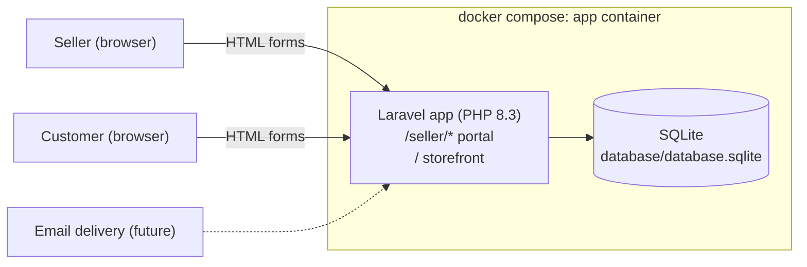
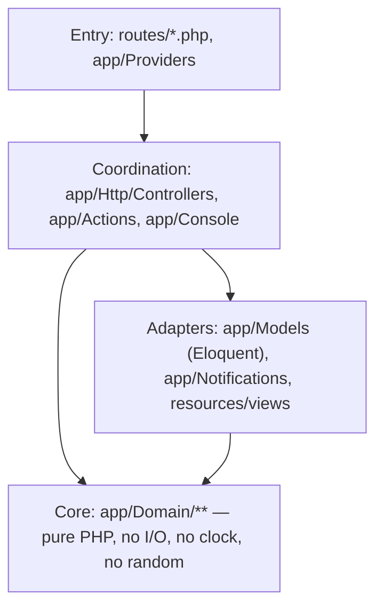
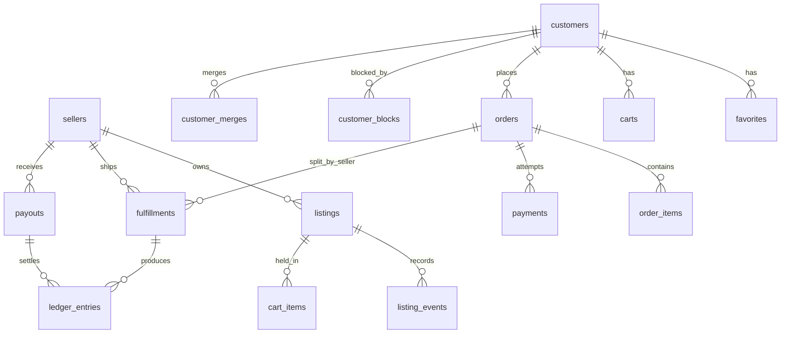
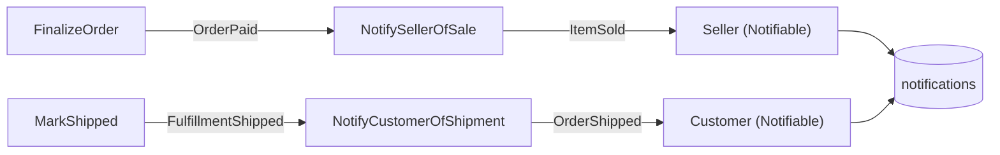

# Art Store prototype — system architecture

Prototype of a two-sided art marketplace: a **seller portal** (back office) and a
**customer storefront**, one Laravel deployable, one SQLite file, no JavaScript
required. Every agent working in `prototype/php/` reads this doc first and
follows the conventions in it.

## Deployables

Question: what runs, and what talks to what?



One container (`app`) holds PHP, Composer, Node (for the Tailwind build), and
the SQLite file. Nothing is installed on the host.

## Layers inside the deployable

Functional core / imperative shell. Dependencies point inward only.



| Layer | Lives in | Rules |
| --- | --- | --- |
| Core | `app/Domain/<Concept>/` | Pure functions and immutable value objects. Every value object is `final readonly` with a private constructor and named factories (`Money::fromCents()`, `ShippingAddress::to()`, `CartLine::of()`); every static-only helper has a private constructor so it cannot be instantiated; enums answer questions about themselves (`ListingStatus::isOnStorefront()`, `OrderStatus::awaitsPayment()`, `label()`) rather than being read from outside. Receives time/ids as parameters. Unit tested without doubles. |
| Adapters | `app/Models/`, `app/Notifications/`, `app/Support/`, `app/View/Composers/`, `resources/views/` | Eloquent models own their relations, casts, scopes, and the writes that keep their own invariants — a model method applies a decision the core made and writes the row (`Listing::sell()`, `Listing::changeStatusTo()`). Counts and sums a page shows are grouped in SQL by a scope or a model method (`Listing::countedByStatus()`, `LedgerEntry::totalledByType()`, `Seller::escrowBalance()`), and the domain folds the rows that come back. Notifications and their channels carry a message out of the app; Blade views and the composers that fill a layout render it in. |
| Coordination | `app/Actions/<Feature>/`, `app/Http/Controllers/<Site>/`, `app/Http/Requests/<Site>/`, `app/Policies/`, `app/Console/Commands/`, `app/Events/`, `app/Listeners/` | Sequence core + adapters. An action that finishes a business moment dispatches a past-tense event and a listener decides who hears about it. Form requests are the typed entry for input: they authorize the bound model, validate, and hand the controller a domain object. Owns no domain `if`s — if one appears, extract to `app/Domain`. Covered by HTTP feature tests. |
| Entry | `routes/web.php` → `routes/auth.php`, `routes/seller.php`, `routes/shop.php`, `routes/admin.php`; `routes/console.php`; `app/Providers` | Wiring only. `AppServiceProvider::boot()` turns on `Model::shouldBeStrict()` outside production (a lazy load, a discarded attribute, or a read of an unselected column raises), enforces the notification morph map, registers `NotificationPolicy` for `DatabaseNotification` and the two event/listener pairs, binds `ShopLayoutComposer` to `components.layouts.shop`, `SellerLayoutComposer` to `components.layouts.seller`, and `AdminLayoutComposer` to `components.layouts.admin`, and registers `@visitorCan`. `bootstrap/app.php` turns listener discovery off, because it reflects over every file in `app/Listeners` including each listener's sidecar test. `routes/console.php` holds the schedule. |

Naming follows the `naming` skill: actions are verb phrases (`PlaceOrder`,
`ReleaseEscrow`), domain enums name states (`OrderStatus`), events are past
tense (`OrderPlaced`).

### Refusals

A rule the core refuses is an `App\Domain\DomainRuleViolation` — an illegal
status transition (`ListingStatus`, `OrderStatus`, `FulfillmentStatus`), a sale
the stock cannot cover (`ListingStock`), a cart line the listing no longer
supports (`CartQuantity`), an order with no items (`CartTotals`). Its message
is written for the person who tripped it. `bootstrap/app.php` maps it once, for
every route, to `back()->withInput()->withErrors(...)`, and both layouts render
`$errors`; controllers therefore carry no pre-flight copy of a guard the action
already holds. `CheckoutController::place` is the one route that overrides the
destination: it sends the shopper to the cart, where the line the message names
is marked unavailable. Ownership stays separate — a row that is not the
visitor's is still a 404.

### The clock

`app/Domain` reads no clock (`tests/Arch.php` enforces it), so every instant
comes from the shell. `Controller::now(): DateTimeImmutable` is the one place
that produces it, and every controller calls it.

- Actions take `DateTimeImmutable $now` as their last parameter — the commerce
  ones (`PlaceOrder`, `FinalizeOrder`, `MarkShipped`, `ConfirmDelivered`,
  `AddToCart`, `ToggleFavorite`, `RecordListingEvent`, `RunWeeklyPayout`) and
  the identity ones (`SendMagicLink`, `SignInSeller`, `SignInCustomer`,
  `ClaimCustomerIdentity`) alike. No action calls `now()`.
- Model writes that stamp a time take it too: `MagicLink::consume($now)`,
  `MagicLink::statusAt($now)`. The exception is the framework's
  `DatabaseNotification::markAsRead()`, which reads `now()` itself — still
  frozen by `travelTo()`, but not handed in.
- `RunWeeklyPayouts` (the artisan command) is a second producer: a console run
  has no controller, so it reads `now()` or parses `--as-of`.
- `App\Support\UnreadCountStream` is the third. A held SSE stream outlives the
  single instant a request is answered at, so the controller computes a
  deadline from `Controller::now()` and the generator reads `now()` on each
  tick to compare against it. That read is in the shell, which is why
  `tests/Arch.php`'s clock rule — scoped to `App\Domain` — still holds.

A test freezes time with `travelTo()`/`freezeTime()` and every layer follows,
because one call per request produces the instant they all read. A stream is
the exception a test drives with `Sleep::fake(syncWithCarbon: true)`, which
advances the frozen clock by each faked sleep so the loop reaches its deadline
without waiting.

## Sites

| Site | URL prefix | Guard | Theme |
| --- | --- | --- | --- |
| Seller portal | `/seller` | `seller` (session, provider `sellers`) | Stock Tailwind, system font, vanilla controls, dense and tool-focused. |
| Storefront | `/` | `customer` (session, provider `customers`) + anonymous customer cookie | Bright, open, white space, large imagery, brand recedes. |
| Admin site | `/admin` | `admin` (session, provider `admins`) | Stock Tailwind, system font, tables and forms; the platform's back office. |

Each site has its own Blade layout, an anonymous component (`<x-layouts.seller>`,
`<x-layouts.shop>`, `<x-layouts.admin>` in
`resources/views/components/layouts/`), and its own route file. All three
layouts render the `<x-debug-alert>` component that shows any magic link
flashed to the session.

`admins` rows are seeded, never signed up: `/admin/login` issues a link only
for an address that already has one, and answers a submitted address the same
way whether or not it does. `App\Domain\Auth\ActorType::allowsPath()` keeps
each actor on their own site, so a customer's or a seller's link is never
followed to `/admin` and an admin's is never followed to `/seller`. An admin
blocks a customer with a reason (`customer_blocks`); `Customer::canShop()` is
the predicate `AddToCart`, `PlaceOrder`, and `FinalizeOrder` read through
`App\Domain\Customers\CustomerStanding`, so a blocked shopper lands back on
the page they submitted from with the reason while browsing, searching, and
favoriting stay open. See `docs/messaging.md` § "What a block does".

### Authorization

Every route binds its model (`Listing $listing`, `Fulfillment $fulfillment`,
`DatabaseNotification $notification`, `Order $order`; the storefront listing
binds by slug) and then authorizes it. `app/Policies` holds the rules:

| Policy | Abilities | Actor |
| --- | --- | --- |
| `ListingPolicy` | `view`, `update` | `Seller` |
| `FulfillmentPolicy` | `view`, `update`, `ship` | `Seller` |
| `FulfillmentPolicy` | `confirmDelivery` | `Customer` |
| `OrderPolicy` | `view`, `pay` | `Customer` |
| `NotificationPolicy` | `markRead` | `Seller` or `Customer` |
| `ConversationPolicy` | `view`, `post` | `Seller`, `Customer`, or `Admin` |

Ownership denials are `Response::denyAsNotFound()`: a row that is not the
actor's answers 404, so an id outside their own is never confirmed to exist.

A write route backed by a form request authorizes inside that request's
`authorize()`, which returns the same policy `Response` a controller would have
raised. A form request runs before the controller, so the ownership answer
lands before any validation message can describe a row the actor cannot see.

`view` and `update` answer ownership alone — the whole authorization question a
request has to pass, since the action behind it holds the state rule and
phrases its own refusal (see **Refusals**). `ship` and `confirmDelivery` add
the state each form needs to be worth offering, and only the views ask them:
`@can('ship', $fulfillment)` in the seller portal, `@visitorCan` on the
storefront. A double submission therefore still lands on the form's page with
the domain's message rather than on a 403.

Who the actor is differs per site. `Authenticate::using('seller')` makes the
seller guard the default for the request, so seller controllers call
`$this->authorize(...)`, their form requests call `Gate::inspect(...)`, and
seller views use `@can`. The storefront visitor is
resolved by `ResolveCustomerIdentity` middleware rather than signed in on a
guard, so `ShopController::authorizeVisitor()` names them
(`Gate::forUser($this->visitor())`) and the `@visitorCan` Blade directive
registered in `AppServiceProvider` asks the same policies about the same
visitor.

`SellerController`, `ShopController`, and `Admin\AdminController` are the
three base controllers; each exposes the actor behind the request (`seller()`,
`visitor()`, `admin()`) as a non-null model. Most admin pages scope nothing by
the admin who is reading and extend the base controller directly; the
messaging ones scope reads and writes by the signed-in admin, the way the
other two sites already do, so they extend `AdminController` instead. All of
them extend `App\Http\Controllers\Controller`, which holds the clock
(see **The clock**).

## Identity

- Passwordless. A `magic_links` row holds a hashed token, an `email`, an
  `actor_type` (`seller` | `customer` | `admin`), `expires_at`, `consumed_at`, and an
  optional `redirect_to`.
- Delivery is a notification: `App\Notifications\MagicLinkIssued`, sent to the
  address rather than to a row (`Notification::route(...)`, an
  `AnonymousNotifiable`) because the person may have no row yet.
  `config/magic_links.php` names the channel: `session` is
  `App\Notifications\Channels\SessionFlashChannel`, which flashes the URL so
  both layouts print it in a debug alert; `mail` is the framework's mail
  channel, which sends `MagicLinkIssued::toMail()`. An unknown channel raises.
- Customers: every visitor gets a `customers` row with `email = null`, id stored
  in an encrypted cookie `customer_id`. Verifying an email either claims that
  row (first time) or **merges** the anonymous row into the existing verified
  customer (favorites, cart, orders, listing events re-pointed; a
  `customer_merges` row records `anonymous_customer_id -> customer_id` so stale
  cookies resolve to the merged account). The merge decision is a pure
  function in `app/Domain/Customers`; the re-pointing is an action.
- Guest checkout = place order as the anonymous customer
  (`OrderStatus::PendingVerification`), then require verification before the
  order is finalized (charged). The card is never asked for on that first
  request — it is collected on `/orders/{order}/pay`, which the guest reaches
  by following the magic link's `redirect_to`. A verified customer collects
  the card in the same `/checkout` request instead.
- See `docs/identity.md` for the sign-in and verification-with-merge sequence
  diagrams and the `ResolveCustomerIdentity` flowchart.

## Commerce domain

Money is integer cents (`App\Domain\Money\Money`). Orders may span sellers;
fulfillment and escrow are tracked **per (order, seller)** in a `fulfillments`
row.



`magic_links` and `notifications` are deliberately absent: neither holds a
foreign key to `sellers` or `customers`. A magic link matches on an `email`
string plus `actor_type`; a notification names its recipient with a morph type
and id. Full column list and both `customer_merges` foreign keys:
`docs/data-model.md`.

### Listing status

`draft → for_sale → sold`, plus `archived` from `draft`/`for_sale`, plus
`sold → for_sale`: a declined card (`FinalizeOrder`) restores the stock
`PlaceOrder` took, so a listing that sold out during a dead checkout goes
back on the storefront rather than staying stuck at `sold`. Only `for_sale`
listings appear on the storefront. Quantity defaults to 1; a sale decrements
it and `sold` is reached at 0. Source of truth:
`App\Domain\Listings\ListingStatus::transitions()`, verified by
`ListingStatusTest`.

### Order status and fulfillment status

State diagrams, the checkout-to-notification sequence, and a worked
walkthrough of `OrderStatus::fromFulfillments()` roll-up: `docs/orders.md`.
In short: every order starts at `pending_verification` (guest) or
`awaiting_payment` (verified customer) — neither status skips straight to
`paid` — then moves through `paid`/`payment_failed` to
`partially_shipped`/`shipped`/`delivered`. A fulfillment (order × seller)
moves `awaiting_shipment → shipped → delivered`.

### Escrow and payouts

- `ledger_entries` per seller: `held` (+amount on paid), `released` (on
  delivered; moves the amount from held to available), `paid_out` (−amount when
  included in a payout).
- Platform fee: 10% of item subtotal, taken at `held`. Seller net = subtotal −
  fee.
- Payout period = Monday–Sunday. `php artisan payouts:run {--as-of=}` creates
  one `payouts` row per seller for all `released` amounts not yet paid out, as
  of the end of the most recent completed week. Period math is pure
  (`App\Domain\Escrow\PayoutPeriod`). `routes/console.php` schedules it
  `weeklyOn(1, '02:00')` — the Monday after a period closes. The seller portal
  exposes a debug "Run weekly payout now" button for testing.
- One query reads the whole ledger: `LedgerEntry::totalledByType()` sums
  `amount_cents` per (seller, type), and `LedgerBalance::from()` folds those
  summed movements. The payout run bounds it by `occurred_at <= period.end`;
  `Seller::escrowBalance()` leaves it unbounded.
- Ledger flowchart, `payouts:run` sequence diagram, and a worked $100 example:
  `docs/escrow.md`.

### Fake payment

`App\Domain\Payments\FakeCard::decide(string $number): CardDecision`:

| Number | Decision |
| --- | --- |
| `4242 4242 4242 4242` | approved |
| `4000 0000 0000 0002` | declined: generic decline |
| `4000 0000 0000 9995` | declined: insufficient funds |
| anything else | declined: invalid card number |

Spaces and dashes are ignored. Only the last four digits are stored.

### Notifications

A business moment is an event, and what someone is told about it is a
notification:



- Events (`App\Events\OrderPaid`, `App\Events\FulfillmentShipped`) are
  `final readonly`, carry the model plus the instant, and are dispatched from
  inside the action's transaction.
- Listeners (`App\Listeners\NotifySellerOfSale`,
  `App\Listeners\NotifyCustomerOfShipment`) implement
  `ShouldHandleEventsAfterCommit`, so a rolled-back transaction tells nobody
  and no delivery runs with the transaction still open.
- Notifications (`App\Notifications\ItemSold`,
  `App\Notifications\OrderShipped`) extend
  `Illuminate\Notifications\Notification`. `via()` reads
  `config('notifications.channels')` — `database` alone by default, with
  `mail` a comma away; `toArray()` and `toMail()` both come from
  `App\Domain\Notifications\NotificationMessage`, so the inbox row and the
  email say the same thing.
- `Seller`, `Customer`, and `Admin` are `Notifiable`. Rows land in Laravel's
  `notifications` table (uuid `id`, `type`, `notifiable_type`/`notifiable_id`,
  `data` json, `read_at`) and are read back as
  `Illuminate\Notifications\DatabaseNotification`. `notifiable_type` holds the
  morph alias `seller`, `customer`, or `admin`, which is what
  `App\Domain\Auth\ActorType` names; `AppServiceProvider`
  enforces that one map for both `notifications.notifiable_type` and
  `messages.sender_type`.
- Each site renders its own inbox from `$notification->data`, counts
  `unreadNotifications()`, and marks one read with `markAsRead()`.

## Testing

- Pest, `it()`/`test()` functions with `beforeEach`, no PHPUnit classes
  outside `tests/*TestCase.php`. Tests are **sidecars**: `Foo.php` →
  `FooTest.php` in the same directory. `phpunit.xml` scans `app/`, `routes/`,
  and `database/` for `*Test.php` (the last one added for the seeders under
  `database/seeders/`) and lists `tests/Arch.php` by name, since the layer
  rules carry no `Test.php` suffix. `tests/TestCase.php` stays as the Laravel base.
- `tests/Pest.php` binds each sidecar directory to the base class its test
  files need: `Tests\CommerceTestCase` for `app/Actions`,
  `app/Console/Commands`, `app/Events`, `app/Http/Controllers/Admin`,
  `app/Http/Controllers/Seller`, `app/Http/Requests/Admin`,
  `app/Http/Requests/Seller`, `app/Listeners`, `app/Models`,
  `app/Notifications`, and `app/Policies`; `Tests\StorefrontTestCase` for
  `app/Http/Controllers/Shop`, `app/Http/Requests/Shop`,
  `app/View/Composers`, and `tests/SmokeTest.php`;
  `Tests\TestCase` alone for `routes/`;
  `Tests\TestCase` + `RefreshDatabase` for `app/Http/Controllers/Auth`,
  `app/Http/Middleware`, `app/Http/Requests/Auth`, and `database/seeders`.
- Every model under `app/Models` has a factory under `database/factories`,
  with a state per meaningful status (`OrderFactory::paid()`,
  `FulfillmentFactory::shipped()`, `PaymentFactory::declined()`,
  `MagicLinkFactory::consumed()`, `ListingFactory::archived()`, and the like).
  A test reaches for `Model::factory()->create([...])` for a plain row and for
  the action walk (below) only when the row's *lifecycle* — not just its
  final shape — is what the test is about.
- A repeated fixture is a public method on `Tests\CommerceTestCase`
  (`cartWithOneListing()`, `paidOrderWithTwoSellers()`,
  `shippedFulfillmentFor()`, `deliveredFulfillmentFor()`); a fixture used by
  one file is a closure declared at the top of that file and pulled into each
  test with `use ($fixture)`, reaching the running test case through `test()`.
- Tabulated input/output shapes are datasets: inline `->with([...])` or a
  file-local `dataset()` call at the top of the sidecar. Named datasets
  declared in `tests/Pest.php` do not resolve from sidecars under `app/`
  (dataset scope is `tests/`), so the suite keeps datasets inline or
  file-local instead of a shared library.
- `tests/Arch.php` enforces the layer rules: `App\Domain` uses nothing from
  `App\Models`, `App\Http`, `App\Actions`, `App\Console`,
  `Illuminate\Database`, or facades, and calls no clock/random functions;
  every class under `App\Actions` is final and invokable; controllers do not
  use the `DB` facade; no debug functions anywhere; `env()` only in
  `config/`, never under `App`; every file declares strict types — plus
  Pest's `laravel` and `security` presets. The preset's `ignoring` list names
  one class at a time rather than a namespace: the ten controllers whose
  route methods are action verbs (`CartController::add`,
  `CheckoutController::place`, `FavoriteController::toggle`,
  `OrderPaymentController::pay`, `AccountController::readNotification`,
  `NotificationController::markRead`,
  `SignOutController::seller`/`customer`/`admin`, and the three
  `LoginController::send` pairs), `App\Domain` for enums that live
  beside the concept they model, `App\Console\Commands\RunWeeklyPayouts` for
  its artisan command name, `App\Notifications\Channels` for a delivery
  channel, which is not itself a notification, and
  `App\Http\Requests\Shop\ShopRequest`, the abstract base whose children
  hold the rules. Every other controller is held to the preset's REST method
  vocabulary.
- `tests/SidecarsTest.php` asserts every non-abstract, non-interface,
  non-enum, non-trait class under `app/` has a sidecar, against a maintained
  list of exceptions (classes covered by another file's tests, or with no
  independently testable behavior); a second assertion fails if any
  exception's sidecar now exists, so the list can only shrink.
- One exception to the sidecar rule: `tests/SmokeTest.php`, the end-to-end
  walk, has no production file to sit beside. It is its own `Smoke` testsuite
  (`make smoke`) and runs inside `make test` as well.
- Core tests (`app/Domain/**`) need no app boot, no database, no doubles.
- Coordination tests (controllers, actions, commands) run against in-memory
  SQLite; they drive HTTP and assert on rendered HTML and database state.
  `Event::fake([...])` and `Notification::fake()` cover "something was sent";
  what an inbox shows is asserted through the page that renders it.
- Coverage via `pcov`: `composer test:coverage` prints a text summary and
  writes `coverage/`. The suite covers 100.0% of the lines under `app/`.
- TDD: write the failing sidecar test, make it pass, refactor. Feature tickets
  are done when their flow has an HTTP test that walks it end to end.
- The gate: `make check` (`composer check`) runs Pint (`declare_strict_types`
  enforced tree-wide via the `laravel` preset), then PHPStan/Larastan at
  `level: max` over `app`, `database`, `routes`, and `tests` (model casts and
  config types understood via `parseModelCastsMethod` and `checkConfigTypes`),
  then the full Pest suite (1090 tests, 2425 assertions). `make analyse` and `make lint` run
  the first two alone, against the file tree only (`--no-deps`, no web
  server).
- Sidecar tests are analysed at the same level as the code they cover: there
  are no `excludePaths`, no `ignoreErrors`, and no baseline. Pest reaches the
  test case, the custom expectations, and the arch DSL through traits and
  `expect()->extend()`, none of which static analysis can follow, so
  `src/phpstan/*.stub` declares them: `Pest\PendingCalls\TestCall` and
  `Pest\Support\HigherOrderTapProxy` mix in `Tests\StorefrontTestCase` (the
  deepest of the three base classes, so every file gets the members its own
  base carries), `Pest\Expectation` gains `toBeMoney()` and `toHaveStatus()`,
  and `pest-refs.stub` declares the classes those stubs name, which is what
  PHPStan's stub validator resolves against. A higher-order expectation chain
  (`expect($order)->status->toBe(...)`) resolves to `mixed`, so the suite
  writes `expect($order->status)->toBe(...)->and(...)` instead.

## Repository layout

```
prototype/php/
  README.md            how to run, serve, test
  docker-compose.yml   one service: app
  Dockerfile           php:8.3-cli + composer + node + gd + pcov + sqlite
  Makefile             host-side wrappers over docker compose
  docs/                architecture + feature docs (this folder, indexed in docs/README.md)
  work/                tickets and journal (orchestration only)
  src/                 the Laravel application
```

## Mapping the project skills onto this stack

| Skill says | Here it means |
| --- | --- |
| `npm run test:run -- <pattern>` | `docker compose run --rm app composer test -- --filter <pattern>` |
| Vitest unit test | Pest `it()` in a sidecar file, no app boot |
| React Testing Library integration test | Pest `it()` bound to `Tests\CommerceTestCase` or `Tests\StorefrontTestCase`, driving `$this->get()/post()` |
| `src/` | `prototype/php/src/` |
