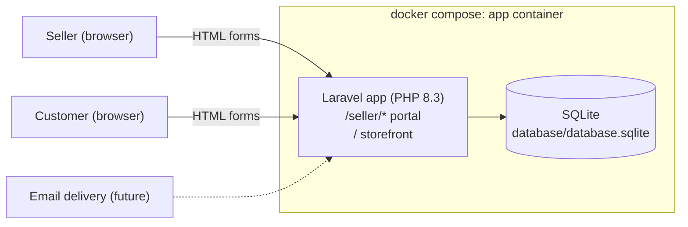
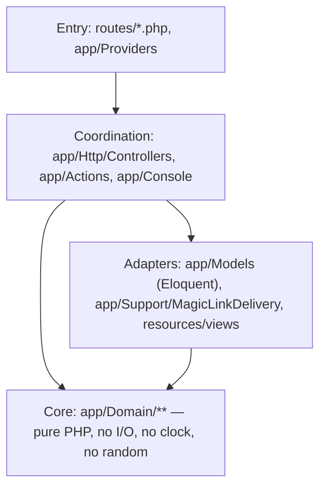
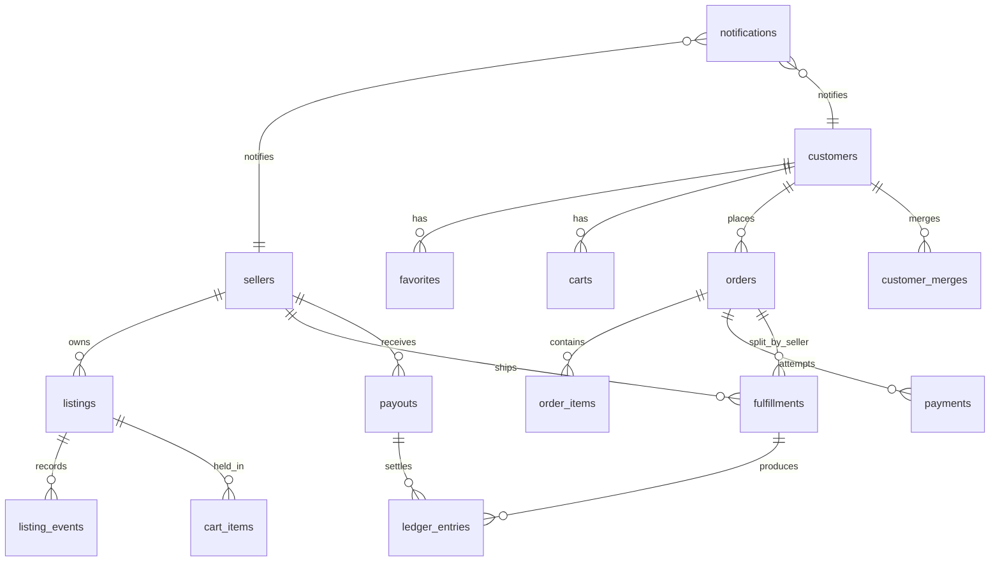

# Art Store prototype — system architecture

Prototype of a two-sided art marketplace: a **seller portal** (back office) and a
**customer storefront**, one Laravel deployable, one SQLite file, no JavaScript
required. Every agent working in `prototype/php/` reads this doc first and
follows the conventions in it.

## Deployables

Question: what runs, and what talks to what?



One container (`app`) holds PHP, Composer, Node (for the Tailwind build), and
the SQLite file. Nothing is installed on the host.

## Layers inside the deployable

Functional core / imperative shell. Dependencies point inward only.



| Layer | Lives in | Rules |
| --- | --- | --- |
| Core | `app/Domain/<Concept>/` | Pure functions and immutable value objects. Readonly classes, enums, static functions. Receives time/ids as parameters. Unit tested without doubles. |
| Adapters | `app/Models/`, `app/Support/`, `resources/views/` | Eloquent models (thin: relations, casts, scopes), the magic-link delivery port implementations, Blade views. |
| Coordination | `app/Actions/<Feature>/`, `app/Http/Controllers/<Site>/`, `app/Console/Commands/` | Sequence core + adapters. Owns no domain `if`s — if one appears, extract to `app/Domain`. Covered by HTTP feature tests. |
| Entry | `routes/web.php` → `routes/auth.php`, `routes/seller.php`, `routes/shop.php`; `app/Providers` | Wiring only. |

Naming follows the `naming` skill: actions are verb phrases (`PlaceOrder`,
`ReleaseEscrow`), domain enums name states (`OrderStatus`), events are past
tense (`OrderPlaced`).

## Sites

| Site | URL prefix | Guard | Theme |
| --- | --- | --- | --- |
| Seller portal | `/seller` | `seller` (session, provider `sellers`) | Stock Tailwind, system font, vanilla controls, dense and tool-focused. |
| Storefront | `/` | `customer` (session, provider `customers`) + anonymous customer cookie | Bright, open, white space, large imagery, brand recedes. |

Each site has its own Blade layout (`resources/views/layouts/seller.blade.php`,
`resources/views/layouts/shop.blade.php`) and its own route file. Both layouts
render the **debug alert** partial that shows any magic link flashed to the
session.

## Identity

- Passwordless. A `magic_links` row holds a hashed token, an `email`, an
  `actor_type` (`seller` | `customer`), `expires_at`, `consumed_at`, and an
  optional `redirect_to`.
- Delivery is a port: `App\Support\MagicLinkDelivery\MagicLinkDelivery`
  (interface) with `SessionFlashMagicLinkDelivery` (prototype: flash the URL so
  the layout prints it in a debug alert) and a stubbed `MailMagicLinkDelivery`
  (the hook for real email). Bound in a service provider from config.
- Customers: every visitor gets a `customers` row with `email = null`, id stored
  in an encrypted cookie `customer_id`. Verifying an email either claims that
  row (first time) or **merges** the anonymous row into the existing verified
  customer (favorites, cart, orders, listing events re-pointed; a
  `customer_merges` row records `anonymous_customer_id -> customer_id` so stale
  cookies resolve to the merged account). The merge decision is a pure
  function in `app/Domain/Customers`; the re-pointing is an action.
- Guest checkout = place order as the anonymous customer
  (`OrderStatus::PendingVerification`), then require verification before the
  order is finalized (charged). The card is never asked for on that first
  request — it is collected on `/orders/{order}/pay`, which the guest reaches
  by following the magic link's `redirect_to`. A verified customer collects
  the card in the same `/checkout` request instead.
- See `docs/identity.md` for the sign-in and verification-with-merge sequence
  diagrams and the `ResolveCustomerIdentity` flowchart.

## Commerce domain

Money is integer cents (`App\Domain\Money\Money`). Orders may span sellers;
fulfillment and escrow are tracked **per (order, seller)** in a `fulfillments`
row.



`magic_links` is deliberately absent: it has no foreign key to `sellers` or
`customers`, only an `email` string plus `actor_type`. Full column list and
both `customer_merges` foreign keys: `docs/data-model.md`.

### Listing status

`draft → for_sale → sold`, plus `archived` from `draft`/`for_sale`, plus
`sold → for_sale`: a declined card (`FinalizeOrder`) restores the stock
`PlaceOrder` took, so a listing that sold out during a dead checkout goes
back on the storefront rather than staying stuck at `sold`. Only `for_sale`
listings appear on the storefront. Quantity defaults to 1; a sale decrements
it and `sold` is reached at 0. Source of truth:
`App\Domain\Listings\ListingStatus::transitions()`, verified by
`ListingStatusTest`.

### Order status and fulfillment status

State diagrams, the checkout-to-notification sequence, and a worked
walkthrough of `OrderStatus::fromFulfillments()` roll-up: `docs/orders.md`.
In short: every order starts at `pending_verification` (guest) or
`awaiting_payment` (verified customer) — neither status skips straight to
`paid` — then moves through `paid`/`payment_failed` to
`partially_shipped`/`shipped`/`delivered`. A fulfillment (order × seller)
moves `awaiting_shipment → shipped → delivered`.

### Escrow and payouts

- `ledger_entries` per seller: `held` (+amount on paid), `released` (on
  delivered; moves the amount from held to available), `paid_out` (−amount when
  included in a payout).
- Platform fee: 10% of item subtotal, taken at `held`. Seller net = subtotal −
  fee.
- Payout period = Monday–Sunday. `php artisan payouts:run {--as-of=}` creates
  one `payouts` row per seller for all `released` amounts not yet paid out, as
  of the end of the most recent completed week. Period math is pure
  (`App\Domain\Escrow\PayoutPeriod`). The seller portal exposes a debug "Run
  weekly payout now" button for testing.
- Ledger flowchart, `payouts:run` sequence diagram, and a worked $100 example:
  `docs/escrow.md`.

### Fake payment

`App\Domain\Payments\FakeCard::decide(string $number): CardDecision`:

| Number | Decision |
| --- | --- |
| `4242 4242 4242 4242` | approved |
| `4000 0000 0000 0002` | declined: generic decline |
| `4000 0000 0000 9995` | declined: insufficient funds |
| anything else | declined: invalid card number |

Spaces and dashes are ignored. Only the last four digits are stored.

### Notifications

`notifications` rows (nullable `seller_id`, nullable `customer_id` — exactly
one is set per row, subject, body, url, read_at) shown in each site's header.
The domain-facing name for which column is set is
`App\Domain\Notifications\RecipientType`; `Notification::recipientColumn()`
maps it. Seller receives "Item sold" when an order is finalized to `paid`;
customer receives "Order shipped" when a fulfillment is marked shipped. The
same port shape as magic links will carry email later.

## Testing

- Pest (ships with PHPUnit underneath). Tests are **sidecars**: `Foo.php` →
  `FooTest.php` in the same directory. `phpunit.xml` scans `app/`, `routes/`,
  and `database/` for `*Test.php` (the last one added for the seeders under
  `database/seeders/`). `tests/TestCase.php` stays as the Laravel base.
- `tests/Pest.php` binds each sidecar directory to the base class its test
  files already `extends`: `Tests\CommerceTestCase` for `app/Actions`,
  `app/Console/Commands`, `app/Http/Controllers/Seller`, and
  `app/Models/ListingTest.php`; `Tests\StorefrontTestCase` for
  `app/Http/Controllers/Shop` and `tests/SmokeTest.php`;
  `Tests\TestCase` + `RefreshDatabase` for `app/Http/Controllers/Auth`,
  `app/Http/Middleware`, and `database/seeders`.
- One exception to the sidecar rule: `tests/SmokeTest.php`, the end-to-end
  walk, has no production file to sit beside. It is its own `Smoke` testsuite
  (`make smoke`) and runs inside `make test` as well.
- Core tests (`app/Domain/**`) extend `PHPUnit\Framework\TestCase` — no app
  boot, no database, no doubles.
- Coordination tests (controllers, actions, commands) extend `Tests\TestCase`
  with `RefreshDatabase` against in-memory SQLite; they drive HTTP and assert
  on rendered HTML and database state.
- Coverage via `pcov`: `composer test:coverage` prints a text summary and
  writes `coverage/`. Targets: ≥ 90% on `app/Domain`, ≥ 80% overall — the
  actual numbers are FEAT-008's to report, in `docs/review.md`.
- TDD: write the failing sidecar test, make it pass, refactor. Feature tickets
  are done when their flow has an HTTP test that walks it end to end.
- The gate: `make check` (`composer check`) runs Pint (`declare_strict_types`
  enforced tree-wide via the `laravel` preset), then PHPStan/Larastan at
  `level: max` over `app`, `database`, `routes` (model casts and config types
  understood via `parseModelCastsMethod` and `checkConfigTypes`), then the
  full Pest suite. `make analyse` and `make lint` run the first two alone,
  against the file tree only (`--no-deps`, no web server).

## Repository layout

```
prototype/php/
  README.md            how to run, serve, test
  docker-compose.yml   one service: app
  Dockerfile           php:8.3-cli + composer + node + gd + pcov + sqlite
  Makefile             host-side wrappers over docker compose
  docs/                architecture + feature docs (this folder, indexed in docs/README.md)
  work/                tickets and journal (orchestration only)
  src/                 the Laravel application
```

## Mapping the project skills onto this stack

| Skill says | Here it means |
| --- | --- |
| `npm run test:run -- <pattern>` | `docker compose run --rm app composer test -- --filter <pattern>` |
| Vitest unit test | PHPUnit test extending `PHPUnit\Framework\TestCase`, sidecar file |
| React Testing Library integration test | PHPUnit feature test extending `Tests\TestCase`, driving `$this->get()/post()` |
| `src/` | `prototype/php/src/` |
