# Data model

Generated from `database/migrations/`. Laravel's own tables (`sessions`,
`cache`, `cache_locks`, `jobs`, `job_batches`, `failed_jobs`) are omitted —
nothing in the domain reads or writes them directly.

Question: what tables exist, what does each row mean, and how do they
connect?

## Identifiers

Every primary key and every foreign key below is text 30 characters long:
a three-letter table prefix, an underscore, and the 26-character body of a
ULID in uppercase Crockford base32 — `ord_01J5X3M9A2K8YB7Q4R6T1V0WZE`. The id
is the public identifier; there is no second column and no separate order
number. `docs/alignment.md` §1 fixes the format and the prefix table the three
prototypes share.

| Table                  | Prefix | Table                | Prefix |
| ---------------------- | ------ | -------------------- | ------ |
| admins                 | `adm`  | listing_faqs         | `faq`  |
| sellers                | `sel`  | carts                | `crt`  |
| customers              | `cus`  | cart_items           | `cti`  |
| customer_merges        | `cmg`  | favorites            | `fav`  |
| customer_blocks        | `blk`  | orders               | `ord`  |
| magic_links            | `mlk`  | order_items          | `oit`  |
| listings               | `lst`  | payments             | `pay`  |
| analytics_events       | `aev`  | fulfillments         | `ful`  |
| conversations          | `cnv`  | ledger_entries       | `led`  |
| messages               | `msg`  | payouts              | `pyt`  |
| notifications          | `ntf`  | refunds              | `rfd`  |
| listing_removals       | `rmv`  | page_view_counts     | `pvc`  |
| funnels                | `fnl`  | store_profiles       | `sto`  |
| store_slugs            | `ssl`  | store_images         | `sim`  |
| store_sections         | `sse`  | store_section_images | `ssi`  |
| store_links            | `slk`  | fulfillment_flows    | `ffl`  |
| fulfillment_flow_steps | `ffs`  | fulfillment_events   | `fev`  |
| categories             | `cat`  | properties           | `prp`  |
| property_values        | `pvl`  | category_properties  | `cpr`  |
| listing_attributes     | `lat`  | listing_images       | `img`  |
| option_axes            | `axs`  | option_values        | `ovl`  |
| variants               | `vrt`  | variant_options       | `vop`  |
| units                  | `unt`  | modifiers             | `mdf`  |
| modifier_options       | `mdo`  | modifier_scopes       | `mds`  |
| quantity_breaks        | `qbk`  | description_sections  | `dsc`  |

The sixteen configurator tables above (`categories` through
`description_sections`) hold a listing's structured configuration — units,
option axes and variants, modifiers, quantity breaks, and a listing's own
description sections and images. [`item-configurator.md`](item-configurator.md)
is their reference; the diagram below keeps to the tables the seller and
buyer lifecycle touches directly and omits their columns and relationships.

`App\Domain\Identifiers\PrefixedId` reads and refuses the format;
`App\Models\Concerns\HasPrefixedUlid` mints an id from the application clock
when a row is created and turns a value carrying another table's prefix into
the site's 404 at route-model binding. Laravel's own tables keep the
framework's keys.

Rows are ordered by `created_at` — or by the domain's own instant, `sent_at`
for a message and `placed_at` for an order — never by the id alone. Second
resolution leaves ties, so the id breaks them; a ULID sorts in the order it
was minted.

`page_view_counts` and `analytics_events` live in the analytics store
(`docs/alignment.md` §2.6), a SQLite file of its own beside this database,
written by `App\Analytics\Analytics` and never in the request that triggers
them. They are drawn in the diagram below for their shape; the two
relationship lines running into `analytics_events` are dotted because they
are logical only — no foreign key crosses the two files, so the columns that
would otherwise carry `FK` carry a reference note instead.

```mermaid
erDiagram
    sellers {
        text id PK
        string email UK
        string name
        string shop_name
        timestamp email_verified_at
    }
    customers {
        text id PK
        string email UK "nullable, anonymous rows have none"
        string name
        timestamp email_verified_at
    }
    admins {
        text id PK
        string email UK
        string name "nullable"
        timestamp email_verified_at "nullable"
    }
    funnels {
        text id PK
        string name
        string slug UK
        json steps "ordered list of AnalyticsEventName values"
        integer position "tile order on the analytics home"
    }
    customer_blocks {
        text id PK
        text customer_id FK "indexed with lifted_at"
        string reason "shown to the shopper on refusal"
        timestamp lifted_at "nullable, null while the block is active"
    }
    listing_removals {
        text id PK
        text listing_id FK "indexed with lifted_at"
        string kind "temporary | permanent"
        string reason "shown to the seller on their own listing page"
        timestamp lifted_at "nullable, null while the removal stands"
    }
    page_view_counts {
        text id PK
        string site "shop | seller | admin, read off the route pattern"
        string path_pattern "the route's pattern, not the concrete URL"
        date day "unique with site and path_pattern"
        unsigned count "incremented by the roll-up's upsert"
    }
    customer_merges {
        text id PK
        text anonymous_customer_id FK "UK, -> customers"
        text customer_id FK "-> customers, the verified survivor"
    }
    listings {
        text id PK
        text seller_id FK
        text category_id FK "nullable, see item-configurator.md"
        text fulfillment_flow_id FK "nullable, null = the seller's default flow"
        string title
        string slug UK
        text description "nullable"
        unsigned price_cents
        unsigned quantity "nullable, default 1; null = made to order"
        string status "draft|for_sale|sold|archived"
        string dimensions "nullable"
    }
    store_profiles {
        text id PK
        text seller_id FK "UK, one store per seller"
        string slug UK "the current address"
        string name
        string tagline "nullable"
        string location "nullable"
        text portrait_image_id "nullable, a sim_ id, no foreign key"
        text cover_image_id "nullable, a sim_ id, no foreign key"
        timestamp published_at "nullable, null while the store is hidden"
    }
    store_slugs {
        text id PK
        text store_profile_id FK
        string slug UK "unique across every store, retired rows included"
        timestamp retired_at "nullable, null on the current address"
    }
    store_images {
        text id PK
        text store_profile_id FK
        text seller_id FK
        string path "on the public disk"
        string alt "nullable"
    }
    store_sections {
        text id PK
        text store_profile_id FK
        string kind "story|gallery"
        unsigned position "unique with store_profile_id"
        string heading "nullable"
        text body "nullable"
    }
    store_section_images {
        text id PK
        text store_section_id FK
        text store_image_id FK "unique with store_section_id"
        unsigned position "unique with store_section_id"
    }
    store_links {
        text id PK
        text store_profile_id FK
        string kind "website|instagram, unique with store_profile_id"
        string url
        unsigned position "unique with store_profile_id"
    }
    fulfillment_flows {
        text id PK
        text seller_id FK
        string name
        boolean is_default "partial unique index, one true per seller"
    }
    fulfillment_flow_steps {
        text id PK
        text fulfillment_flow_id FK
        text seller_id FK "the flow's seller, copied down"
        string key "unique with fulfillment_flow_id"
        string label "the words the seller gave the step"
        string action "none|print_label"
        unsigned position "unique with fulfillment_flow_id"
    }
    fulfillment_events {
        text id PK
        text fulfillment_id FK
        text seller_id FK
        string kind "step_completed|shipped|delivered|declined|refunded"
        text fulfillment_flow_step_id FK "nullable, UK with fulfillment_id"
        string step_label "nullable, the step's words at completion"
        string actor_type "seller|customer|admin|system"
        text actor_id "nullable"
        string carrier "nullable, from a print_label step"
        string tracking_number "nullable, from a print_label step"
        timestamp occurred_at
    }
    analytics_events {
        text id PK
        string name "closed vocabulary, e.g. listing.view"
        timestamp occurred_at "the instant recorded, not the instant written"
        string subject_type "nullable, e.g. listing"
        text subject_id "nullable, analytics store, references e.g. listings.id"
        text actor_id "nullable, analytics store, references e.g. customers.id"
        string dedupe_key "nullable, UK; the listing-view hour collapse"
        json data
    }
    favorites {
        text id PK
        text customer_id FK
        text listing_id FK
    }
    carts {
        text id PK
        text customer_id FK "not unique - a merge can leave two"
    }
    cart_items {
        text id PK
        text cart_id FK
        text listing_id FK
        unsigned quantity
    }
    orders {
        text id PK
        text customer_id FK
        string email
        string status
        string shipping_name
        string shipping_line1
        string shipping_city
        string shipping_region
        string shipping_postal_code
        string shipping_country
        unsigned subtotal_cents
        unsigned total_cents
        unsigned refunded_cents "sum of this order's refunds"
        timestamp placed_at
        timestamp finalized_at "nullable, set on paid"
    }
    order_items {
        text id PK
        text order_id FK
        text listing_id FK
        text seller_id FK
        string title "snapshot"
        unsigned unit_price_cents "snapshot"
        unsigned quantity
    }
    payments {
        text id PK
        text order_id FK "one row per attempt"
        string status "approved|declined"
        unsigned amount_cents
        string card_last_four
        string decline_reason "nullable"
        timestamp processed_at
    }
    fulfillments {
        text id PK
        text order_id FK "UK with seller_id"
        text customer_id FK
        text seller_id FK
        string status "awaiting_shipment|shipped|delivered|declined|refunded"
        string carrier "nullable"
        string tracking_number "nullable"
        timestamp shipped_at "nullable"
        timestamp delivered_at "nullable"
        unsigned subtotal_cents
        unsigned fee_cents
        unsigned net_cents
    }
    refunds {
        text id PK
        text order_id FK
        text fulfillment_id FK "UK, one refund per fulfillment"
        text payment_id FK "nullable, the charge it reverses"
        unsigned amount_cents "always the whole fulfillment subtotal"
        string reason "1-500 chars"
        string issued_by_type "seller|admin"
        text issued_by_id "id within that table"
    }
    payouts {
        text id PK
        text seller_id FK "UK with period_start"
        date period_start
        date period_end
        unsigned amount_cents
        timestamp paid_at
    }
    ledger_entries {
        text id PK
        text seller_id FK
        text fulfillment_id FK "nullable"
        text payout_id FK "nullable"
        string type "held|released|paid_out|refunded"
        int amount_cents "signed"
        timestamp occurred_at
    }
    notifications {
        text id PK
        string type "the notification class that wrote the row"
        string notifiable_type "seller|customer (morph alias)"
        text notifiable_id "id within that table"
        json data "subject, body, url"
        timestamp read_at "nullable"
    }
    conversations {
        text id PK
        string kind "admin_seller|admin_customer|fulfillment|listing_question"
        string title "nullable; every kind but fulfillment carries one"
        string subject_key UK "nullable; the fulfillment kind alone, e.g. fulfillment:sSEL…:cCUS…:fFUL…"
        text seller_id FK "nullable, indexed with last_message_at"
        text customer_id FK "nullable, indexed with last_message_at"
        text admin_id FK "nullable, indexed with last_message_at; who first answered a desk thread"
        text listing_id FK "nullable, the listing_question subject"
        text fulfillment_id FK "nullable, the fulfillment subject"
        text order_id FK "nullable"
        timestamp resolved_at "nullable"
        string resolved_by_type "nullable, seller|customer|admin morph alias"
        text resolved_by_id "nullable"
        timestamp last_message_at "nullable, the inbox sort"
    }
    messages {
        text id PK
        text conversation_id FK "cascade on delete"
        string sender_type "seller|customer|admin morph alias"
        text sender_id "the id within the table sender_type names"
        text reply_to_message_id FK "nullable, -> messages, nullOnDelete"
        text body "<= 2000 characters"
        timestamp sent_at
        timestamp read_at "nullable, indexed with conversation_id"
    }
    listing_faqs {
        text id PK
        text listing_id FK "cascade on delete"
        string question "<= 500 characters"
        text answer "<= 2000 characters"
        text source_message_id FK "nullable, -> messages, null on delete"
        timestamp published_at "not null, the row exists only while published"
    }
    magic_links {
        text id PK
        string token_hash UK
        string email
        string actor_type "seller|customer|admin"
        string redirect_to "nullable"
        timestamp expires_at
        timestamp consumed_at "nullable"
    }

    sellers ||--o{ listings : owns
    sellers ||--o{ order_items : sold_via
    sellers ||--o{ fulfillments : ships
    customers ||--o{ fulfillments : receives
    sellers ||--o{ ledger_entries : entries
    sellers ||--o{ payouts : receives
    customers ||..o{ analytics_events : acts_as
    customers ||--o{ favorites : has
    customers ||--o{ carts : has
    customers ||--o{ orders : places
    customers ||--o{ customer_blocks : blocked_by
    customers ||--o{ customer_merges : "merged from (anonymous)"
    customers ||--o{ customer_merges : "merged into (verified)"
    sellers ||--o{ conversations : participates_in
    customers ||--o{ conversations : participates_in
    admins ||--o{ conversations : participates_in
    listings ||--o{ conversations : asked_about
    fulfillments ||--o{ conversations : asked_about
    orders ||--o{ conversations : raised_over
    conversations ||--o{ messages : holds
    messages ||--o{ messages : "replied to by"
    listings ||--o{ listing_faqs : publishes
    messages ||--o{ listing_faqs : lifted_from
    listings ||..o{ analytics_events : subject_of
    listings ||--o{ favorites : favorited_in
    listings ||--o{ cart_items : held_in
    listings ||--o{ order_items : sold_as
    carts ||--o{ cart_items : contains
    orders ||--o{ order_items : contains
    orders ||--o{ payments : attempts
    orders ||--o{ fulfillments : split_by_seller
    listings ||--o{ listing_removals : taken_off_sale_by
    orders ||--o{ refunds : sends_back
    fulfillments ||--o| refunds : settled_by
    payments ||--o{ refunds : reversed_by
    fulfillments ||--o{ ledger_entries : produces
    payouts ||--o{ ledger_entries : settles
    sellers ||--o| store_profiles : presents_as
    store_profiles ||--o{ store_slugs : has_answered_to
    store_profiles ||--o{ store_images : owns
    store_profiles ||--o{ store_sections : is_built_from
    store_profiles ||--o{ store_links : links_out_through
    store_sections ||--o{ store_section_images : places
    store_images ||--o{ store_section_images : placed_as
    sellers ||--o{ fulfillment_flows : owns
    fulfillment_flows ||--o{ fulfillment_flow_steps : orders
    listings }o--o| fulfillment_flows : ships_by
    fulfillments ||--o{ fulfillment_events : is_the_record_of
    fulfillment_flow_steps ||--o{ fulfillment_events : completed_as
```

Caveats:

- `magic_links` has no foreign key to `sellers` or `customers` — it matches
  by `email` string plus `actor_type`, so it is drawn without a relationship
  line above. A seller and a customer can share an email address; each gets
  its own row in its own table.
- `notifications` is Laravel's own table, filled by the notification classes
  in `app/Notifications` and read back as
  `Illuminate\Notifications\DatabaseNotification`. Its rows carry a `ntf_` id
  rather than the UUID the framework mints, because
  `App\Notifications\PrefixedUlidNotification` sets one before the notification
  is sent. It names its recipient
  with a morph pair rather than a foreign key, so it is drawn without a
  relationship line above. `notifiable_type` holds the morph alias `seller`,
  `customer`, or `admin` — `AppServiceProvider` enforces that map from
  `App\Domain\Auth\ActorType`, so the column reads as words
  rather than class names. An anonymous-customer merge re-points the rows
  whose `notifiable_type` is `customer` through the morph relation.
- `messages.sender_type` holds the same three morph aliases, so a message
  names its sender the way a notification names its recipient and is drawn
  without a relationship line above.
- `conversations.subject_key` is the uniqueness spine of "one thread per
  fulfillment" — `App\Domain\Messaging\ConversationSubject::subjectKey()`
  folds the seller, customer, and fulfillment ids into one non-null string
  (`fulfillment:s…:c…:f…`) so a composite unique index need not lean on
  three nullable columns, where SQL treats null as distinct from null. It is
  the one kind whose thread is found again on a second ask; `AdminSeller`,
  `AdminCustomer`, and `ListingQuestion` open a fresh row every time and
  carry a `title`, with no `subject_key`. An anonymous-customer merge moves
  `customer_id` and `subject_key` together — see `docs/messaging.md` §
  "The merge".
- `conversations.resolved_at` / `resolved_by_type` / `resolved_by_id` record
  who closed a thread and when; `resolved_by` is a morph pair the way
  `notifications.notifiable` is. `admin_id` on the two desk kinds
  (`AdminSeller`, `AdminCustomer`) records who first answered, not a gate —
  the desk is every admin, collectively.
- `listing_faqs` rows exist only while published: `published_at` is not null,
  and unpublishing deletes the row rather than clearing it.
  `source_message_id` records which answer an entry was lifted from and is
  `nullOnDelete`.
- `admins` is seeded, never written by a sign-up: `/admin/login` issues a
  magic link only for an address that already has a row, and
  `App\Actions\Auth\SignInAdmin` answers 404 rather than creating one. It
  holds no foreign key, so it is drawn without a relationship line above.
- `funnels` holds no foreign key either, so it too is drawn without a
  relationship line above. `steps` never stores visitors, every funnel's
  implied first step; the built-in "Storefront" row is seeded the same way
  `admins` is, unconditionally, so it survives a database that already
  holds demo data. See `docs/analytics.md` § "The funnel".
- `customer_blocks` keeps every block a customer has ever had; the active one
  is the row with `lifted_at` null. "At most one active block" is
  `BlockCustomer`'s rule rather than a partial unique index, which SQLite does
  not carry.
- `payments` is one row per charge attempt, not one row per order — a
  declined card followed by a retry leaves two rows. The order's current
  payment is the latest one by `processed_at` (`Order::latestPayment()`).
- `ledger_entries.amount_cents` is signed: `held` and `released` are
  positive, `paid_out` and `refunded` are negative. See `docs/escrow.md`.
- `refunds` has `unique(fulfillment_id)`: the amount is always the whole
  fulfillment subtotal, so a second row would be a second full refund. It
  names who issued it with `issued_by_type` / `issued_by_id` rather than a
  foreign key, because a seller and an admin live in different tables; the
  column holds the same `seller` / `admin` words the morph map uses, read back
  through `Refund::issuer()`. See `docs/orders.md`.
- `carts.customer_id` is not unique — `MergeAnonymousCustomer` can re-point
  a second cart onto a customer that already has one.
- `store_profiles.portrait_image_id` and `cover_image_id` hold a `sim_` id
  with no foreign key, so they are drawn without a relationship line above.
  `store_images` carries `store_profile_id`, so a key back the other way is a
  cycle SQLite cannot create in either order; `RemoveStoreImage` clears both
  columns before it deletes the row.
- `store_slugs.slug` is unique across the whole table, retired rows included.
  The current address also sits on `store_profiles.slug` for the lookup; a
  rename retires one row, brings in another, and updates the profile in one
  transaction. See `docs/seller-portal.md` § "Addresses are history".
- `store_sections`, `store_section_images`, and `store_links` each hold their
  order in a `position` unique with their parent. `store_section_images` and
  `store_links` carry a second unique index — on the image and on the link
  kind — so neither is listed twice under one parent.
- `fulfillment_flows` holds one default per seller as a partial unique index,
  `(seller_id) where is_default`. Blueprint writes no partial index, so
  the migration writes the statement; SQLite and Postgres both take the
  clause.
- `fulfillment_events` is append-only and unique on
  `(fulfillment_id, fulfillment_flow_step_id)`, so a step is completed once.
  A unique index counts each null as its own value, which leaves the
  transition rows — none of which names a step — outside the constraint.
  `step_label` copies the step's words at completion and
  `fulfillment_flow_step_id` is `nullOnDelete`, so removing a step from a
  flow leaves the log reading as it did. It names its actor with
  `actor_type` / `actor_id` rather than a foreign key, the way `refunds`
  does. See `docs/orders.md` § "The fulfillment event log and the seller's
  flow".
- `listings.fulfillment_flow_id` is nullable and `nullOnDelete`: a listing
  that names no flow ships by its seller's default
  (`Fulfillment::flowInEffect()`).
- `listings.category_id` is nullable and `nullOnDelete`, drawn without a
  relationship line above since `categories` sits outside this diagram —
  [`item-configurator.md`](item-configurator.md) has the full
  configuration model.
- `messages.reply_to_message_id` is nullable and `nullOnDelete`: the
  message a reply answers, so removing the quoted message leaves the reply
  itself intact.
