# Data model

Generated from `database/migrations/`. Laravel's own tables (`sessions`,
`cache`, `cache_locks`, `jobs`, `job_batches`, `failed_jobs`) are omitted —
nothing in the domain reads or writes them directly.

Question: what tables exist, what does each row mean, and how do they
connect?

```mermaid
erDiagram
    sellers {
        id id PK
        string email UK
        string name
        string shop_name
        timestamp email_verified_at
    }
    customers {
        id id PK
        string email UK "nullable, anonymous rows have none"
        string name
        timestamp email_verified_at
    }
    admins {
        id id PK
        string email UK
        string name "nullable"
        timestamp email_verified_at "nullable"
    }
    customer_blocks {
        id id PK
        id customer_id FK "indexed with lifted_at"
        string reason "shown to the shopper on refusal"
        timestamp lifted_at "nullable, null while the block is active"
    }
    customer_merges {
        id id PK
        id anonymous_customer_id FK "UK, -> customers"
        id customer_id FK "-> customers, the verified survivor"
    }
    listings {
        id id PK
        id seller_id FK
        string title
        string slug UK
        unsigned price_cents
        unsigned quantity "default 1"
        string status "draft|for_sale|sold|archived"
    }
    listing_events {
        id id PK
        id listing_id FK
        id customer_id FK "nullable"
        string type "view|favorite|..."
        timestamp occurred_at
    }
    favorites {
        id id PK
        id customer_id FK
        id listing_id FK
    }
    carts {
        id id PK
        id customer_id FK "not unique - a merge can leave two"
    }
    cart_items {
        id id PK
        id cart_id FK
        id listing_id FK
        unsigned quantity
    }
    orders {
        id id PK
        id customer_id FK
        string email
        string status
        string shipping_name
        string shipping_line1
        string shipping_city
        string shipping_region
        string shipping_postal_code
        string shipping_country
        unsigned subtotal_cents
        unsigned total_cents
        timestamp placed_at
        timestamp finalized_at "nullable, set on paid"
    }
    order_items {
        id id PK
        id order_id FK
        id listing_id FK
        id seller_id FK
        string title "snapshot"
        unsigned unit_price_cents "snapshot"
        unsigned quantity
    }
    payments {
        id id PK
        id order_id FK "one row per attempt"
        string status "approved|declined"
        unsigned amount_cents
        string card_last_four
        string decline_reason "nullable"
        timestamp processed_at
    }
    fulfillments {
        id id PK
        id order_id FK "UK with seller_id"
        id seller_id FK
        string status "awaiting_shipment|shipped|delivered"
        string carrier "nullable"
        string tracking_number "nullable"
        unsigned subtotal_cents
        unsigned fee_cents
        unsigned net_cents
    }
    payouts {
        id id PK
        id seller_id FK "UK with period_start"
        date period_start
        date period_end
        unsigned amount_cents
        timestamp paid_at
    }
    ledger_entries {
        id id PK
        id seller_id FK
        id fulfillment_id FK "nullable"
        id payout_id FK "nullable"
        string type "held|released|paid_out"
        int amount_cents "signed"
        timestamp occurred_at
    }
    notifications {
        uuid id PK
        string type "the notification class that wrote the row"
        string notifiable_type "seller|customer (morph alias)"
        id notifiable_id "id within that table"
        json data "subject, body, url"
        timestamp read_at "nullable"
    }
    conversations {
        id id PK
        string kind "admin_seller|admin_customer|fulfillment|listing_question"
        string subject_key UK "kind + participant ids, e.g. listing_question:s3:c9:l24"
        id seller_id FK "nullable, indexed with last_message_at"
        id customer_id FK "nullable, indexed with last_message_at"
        id admin_id FK "nullable, indexed with last_message_at"
        id listing_id FK "nullable, the listing_question subject"
        id fulfillment_id FK "nullable, the fulfillment subject"
        timestamp last_message_at "nullable, the inbox sort"
    }
    messages {
        id id PK
        id conversation_id FK "cascade on delete"
        string sender_type "seller|customer|admin morph alias"
        unsigned sender_id
        text body "<= 2000 characters"
        timestamp sent_at
        timestamp read_at "nullable, indexed with conversation_id"
    }
    listing_faqs {
        id id PK
        id listing_id FK "cascade on delete"
        string question "<= 500 characters"
        text answer "<= 2000 characters"
        id source_message_id FK "nullable, -> messages, null on delete"
        timestamp published_at "not null, the row exists only while published"
    }
    magic_links {
        id id PK
        string token_hash UK
        string email
        string actor_type "seller|customer|admin"
        string redirect_to "nullable"
        timestamp expires_at
        timestamp consumed_at "nullable"
    }

    sellers ||--o{ listings : owns
    sellers ||--o{ order_items : sold_via
    sellers ||--o{ fulfillments : ships
    sellers ||--o{ ledger_entries : entries
    sellers ||--o{ payouts : receives
    customers ||--o{ listing_events : records
    customers ||--o{ favorites : has
    customers ||--o{ carts : has
    customers ||--o{ orders : places
    customers ||--o{ customer_blocks : blocked_by
    customers ||--o{ customer_merges : "merged from (anonymous)"
    customers ||--o{ customer_merges : "merged into (verified)"
    sellers ||--o{ conversations : participates_in
    customers ||--o{ conversations : participates_in
    admins ||--o{ conversations : participates_in
    listings ||--o{ conversations : asked_about
    fulfillments ||--o{ conversations : asked_about
    conversations ||--o{ messages : holds
    listings ||--o{ listing_faqs : publishes
    messages ||--o{ listing_faqs : lifted_from
    listings ||--o{ listing_events : has
    listings ||--o{ favorites : favorited_in
    listings ||--o{ cart_items : held_in
    listings ||--o{ order_items : sold_as
    carts ||--o{ cart_items : contains
    orders ||--o{ order_items : contains
    orders ||--o{ payments : attempts
    orders ||--o{ fulfillments : split_by_seller
    fulfillments ||--o{ ledger_entries : produces
    payouts ||--o{ ledger_entries : settles
```

Caveats:

- `magic_links` has no foreign key to `sellers` or `customers` — it matches
  by `email` string plus `actor_type`, so it is drawn without a relationship
  line above. A seller and a customer can share an email address; each gets
  its own row in its own table.
- `notifications` is Laravel's own table, filled by the notification classes
  in `app/Notifications` and read back as
  `Illuminate\Notifications\DatabaseNotification`. It names its recipient
  with a morph pair rather than a foreign key, so it is drawn without a
  relationship line above. `notifiable_type` holds the morph alias `seller`,
  `customer`, or `admin` — `AppServiceProvider` enforces that map from
  `App\Domain\Auth\ActorType`, so the column reads as words
  rather than class names. An anonymous-customer merge re-points the rows
  whose `notifiable_type` is `customer` through the morph relation.
- `messages.sender_type` holds the same three morph aliases, so a message
  names its sender the way a notification names its recipient and is drawn
  without a relationship line above.
- `conversations.subject_key` is the uniqueness spine of "one thread per
  subject": SQL treats null as distinct from null, so a composite unique
  index over the five nullable id columns would let a duplicate row through.
  The key folds the kind and those ids into one non-null string
  (`listing_question:s3:c9:l24`). It names the participants, so an
  anonymous-customer merge moves `customer_id` and `subject_key` together —
  see `docs/messaging.md` § "The merge".
- `listing_faqs` rows exist only while published: `published_at` is not null,
  and unpublishing deletes the row rather than clearing it.
  `source_message_id` records which answer an entry was lifted from and is
  `nullOnDelete`.
- `admins` is seeded, never written by a sign-up: `/admin/login` issues a
  magic link only for an address that already has a row, and
  `App\Actions\Auth\SignInAdmin` answers 404 rather than creating one. It
  holds no foreign key, so it is drawn without a relationship line above.
- `customer_blocks` keeps every block a customer has ever had; the active one
  is the row with `lifted_at` null. "At most one active block" is
  `BlockCustomer`'s rule rather than a partial unique index, which SQLite does
  not carry.
- `payments` is one row per charge attempt, not one row per order — a
  declined card followed by a retry leaves two rows. The order's current
  payment is the latest one (`orderByDesc('id')->first()`).
- `ledger_entries.amount_cents` is signed: `held` and `released` are
  positive, `paid_out` is negative. See `docs/escrow.md`.
- `carts.customer_id` is not unique — `MergeAnonymousCustomer` can re-point
  a second cart onto a customer that already has one.
