# Data model

Generated from `database/migrations/`. Laravel's own tables (`sessions`,
`cache`, `cache_locks`, `jobs`, `job_batches`, `failed_jobs`) are omitted —
nothing in the domain reads or writes them directly.

Question: what tables exist, what does each row mean, and how do they
connect?

```mermaid
erDiagram
    sellers {
        id id PK
        string email UK
        string name
        string shop_name
        timestamp email_verified_at
    }
    customers {
        id id PK
        string email UK "nullable, anonymous rows have none"
        string name
        timestamp email_verified_at
    }
    customer_merges {
        id id PK
        id anonymous_customer_id FK "UK, -> customers"
        id customer_id FK "-> customers, the verified survivor"
    }
    listings {
        id id PK
        id seller_id FK
        string title
        string slug UK
        unsigned price_cents
        unsigned quantity "default 1"
        string status "draft|for_sale|sold|archived"
    }
    listing_events {
        id id PK
        id listing_id FK
        id customer_id FK "nullable"
        string type "view|favorite|..."
        timestamp occurred_at
    }
    favorites {
        id id PK
        id customer_id FK
        id listing_id FK
    }
    carts {
        id id PK
        id customer_id FK "not unique - a merge can leave two"
    }
    cart_items {
        id id PK
        id cart_id FK
        id listing_id FK
        unsigned quantity
    }
    orders {
        id id PK
        id customer_id FK
        string email
        string status
        string shipping_name
        string shipping_line1
        string shipping_city
        string shipping_region
        string shipping_postal_code
        string shipping_country
        unsigned subtotal_cents
        unsigned total_cents
        timestamp placed_at
        timestamp finalized_at "nullable, set on paid"
    }
    order_items {
        id id PK
        id order_id FK
        id listing_id FK
        id seller_id FK
        string title "snapshot"
        unsigned unit_price_cents "snapshot"
        unsigned quantity
    }
    payments {
        id id PK
        id order_id FK "one row per attempt"
        string status "approved|declined"
        unsigned amount_cents
        string card_last_four
        string decline_reason "nullable"
        timestamp processed_at
    }
    fulfillments {
        id id PK
        id order_id FK "UK with seller_id"
        id seller_id FK
        string status "awaiting_shipment|shipped|delivered"
        string carrier "nullable"
        string tracking_number "nullable"
        unsigned subtotal_cents
        unsigned fee_cents
        unsigned net_cents
    }
    payouts {
        id id PK
        id seller_id FK "UK with period_start"
        date period_start
        date period_end
        unsigned amount_cents
        timestamp paid_at
    }
    ledger_entries {
        id id PK
        id seller_id FK
        id fulfillment_id FK "nullable"
        id payout_id FK "nullable"
        string type "held|released|paid_out"
        int amount_cents "signed"
        timestamp occurred_at
    }
    notifications {
        id id PK
        id seller_id FK "nullable"
        id customer_id FK "nullable, exactly one recipient FK is set"
        string subject
        text body
        string url "nullable"
        timestamp read_at "nullable"
    }
    magic_links {
        id id PK
        string token_hash UK
        string email
        string actor_type "seller|customer"
        string redirect_to "nullable"
        timestamp expires_at
        timestamp consumed_at "nullable"
    }

    sellers ||--o{ listings : owns
    sellers ||--o{ order_items : sold_via
    sellers ||--o{ fulfillments : ships
    sellers ||--o{ ledger_entries : entries
    sellers ||--o{ payouts : receives
    sellers ||--o{ notifications : receives
    customers ||--o{ listing_events : records
    customers ||--o{ favorites : has
    customers ||--o{ carts : has
    customers ||--o{ orders : places
    customers ||--o{ notifications : receives
    customers ||--o{ customer_merges : "merged from (anonymous)"
    customers ||--o{ customer_merges : "merged into (verified)"
    listings ||--o{ listing_events : has
    listings ||--o{ favorites : favorited_in
    listings ||--o{ cart_items : held_in
    listings ||--o{ order_items : sold_as
    carts ||--o{ cart_items : contains
    orders ||--o{ order_items : contains
    orders ||--o{ payments : attempts
    orders ||--o{ fulfillments : split_by_seller
    fulfillments ||--o{ ledger_entries : produces
    payouts ||--o{ ledger_entries : settles
```

Caveats:

- `magic_links` has no foreign key to `sellers` or `customers` — it matches
  by `email` string plus `actor_type`, so it is drawn without a relationship
  line above. A seller and a customer can share an email address; each gets
  its own row in its own table.
- `notifications` has two nullable recipient columns (`seller_id`,
  `customer_id`) rather than a polymorphic `recipient_type` /
  `recipient_id` pair. Exactly one is set per row. This keeps both foreign
  keys real and lets an anonymous-customer merge re-point rows by
  `customer_id` the same way it re-points `favorites` or `orders`.
- `payments` is one row per charge attempt, not one row per order — a
  declined card followed by a retry leaves two rows. The order's current
  payment is the latest one (`orderByDesc('id')->first()`).
- `ledger_entries.amount_cents` is signed: `held` and `released` are
  positive, `paid_out` is negative. See `docs/escrow.md`.
- `carts.customer_id` is not unique — `MergeAnonymousCustomer` can re-point
  a second cart onto a customer that already has one.
