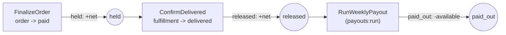
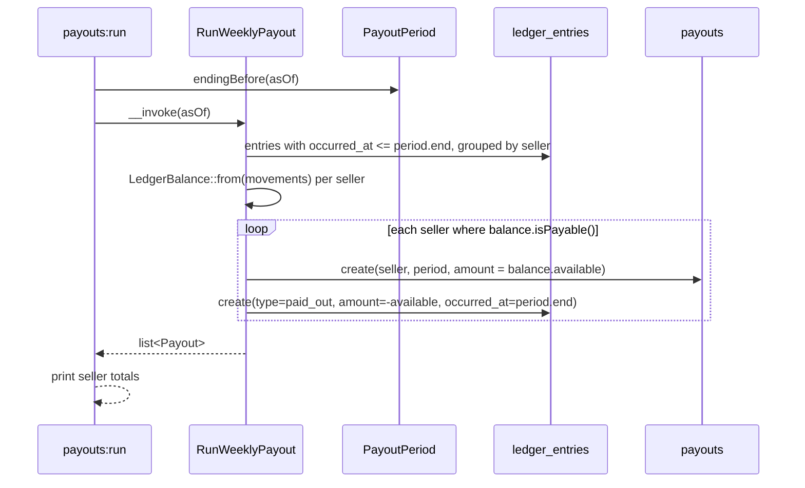

# Escrow and payouts

Per-seller money tracked in `ledger_entries`, settled weekly into `payouts`.
Code: `app/Domain/Escrow/`, `app/Actions/Orders/FinalizeOrder.php`,
`app/Actions/Fulfillment/ConfirmDelivered.php`,
`app/Actions/Escrow/RunWeeklyPayout.php`,
`app/Console/Commands/RunWeeklyPayouts.php`.

## Ledger entry types through hold → release → payout

Question: what event writes each `ledger_entries.type`, and what does each
one do to a seller's balance?

Caveats: `amount_cents` is signed — `held` and `released` are positive,
`paid_out` is negative (`LedgerMovement::payout()` negates it). A seller's
balance (`App\Domain\Escrow\LedgerBalance::from()`) folds every entry:
`held = held − released`, `available = released + paid_out`,
`paidOut = −paid_out`. Only a fulfillment with `available > 0`
(`isPayable()`) gets a payout row.

## `payouts:run`

Question: how does the weekly payout command turn released escrow into
`payouts` rows?

Caveats: the `paid_out` entry is dated at `period.end`, not the moment the
command runs — that is what makes re-running the same period a no-op (the
money is already inside `occurred_at <= period.end` on the next run, so it
nets to zero and `isPayable()` is false). `payouts` also has
`unique(seller_id, period_start)`. `PayoutPeriod::endingBefore()` is pure —
Monday–Sunday, `asOf`'s most recently completed week.

## Worked example

A $100.00 listing, one unit, one seller, no other activity that period.

| Step | Action | `ledger_entries` written | Seller balance |
| --- | --- | --- | --- |
| Order placed, card approved | `FinalizeOrder`: `Fee::platform($100.00)` = $10.00, `Fee::net($100.00)` = $90.00; `LedgerMovement::hold($90.00)` | `held +9000` | held $90.00, available $0.00 |
| Customer confirms delivery | `ConfirmDelivered`: `LedgerMovement::release($90.00)` | `released +9000` | held $0.00, available $90.00 |
| `payouts:run` (period ends) | `RunWeeklyPayout`: balance is payable, pays $90.00; `LedgerMovement::payout($90.00)` | `paid_out -9000` | available $0.00, paid out $90.00 lifetime |

`Fee::platform()` is 10% of the item subtotal (`Fee::PLATFORM_PERCENT`),
taken at `held`; `net = subtotal − fee`. The fee is computed once, in
`PlaceOrder`, and stored on the `fulfillments` row (`fee_cents`,
`net_cents`) — `FinalizeOrder` and `ConfirmDelivered` move `fulfillment.net()`
through escrow rather than recomputing it.
