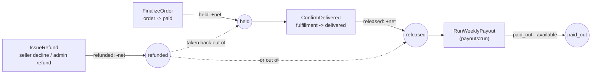
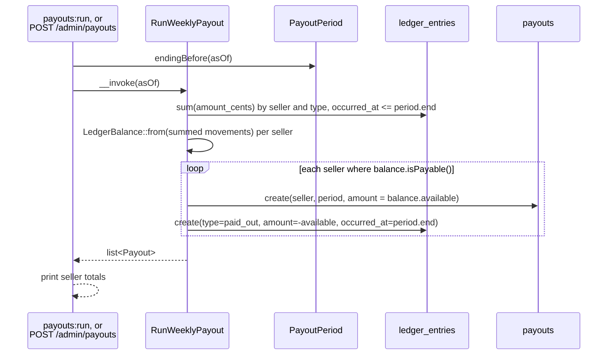

# Escrow and payouts

Per-seller money tracked in `ledger_entries`, settled weekly into `payouts`.
Code: `app/Domain/Escrow/`, `app/Actions/Orders/FinalizeOrder.php`,
`app/Actions/Fulfillment/ConfirmDelivered.php`,
`app/Actions/Escrow/IssueRefund.php`,
`app/Actions/Escrow/RunWeeklyPayout.php`,
`app/Console/Commands/RunWeeklyPayouts.php`,
`app/Http/Controllers/Admin/PayoutController.php`,
`app/Http/Controllers/Admin/RunPayoutController.php`.

Running a payout is a platform action: the CLI (`payouts:run`) and
`POST /admin/payouts` are the only two entry points, and both call
`RunWeeklyPayout` — the admin route for every seller in one run, the same as
the CLI. The seller portal shows a seller their held / available / paid-out
balance and their payout history on `/seller/earnings` and offers no control
that runs one: paying sellers is a platform action (docs/alignment.md §5).

## Ledger entry types through hold → release → payout

Question: what event writes each `ledger_entries.type`, and what does each
one do to a seller's balance?

Caveats: `amount_cents` is signed — `held` and `released` are positive,
`paid_out` and `refunded` are negative (`LedgerMovement::payout()` and
`::refund()` negate them). Only a seller with `available > 0` (`isPayable()`)
gets a payout row, which is also what makes a negative balance carry forward.

## Where a refund comes out of

Question: a `refunded` entry is always `−net`, so which balance does it drop —
and how does the fold know?

A refund takes the money back from wherever that fulfillment's money is
sitting: out of escrow while it is still held, out of the available balance
once delivery released it. Which of the two it is **cannot be read from a
seller's totals alone** — one sale refunded after release and another still
held sum to exactly the same three numbers as the reverse — so
`App\Domain\Escrow\LedgerBalance::from()` groups the movements by
fulfillment before it adds them up, and `LedgerEntry::totalledByType()` groups
in SQL by `(seller_id, fulfillment_id, type)` to match. Payouts name no
fulfillment and fall into a group of their own.

Per fulfillment, with `escrow = held − released` and `refund = −refunded`:

|              |                                                  |                       |
| ------------ | ------------------------------------------------ | --------------------- |
| `fromEscrow` | `max(0, min(escrow, refund))`                    | what escrow can cover |
| `held`       | `+= escrow − fromEscrow`                         |                       |
| `available`  | `+= released + paid_out + refunded + fromEscrow` |                       |

What escrow cannot cover leaves the available balance negative. That is the
intended reading — the seller owes the platform — and the next payout period
settles it.

## The three refund timings

| Timing                                         | Entries for the fulfillment                     | Held                          | Available       |
| ---------------------------------------------- | ----------------------------------------------- | ----------------------------- | --------------- |
| Refund before release (decline, or an admin    | `held +net`, `refunded −net`                    | back to `0`; nothing releases | `0`             |
| refund of an unshipped or shipped parcel)      |                                                 |                               |                 |
| Refund after release (delivered, then          | `held +net`, `released +net`, `refunded −net`   | `0`                           | drops by `net`  |
| refunded)                                      |                                                 |                               |                 |
| Refund after payout                            | `held +net`, `released +net`, `paid_out −net`,  | `0`                           | `−net`, carried |
|                                                | `refunded −net`                                 |                               |                 |

In this prototype escrow is released on **delivery**, so an admin refund of a
`shipped` fulfillment is still a refund before release. §4.2 of
`docs/alignment.md` groups shipped and delivered together as "after release";
the arithmetic is the same either way, because the fold reads which of the two
happened from the fulfillment's own entries rather than from its status.

A payout of `≤ 0` writes no `paid_out` row at all, so the negative available
balance survives the period and is netted against the seller's next sale
before anything is paid — `RunWeeklyPayoutTest` walks both halves of that.

The platform fee on a refunded fulfillment is **forgone**: the `refunded` entry
runs the whole `net_cents` back out and the `fee_cents` is never collected as
revenue. Accounting reads `fees_earned_cents` over fulfillments that are not
declined or refunded (`FulfillmentStatus::isLive()`) and reports
`fees_refunded_cents` beside it; `/admin/accounting` surfaces both.

## `payouts:run`

Question: how does the weekly payout command — or the admin site's own payout
run — turn released escrow into `payouts` rows?

Caveats: the `paid_out` entry is dated at `period.end`, not the moment the
command runs — that is what makes re-running the same period a no-op (the
money is already inside `occurred_at <= period.end` on the next run, so it
nets to zero and `isPayable()` is false). `payouts` also has
`unique(seller_id, period_start)`. `PayoutPeriod::endingBefore()` is pure —
Monday–Sunday, `asOf`'s most recently completed week.

| Way in            | Command                                                      |
| ----------------- | ------------------------------------------------------------ |
| CLI, current week | `php artisan payouts:run` — settles the week that just ended |
| CLI, a named week | `php artisan payouts:run --as-of=2026-08-24`                 |
| Make              | `make payouts`, or `make payouts AS_OF=2026-08-24`           |
| Admin site        | `POST /admin/payouts` with an `as_of` field                  |

## Worked example

A $100.00 listing, one unit, one seller, no other activity that period.

| Step                                  | Action                                 | `ledger_entries` written | Seller balance                         |
| ------------------------------------- | -------------------------------------- | ------------------------ | -------------------------------------- |
| Order placed, card approved           | `FinalizeOrder`:                       | `held +9000`             | held $90.00, available $0.00           |
|                                       | `Fee::platform($100.00)` = $10.00,     |                          |                                        |
|                                       | `Fee::net($100.00)` = $90.00;          |                          |                                        |
|                                       | `LedgerMovement::hold($90.00)`         |                          |                                        |
| Customer confirms delivery            | `ConfirmDelivered`:                    | `released +9000`         | held $0.00, available $90.00           |
|                                       | `LedgerMovement::release($90.00)`      |                          |                                        |
| `payouts:run` (period ends)           | `RunWeeklyPayout`: balance is payable, | `paid_out -9000`         | available $0.00, paid out $90.00       |
|                                       | pays $90.00;                           |                          | lifetime                               |
|                                       | `LedgerMovement::payout($90.00)`       |                          |                                        |
| Admin refunds the dispute a week      | `RefundFulfillment` → `IssueRefund`:   | `refunded -9000`         | available −$90.00, carried             |
| later                                 | `LedgerMovement::refund($90.00)`       |                          |                                        |
| `payouts:run` (next period, no other  | balance is not payable, nothing        | —                        | available −$90.00, still carried       |
| sales)                                | written                                |                          |                                        |

`Fee::platform()` is 10% of the item subtotal (`Fee::PLATFORM_PERCENT`),
taken at `held`; `net = subtotal − fee`. The fee is computed once, in
`PlaceOrder`, and stored on the `fulfillments` row (`fee_cents`,
`net_cents`) — `FinalizeOrder` and `ConfirmDelivered` move `fulfillment.net()`
through escrow rather than recomputing it.
