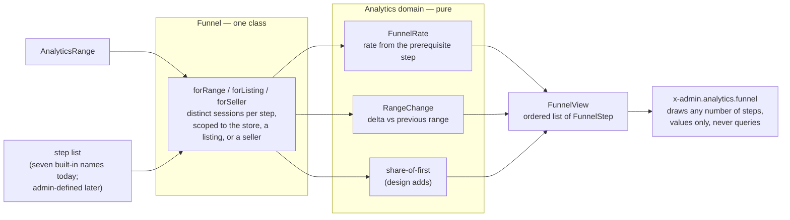

# The funnel

The boundary between the query that produces a funnel's steps and the
component that draws them, and the contract that crosses it. Code:
`app/Analytics/Admin/{Funnel,FunnelView,FunnelStep}.php`,
`app/Domain/Analytics/{FunnelRate,RangeChange,BarStrip}.php`,
`resources/views/components/admin/analytics/funnel.blade.php`. See
`docs/analytics.md` § "The funnel" for the event vocabulary and scopes
(`forRange`/`forListing`/`forSeller`) the query reads.

## Data flow

Question: what produces a funnel step, what computes on it, and what
draws it?

`Funnel` is the one class that reads `analytics_events`; it takes a range
and a scope and returns a `FunnelView`. `FunnelRate` and `RangeChange` are
pure — no I/O, no reference to the request or the database — and so is the
share-of-first computation the design adds. All three live under
`App\Domain\Analytics`; `Funnel` is their only caller.
`x-admin.analytics.funnel` receives a `FunnelView` and renders it: values
only, formatted numbers and pre-computed widths, the query and every
percentage already done by the time the component sees them.

## The step contract

`FunnelStep` is what crosses the boundary — one value per step, nothing a
step needs computed twice. The design's accepted canvas draws every field
below.

| Field                  | Meaning                                                                             | Today                                 |
| ----------------------- | ------------------------------------------------------------------------------------ | -------------------------------------- |
| `key`                   | the event name the step counts, or `visitors` for the first step                     | absent                                 |
| `label`                 | the heading a reader sees ("Viewed a listing")                                       | `FunnelStep::$label`                   |
| `current`               | the step's count for the range                                                       | `FunnelStep::$current`                 |
| `previous`              | the step's count for the range before                                                | `FunnelStep::$previous`                |
| `change`                | `RangeChange` between `current` and `previous`                                       | `FunnelStep::$change`                  |
| `rate`                  | `FunnelRate` against the step's prerequisite, carrying the prerequisite's own label   | `FunnelStep::$rate` (null on the first step) |
| `shareOfFirst`          | `current` as a share of this range's first step                                      | absent — the Blade component computes it today |
| `previousShareOfFirst`  | `previous` as a share of the previous range's own first step                         | absent                                 |
| `isLargestDrop`         | true on the one step with the lowest `rate` among steps that carry one               | absent                                 |
| `note`                  | an optional line below the footer (the paid step's "N cancelled")                    | `FunnelStep::$note`                    |
| `side`                  | an optional line naming a non-path metric on a step (the viewed step's "N favorited") | absent                                 |

`key`, `shareOfFirst`, `previousShareOfFirst`, and `isLargestDrop` are what
the design adds. The component draws `shareOfFirst` and
`previousShareOfFirst` as the two bars and reads `isLargestDrop` to place
the badge — it must not compute a share, a ratio, or a "which step is
worst" comparison itself. `funnel.blade.php` does this today: `$first =
$funnel->steps[0]->current; $shareOf = fn (int $current): int => …` is
exactly the computation the design moves into `Funnel`, so the component
goes back to drawing values only.

## The unit decision

Every step counts distinct sessions among the events that qualify for it,
the same shape `Funnel::visitorTotals()` already uses for the visitors
step (`count(distinct session_id)`). A step is a subset of its
prerequisite's sessions, so no step's count can exceed the one before it
and no bar can exceed its container.

`Funnel` does not do this today: `nameTotals()` counts events
(`sum(case when … then 1 else 0 end)`), so a session that views the same
listing three times inflates the "listing views" step past the visitor
count that produced it. Moving every event-count step to
`count(distinct session_id)` is the change the unit decision requires,
independent of which favorites option is chosen.

Favorites sits off the buying path — a viewer may favorite a listing they
never add to cart, and a cart add never depends on having favorited. Two
options for where it renders, both compatible with the session-count
change above:

- **Primary (the accepted design).** Favorites is a side metric on the
  viewed step: `App\Analytics\Admin\Funnel` computes the count of sessions
  that favorited within the scope and attaches it as that step's `side`
  ("98 favorited"), never becoming a step of its own. The ordered step
  list stays six steps plus visitors.
- **Option B.** Favorites stays a step, the way the current seven-tile row
  already draws it. `Funnel` would need favorites' session count to be a
  subset of the viewed step's session count — a session that favorited
  without viewing (a listing favorited by id from an actor's own page, or
  a stale row from data drift) would otherwise put a bar past its
  container.

Which option ships is the human's decision; the design canvas shows the
primary option in `Main.dc.html`/`Dark.dc.html`/`Listing.dc.html`/
`Phone.dc.html` and Option B in `OptionB.dc.html`.

## Drawing rules

The design follows Tailwind Plus Application UI › Data Display › Stats,
the "with shared borders" grid (a one-pixel hairline gap between cells, no
per-cell border — the admin dashboard's own stat row already uses this
grid) and the "with trending" variant's delta glyph (a small up/down
chevron beside a colored percentage, next to the label).

**Cell anatomy, top to bottom:**

1. Label and delta glyph, on one row, space-between.
2. The count, large and bold, tabular figures; the "largest drop" badge
   sits inline beside it when this step carries one.
3. Two stacked bars: an 8px bar for this range's share of the first step,
   directly beneath it a thinner 4px "ghost" bar for the previous range's
   share of its own first step. A `title` attribute on the pair carries
   the exact counts ("this range 128 · previous 42") for a reader who
   wants the numbers a hover shows on a chart.
4. The footer line: "x% of `<prerequisite label>`" alone when the step has
   no upstream comparison to add, or "x% of `<prerequisite label>` · y% of
   visitors" when the prerequisite is not visitors itself. The visitors
   step's own footer is blank (`&nbsp;`) — it has no prerequisite.
5. An optional side note below the footer, offset by a small top margin
   (the viewed step's "98 favorited", the paid step's "6 cancelled").

**Bars.** Both bars scale to a share of the first step's count — the top
of the funnel — so the row narrows left to right the way a funnel does.
Every bar floors at 2% width so a real zero still reads as a sliver
distinct from an empty cell. The ghost bar is the one exception: when the
previous range's own first-step count is zero (nothing to be a share of —
the "new" case), it draws at 0% width, with no data to represent.

**The largest-drop badge.** Placed on whichever step has the lowest `rate`
among the steps that carry one (every step but the first) — a computed
position that follows the data: the store-wide canvas puts it on "Opened
checkout"; the single-listing canvas puts it on "Added to cart", where
that listing's own worst conversion sits one step earlier.

**Dark variant.** Page background `#030712`; cell background `#1c1917`;
the hairline gap and outer ring become `rgba(255,255,255,0.1)`; label and
footer text `#a8a29e`; the count `#f5f5f4`; the "this range" bar `#a8a29e`
over an `#292524` track, the ghost bar `#57534d`; the up-delta glyph
`#4ade80`; the "largest drop" badge `#451a03` background on `#fbbf24`
text.

**Phone layout.** The grid collapses to one column
(`grid-template-columns: repeat(1, …)`); every cell keeps the same
anatomy, stacked top to bottom instead of side by side — no cell is
redesigned for the narrow width.

## What an admin-defined funnel needs

The seven-step list `Funnel::EVENT_NAMES` hard-codes today becomes data: an
ordered list of `{key, label}` entries an admin defines, each `key` an
`AnalyticsEventName` value. `Funnel::build()` takes that list as a
parameter instead of the fixed wiring it does today, and resolves each
step's prerequisite by a rule that defaults to "the entry before it in the
list" with room for the same kind of exception cart adds already needs —
its own prerequisite is views, the entry before favorites in the list.
Once the step contract above
lands, `x-admin.analytics.funnel` changes nothing further: it already
draws whatever `FunnelView` it is handed, so a four-step channel funnel
and the seven-step storefront funnel render through the same component.
