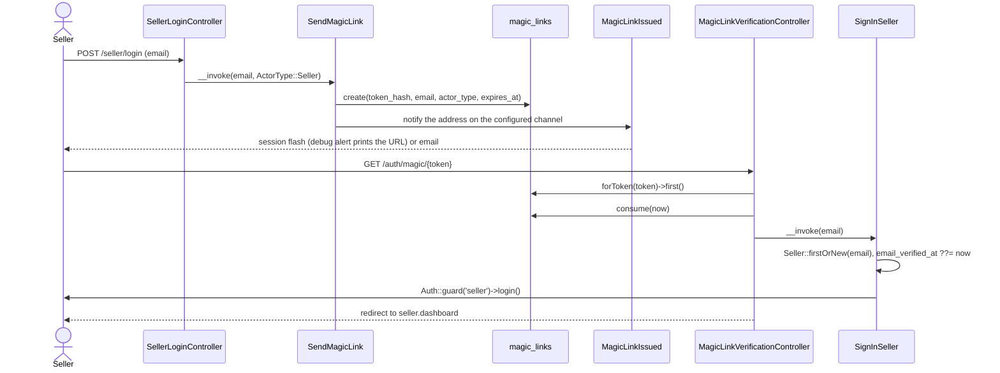
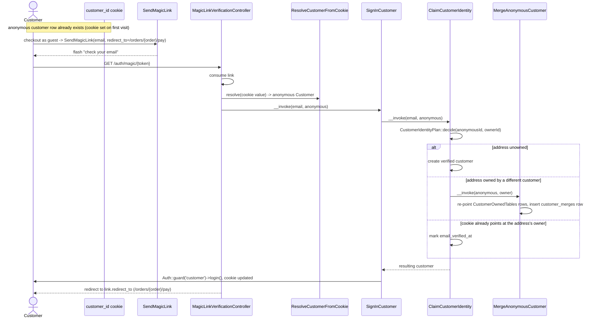
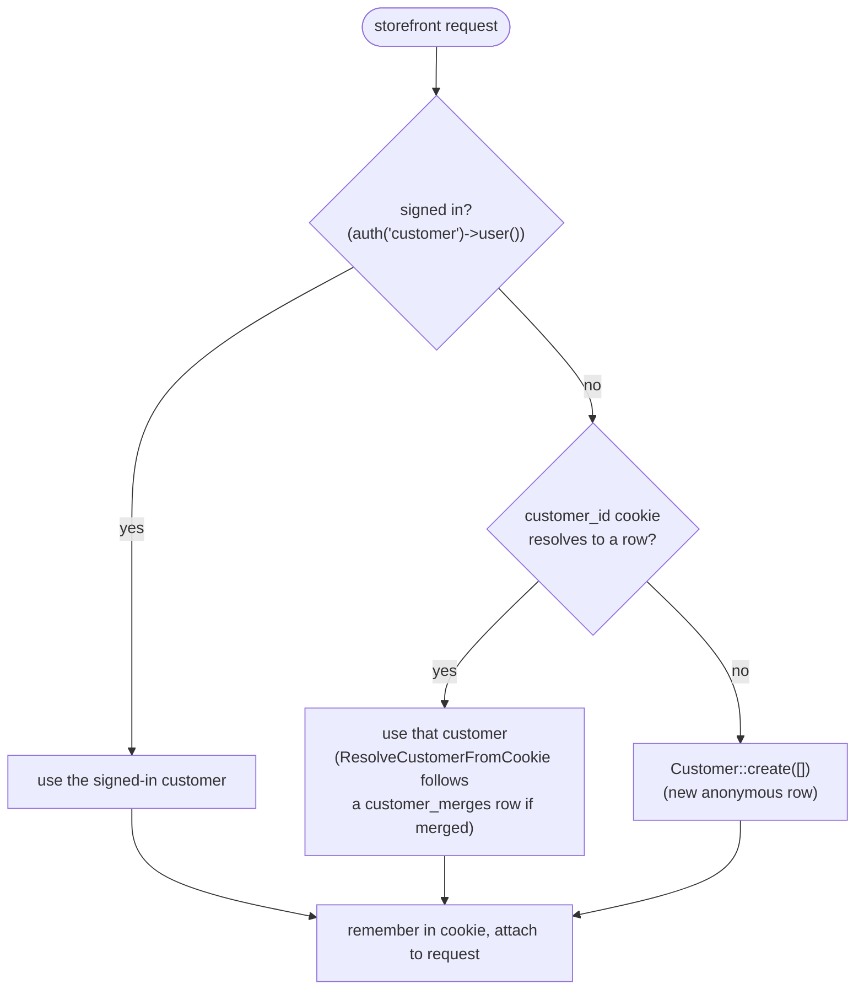

# Identity

Passwordless sign-in for both sites, plus the anonymous-customer cookie the
storefront hangs favorites, carts, and guest orders on before anyone verifies
an address. Code: `app/Actions/Auth/`, `app/Actions/Customers/`,
`app/Http/Middleware/ResolveCustomerIdentity.php`,
`app/Domain/Customers/CustomerIdentityPlan.php`.

## Seller magic-link sign-in

Question: what happens between a seller submitting an email and landing on
the dashboard?

Caveats: the link goes to an address, not to a row —
`Notification::route(MagicLinkIssued::channel(), $address)` — because a
first-time email creates the seller row, and there is no separate sign-up
step. An expired or already-consumed link redirects back to
`auth.seller.login` with an error instead of reaching `SignInSeller`.

## Customer guest verification with anonymous merge

Question: when a guest verifies an email mid-checkout, which customer row
ends up owning the order — and what happens to the anonymous one?

Caveats: `MergeAnonymousCustomer` walks
`App\Domain\Customers\CustomerOwnedTables::all()` inside a transaction and
skips any table/column that does not exist yet (guards schema drift across
tickets landing in parallel). The anonymous row is never deleted — the
`customer_merges` row lets a stale cookie on a second device resolve forward
to the verified customer, following as many recorded merges as it takes to
land on a row nothing else points at. Merging the same anonymous customer
into the same verified one twice writes one `customer_merges` row —
`customer_merges.anonymous_customer_id` is unique, and the action reads that
row back with `firstOrCreate` instead of failing on it.

A `redirect_to` naming a `/seller` path is never followed on a customer link,
even when it is otherwise local: the link falls back to `shop.account`. A
customer link carries no seller session, so following it there would only land
on the seller login wall. Both halves of that answer are the domain's:
`LocalRedirect::resolve($requested, $actor, $fallback, $origin)` keeps a target
only when it stays on this site and `ActorType::allowsPath()` says the actor
belongs on it.

## Which identity a storefront request resolves to

Question: given a request, which customer does `CustomerIdentity::current()`
return?

Caveats: this is `App\Http\Middleware\ResolveCustomerIdentity`, wrapping
every route in `routes/shop.php`. It never runs on `/auth/magic/{token}`,
`/login`, or `/logout` — those read the cookie directly through
`ResolveCustomerFromCookie` so a seller clicking a seller link cannot
accidentally create a customer row.
