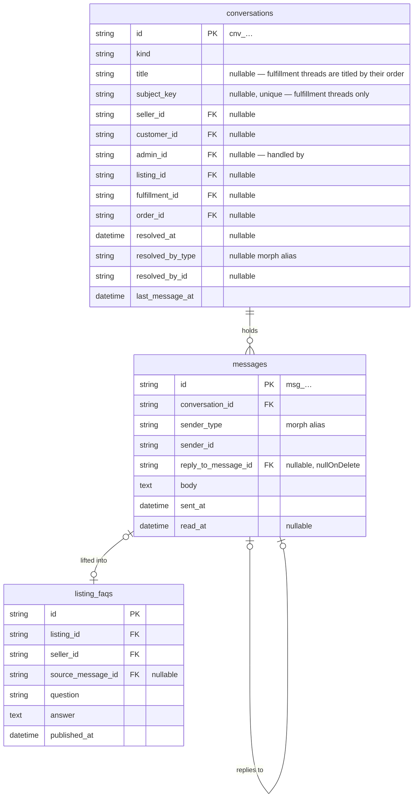
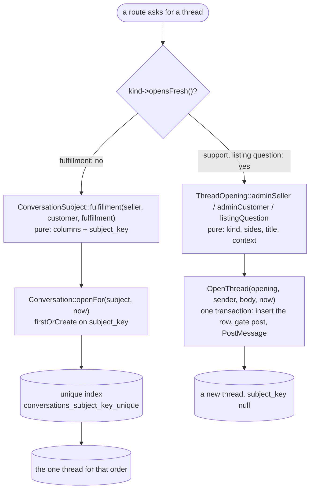
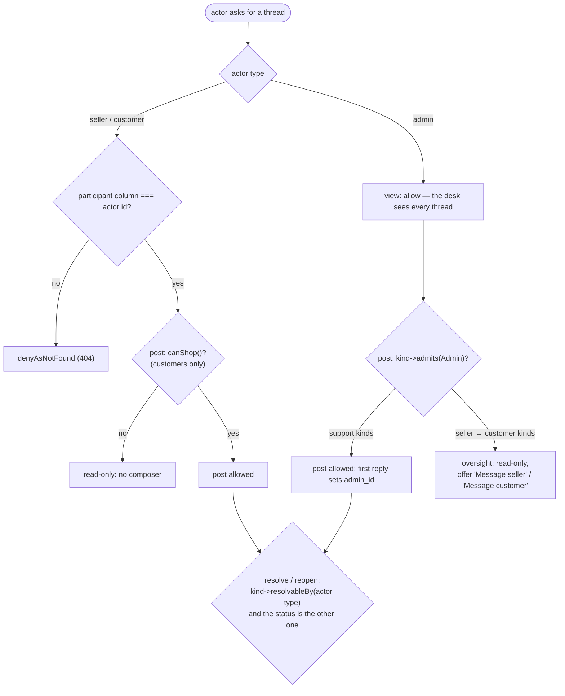
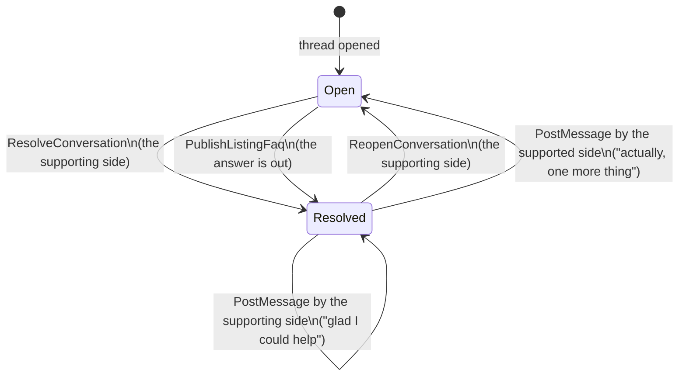
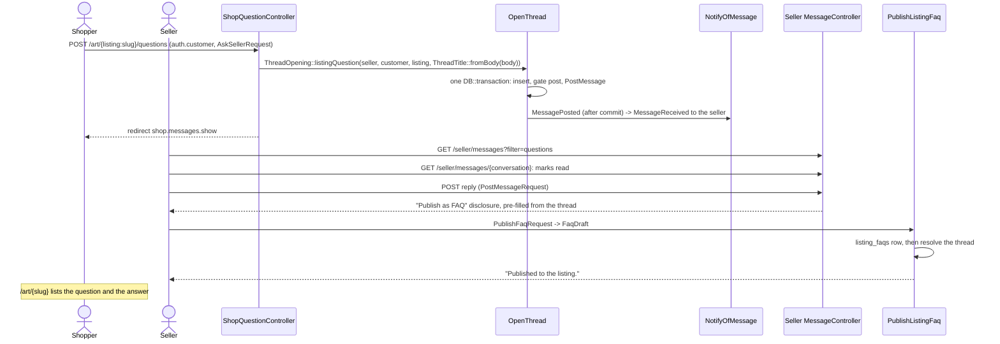
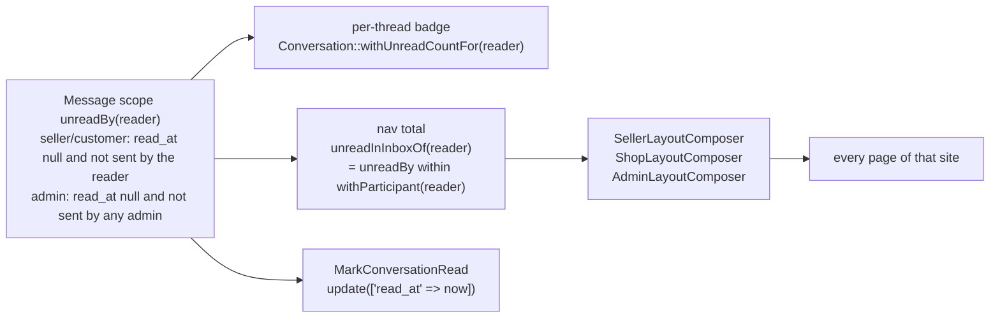
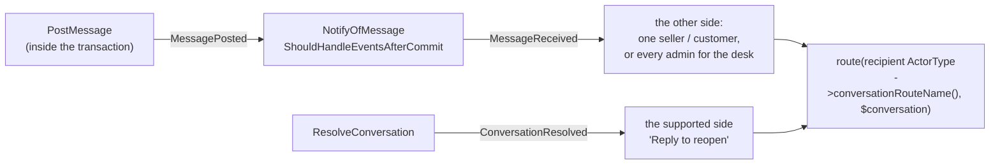

# Messaging

One conversation model serves every pairing on the marketplace. Four kinds
share one message store, threads carry a title and an open/resolved status, a
message can reply to another, and one of the kinds carries the product feature
that pays for it: a customer's question on a listing, answered by the seller,
published as an FAQ entry the whole storefront can read.

Code: `app/Domain/Messaging/`, `app/Actions/Messaging/`,
`app/Models/Conversation.php`, `app/Models/Message.php`,
`app/Models/ListingFaq.php`, `app/Policies/ConversationPolicy.php`,
`app/Http/Controllers/{Seller,Shop,Admin}/MessageController.php` and the
per-site open/resolve controllers beside them, `app/Events/MessagePosted.php`,
`app/Listeners/NotifyOfMessage.php`, `app/Notifications/MessageReceived.php`,
`app/Notifications/ConversationResolved.php`, `app/Support/ActorDisplay.php`,
`app/View/Composers/`, `public/composer.js`. Tables:
`database/migrations/*_create_messaging_tables.php`.

## The four kinds

`conversations.kind` says who the two sides are, which context columns the
row fills, whether an ask opens a fresh thread or finds the one that exists,
and which side may mark the thread resolved
(`App\Domain\Messaging\ConversationKind`).

| `kind`             | Sides                           | Context columns                                | Opens          | Resolved by |
| ------------------ | ------------------------------- | ---------------------------------------------- | -------------- | ----------- |
| `admin_seller`     | support desk ↔ `seller_id`      | `fulfillment_id` optional (a seller's order)   | fresh, titled  | admin       |
| `admin_customer`   | support desk ↔ `customer_id`    | `order_id` optional (the customer's order)     | fresh, titled  | admin       |
| `fulfillment`      | `seller_id` ↔ `customer_id`     | `fulfillment_id` required                      | find-or-open   | seller      |
| `listing_question` | `seller_id` ↔ `customer_id`     | `listing_id` required                          | fresh, titled  | seller      |

Every thread has exactly two **sides**. That is the invariant the rest of the
design rests on: one `read_at` per message is unambiguous, because the reader
is always the side that did not send it. On the two support kinds one side is
the **desk** — every admin, collectively — rather than one admin row. The
`admin_id` column no longer gates participation; it records which admin first
answered ("handled by") and is null until one does.

`listing_question` is the conversation a seller and a customer have **before**
any order exists: a shopper asking about a piece they have not bought. It
needs no order and no cart, only a signed-in customer and a listing that is
for sale. `fulfillment` is the conversation they have **after** one: it is
opened from the order page on either side and named by the order.

`ConversationKind` answers questions about itself the way `OrderStatus` and
`ListingStatus` do — `participantColumns()`, `contextColumns()`,
`opensFresh()`, `isDesk()`, `admits(ActorType)`, `resolvableBy(ActorType)`,
`topic(...)` — so no controller and no Blade file branches on a kind value.

Each site reads the same threads through its own routes.
`ActorType::conversationRouteName()` and `ActorType::inboxRouteName()` name
them, so the notification a post sends links to the thread on the
**recipient's** site rather than the sender's.

## A thread's shape

`title` is a `ThreadTitle` value object (`MAX_LENGTH` 120). A seller or a
customer types it when they open a support thread; a listing question derives
it from the question itself (`ThreadTitle::fromBody()`: the first line,
cut at 80 characters with an ellipsis); a fulfillment thread has none and is
named by its order everywhere it appears.

## Opening a thread

Question: two people reach for a conversation from two pages — when does the
second ask find the first one's thread, and when does it open its own?

Caveats: a fulfillment is one conversation. A shopper and a seller talking
about one order should land in one place however many pages offer the way in,
so the fulfillment kind keeps the find-or-open shape and the `subject_key`
unique index that makes `firstOrCreate` a real find-or-open under contention.
The key exists because SQL treats `null` as distinct from `null` in a unique
index; one non-null string column has no such hole.

The other three kinds open fresh. A support issue is a thread with a title;
a seller with two issues has two threads, and the resolved one stays resolved
while the new one is answered. A listing question is one question: each
"Ask a question" opens its own thread, which is what lets the seller's queue
read one question per row and lets "Publish as FAQ" lift exactly that
question and its answer. Their `subject_key` is null, which the unique index
ignores.

`OpenThread` runs the insert, the `post` gate, and `PostMessage` inside a
single `DB::transaction`, so a refused first message (a blocked customer)
rolls the row back with it and leaves nothing behind. It replaces
`OpenConversationWithMessage`. `OpenConversation` (fulfillment) still opens
an empty thread and redirects to it, since the actor types the first message
on the page they land on.

The rate limit `conversation_open` (`10/1h` per actor) guards every opening
route; `message_post` guards every reply.

## Who may read, post, and resolve

Question: given an actor and a conversation, what is that actor allowed to do?

Caveats: `ConversationPolicy` keeps `FulfillmentPolicy`'s shape. `view` for a
seller or customer answers ownership alone and denies as not found, so a
thread somebody else is in and a thread that never existed answer the same.
`view` for an admin always allows: the desk's brief is to see everything, and
the admin inbox lists every thread on the marketplace. `post` is `view` plus
standing — `canShop()` for a customer, `admits(Admin)` for an admin. The desk
never posts into a seller ↔ customer thread: the two-sides invariant is what
keeps `read_at` and the notification recipient unambiguous, so an admin who
needs to step in opens their own support thread with either party from the
buttons the oversight view offers, carrying the order or listing as context.

`resolve` and `reopen` belong to the supporting side: the seller on the two
kinds a seller answers, the desk on the two support kinds. A customer never
resolves; a customer reopens by replying (below).

The composer is offered by the same policy that guards the write —
`@can('post', $conversation)` on the seller portal and the admin site,
`@visitorCan('post', $conversation)` on the storefront — and the write route's
form request authorizes it again. An admin reading an oversight thread does
not mark it read: `MarkConversationRead` is called only where `post` allows.

## Open and resolved

Question: what does "resolved" mean, who sets it, and what unsets it?

Caveats: `ConversationStatus` (`Open`, `Resolved`) is read from `resolved_at`.
`ConversationStatus::afterPostBy(ActorType, ConversationKind)` is the one pure
rule `PostMessage` applies: a post from an actor the kind does not let resolve
reopens a resolved thread; a post from the side that could have resolved it
leaves the status alone. `ResolveConversation` and `ReopenConversation` refuse
a thread already in that state with a `DomainRuleViolation`, which
`bootstrap/app.php` turns into `back()->withErrors(...)`. Both write
`resolved_at` and the `resolved_by` morph pair, log `conversation.resolve` /
`conversation.reopen`, and `ResolveConversation` sends `ConversationResolved`
to the supported side with the thread's URL on their site — "Reply to
reopen" is the whole escape hatch, so nobody is locked out of a thread.

Publishing an FAQ resolves the question thread its source message belongs to,
when it is still open: the answer is on the listing for everyone, which is
what answering meant.

Inboxes default to open threads. The status filter (`open`, `resolved`,
`all`) is a query parameter on every inbox route, as `filter` is.

## Replying to a message

Question: a thread is twelve messages long and the answer refers to the
third — how does the reader see which?

`messages.reply_to_message_id` names the message a reply quotes, and must
belong to the same thread (`PostMessage` refuses otherwise with a
`DomainRuleViolation`). The thread renders the quoted message's sender and
first line above the reply, linking to `#msg_…` on the original. The composer
gets there through the URL: every message carries a "Reply" link to the thread
route with `?reply_to=msg_…`, the controller resolves it (same thread, else
ignored), the composer shows "Replying to Hermione — *Does this vase…*" with a
Cancel link back to the bare thread, and a hidden `reply_to_message_id` rides
the POST. No JavaScript is required for any of it. `nullOnDelete` on the
column means a quoted message that is ever removed leaves its replies intact.

## The composer

One behaviour on three sites, each in its own dress. The Blade pieces are per
site (`components/seller/messaging/composer.blade.php`,
`components/messaging/body-form.blade.php` for the admin, the storefront's own
partial); the behaviour is shared:

- The textarea grows with its content (`field-sizing: content`, between three
  and twelve rows; browsers without it keep three rows and scroll).
- `Cmd`/`Ctrl`+`Enter` submits; `Enter` alone is a newline. `public/composer.js`
  (~15 lines, `<script defer>` on every layout that has a composer) does only
  that and the live counter; without it the form still posts.
- A counter shows `1,240 / 2,000`; the limit is read from
  `MessageBody::MAX_LENGTH` in the Blade file, and the same constant fills
  `maxlength`, so the client hint and the server rule cannot drift.
- The reply-quote block sits above the textarea when `?reply_to` names a
  message.
- Over-length and rate-limited submissions come back through `old('body')`
  into the same textarea, with `old('reply_to_message_id')` preserved.

## A question becomes a published FAQ

Question: what runs between a shopper asking about a listing and that answer
appearing on the listing page for everyone?

Caveats: asking needs a **verified** customer. The question route sits inside
`auth.customer`; a signed-out visitor sees "Sign in to ask Sybill a question"
in the form's place, and the magic link brings them back to the listing. The
same holds for `/support`. Threads a customer already holds still follow them
through the merge (below). This reverses the earlier decision that let an
anonymous cookie ask: a question is the start of a relationship, and a
relationship needs an address to reach.

A `listing_faqs` row exists **only while it is published**. `published_at` is
`not null`, unpublishing deletes the row, and the storefront reads
`$listing->faqs` with no predicate of its own. `source_message_id` records
which answer an entry was lifted from and is `nullOnDelete`.

The limits are domain constants the form requests read:
`MessageBody::MAX_LENGTH` (2000), `ThreadTitle::MAX_LENGTH` (120),
`FaqDraft::QUESTION_MAX_LENGTH` (500), `FaqDraft::ANSWER_MAX_LENGTH` (2000).
`PostMessageRequest::body()` returns a `MessageBody`, `OpenThreadRequest`
returns a `ThreadTitle` and a `MessageBody`, `PublishFaqRequest::draft()`
returns a `FaqDraft`, so a controller receives the value object rather than a
string bag. Every `maxlength` in Blade reads the constant.

## What a block does

An admin blocks a customer with a reason (`customer_blocks`, at most one
active per customer). `Customer::canShop()` turns false: `AddToCart`,
`PlaceOrder`, `FinalizeOrder` refuse with a `DomainRuleViolation`, and
`ConversationPolicy::post` denies, so the composer is not rendered and a
submission anyway is refused with the policy's words. Browsing, favoriting
and reading threads stay open. `OpenThread`'s transaction means a blocked
customer's ask leaves no row. Lifting the block (`lifted_at`) restores all of
it.

## Unread counts

Question: where does the number on every layout's Messages link come from?

Caveats: one `#[Scope]` method on `Message` is the single definition. For a
seller or a customer a message is unread when `read_at` is null and that
reader did not send it. For an admin the reader is the desk: unread when
`read_at` is null and `sender_type` is not `admin`, so Anna's reply is never
unread for Jonathan, and Jonathan opening a thread reads it for Anna too. Two
admins are one desk; per-admin read state is a later concern with an
assignment model behind it.

`Conversation::withParticipant(reader)` is the inbox's membership query: the
seller's and customer's own column, and for an admin the two desk kinds. The
oversight threads (seller ↔ customer) are listed on the admin inbox through a
separate scope and never count toward the admin's badge, since nobody on the
desk is waited on there.

## Inbox filters and the seller's queue

Every inbox takes `?filter=` and `?status=`; unknown values answer 400 the way
`docs/alignment.md` §5 says.

| Site   | `filter` values                                                 | Default sort                                   |
| ------ | --------------------------------------------------------------- | ---------------------------------------------- |
| Seller | `all`, `unread`, `questions`, `orders`, `support`               | `last_message_at` desc; `questions` lists      |
|        |                                                                 | unanswered first (last message not the seller's) |
| Admin  | `needs-reply`, `all`, `sellers`, `customers`, `orders`,         | `last_message_at` desc                         |
|        | `questions`                                                     |                                                |
| Shop   | `all`, `unread`                                                 | `last_message_at` desc                         |

`needs-reply` on the admin site is the desk's work queue: open desk threads
whose latest message is not an admin's. `orders` and `questions` on the admin
site are the oversight lists.

## Telling the other side

Caveats: the pipeline is the one `OrderPaid` and `FulfillmentShipped` use.
`Conversation::recipientsOf(Message)` answers the side that did not send:
one model, or every `Admin` when the desk is the other side. What a
notification says a thread is about is `ConversationKind::topic(...)` plus
the title: "Support · Payout timing" or "Order ord_… " or the listing's title.

## How a thread names its other side

`Conversation::counterpartName(viewer)` is what an inbox row and a thread
header show. A seller or customer on a desk thread sees **Art Store Support**
(`ActorDisplay::SUPPORT_DESK`), and each message names the admin who wrote it
("Anna Schmunk"), which is the relationship the desk is for. An admin sees the
seller or the customer. On an oversight thread the admin header names both
sides ("Sybill Trelawney ↔ Hermione Granger").

## Routes

Seller portal (`routes/seller.php`), all behind `auth.seller`:

| Method | Path                                      | Name                            | Purpose                                                       |
| ------ | ----------------------------------------- | ------------------------------- | ------------------------------------------------------------- |
| GET    | `/seller/messages`                        | `seller.messages.index`         | Inbox; `?filter=`, `?status=`                                 |
| GET    | `/seller/messages/{conversation}`         | `seller.messages.show`          | Thread; marks read; `?reply_to=`; FAQ disclosure on questions |
| POST   | `/seller/messages/{conversation}`         | `seller.messages.store`         | Reply (`reply_to_message_id` optional)                        |
| POST   | `/seller/messages/{conversation}/resolve` | `seller.messages.resolve`       | Mark resolved                                                 |
| POST   | `/seller/messages/{conversation}/reopen`  | `seller.messages.reopen`        | Reopen                                                        |
| GET    | `/seller/support`                         | `seller.support`                | New support thread: title, message, optional order            |
| POST   | `/seller/support`                         | `seller.support.store`          | Opens the `admin_seller` thread                               |
| POST   | `/seller/orders/{fulfillment}/messages`   | `seller.orders.messages`        | Finds or opens the `fulfillment` thread                       |
| …      | `/seller/listings/{listing}/faqs…`        | `seller.listings.faqs.*`        | Publish / reword / unpublish (unchanged)                      |

Storefront (`routes/shop.php`):

| Method | Path                                                  | Name                       | Guard              | Purpose                                              |
| ------ | ----------------------------------------------------- | -------------------------- | ------------------ | ---------------------------------------------------- |
| GET    | `/messages`                                           | `shop.messages.index`      | `customer.identity`| Inbox; `?filter=`, `?status=`                        |
| GET    | `/messages/{conversation}`                            | `shop.messages.show`       | `customer.identity`| Thread; marks read; `?reply_to=`                     |
| POST   | `/messages/{conversation}`                            | `shop.messages.store`      | `customer.identity`| Reply                                                |
| POST   | `/art/{listing:slug}/questions`                       | `shop.listing.questions`   | `auth.customer`    | Ask: opens a `listing_question` thread               |
| GET    | `/support`                                            | `shop.support`             | `auth.customer`    | New support thread form; `?order=` preselects        |
| POST   | `/support`                                            | `shop.support.store`       | `auth.customer`    | Opens the `admin_customer` thread                    |
| POST   | `/orders/{order}/fulfillments/{fulfillment}/messages` | `shop.order.messages`      | `customer.identity`| Finds or opens the `fulfillment` thread              |

Admin site (`routes/admin.php`), all behind `auth.admin`:

| Method | Path                                     | Name                        | Purpose                                                   |
| ------ | ---------------------------------------- | --------------------------- | --------------------------------------------------------- |
| GET    | `/admin/messages`                        | `admin.messages.index`      | Every thread; `?filter=`, `?status=`                      |
| GET    | `/admin/messages/{conversation}`         | `admin.messages.show`       | Thread; marks read on desk kinds; oversight otherwise     |
| POST   | `/admin/messages/{conversation}`         | `admin.messages.store`      | Reply (desk kinds)                                        |
| POST   | `/admin/messages/{conversation}/resolve` | `admin.messages.resolve`    | Mark resolved                                             |
| POST   | `/admin/messages/{conversation}/reopen`  | `admin.messages.reopen`     | Reopen                                                    |
| POST   | `/admin/sellers/{seller}/messages`       | `admin.sellers.messages`    | New `admin_seller` thread: title, message, optional order |
| POST   | `/admin/customers/{customer}/messages`   | `admin.customers.messages`  | New `admin_customer` thread: title, message, optional order |

A conversation id naming a thread a seller or customer is not in answers 404
on every read and write above. An id that matches no row answers 404 through
route-model binding.

## The merge

An anonymous customer who verifies an address takes their threads with them.
Sent messages re-point through the `sender` morph, so a message the verified
customer sent never reads as unread to them. Conversations move by column:
a fresh-opened thread (`subject_key` null) simply takes the new
`customer_id`; a fulfillment thread rebuilds its key from
`ConversationSubject::for(kind, ids)`, and where the verified customer already
holds that order's thread the moved one folds into it (messages re-point,
`last_message_at` is read back, the row is deleted). `customer_blocks` moves
with `CustomerOwnedTables`. See `docs/identity.md`.

## Costs stated

- A thread's messages are loaded whole. Threads here are tens of messages;
  pagination inside a thread is a later concern.
- The desk is every admin. With two admins sharing one read state this is
  right; a support team needs assignment and per-agent read state, which the
  `admin_id` "handled by" column is the seed of.
- `reply_to` is one level deep and renders a quote, not a nested tree.
