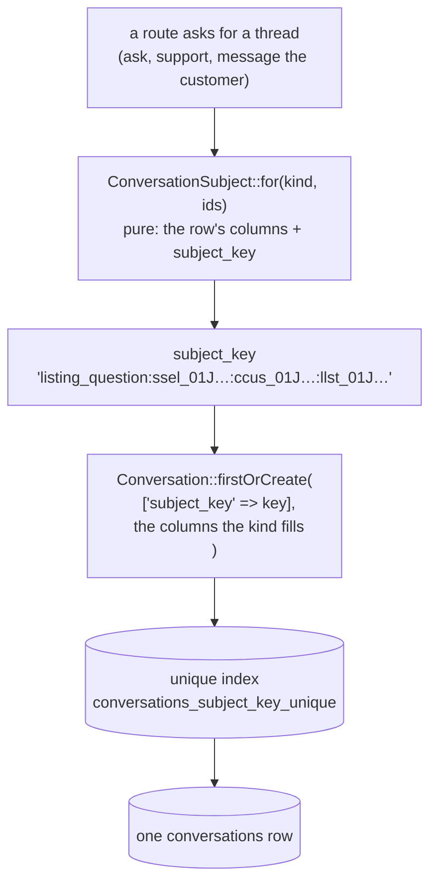
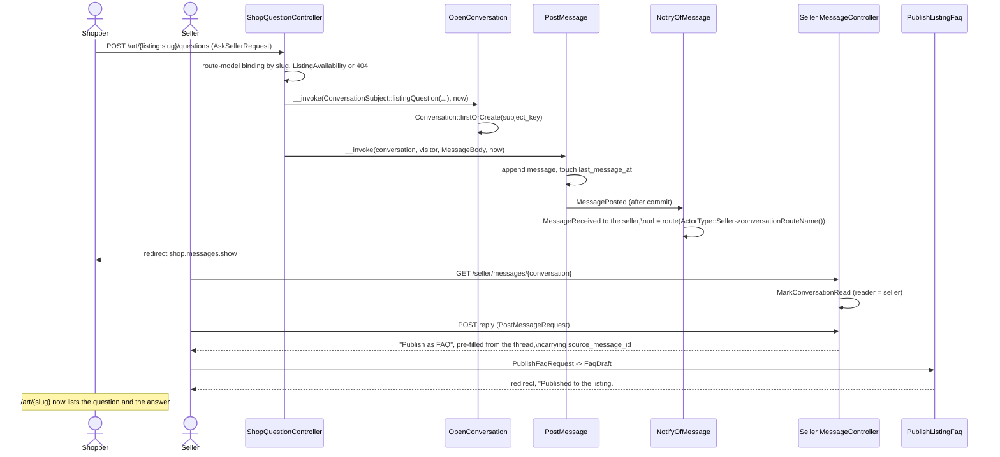
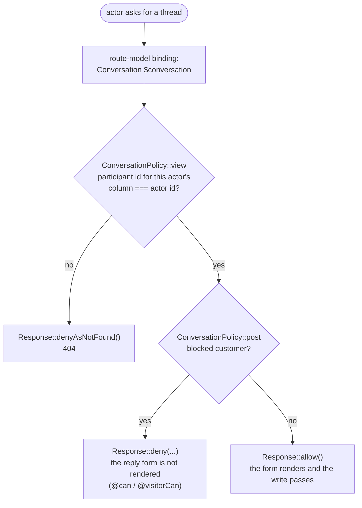
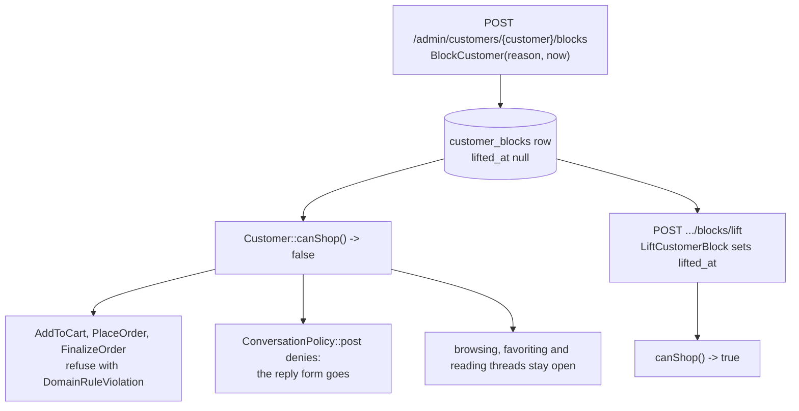
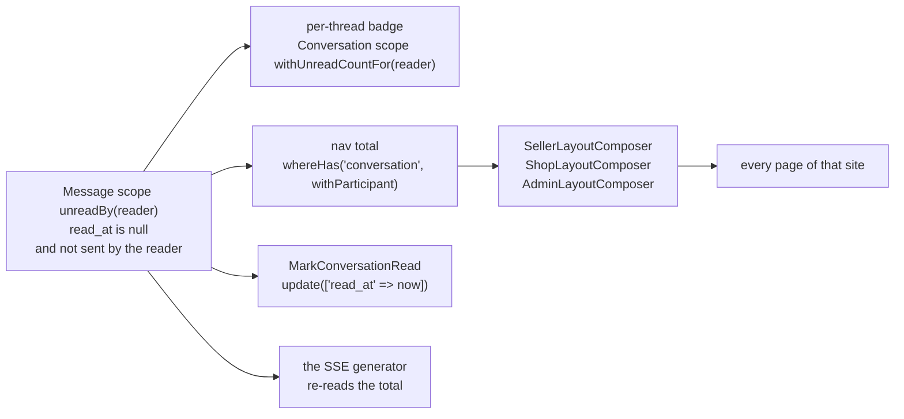
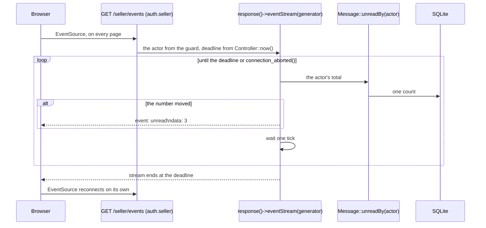
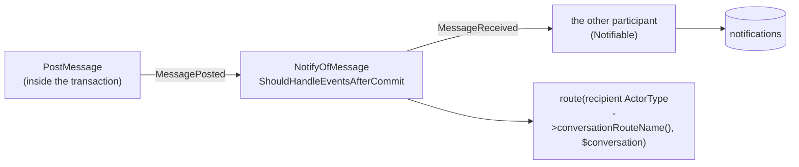

# Messaging

One conversation model serves every pairing on the marketplace, and one of the
four kinds carries the product feature that pays for it: a customer's question
on a listing, answered by the seller, published as an FAQ entry the whole
storefront can read.

Code: `app/Domain/Messaging/`, `app/Actions/Messaging/`,
`app/Models/Conversation.php`, `app/Models/Message.php`,
`app/Models/ListingFaq.php`, `app/Policies/ConversationPolicy.php`,
`app/Http/Controllers/Seller/MessageController.php`,
`app/Http/Controllers/Shop/MessageController.php`,
`app/Http/Controllers/Admin/MessageController.php`,
`app/Events/MessagePosted.php`, `app/Listeners/NotifyOfMessage.php`,
`app/Notifications/MessageReceived.php`, `app/Support/ActorDisplay.php`,
`app/View/Composers/`. Tables:
`database/migrations/*_create_messaging_tables.php`.

Four tables would repeat the same message store four times, so there is one:
`conversations.kind` says which two participant columns are filled and which
subject column, if any, names what the thread is about
(`App\Domain\Messaging\ConversationKind`).

## Conversation kinds

| `kind` | Participants | Subject column | Opened by |
| --- | --- | --- | --- |
| `admin_seller` | `admin_id` ↔ `seller_id` | — | `seller.support`, `admin.sellers.messages` |
| `admin_customer` | `admin_id` ↔ `customer_id` | — | `shop.support`, `admin.customers.messages` |
| `fulfillment` | `seller_id` ↔ `customer_id` | `fulfillment_id` | `seller.orders.messages`, `shop.order.messages` |
| `listing_question` | `seller_id` ↔ `customer_id` | `listing_id` | `shop.listing.questions` |

Every kind has exactly two participants. That is the invariant the rest of the
design rests on: one `read_at` per message is unambiguous, because the reader is
always the participant who did not send it.

`ConversationKind` answers questions about itself the way `OrderStatus` and
`ListingStatus` do — `participantColumns()`, `subjectColumn()`,
`admits(ActorType $actor)`, `topic(...)` — so no controller and no Blade file
branches on a kind value.

Each site reads the same threads through its own routes.
`ActorType::conversationRouteName()` and `ActorType::inboxRouteName()` name
them, beside the `homeRouteName()` and `loginRouteName()` that enum already
carries: the shell passes the name to `route()`, so the notification a post
sends links to the thread on the **recipient's** site rather than the sender's.

Both support routes open the thread against **the first admin by id**. Admin
rows are seeded and this prototype has no assignment model; with no admin row
at all the route redirects back with an error rather than opening a half-formed
thread.

## One thread per subject

Question: two people reach for the same conversation from two pages at the same
moment — how does one row come back to both?

Caveats: the subject is the domain's answer and the write is the model's.
`App\Domain\Messaging\ConversationSubject` is a `final readonly` value object
built by named factories — one per kind, each naming exactly the participants
and the subject row that kind needs — and `subjectKey()` folds them into the
string the unique index guards.

The key exists because SQL treats `null` as distinct from `null` in a unique
index: a unique index over `(kind, seller_id, customer_id, admin_id,
listing_id, fulfillment_id)` would let two `admin_seller` rows through, since
three of those columns are null on every one of them. One non-null string
column has no such hole, so `firstOrCreate` is a real find-or-open under
contention rather than a read followed by a hopeful insert.

The columns are still written beside the key — that is what an inbox query
reads (`where seller_id = ? order by last_message_at desc`) and what the merge
re-points.

## A question becomes a published FAQ

Question: what runs between a shopper asking about a listing and that answer
appearing on the listing page for everyone?

Caveats: an **anonymous** customer can ask. The question route sits inside the
`customer.identity` group with no `auth.customer` middleware, so the row
`ResolveCustomerIdentity` minted is the participant. If that visitor later
verifies an address, the thread moves with them (see **The merge**).

A `listing_faqs` row exists **only while it is published**. `published_at` is
`not null`, unpublishing deletes the row, and the storefront reads
`$listing->faqs` with no predicate of its own. There is no draft state and no
fourth route, because re-publishing is one click from the thread the answer
came from, which is still there. `source_message_id` records which answer an
entry was lifted from and is `nullOnDelete`.

The limits are domain constants the form requests read:
`MessageBody::MAX_LENGTH` (2000), `FaqDraft::QUESTION_MAX_LENGTH` (500),
`FaqDraft::ANSWER_MAX_LENGTH` (2000). `PostMessageRequest::body()` returns a
`MessageBody` and `PublishFaqRequest::draft()` returns a `FaqDraft`, so a
controller receives the value object rather than a string bag — the shape
`CheckoutRequest` and `MarkShippedRequest` already use. Laravel's
`TrimStrings` middleware does the trimming before either rule runs.

The Blade side of the same limit is a literal: every `<textarea maxlength="…">`
and `<input maxlength="…">` in `resources/views/**/messages/*.blade.php` and
`components/messaging/body-form.blade.php` writes `2000` (or `500` for an FAQ
question) by hand rather than reading the domain constant, so the two only
agree because nobody has changed one without the other yet. The form request
is still the enforcement — a longer value submitted anyway is rejected by
its `max:` rule regardless of what the `maxlength` attribute let through — but
a future change to a domain constant would silently desync the client-side
hint from the server-side rule.

## Who may read, who may post

Question: given an actor and a conversation, what is that actor allowed to do?

Caveats: `ConversationPolicy` follows `FulfillmentPolicy`'s shape. `view`
answers ownership alone and denies as not found, so a thread somebody else is
in and a thread that never existed answer the same and no site confirms which
it was. `post` is `view` plus standing, the same way `ship` is ownership plus
state — and the same `whenAllowed(Response $ownership, bool $isReady)` private
helper carries it.

Which column is this actor's is `ActorType::participantColumn()`;
`Conversation::participantIdFor(ActorType)` is the model read. Only a customer
can be blocked, so `post` asks `Customer::canShop()` and the other two sides
never pay for the read.

The reply form is offered by the same policy that guards the write —
`@can('post', $conversation)` in the seller portal and the admin site,
`@visitorCan('post', $conversation)` on the storefront — and the write route's
form request authorizes it again through `Gate::inspect(...)`. A blocked
customer reads the thread with no form; a submission anyway is refused with the
policy's words.

## What a block does

Question: an admin blocks a customer — what changes, and where?

Caveats: at most one active block per customer. `BlockCustomer` refuses an
already-blocked customer and `LiftCustomerBlock` refuses an unblocked one, both
with a `DomainRuleViolation`, which `bootstrap/app.php` already turns into
`back()->withErrors(...)` for every route. `customer_blocks` carries
`(customer_id, lifted_at)` for the read; the "only one active" rule is the
action's, since a partial unique index is not portable to the SQLite file this
prototype ships.

The refusal for the paths that buy something is the action's, so the shopper
lands back on the page they submitted from with the reason. The refusal for
messages is the policy's, so the form is never offered in the first place. Both
read the same `canShop()`.

A blocked visitor who submits `shop.listing.questions` anyway leaves a thread
behind with no message in it. `ListingQuestionController` calls
`OpenConversation` before `authorizeVisitor('post', ...)`, so the thread opens
(or is found) first and the policy only denies the `PostMessage` that would
follow; retrying finds the same thread through `firstOrCreate` rather than
opening a second one. That empty thread renders on both inboxes as a named row
with no preview, stays one row no matter how many times the visitor tries, and
notifies nobody. Accepted for the prototype rather than reordered, since
reordering would mean authorizing against a conversation that does not exist
yet. `shop.order.messages` carries no such risk — it only opens or finds the
fulfillment thread and redirects to it; the reply itself is a separate
`shop.messages.store` request, authorized before anything is written.

The admin site is the minimum messaging needs: a seeded `admins` table, an
`admin` session guard, magic-link sign-in at `/admin/login` that admits only an
address with an `admins` row, a dashboard, a sellers list and detail page, a
customers list and detail page, and the two block writes. No listing removals,
no analytics, no accounting pages. `ActorType::Admin` joins the enum, the morph
map, and `allowsPath()`, so a customer's magic link is never followed to
`/admin` and an admin's is never followed to `/seller`.

## Unread counts

Question: where does the number on every layout's Messages link come from?

Caveats: one `#[Scope]` method on `Message` is the single definition — a
message is unread for a reader when `read_at` is null and that reader did not
send it. The per-thread badge, the nav total, the mark-read write, and the
stream all pass through it, so no two of them can disagree and the rule is
never restated in a second `where`.

The reader is named by the morph pair the `sender` `MorphTo` relation uses, so
the scope compares `sender_type` against `$reader->getMorphClass()` — the words
`seller`, `customer`, `admin` from the map `AppServiceProvider` enforces, not
class strings.

The count belongs to the layout that renders it, so each site gets a view
composer bound in `AppServiceProvider` beside the existing `ShopLayoutComposer`
binding. A layout renders it on every page, including pages that require
nobody: the storefront composer reads the visitor through `CustomerIdentity`
and renders nothing when there is none, which is what `/login` needs.

## The live badge

Question: how does the badge change without a page load?

Caveats: `response()->eventStream()` is Laravel's own — a generator whose
yields become `text/event-stream` frames, with `connection_aborted()` checked
between them. Each site serves its own `/events` route inside its own guard
group (`auth.seller`, `customer.identity`, `auth.admin`), so a stream can only
ever read the actor the request authenticated as. `App\Support\UnreadCountStream`
is the generator: it reads no id from the request, only the actor its caller
already resolved. The controller computes the deadline from `Controller::now()`
before the stream opens; the generator's own loop then reads `now()` again on
every tick to compare against it, since that loop runs in the imperative shell
(`app/Support`), not `app/Domain`. The stream ends at the deadline with a
normal close — the response carries no `retry:` hint, so the browser's
`EventSource` reconnects on its own default interval (about three seconds in
Chrome and Firefox), which also bounds how long a stale connection can hold
anything. The tick interval and the deadline are named constants on
`UnreadCountStream`: `TICK_SECONDS = 2`, `LIFETIME_SECONDS = 25`.

Two costs, stated rather than hidden. One open stream holds one PHP worker for
its whole lifetime: `artisan serve` runs PHP's built-in server, which handles
one request per worker, so `PHP_CLI_SERVER_WORKERS` is set to `5` in
`docker-compose.yml` (alongside `--no-reload`, which the built-in server
requires for that variable to take effect at all) and the number of concurrent
readers this prototype supports is that value minus the workers pages need.
Measured against the running container: four concurrent streams are served and
page loads still answer in under 50ms; a fifth stream plus a page load both
wait. And the generator polls — one `count` per tick per open stream — because
this deployable has no queue, no broadcaster, and no shared bus. Both facts
live in a comment on the stream as well as here.

Two more costs the shape carries. `eventStream()` consults
`connection_aborted()` between yields, and this generator yields only when the
number moved, so a closed tab does not free its worker at once — measured, the
worker comes back within about five seconds rather than instantly. And the
storefront's `/events` sits inside `customer.identity`, so a client with no
`customer_id` cookie mints a `customers` row, the same as `GET /` and every
other storefront route; a crawler that ignores cookies mints one per request
and holds a worker for the stream's lifetime each time. Both are bounded and
both are the prototype's own scale, not a deployment's.

The client is one `<script defer>` per layout over ~20 lines of dependency-free
JavaScript (`src/public/live-badge.js`, served directly rather than through
Vite): open an `EventSource` against the "Messages" nav link's own
`data-events-url`, write the number back into that link's text on every
`unread` frame. It returns before anything else when `EventSource` is absent.
Every page still works with JavaScript off — the composer already rendered the
count server-side and every write is a form POST. This is the first
`<script>` tag in the tree, so `README.md` and `docs/review.md`'s "no
`<script>` tag in any view" claim are rewritten to say what is there and what
still holds without it.

The session driver is `database`, so a held request does not block the same
browser's other requests behind a session file lock.

## Telling the other side

Question: who hears about a posted message, and through what?

Caveats: the pipeline is the one `OrderPaid` and `FulfillmentShipped` already
use. `MessagePosted` is `final readonly`, carries the message and the instant,
and is dispatched from inside `PostMessage`'s transaction; `NotifyOfMessage`
implements `ShouldHandleEventsAfterCommit`, so a rolled-back post tells nobody.
`MessageReceived::via()` reads `config('notifications.channels')` — `database`
alone by default, `mail` a comma away — and `toArray()` and `toMail()` both
come from `App\Domain\Notifications\NotificationMessage`, so the inbox row and
the email say the same thing.

The recipient is the participant who did not send, which the two-participant
invariant makes a single row. `Admin` is `Notifiable` for the same reason
`Seller` and `Customer` are, and `notifications.notifiable_type` gains the
morph alias `admin`.

What the notification says a thread is about is
`ConversationKind::topic(...)`: the support kinds answer with the desk, a
`fulfillment` thread with its order number, a `listing_question` with the
listing's title. The same words fill the inbox row on each site.

## Routes

Seller portal (`routes/seller.php`), all behind `auth.seller`:

| Method | Path | Name | Purpose |
| --- | --- | --- | --- |
| GET | `/seller/messages` | `seller.messages.index` | Inbox: counterpart, topic, preview, unread count, newest first |
| GET | `/seller/messages/{conversation}` | `seller.messages.show` | Thread; marks it read; offers "Publish as FAQ" when the thread has a listing |
| POST | `/seller/messages/{conversation}` | `seller.messages.store` | Reply |
| GET | `/seller/support` | `seller.support` | Finds or opens the `admin_seller` thread and redirects to it |
| POST | `/seller/orders/{fulfillment}/messages` | `seller.orders.messages` | Finds or opens the `fulfillment` thread |
| GET | `/seller/listings/{listing}/faqs` | `seller.listings.faqs.index` | Published entries with an edit form and an unpublish button |
| POST | `/seller/listings/{listing}/faqs` | `seller.listings.faqs.store` | Publish |
| PUT | `/seller/listings/{listing}/faqs/{faq}` | `seller.listings.faqs.update` | Reword |
| DELETE | `/seller/listings/{listing}/faqs/{faq}` | `seller.listings.faqs.destroy` | Unpublish (deletes the row) |
| GET | `/seller/events` | `seller.events` | The seller's unread-count stream |

Storefront (`routes/shop.php`), inside the `customer.identity` group, no
`auth.customer`:

| Method | Path | Name | Purpose |
| --- | --- | --- | --- |
| GET | `/messages` | `shop.messages.index` | Inbox |
| GET | `/messages/{conversation}` | `shop.messages.show` | Thread; marks it read; no reply form while `post` is denied |
| POST | `/messages/{conversation}` | `shop.messages.store` | Reply |
| POST | `/art/{listing:slug}/questions` | `shop.listing.questions` | Ask the seller — anonymous visitors included; lands on the new thread |
| GET | `/support` | `shop.support` | Finds or opens the `admin_customer` thread |
| POST | `/orders/{order}/fulfillments/{fulfillment}/messages` | `shop.order.messages` | Finds or opens the `fulfillment` thread (`scopeBindings()`) |
| GET | `/events` | `shop.events` | The visitor's unread-count stream |

Admin site (`routes/admin.php`), all behind `auth.admin`:

| Method | Path | Name | Purpose |
| --- | --- | --- | --- |
| GET | `/admin/messages` | `admin.messages.index` | Inbox |
| GET | `/admin/messages/{conversation}` | `admin.messages.show` | Thread; marks it read |
| POST | `/admin/messages/{conversation}` | `admin.messages.store` | Reply |
| POST | `/admin/sellers/{seller}/messages` | `admin.sellers.messages` | "Message seller" from the seller page |
| POST | `/admin/customers/{customer}/messages` | `admin.customers.messages` | "Message customer" from the customer page |
| GET | `/admin/events` | `admin.events` | The admin's unread-count stream |

A conversation id naming a thread the actor is not in answers 404 on every read
and write above, because `ConversationPolicy::view` denies as not found. An id
that matches no row answers 404 through route-model binding.

The seller portal and the admin site render the same gray, tool-focused
Tailwind theme (`docs/architecture.md`'s Sites table), so their inbox and
thread pages share two anonymous components —
`resources/views/components/messaging/inbox.blade.php` and
`.../messaging/thread.blade.php`, each taking the route names and the viewer's
`ActorType` as props — plus `.../messaging/body-form.blade.php` for the reply
form and the "Message seller"/"Message customer" forms on the admin site's
seller and customer detail pages. Both `@can('post', ...)` checks live inside
`messaging/thread.blade.php`, which real guards on both sites make possible.
The storefront renders a different theme (bright, open, large imagery) and
keeps its own hand-styled `shop/messages/*.blade.php` views rather than
stretching the shared components to fit a second look.

## The merge

Question: an anonymous customer who has been asking questions verifies an
address — what follows them?

`App\Domain\Customers\CustomerOwnedTables::all()` gains
`'customer_blocks' => 'customer_id'`, so `MergeAnonymousCustomer` re-points it
inside the transaction it already runs. Two things move without the table list,
because a blind column write would leave part of the row behind:

- **Sent messages.** They name their sender by morph type and id, the way
  notifications do, so they re-point through the relation — which is what
  keeps the unread rule honest afterwards, since a message the verified
  customer sent must not read as unread to them.
- **Conversations.** `subject_key` names the participants as well as the
  column does, so `Conversation::moveCustomer()` writes both together. A
  thread left holding the anonymous customer's key would be found by no later
  ask for its subject, and the next `OpenConversation` for it would open a
  second thread beside the first. Where the verified customer already holds
  the thread for a subject the anonymous row also asked about, the moved
  thread folds into it: its messages re-point, `last_message_at` is read back
  from the newest of them, and the moved row is deleted.

`ConversationSubject::for(kind, ids)` is what rebuilds a key from a row's own
columns; the four named factories build one from scratch.

The anonymous row survives the merge, `customer_merges` records it, and a stale
cookie resolves forward to the verified customer and lands on the same threads.
See `docs/identity.md`.
