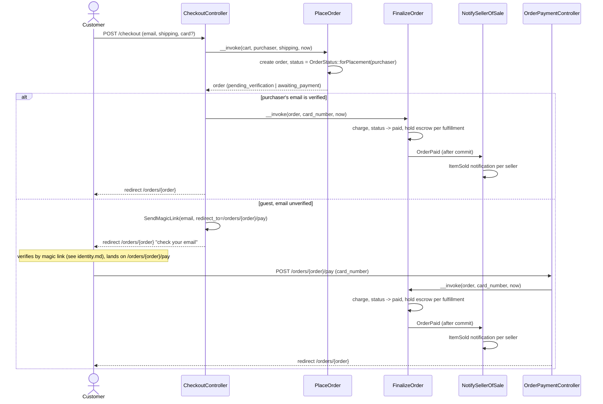
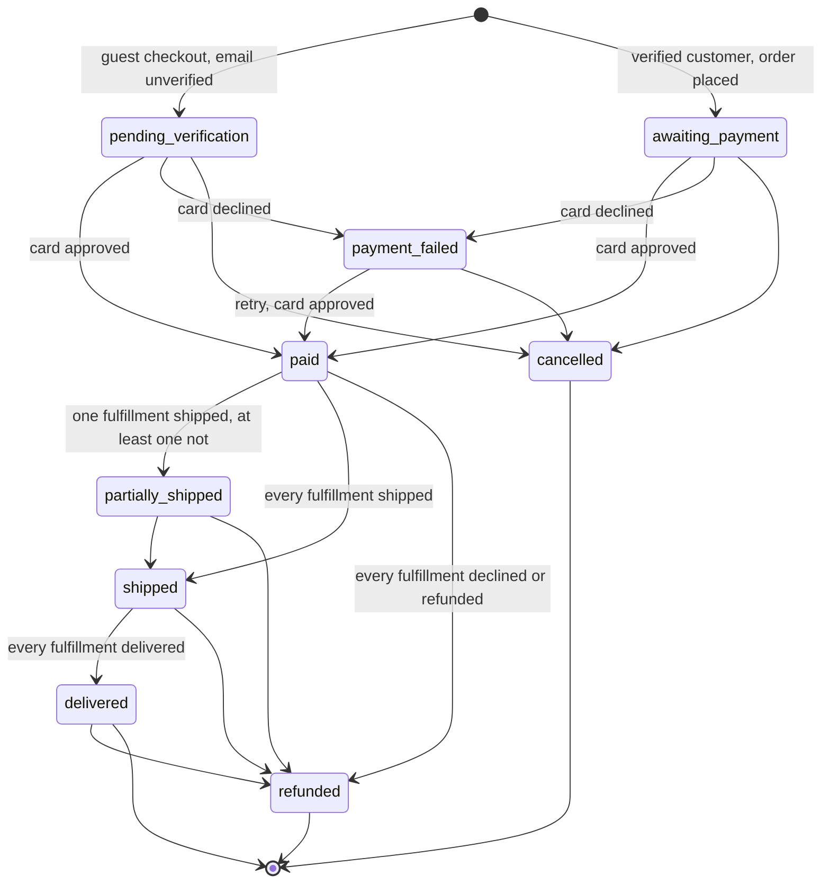
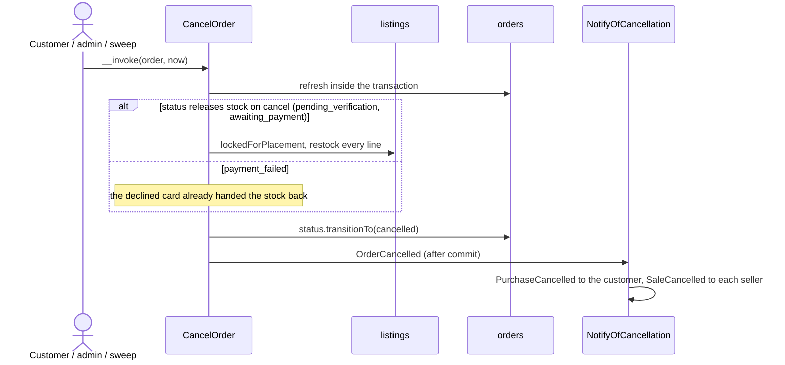
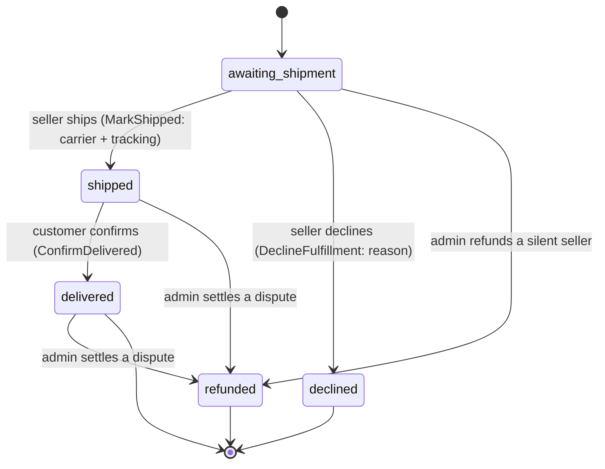
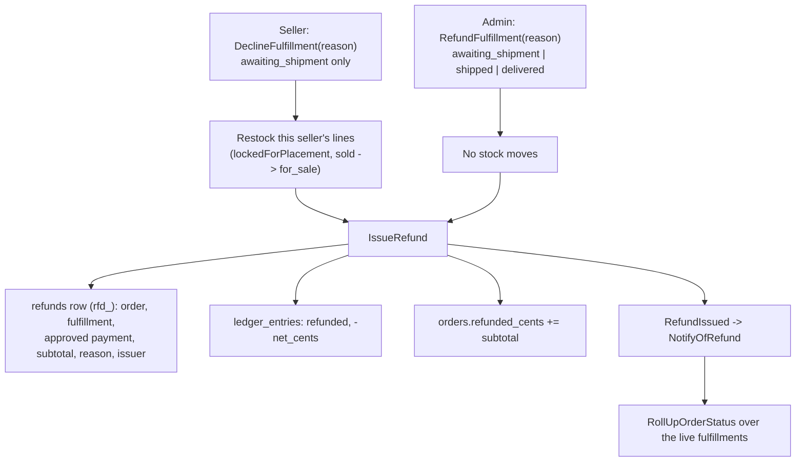

# Orders

Checkout, payment, fulfillment, and the sad half: cancel, sweep, decline, and
refund. Code: `app/Actions/Orders/`, `app/Actions/Fulfillment/`,
`app/Actions/Escrow/IssueRefund.php`,
`app/Http/Controllers/Shop/CheckoutController.php`,
`app/Http/Controllers/Shop/OrderPaymentController.php`,
`app/Domain/Orders/OrderStatus.php`, `app/Domain/Orders/FulfillmentStatus.php`.

## Checkout to a paid, seller-notified order

Question: from a submitted checkout form to a seller's "item sold"
notification, what runs, and where does a guest's flow diverge from a
verified customer's?

Caveats: `OrderPaid` is dispatched inside the action's transaction and the
listener implements `ShouldHandleEventsAfterCommit`, so a rolled-back charge
tells nobody. A declined card sets `payment_failed` and restores the stock
`PlaceOrder` took (`ListingStatus::Sold -> ForSale` when the listing had
reached zero); the order page and `/orders/{order}/pay` both post to
`FinalizeOrder` again for a retry. `FinalizeOrder` writes one `payments` row
per attempt.

## A cart that went stale between the page and the submit

Question: a shopper's cart holds a line that is no longer for sale, sold out,
or short of stock by the time they submit — what refuses the order, and what
does the shopper see?

`App\Domain\Orders\OrderPlacementPlan::for()` is the pure decision: it takes
a list of `PlaceableLine`s (what a line asks for, against what the listing
behind it allows right now) and folds them into `isPlaceable(): bool` plus a
`blocked` list of every line standing in the way, each carrying an
`UnavailableReason` — `Removed`, `OffSale`, `SoldOut`, or `ShortStock`. It
reads nothing itself: `Cart::placementPlan()` and `Order::placementPlan()`
build the lines from their own `items.listing` relation, so the plan stays
testable with no database. `Removed` waits on FEAT-024 to wire an admin
listing removal in — every caller passes `hasActiveRemoval: false` until
then, so a removed listing reads as whatever its ordinary status says.

`PlaceOrder` builds the plan **inside its own transaction**, from listing rows
it reads **for update** (`Listing`'s `lockedForPlacement` scope: `order by id`,
`for update`). `Listing::sell()` computes the new quantity and status in PHP
from the row it read and writes the pair back, so the row has to be held from
that read until the commit: a second checkout for the same listing blocks on
the lock, and reads the quantity the first one committed instead of
overwriting it with arithmetic from a read taken before. A plan that is not
placeable throws `App\Domain\Orders\OrderPlacementRefused` with every blocked
line, instead of stopping at the first one. `FinalizeOrder` asks the same
question before a retry retakes stock (`OrderStatus::retakesStockOnRetry()`,
reached only from `payment_failed`): a decline hands a listing's stock back to
the storefront, so a retry has to find it still available before it claims
that stock again, and it takes the same rows for update — as does the restock
a decline writes.

SQLite, the prototype's development and test database, has no row lock: it runs
one write transaction at a time, so a second checkout is turned away by the
database rather than losing the update, and its query grammar compiles the
clause away. The lock is what makes a database that runs write transactions
concurrently hold the second one until the first commits, so no test here can
interleave two checkouts to show it. `ListingTest` compiles the scope
with a grammar that has the clause and asserts on it; `PlaceOrderTest` and
`FinalizeOrderTest` assert the plan is judged against rows read inside the
transaction rather than whatever the caller loaded before it.

`OrderPlacementRefused` carries its blocked lines two ways: `getMessage()`
reads as one sentence, and `refusalData()` (the `App\Domain\CarriesRefusalData`
contract) hands `Story::tell()` a `blocked` array — `listing_id`, `title`,
`reason` per line — that lands in the `order.place` or `order.pay` `refused`
log line's `data` (docs/alignment.md §2.3) without `Story` knowing what kind
of refusal it caught.

`CheckoutController::place` catches `OrderPlacementRefused` separately from
every other `DomainRuleViolation`: it re-renders the checkout page itself at
422, naming every blocked line and its reason, with the submitted form flashed
back so the shopper retypes nothing — except the card, which nothing flashes
(`ShopRequest::CARD_FIELDS`, and `bootstrap/app.php` for the two flashes the
framework does on its own: the validation redirect and a
`DomainRuleViolation`'s `back()->withInput()`). `<x-card-fields>` renders
`old('card_number')` back into the field, so a flashed number would be written
into the response body and held in session storage. A refusal that is not
about a specific line — a blocked customer — still redirects to the cart, the
page that already holds every line. `OrderPaymentController::pay` answers a
stale retry the same way, re-rendering `/orders/{order}/pay` at 422.

The cart page (`CartController::show`) reads `Cart::placementPlan()` to mark
each blocked line with its reason and disable the checkout control —
`<button disabled>`, not merely hidden or styled away — while any line is
blocked.

## Order status

Question: what are the legal `OrderStatus` transitions?

Source of truth: `App\Domain\Orders\OrderStatus::transitions()`, verified by
`OrderStatusTest`. `Cancelled` is reached by `CancelOrder` — from the customer's
button, the admin console, or the stale sweep — and `refunded` by the roll-up
once no fulfillment is left live.

`OrderStatus::fromFulfillments()` rolls a multi-seller order up from its
**live** fulfillments — the ones that are neither `declined` nor `refunded`
(`FulfillmentStatus::isLive()`). Among those, any that has shipped or delivered
counts as "departed"; a delivered fulfillment mixed with an unshipped one still
reads `partially_shipped`, not `paid`. An order whose fulfillments are all
settled rolls up to `refunded`, and `orders.refunded_cents` carries the sum of
its refunds.

## Cancelling an order nothing has been charged for

Question: who can cancel, what happens to the stock, and what stops a paid
order from being cancelled?

Caveats: `CancelOrder` re-reads the order's status **inside** the transaction
that writes, so an order paid between the page and the submit is refused rather
than cancelled out from under the money — `OrderStatus::transitionTo()` has no
`paid -> cancelled` edge. The storefront route authorizes `view` (another
customer's order is a 404) and lets the action phrase the refusal;
`OrderPolicy::cancel` is what the button on the order page is shown by.
`OrderStatus::releasesStockOnCancel()` is the one predicate that decides
whether stock comes back: a `payment_failed` order already restocked when the
card was declined.

## The stale-order sweep

Question: what stops an abandoned guest checkout from holding stock forever?

`make sweep` runs `orders:sweep` (`App\Console\Commands\SweepOrders`), also
scheduled hourly in `routes/console.php`. It cancels every
`pending_verification` order whose `placed_at` is older than
`config('orders.stale_hours')` — `STALE_ORDER_HOURS`, default `24` — through
the same `CancelOrder` every other cancel path uses, so the stock comes back
the same way.

It is idempotent by construction: it selects `pending_verification` and leaves
`cancelled`, so a second run over the same window finds nothing. It never
touches `awaiting_payment` — a verified customer still has a card form open —
and never anything younger than the cutoff. `SweepStaleOrders` calls
`Story::asSystem()` first, so its `order.sweep` lines and the `order.cancel`
each order writes carry `actor_type: system` (docs/alignment.md §2.1).

## Fulfillment status (per order × seller)

Question: what are the legal `FulfillmentStatus` transitions?

Source of truth: `App\Domain\Orders\FulfillmentStatus::transitions()`,
verified by `FulfillmentStatusTest`. `MarkShipped` rolls the order status up
and dispatches `FulfillmentShipped`, which `NotifyCustomerOfShipment` turns
into the customer's "Order shipped" notification after the commit; `ConfirmDelivered` releases
the fulfillment's held escrow (see `docs/escrow.md`) and rolls the order
status up. Delivery confirmation is the customer clicking a button on the
order page — a stand-in for carrier tracking in this prototype.

## Decline and refund

Question: who can send a fulfillment's money back, what happens to the stock,
and what refuses a second one?

Caveats: both actions re-read the fulfillment's status **inside** the
transaction that writes it, so "decline after ship", "ship after decline",
"refund twice", and "refund what was already declined" are all refused by
`FulfillmentStatus::transitionTo()` against the row as it stands at write time,
not as the page rendered it. `IssueRefund` refuses an order no card ever
cleared (`OrderStatus::hasBeenPaid()`), which is what stops a refund on an
unpaid order — the fulfillments exist from the moment the order is placed.
`refunds` has `unique(fulfillment_id)`: the amount is always the whole
subtotal, so a second row would be a second full refund.

A decline is the seller's and restores stock; a refund is the admin's and does
not — the pieces are with the customer, or with a seller who is not answering
for them. The seller who declined is not notified of their own decision;
an admin refund tells both sides.
