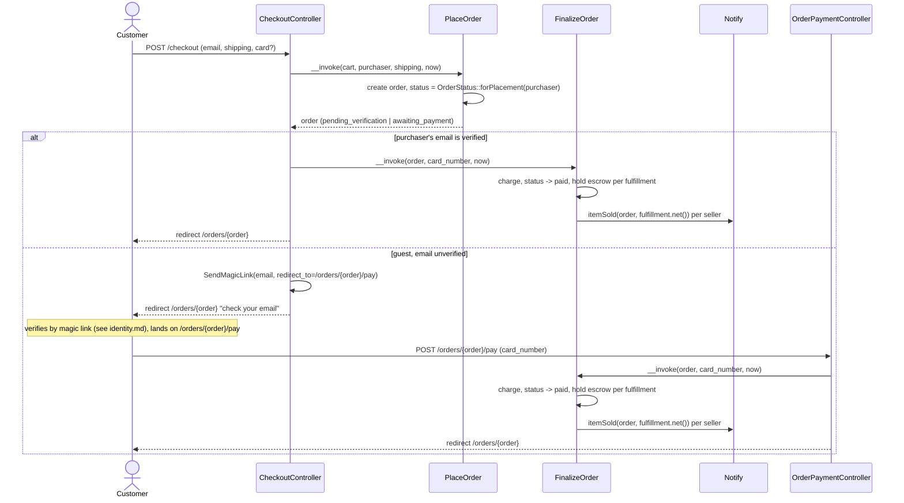
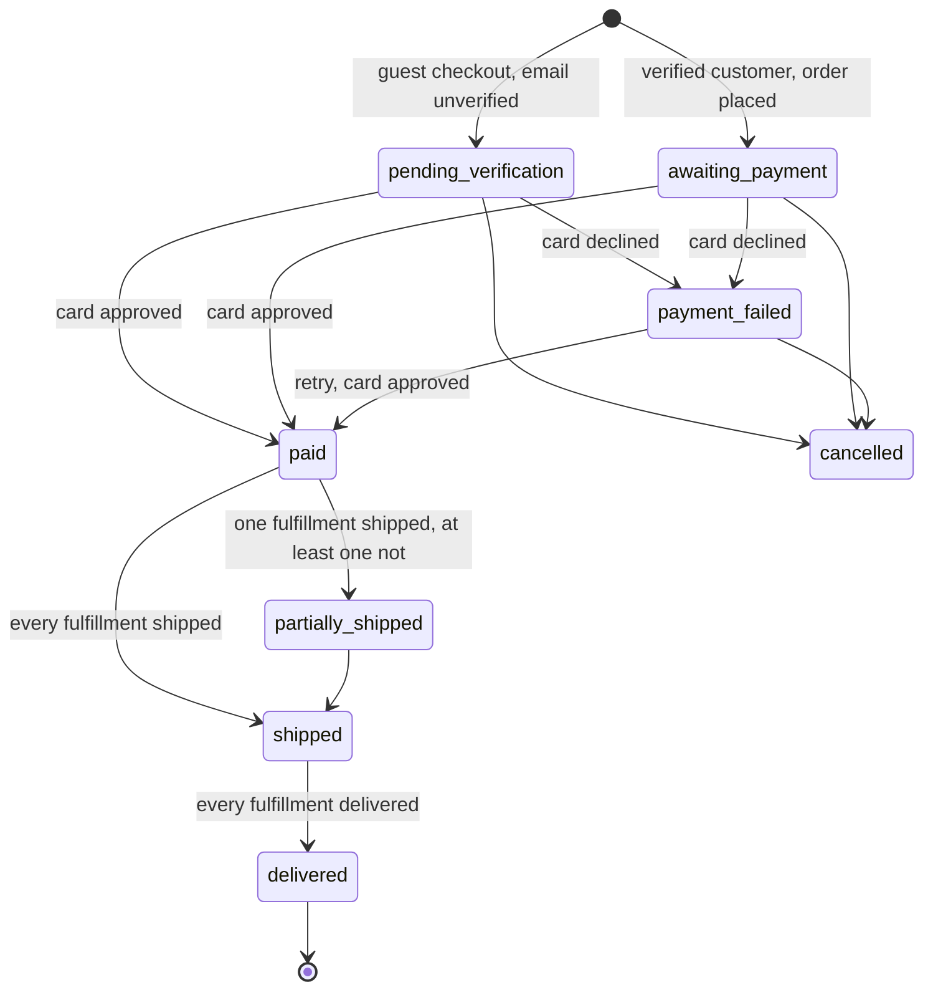
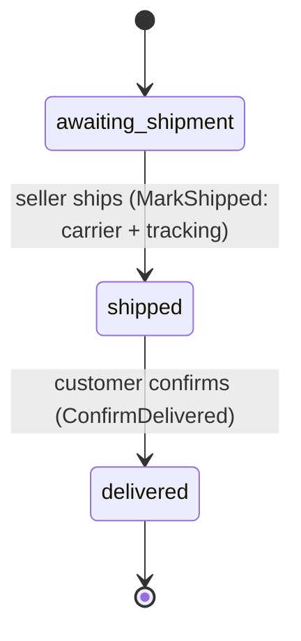

# Orders

Checkout, payment, and fulfillment. Code: `app/Actions/Orders/`,
`app/Actions/Fulfillment/`, `app/Http/Controllers/Shop/CheckoutController.php`,
`app/Http/Controllers/Shop/OrderPaymentController.php`,
`app/Domain/Orders/OrderStatus.php`, `app/Domain/Orders/FulfillmentStatus.php`.

## Checkout to a paid, seller-notified order

Question: from a submitted checkout form to a seller's "item sold"
notification, what runs, and where does a guest's flow diverge from a
verified customer's?

Caveats: a declined card sets `payment_failed` and restores the stock
`PlaceOrder` took (`ListingStatus::Sold -> ForSale` when the listing had
reached zero); the order page and `/orders/{order}/pay` both post to
`FinalizeOrder` again for a retry. `FinalizeOrder` writes one `payments` row
per attempt.

## Order status

Question: what are the legal `OrderStatus` transitions?

Source of truth: `App\Domain\Orders\OrderStatus::transitions()`, verified by
`OrderStatusTest`. `Cancelled` has no route to it from the UI in this
prototype — the transition exists in the domain but no action calls it.
`OrderStatus::fromFulfillments()` rolls a multi-seller order up from its
fulfillments: any fulfillment that has shipped or delivered counts as
"departed"; a delivered fulfillment mixed with an unshipped one still reads
`partially_shipped`, not `paid`.

## Fulfillment status (per order × seller)

Question: what are the legal `FulfillmentStatus` transitions?

Source of truth: `App\Domain\Orders\FulfillmentStatus::transitions()`,
verified by `FulfillmentStatusTest`. `MarkShipped` notifies the customer
("Order shipped") and rolls the order status up; `ConfirmDelivered` releases
the fulfillment's held escrow (see `docs/escrow.md`) and rolls the order
status up. Delivery confirmation is the customer clicking a button on the
order page — a stand-in for carrier tracking in this prototype.
