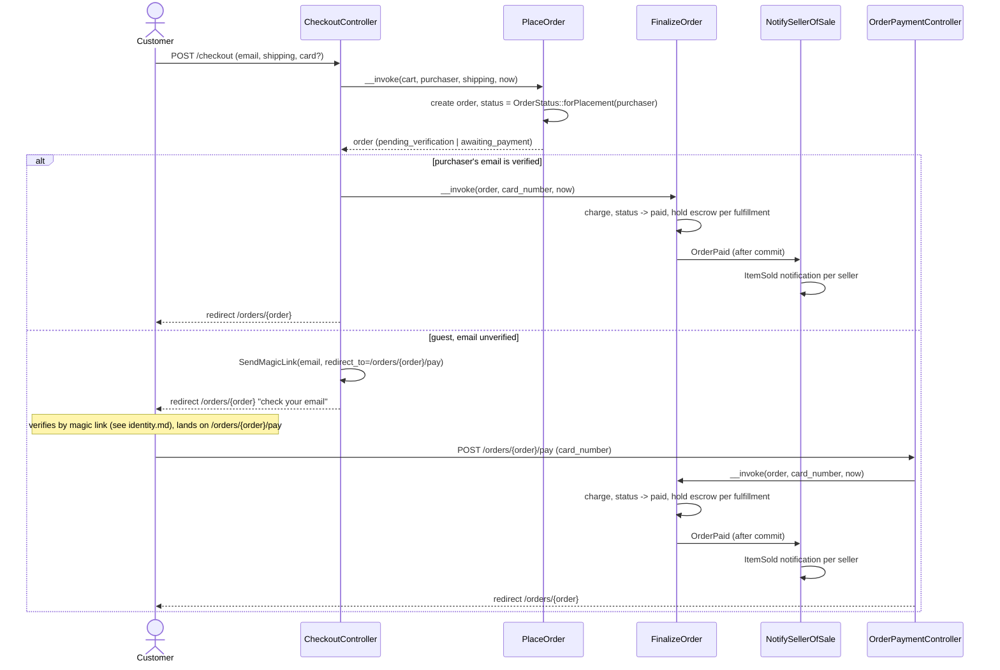
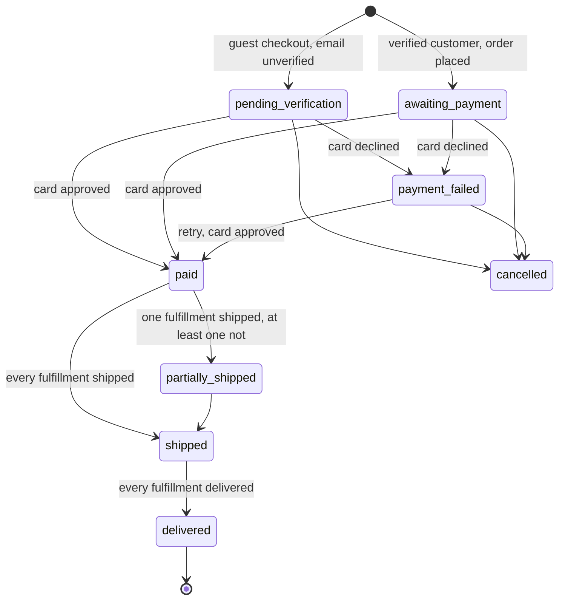
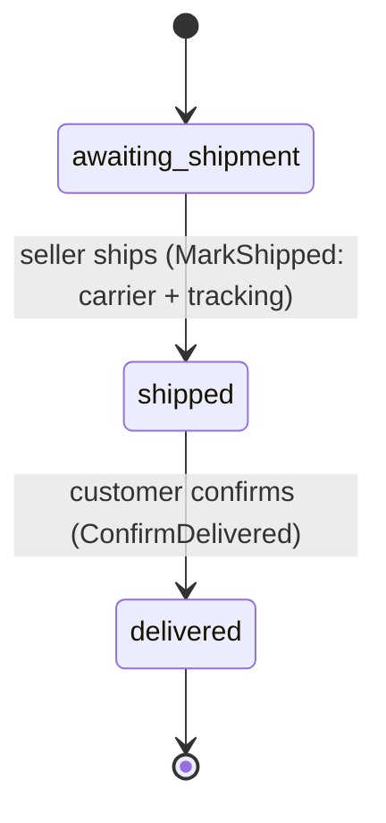

# Orders

Checkout, payment, and fulfillment. Code: `app/Actions/Orders/`,
`app/Actions/Fulfillment/`, `app/Http/Controllers/Shop/CheckoutController.php`,
`app/Http/Controllers/Shop/OrderPaymentController.php`,
`app/Domain/Orders/OrderStatus.php`, `app/Domain/Orders/FulfillmentStatus.php`.

## Checkout to a paid, seller-notified order

Question: from a submitted checkout form to a seller's "item sold"
notification, what runs, and where does a guest's flow diverge from a
verified customer's?

Caveats: `OrderPaid` is dispatched inside the action's transaction and the
listener implements `ShouldHandleEventsAfterCommit`, so a rolled-back charge
tells nobody. A declined card sets `payment_failed` and restores the stock
`PlaceOrder` took (`ListingStatus::Sold -> ForSale` when the listing had
reached zero); the order page and `/orders/{order}/pay` both post to
`FinalizeOrder` again for a retry. `FinalizeOrder` writes one `payments` row
per attempt.

## A cart that went stale between the page and the submit

Question: a shopper's cart holds a line that is no longer for sale, sold out,
or short of stock by the time they submit — what refuses the order, and what
does the shopper see?

`App\Domain\Orders\OrderPlacementPlan::for()` is the pure decision: it takes
a list of `PlaceableLine`s (what a line asks for, against what the listing
behind it allows right now) and folds them into `isPlaceable(): bool` plus a
`blocked` list of every line standing in the way, each carrying an
`UnavailableReason` — `Removed`, `OffSale`, `SoldOut`, or `ShortStock`. It
reads nothing itself: `Cart::placementPlan()` and `Order::placementPlan()`
build the lines from their own `items.listing` relation, so the plan stays
testable with no database. `Removed` waits on FEAT-024 to wire an admin
listing removal in — every caller passes `hasActiveRemoval: false` until
then, so a removed listing reads as whatever its ordinary status says.

`PlaceOrder` builds the plan **inside its own transaction**, against the cart
and listing rows as they stand at that moment — reading the cart, deciding,
and taking the stock stay one transaction, so two shoppers cannot both take
the last piece. A plan that is not placeable throws
`App\Domain\Orders\OrderPlacementRefused` with every blocked line, instead of
stopping at the first one. `FinalizeOrder` asks the same question before a
retry retakes stock (`OrderStatus::retakesStockOnRetry()`, reached only from
`payment_failed`): a decline hands a listing's stock back to the storefront,
so a retry has to find it still available before it claims that stock again.

`OrderPlacementRefused` carries its blocked lines two ways: `getMessage()`
reads as one sentence, and `refusalData()` (the `App\Domain\CarriesRefusalData`
contract) hands `Story::tell()` a `blocked` array — `listing_id`, `title`,
`reason` per line — that lands in the `order.place` or `order.pay` `refused`
log line's `data` (docs/alignment.md §2.3) without `Story` knowing what kind
of refusal it caught.

`CheckoutController::place` catches `OrderPlacementRefused` separately from
every other `DomainRuleViolation`: it re-renders the checkout page itself at
422, naming every blocked line and its reason, with the submitted form
flashed back so nothing the shopper typed is lost. A refusal that is not
about a specific line — a blocked customer — still redirects to the cart, the
page that already holds every line. `OrderPaymentController::pay` answers a
stale retry the same way, re-rendering `/orders/{order}/pay` at 422.

The cart page (`CartController::show`) reads `Cart::placementPlan()` to mark
each blocked line with its reason and disable the checkout control —
`<button disabled>`, not merely hidden or styled away — while any line is
blocked.

## Order status

Question: what are the legal `OrderStatus` transitions?

Source of truth: `App\Domain\Orders\OrderStatus::transitions()`, verified by
`OrderStatusTest`. `Cancelled` has no route to it from the UI in this
prototype — the transition exists in the domain but no action calls it.
`OrderStatus::fromFulfillments()` rolls a multi-seller order up from its
fulfillments: any fulfillment that has shipped or delivered counts as
"departed"; a delivered fulfillment mixed with an unshipped one still reads
`partially_shipped`, not `paid`.

## Fulfillment status (per order × seller)

Question: what are the legal `FulfillmentStatus` transitions?

Source of truth: `App\Domain\Orders\FulfillmentStatus::transitions()`,
verified by `FulfillmentStatusTest`. `MarkShipped` rolls the order status up
and dispatches `FulfillmentShipped`, which `NotifyCustomerOfShipment` turns
into the customer's "Order shipped" notification after the commit; `ConfirmDelivered` releases
the fulfillment's held escrow (see `docs/escrow.md`) and rolls the order
status up. Delivery confirmation is the customer clicking a button on the
order page — a stand-in for carrier tracking in this prototype.
