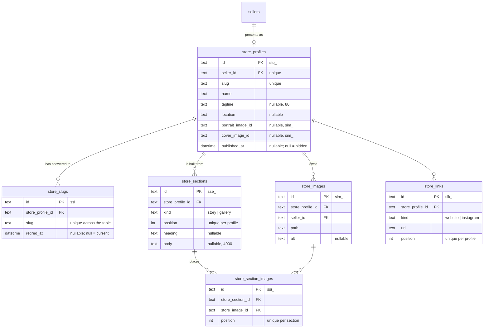

# The seller portal

## Store profile

A seller presents on the site as a **store**: a name, an address under
`/s/{slug}`, a tagline, where they work, a portrait, a cover, links, and an
ordered list of sections. `GET /seller/store` is the screen; the same
component that renders the preview beside the form is what the storefront
renders as the page.

### The tables

The profile row holds only what every store has once. Everything the page
*says* is a section row of a typed kind, ordered by position.

`portrait_image_id` and `cover_image_id` hold a `sim_` id without a database
foreign key: `store_images` carries `store_profile_id`, so a key back the
other way is a cycle SQLite cannot create in either order.
`App\Actions\Store\RemoveStoreImage` clears both columns before it deletes
the row.

### The section rule

`App\Domain\Store\StoreSectionKind::allows(StoreSectionField)` is the one
statement of which fields a kind uses:

| Kind      | Heading | Body | Images |
| --------- | ------- | ---- | ------ |
| `story`   | yes     | yes  | no     |
| `gallery` | yes     | no   | yes    |

`App\Http\Requests\Seller\StoreSectionRequest` reads it twice — once to
decide which fields to validate, once in its after-validation pass to refuse
a field the kind does not use, so a body posted at a gallery is an error
rather than a silently dropped column.

A new kind of store content is a case here, a renderer in
`resources/views/components/store/profile.blade.php`, and — when it needs
columns no other kind has — a child table keyed by section. It is never a
wider `store_profiles` row and never a JSON blob the database cannot index
or validate.

### Addresses are history

The current address lives on the profile for the unique index and the fast
lookup. Every address the store has ever answered to is a `store_slugs` row;
`retired_at` says when it stopped being current. The column is unique across
the whole table, so a rename can never take an address another store has
ever used and a redirect can never be ambiguous.

`App\Actions\Store\RenameStoreSlug` is the one writer: in one transaction it
stamps the current row retired, brings the new address in as the current
row, and updates the profile. A rename back to an address the store retired
earlier revives that row rather than colliding with its own history. A
rename to the address the store already holds writes nothing.

### The routes

| Route                                              | What it does                                    |
| -------------------------------------------------- | ----------------------------------------------- |
| `GET /seller/store`                                | The form and the buyer preview                  |
| `PUT /seller/store`                                | Name, address, tagline, location, links, visibility |
| `POST /seller/store/images`                        | One picture, as the portrait, the cover, or a gallery picture |
| `DELETE /seller/store/images/{image}`              | Takes a picture out of the store                |
| `POST /seller/store/sections`                      | Adds a section of a kind                        |
| `PUT /seller/store/sections/{section}`             | The section's text and, for a gallery, its pictures |
| `DELETE /seller/store/sections/{section}`          | Takes the section off the page                  |
| `POST /seller/store/sections/{section}/reorder`    | Moves it one place up or down                   |

The first `GET /seller/store` mints the store — hidden, named after the shop
— through `App\Actions\Store\StartStore`, the shape
`App\Models\Customer::cart()` already gives a storefront visitor. Every
route answers 404 for another seller's rows (`App\Policies\StoreProfilePolicy`).

### Limits

| Thing                        | Ceiling                                    |
| ---------------------------- | ------------------------------------------ |
| Address                      | 3–60 characters, `[a-z0-9]` with single hyphens |
| Tagline                      | `StoreProfile::MAX_TAGLINE_LENGTH` (80)    |
| Pictures per store           | `StoreProfile::MAX_IMAGES` (24)            |
| Story body                   | `StoreSection::MAX_BODY_LENGTH` (4,000)    |
| Pictures per gallery         | `StoreSection::MAX_GALLERY_IMAGES` (8)     |
| Sections per store           | `StoreSection::MAX_PER_PROFILE` (12)       |

### Seeds

`Database\Seeders\StoreProfileSeeder` gives every seeded seller a published
store: a tagline, where they work, a story, a gallery, and two links. The
picture rows name the same files on the public disk that the seller's
listings already show, so the seed copies nothing.

### What the store does not write

`docs/alignment.md` §2.3 closes the log-event vocabulary and §3 closes the
rate-limit names. Store writes emit neither: there is no `store.*` event and
no store limiter until the contract gains them, so the actions here write
silently rather than minting names the other two prototypes lack.
