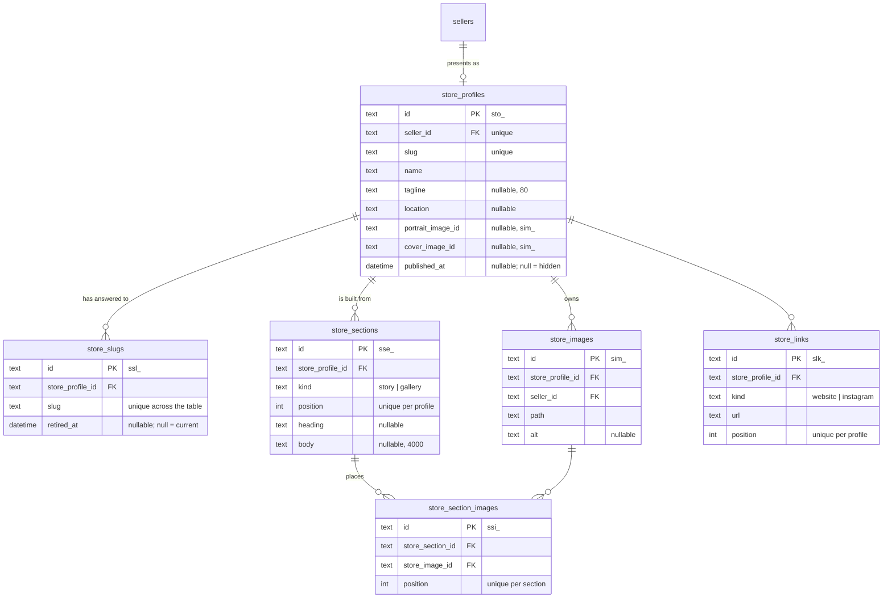
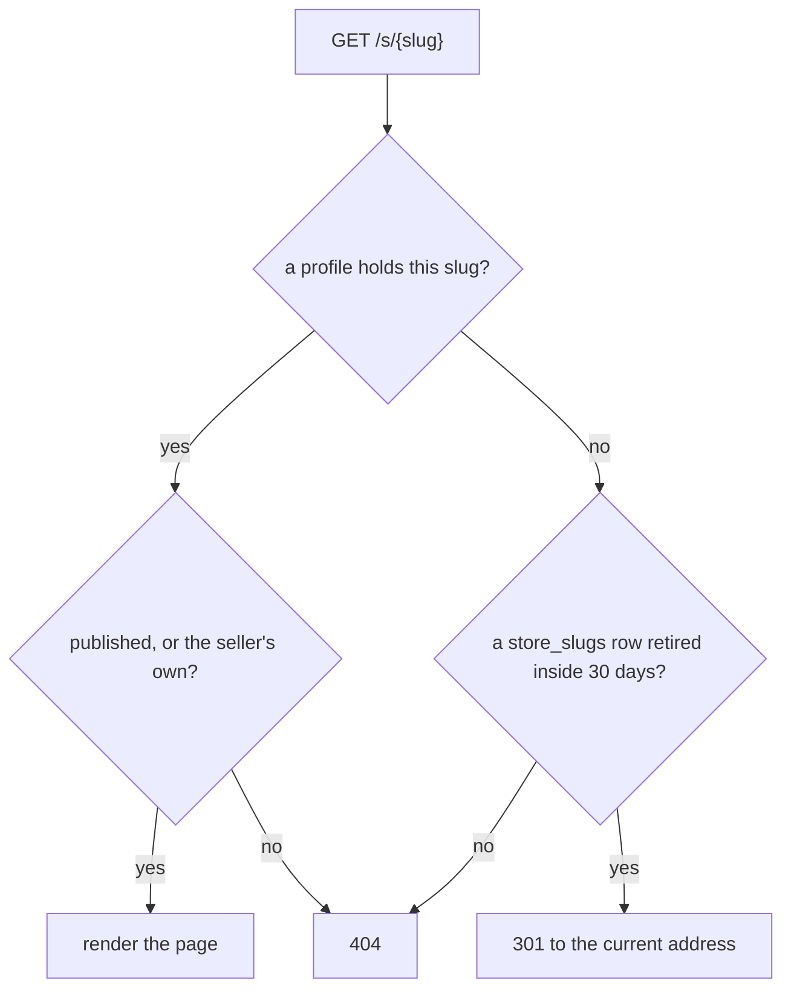
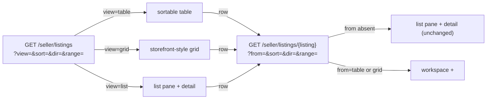
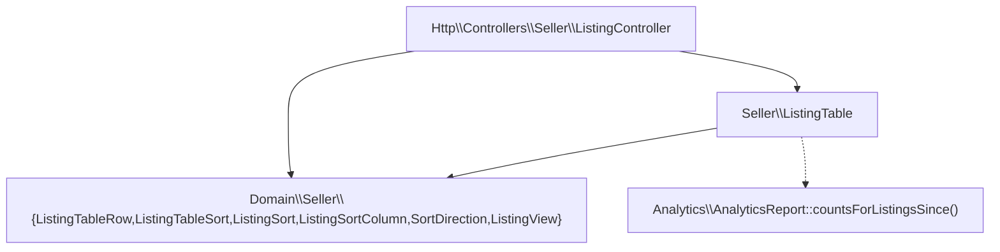
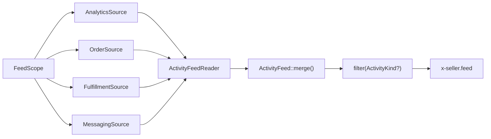
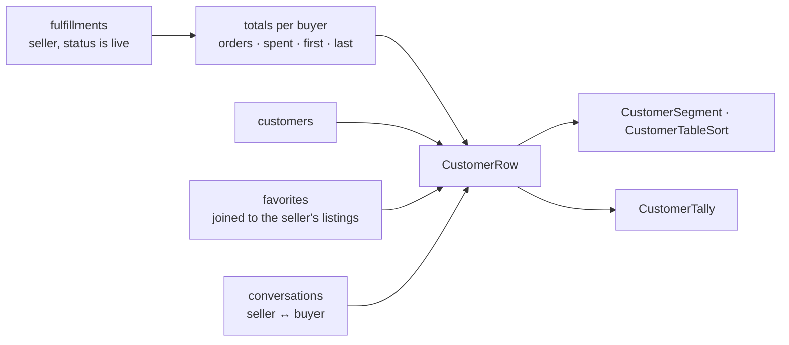
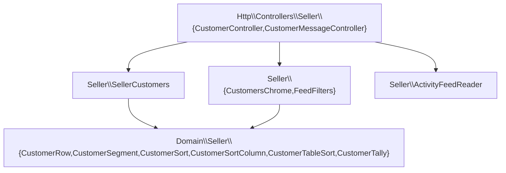
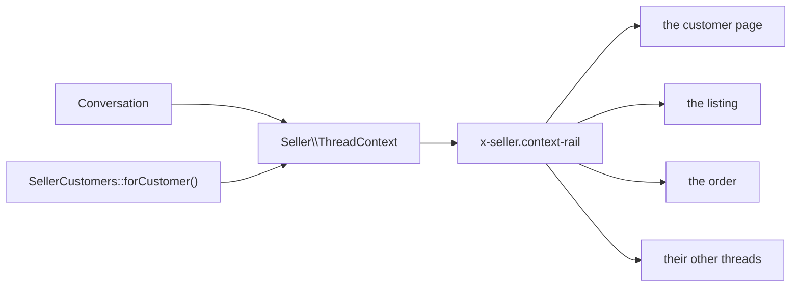

# Seller portal

The seller portal's tools beyond the backbone (dashboard, orders, messages,
earnings) covered in [`architecture.md`](architecture.md). Each tool gets its
own section here as its lane lands.

## Store profile

A seller presents on the site as a **store**: a name, an address under
`/s/{slug}`, a tagline, where they work, a portrait, a cover, links, and an
ordered list of sections. `GET /seller/store` is the screen; the same
component that renders the preview beside the form is what the storefront
renders as the page.

### The tables

The profile row holds only what every store has once. Everything the page
*says* is a section row of a typed kind, ordered by position.

`portrait_image_id` and `cover_image_id` hold a `sim_` id without a database
foreign key: `store_images` carries `store_profile_id`, so a key back the
other way is a cycle SQLite cannot create in either order.
`App\Actions\Store\RemoveStoreImage` clears both columns before it deletes
the row.

### The section rule

`App\Domain\Store\StoreSectionKind::allows(StoreSectionField)` is the one
statement of which fields a kind uses:

| Kind      | Heading | Body | Images |
| --------- | ------- | ---- | ------ |
| `story`   | yes     | yes  | no     |
| `gallery` | yes     | no   | yes    |

`App\Http\Requests\Seller\StoreSectionRequest` reads it twice — once to
decide which fields to validate, once in its after-validation pass to refuse
a field the kind does not use, so a body posted at a gallery is an error
the seller sees.

Every section on the screen posts its own form under the same field names,
so a section's errors go into a bag named for it
(`StoreSectionRequest::errorBagFor()`), and the page reads that bag beside
that section. The section that failed shows the words the seller typed; the
others show what is stored. A gallery numbers its pictures with an
`order[{image}]` field, and `imageIds()` sorts by it — a picture with no
number sorts last.

A new kind of store content is a case here, a renderer in
`resources/views/components/store/profile.blade.php`, and — when it needs
columns no other kind has — a child table keyed by section. It is never a
wider `store_profiles` row and never a JSON blob the database cannot index
or validate.

### Addresses are history

The current address lives on the profile for the unique index and the fast
lookup. Every address the store has ever answered to is a `store_slugs` row;
`retired_at` says when it stopped being current. The column is unique across
the whole table, so a rename can never take an address another store has
ever used and a redirect can never be ambiguous.

`App\Actions\Store\RenameStoreSlug` is the one writer: in one transaction it
stamps the current row retired, brings the new address in as the current
row, and updates the profile. A rename back to an address the store retired
earlier revives that row. A rename to the address the store already holds
writes nothing.

### The routes

| Route                                              | What it does                                    |
| -------------------------------------------------- | ----------------------------------------------- |
| `GET /seller/store`                                | The form and the buyer preview                  |
| `PUT /seller/store`                                | Name, address, tagline, location, links, visibility |
| `POST /seller/store/images`                        | One picture, as the portrait, the cover, or a gallery picture |
| `DELETE /seller/store/images/{image}`              | Takes a picture out of the store                |
| `POST /seller/store/sections`                      | Adds a section of a kind                        |
| `PUT /seller/store/sections/{section}`             | The section's text and, for a gallery, its pictures |
| `DELETE /seller/store/sections/{section}`          | Takes the section off the page                  |
| `POST /seller/store/sections/{section}/reorder`    | Moves it one place up or down                   |

The first `GET /seller/store` mints the store — hidden, named after the shop
— through `App\Actions\Store\StartStore`, the shape
`App\Models\Customer::cart()` already gives a storefront visitor. Every
route answers 404 for another seller's rows (`App\Policies\StoreProfilePolicy`).

### Limits

| Thing                        | Ceiling                                    |
| ---------------------------- | ------------------------------------------ |
| Address                      | 3–60 characters, `[a-z0-9]` with single hyphens |
| Tagline                      | `StoreProfile::MAX_TAGLINE_LENGTH` (80)    |
| Pictures per store           | `StoreProfile::MAX_IMAGES` (24)            |
| Story body                   | `StoreSection::MAX_BODY_LENGTH` (4,000)    |
| Pictures per gallery         | `StoreSection::MAX_GALLERY_IMAGES` (8)     |
| Sections per store           | `StoreSection::MAX_PER_PROFILE` (12)       |

### Seeds

`Database\Seeders\StoreProfileSeeder` gives every seeded seller a published
store: a tagline, where they work, a story, a gallery, and two links. The
picture rows name the same files on the public disk that the seller's
listings already show, so the seed copies nothing.

### What the store does not write

`docs/alignment.md` §2.3 closes the log-event vocabulary and §3 closes the
rate-limit names. Store writes emit neither: there is no `store.*` event and
no store limiter until the contract gains them, so the actions here write
silently; minting a name the other two prototypes lack is what §2.3
forbids.

## The public page

`GET /s/{slug}` renders the store in the Warm Craft theme. It is the same
component the seller previews beside their form
(`resources/views/components/store/profile.blade.php`); only the shell
(`x-layouts.shop`) and the listing grid below it differ.

### Resolving an address

`App\Support\Store\StoreAddressLookup` is the query;
`App\Domain\Store\RetiredSlugWindow` is the thirty-day rule. The redirect
target is resolved through published profiles only, so an old address of a
store that has since been hidden answers 404 and never names where the
store now lives.
A hidden store, an address retired too long ago, and an address no store
ever held all answer the same 404, so a hidden store is never confirmed to
exist. Its own seller is the exception: they see the page with a banner
saying buyers cannot open it.

### What the page shows

The cover, the portrait, the name, the tagline, the location, "N pieces for
sale · Selling since <Month Year>" (`App\Support\Store\StoreFacts` — the
count is `Listing::forSale()`, so a sold piece stays on the page and out of
the number), the sections in order, the links, and the seller's storefront
listings
(`Listing::onStorefront()` — for sale and sold, never draft, archived, or
removed) in the storefront's own grid partial.

The page carries a title, a description (the tagline, else the opening of
the first story, else the name), and an Open Graph image (the cover, else
the portrait). `x-layouts.shop` gained `description` and `image` props for
this, and emits the Open Graph group only for a page that passes one of
them; every other storefront page renders as it did.

### Listing cards lead to it

`x-listing-card` and `/art/{slug}` name the seller as a link to their store
when the store is published, and as plain text otherwise. The link reads
`$listing->seller->storeProfile`, so every query that feeds a card eager
loads `seller.storeProfile` — `Model::shouldBeStrict()` turns a missed one
into a lazy-loading violation outside production, so it fails loudly.

### Analytics

A view of a published page records `store.view` in the analytics store with
`subject_type = 'store'` and the profile's `sto_` id, deduplicated per
(store, customer, UTC hour) by `App\Domain\Store\StoreViewCollapse` —
`listing.view`'s shape. A seller previewing their own hidden page records
nothing. The admin analytics event list reads
`AnalyticsEventName::cases()`, so the event appears there; an actor's feed
names the store unlinked, the way it already names a cart.

## Listings

Question: how does a seller look at their inventory, and how does one
listing's detail end up rendered in three different places without drifting?

### Query vocabulary

`App\Http\Requests\Seller\ListingsQueryRequest` owns every parameter both
routes share, the `docs/alignment.md` §5 idiom: an absent or emptied value
reads as its default, an unrecognised one answers a bare 400.

| Param   | Values                                                                | Default | Read by                     |
| ------- | ---------------------------------------------------------------------- | ------- | ---------------------------- |
| `view`  | `list` \| `table` \| `grid` (`App\Domain\Seller\ListingView`)          | `list`  | the index route              |
| `from`  | `table` \| `grid`                                                     | absent  | the detail route             |
| `sort`  | one of eleven `App\Domain\Seller\ListingSortColumn` cases               | `views` | table/grid, and the header's `<select>` |
| `dir`   | `asc` \| `desc` (`App\Domain\Seller\SortDirection`)              | `desc`  | table/grid                   |
| `range` | `7` \| `30` \| `90` (`App\Domain\Analytics\AnalyticsRange::SIZES`)      | `30`    | the ranged columns and the detail's view strip |

The detail route carries `from`, not `view` — `ListingController::show()`
resolves `view` from it before building the header and, on table/grid,
the workspace behind the overlay, so every link there still names `view`
explicitly.

### Layers

`App\Seller\ListingTable::forSeller()` reads a seller's listings, their
Medium attribute (batched, one query for every listing), their sold count
and revenue, and their ranged analytics counts, joined by id in PHP into a
`list<ListingTableRow>`; `App\Domain\Seller\ListingTableSort::apply()`
orders them by the request's `ListingSort`. `ListingTable::forListing()`
builds the same row for one listing — the detail component's source, so a
listing's own page never disagrees with its row in the table.

**Sold and revenue** are all-time, unranged: an `order_items` row counts
only when its order has been paid (`OrderStatus::hasBeenPaid()`) and its
matching `fulfillments` row (same `order_id` + `seller_id`) is still live
(not `declined`, not `refunded`) — a fulfillment exists from the moment an
order is placed, before payment clears, so the paid gate keeps an
abandoned checkout from reading as a sale.

### Sorting is a link

Every table column header is an `<a href>` carrying `aria-sort`; clicking
the already-sorted column flips `dir`
(`App\Domain\Seller\ListingSort::nextDirectionFor()`), clicking another one
sorts it descending. The header's own `<select name="sort">` (every column
but Status, which the table's header link already covers) is the same
choice for Grid, which has no column headers to click; it posts back to
the index route by GET, with a `<noscript>` fallback submit button.

### Overlay vs takeover

A table or grid row links to `/seller/listings/{id}?from=table` (or
`grid`). `ListingController::show()` renders one view,
`seller/listings/detail-overlay.blade.php`, that carries three blocks:
the listings workspace (`hidden 2xl:flex`), a native `<dialog open>` over
it (`hidden 2xl:flex`) holding the detail, and a takeover of the full
content area (`2xl:hidden`) holding the same detail with a back link.
Tailwind's `2xl:` variants pick which shows — no JavaScript decides, and
the `<dialog>`'s "close" is a plain link back to the index at the
resolved view, sort, and range.

### One detail component

`x-seller.listing-detail` (`resources/views/components/seller/listing-detail.blade.php`)
renders identity, status transitions, an active-removal alert,
price/stock/dimensions/ranged-views/favorites/cart-adds/sold-and-revenue/last-sold,
a ranged view strip (`x-seller.bar-strip` over
`App\Domain\Analytics\BarStrip::bars()`), and the sales table. It takes a
`Listing` (eager loaded with `activeRemoval`, `category`, `images`) and its
`ListingTableRow`, and renders identically in the list pane, the overlay,
and the takeover.

## Activity feed

Question: a seller wants to read everything that happened between them and
one buyer — or everything on one order — in time order. Which row comes from
where, and what stops two sources telling the same story twice?

One feed, four sources, one merge.

`App\Seller\FeedScope` says which story: `forFulfillment()` is one parcel —
its own listings, its own threads — and `forCustomer()` is everything between
a seller and a buyer. Both carry the same shape (seller, customer, the
customer's display name, fulfillment ids, listing ids), so a source never
asks which scope it is answering, beyond the one narrowing an order scope
does to threads.

Each source is one method — `ActivityFeedSource::events(FeedScope): FeedEvent[]`
— and `App\Seller\ActivityFeedReader` is the only thing that knows there are
four of them.

### Which source owns which row

| Source | Reads | Rows it owns | Kind |
| --- | --- | --- | --- |
| `AnalyticsSource` | `analytics_events` on the analytics connection, `actor_id` = the customer | listing viewed, favorited, unfavorited, added to cart; checkout opened | `browse` |
| `OrderSource` | `orders`, `payments`, `ledger_entries`, `refunds` | the order placed; each card attempt, approved or declined; held in escrow, released, returned to the buyer | `order` |
| `FulfillmentSource` | `fulfillment_events` (see `orders.md`) | each completed flow step, the label with its carrier and tracking number, shipped, delivered, declined | `shipping` |
| `MessagingSource` | `conversations`, `messages` | every message in a thread between the two of them | `messages` |

Two boundaries keep a row from appearing twice:

- The analytics store also carries `order.place`, `order.pay`, and
  `order.cancel`. Those are the order source's, read from the tables that
  hold the money, where the amounts are. The analytics source takes the
  browsing five and nothing else.
- `fulfillment_events` carries a `refunded` row and `ledger_entries` carries
  a `refunded` movement. The movement wins: it carries the amount, which the
  log does not, and it takes the refund's reason as its quote. The
  fulfillment source skips that kind.

A decline is told once: the shipping row says the parcel was turned down and
the `refunded` movement carries the amount and the words the seller typed. A
message is a messages row whose quote is the body.

### Merging and filtering are pure

`App\Domain\Seller\ActivityFeed::merge(...$sources)` takes each source's
`list<FeedEvent>` and sorts newest first. PHP's sort is stable, so two rows
carrying the same instant come out in the order the reader passed their
sources — browsing, order, shipping, messages — and a page reading the same
scope twice reads the same feed.

`filter(?ActivityKind)` narrows what the feed hands back, never what the
sources return, so a page can never disagree with itself about what
happened. A null kind is the whole feed, which is what an absent `?kind=`
reads as. Both are unit tested with no database; each source is tested
through it.

`FeedEvent` is readonly: `occurredAt`, `kind`, `icon`, `actor`, `text`, and
the optional `quote` and `link`. `FeedIcon` carries the heroicon path, so a
row brings its own picture and `x-seller.feed` stays a renderer — the only
feed markup in the portal, in the Tailwind Plus feed shape: a 32px round icon
on a rail, the body, the instant.

## Customers

Question: a seller wants to know who buys from them. Where does that list
come from, given no table holds it — and what does a seller get to see about
a person?

A customer is a buyer. Someone holding at least one paid fulfillment with
the seller that still stands is on the list; browsing, favoriting, and
asking about a piece join their timeline once they have bought. Every
request derives the list from `fulfillments`; no table holds it.

A `fulfillments` row exists from the moment an order is placed, so the
derivation gates on the order having been paid: an abandoned checkout
leaves the list alone and leaves Spent alone. A declined or refunded parcel
settled its money back, so it counts toward nothing here — a buyer whose
only parcel was declined drops off the list and their page answers 404,
while the parcel itself stays listed on a page they still hold.

### Privacy

A seller sees a customer's name and email because an order carried them.
That is the whole permission: `GET /seller/customers/{customer}` answers
404 for anyone who has never bought from this seller, so a visitor who
favorited a piece or asked a question has no page a seller can open. The
name is the account's own where it has one, and the latest order's
`shipping_name` where it does not — the same fall-back for the email.

### Query vocabulary

`App\Http\Requests\Seller\CustomersQueryRequest` owns every parameter both
routes read, the `docs/alignment.md` §5 idiom: an absent or emptied value
reads as its default, an unrecognised one answers a bare 400.

| Param     | Values                                                                   | Default | Read by         |
| --------- | ------------------------------------------------------------------------ | ------- | --------------- |
| `range`   | `7` \| `30` \| `90` (`App\Domain\Analytics\AnalyticsRange::SIZES`)        | `30`    | the index route |
| `segment` | `all` \| `repeat` \| `new` (`App\Domain\Seller\CustomerSegment`)          | `all`   | the index route |
| `sort`    | one of seven `App\Domain\Seller\CustomerSortColumn` cases                | `spent` | the index route |
| `dir`     | `asc` \| `desc` (`App\Domain\Seller\SortDirection`)                      | `desc`  | the index route |
| `kind`    | one of four `App\Domain\Seller\ActivityKind` cases                       | absent  | the customer page's timeline |

`range` is what "new this period" means: a buyer is new when their first
order falls inside the window. The four figures above the table count every
buyer whatever the segment shows, so switching segments never moves them.

### Layers

`SellerCustomers::forSeller()` folds the figures in one grouped query —
`count(*)`, `sum(subtotal_cents)`, and `min`/`max(orders.placed_at)` over
the seller's counted parcels joined to their orders, grouped by customer —
then joins the account rows, the favorites, and the thread counts by id in
PHP. A buyer holding no account name or address takes both from their
latest order, which is one more query, run only when such a buyer is in the
list. `forCustomer()` is the same fold narrowed to one person and hands
back null for a stranger; the customer page, the Message button, and the
thread rail all read it. `conversationCounts()` is the two thread figures
the tiles carry.

Sorting is a link carrying `aria-sort`, `App\Seller\ColumnHeader` per
column through `x-seller.sortable-th`; a click on the sorted column flips
`dir` (`CustomerSort::nextDirectionFor()`). The segment control and the
timeline's kind filter are the same `x-seller.segmented` over
`App\Seller\SegmentLink`, built by `CustomersChrome` and `FeedFilters`.

### The customer page

Identity (name, email, customer since, a Repeat buyer badge from two
orders), four figures, the activity feed under its kind filter
(`ActivityFeedReader` over `FeedScope::forCustomer()`), every parcel
between the two of them — a declined or refunded one included, which the
figures leave out and the seller still has to be able to look back at —
their favorites of this seller's pieces, and their threads.

Message opens the buyer's newest thread with this seller. For a buyer the
seller has yet to write to, it opens the thread for the buyer's latest
parcel — latest by `orders.placed_at`, the recency this section reads
everywhere — through `App\Actions\Messaging\OpenConversation`. That is a
subject the two of them already share, so the button needs no new kind of
conversation.

## Messages

The inbox and the thread are `docs/messaging.md`. What the seller portal adds
beside the transcript is the context rail: who the seller is talking to, and
what the thread is about.

`App\Seller\ThreadContext::forSeller()` is the rail's one read — the
`FeedScope` idiom, a readonly value object with a named constructor that
reads. It carries the counterpart's name and initials, the `CustomerRow`
where the counterpart has bought from this seller, the listing a question
is about, the parcel a fulfillment thread is about — named by this seller's
own lines, since a two-seller order carries both — and every other thread
the two of them hold, newest first.

The same privacy rule the customers section states: a buyer's numbers and
their email show because an order carried them. A visitor who has only
asked about a piece shows a name alone — no figures, no email, no View
customer link, since they have no customer page to open. A support thread
shows the desk in place of a customer, and no other conversations.

The rail sits beside the transcript at `xl` and under it below that, inside
the thread component's own pane. Nothing about the transcript, the
composer, resolve, reopen, or Publish as FAQ changed; the rate-limited
reply re-renders the same rail with the thread it came back to.
