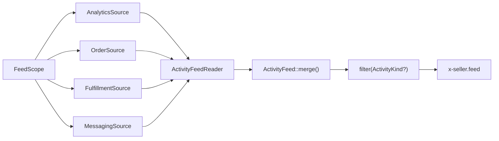

# Seller portal

The seller's own site: dashboard, listings, orders, messages, earnings,
support. Code: `app/Http/Controllers/Seller/`, `app/Seller/`,
`app/Domain/Seller/`, `resources/views/seller/`,
`resources/views/components/seller/`.

## Activity feed

Question: a seller wants to read everything that happened between them and
one buyer — or everything on one order — in time order. Which row comes from
where, and what stops two sources telling the same story twice?

One feed, four sources, one merge.

`App\Seller\FeedScope` says which story: `forFulfillment()` is one parcel —
its own listings, its own threads — and `forCustomer()` is everything between
a seller and a buyer. Both carry the same shape (seller, customer, the
customer's display name, fulfillment ids, listing ids), so a source never
asks which scope it is answering, beyond the one narrowing an order scope
does to threads.

Each source is one method — `ActivityFeedSource::events(FeedScope): FeedEvent[]`
— and `App\Seller\ActivityFeedReader` is the only thing that knows there are
four of them.

### Which source owns which row

| Source | Reads | Rows it owns | Kind |
| --- | --- | --- | --- |
| `AnalyticsSource` | `analytics_events` on the analytics connection, `actor_id` = the customer | listing viewed, favorited, unfavorited, added to cart; checkout opened | `browse` |
| `OrderSource` | `orders`, `payments`, `ledger_entries`, `refunds` | the order placed; each card attempt, approved or declined; held in escrow, released, returned to the buyer | `order` |
| `FulfillmentSource` | `fulfillment_events` (see `orders.md`) | each completed flow step, the label with its carrier and tracking number, shipped, delivered, declined | `shipping` |
| `MessagingSource` | `conversations`, `messages` | every message in a thread between the two of them | `messages` |

Two boundaries keep a row from appearing twice:

- The analytics store also carries `order.place`, `order.pay`, and
  `order.cancel`. Those are the order source's, read from the tables that
  hold the money, where the amounts are. The analytics source takes the
  browsing five and nothing else.
- `fulfillment_events` carries a `refunded` row and `ledger_entries` carries
  a `refunded` movement. The movement wins: it carries the amount, which the
  log does not, and it takes the refund's reason as its quote. The
  fulfillment source skips that kind.

A decline is told once: the shipping row says the parcel was turned down and
the `refunded` movement carries the amount and the words the seller typed. A
message is a messages row whose quote is the body.

### Merging and filtering are pure

`App\Domain\Seller\ActivityFeed::merge(...$sources)` takes each source's
`list<FeedEvent>` and sorts newest first. PHP's sort is stable, so two rows
carrying the same instant come out in the order the reader passed their
sources — browsing, order, shipping, messages — and a page reading the same
scope twice reads the same feed.

`filter(?ActivityKind)` narrows what the feed hands back, never what the
sources return, so a page can never disagree with itself about what
happened. A null kind is the whole feed, which is what an absent `?kind=`
reads as. Both are unit tested with no database; each source is tested
through it.

`FeedEvent` is readonly: `occurredAt`, `kind`, `icon`, `actor`, `text`, and
the optional `quote` and `link`. `FeedIcon` carries the heroicon path, so a
row brings its own picture and `x-seller.feed` stays a renderer — the only
feed markup in the portal, in the Tailwind Plus feed shape: a 32px round icon
on a rail, the body, the instant.
