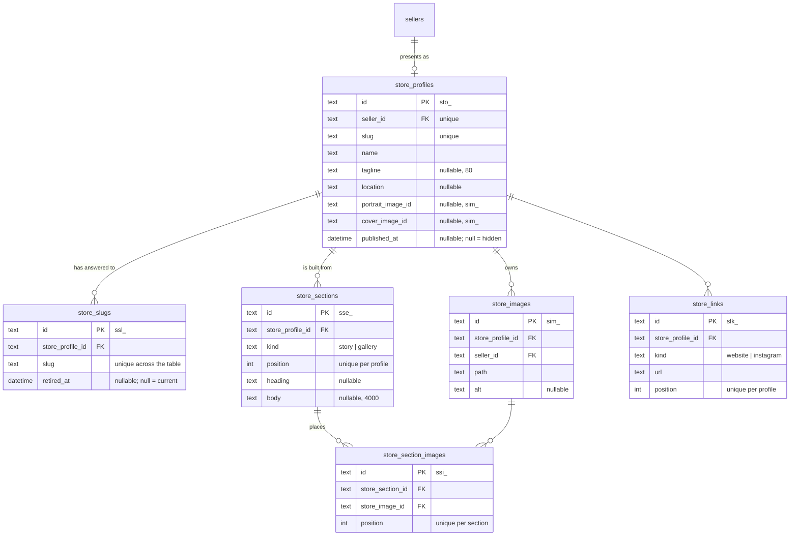
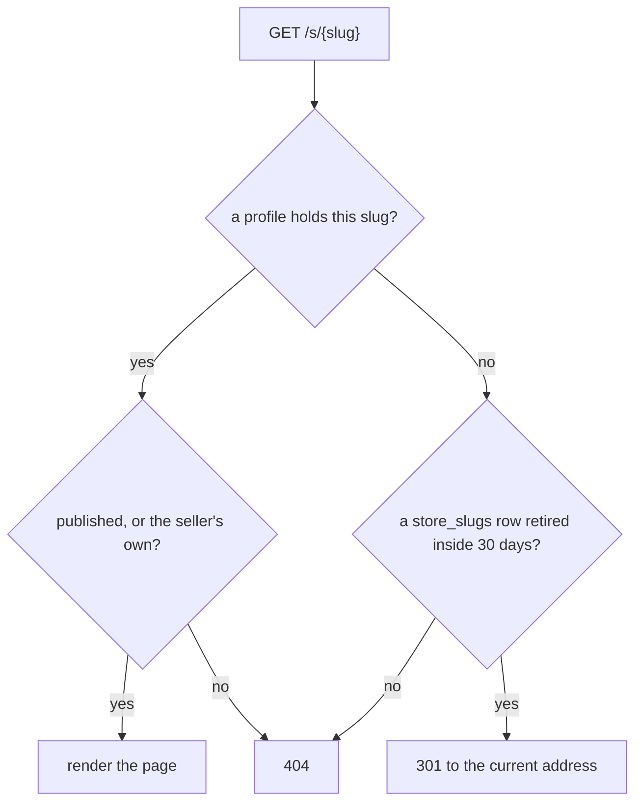
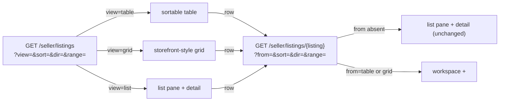
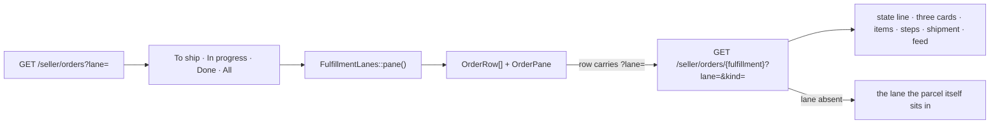
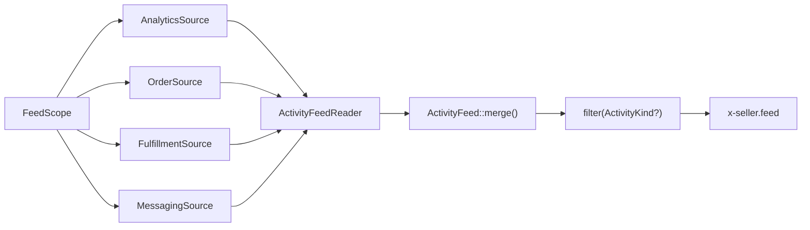
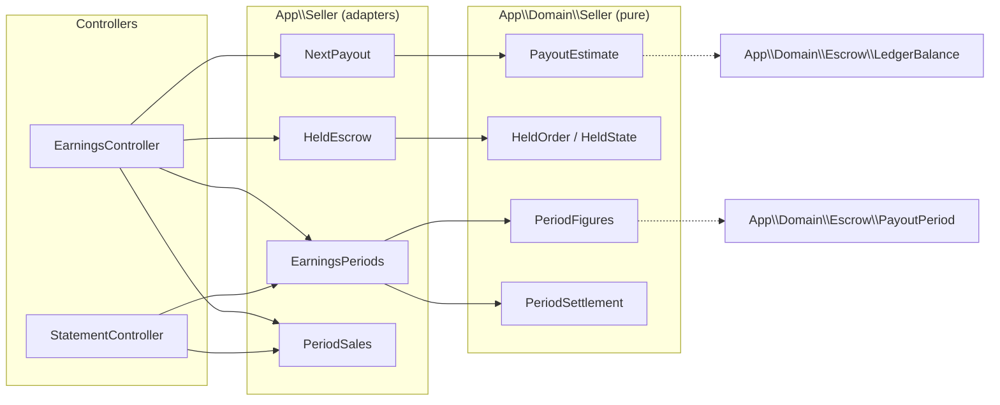
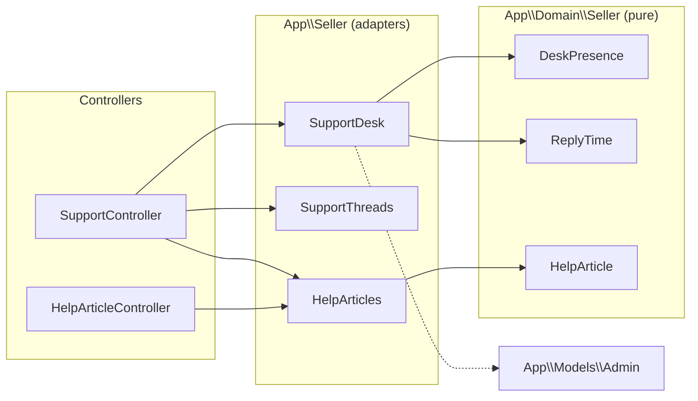
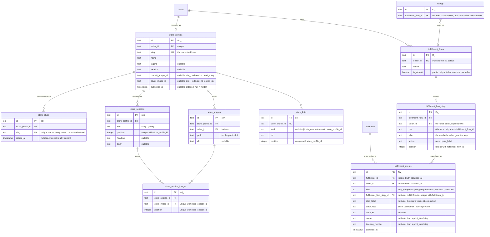

# Seller portal

The seller's own site: what a seller shows the world, what they have for
sale, what they owe a buyer, and what they are owed. The chrome, the
dashboard, and messages are in [`architecture.md`](architecture.md); each
tool gets its own section here as its lane lands.

| Section                                 | Read it for                                                     |
| --------------------------------------- | --------------------------------------------------------------- |
| [Store profile](#store-profile)         | The six store tables, the typed-section rule, addresses as      |
|                                         | history, the routes, the limits, the seeds                      |
| [The public page](#the-public-page)     | `/s/{slug}`, how an address resolves, what the page shows,      |
|                                         | the listing cards that lead to it, `store.view`                 |
| [Listings](#listings)                   | List, table, and grid over one detail component; the query      |
|                                         | vocabulary; sorting as a link; overlay against takeover         |
| [Activity feed](#activity-feed)         | The four sources, which one owns which row, and why merging     |
|                                         | and filtering are pure                                          |
| [Earnings](#earnings)                   | Next payout, held escrow, this period against the seven before  |
|                                         | it, and the printable statement                                 |
| [Support](#support)                     | The desk, its presence and reply time, help articles from       |
|                                         | markdown, and the seller's own support threads                  |
| [Data](#data)                           | The nine tables the portal added, drawn from the migrations     |

## Store profile

A seller presents on the site as a **store**: a name, an address under
`/s/{slug}`, a tagline, where they work, a portrait, a cover, links, and an
ordered list of sections. `GET /seller/store` is the screen; the same
component that renders the preview beside the form is what the storefront
renders as the page.

### The tables

The profile row holds only what every store has once. Everything the page
*says* is a section row of a typed kind, ordered by position.



`portrait_image_id` and `cover_image_id` hold a `sim_` id without a database
foreign key: `store_images` carries `store_profile_id`, so a key back the
other way is a cycle SQLite cannot create in either order.
`App\Actions\Store\RemoveStoreImage` clears both columns before it deletes
the row.

### The section rule

`App\Domain\Store\StoreSectionKind::allows(StoreSectionField)` is the one
statement of which fields a kind uses:

| Kind      | Heading | Body | Images |
| --------- | ------- | ---- | ------ |
| `story`   | yes     | yes  | no     |
| `gallery` | yes     | no   | yes    |

`App\Http\Requests\Seller\StoreSectionRequest` reads it twice — once to
decide which fields to validate, once in its after-validation pass to refuse
a field the kind does not use, so a body posted at a gallery is an error
the seller sees.

Every section on the screen posts its own form under the same field names,
so a section's errors go into a bag named for it
(`StoreSectionRequest::errorBagFor()`), and the page reads that bag beside
that section. The section that failed shows the words the seller typed; the
others show what is stored. A gallery numbers its pictures with an
`order[{image}]` field, and `imageIds()` sorts by it — a picture with no
number sorts last.

A new kind of store content is a case here, a renderer in
`resources/views/components/store/profile.blade.php`, and — when it needs
columns no other kind has — a child table keyed by section. It is never a
wider `store_profiles` row and never a JSON blob the database cannot index
or validate.

### Addresses are history

The current address lives on the profile for the unique index and the fast
lookup. Every address the store has ever answered to is a `store_slugs` row;
`retired_at` says when it stopped being current. The column is unique across
the whole table, so a rename can never take an address another store has
ever used and a redirect can never be ambiguous.

`App\Actions\Store\RenameStoreSlug` is the one writer: in one transaction it
stamps the current row retired, brings the new address in as the current
row, and updates the profile. A rename back to an address the store retired
earlier revives that row. A rename to the address the store already holds
writes nothing.

### The routes

| Route                                              | What it does                                    |
| -------------------------------------------------- | ----------------------------------------------- |
| `GET /seller/store`                                | The form and the buyer preview                  |
| `PUT /seller/store`                                | Name, address, tagline, location, links, visibility |
| `POST /seller/store/images`                        | One picture, as the portrait, the cover, or a gallery picture |
| `DELETE /seller/store/images/{image}`              | Takes a picture out of the store                |
| `POST /seller/store/sections`                      | Adds a section of a kind                        |
| `PUT /seller/store/sections/{section}`             | The section's text and, for a gallery, its pictures |
| `DELETE /seller/store/sections/{section}`          | Takes the section off the page                  |
| `POST /seller/store/sections/{section}/reorder`    | Moves it one place up or down                   |

The first `GET /seller/store` mints the store — hidden, named after the shop
— through `App\Actions\Store\StartStore`, the shape
`App\Models\Customer::cart()` already gives a storefront visitor. Every
route answers 404 for another seller's rows (`App\Policies\StoreProfilePolicy`).

### Limits

| Thing                        | Ceiling                                    |
| ---------------------------- | ------------------------------------------ |
| Address                      | 3–60 characters, `[a-z0-9]` with single hyphens |
| Tagline                      | `StoreProfile::MAX_TAGLINE_LENGTH` (80)    |
| Pictures per store           | `StoreProfile::MAX_IMAGES` (24)            |
| Story body                   | `StoreSection::MAX_BODY_LENGTH` (4,000)    |
| Pictures per gallery         | `StoreSection::MAX_GALLERY_IMAGES` (8)     |
| Sections per store           | `StoreSection::MAX_PER_PROFILE` (12)       |

### Seeds

`Database\Seeders\StoreProfileSeeder` gives every seeded seller a published
store: a tagline, where they work, a story, a gallery, and two links. The
picture rows name the same files on the public disk that the seller's
listings already show, so the seed copies nothing.

### What the store does not write

`docs/alignment.md` §2.3 closes the log-event vocabulary and §3 closes the
rate-limit names. Store writes emit neither: there is no `store.*` event and
no store limiter until the contract gains them, so the actions here write
silently; minting a name the other two prototypes lack is what §2.3
forbids.

## The public page

`GET /s/{slug}` renders the store in the Warm Craft theme. It is the same
component the seller previews beside their form
(`resources/views/components/store/profile.blade.php`); only the shell
(`x-layouts.shop`) and the listing grid below it differ.

### Resolving an address



`App\Support\Store\StoreAddressLookup` is the query;
`App\Domain\Store\RetiredSlugWindow` is the thirty-day rule. The redirect
target is resolved through published profiles only, so an old address of a
store that has since been hidden answers 404 and never names where the
store now lives.
A hidden store, an address retired too long ago, and an address no store
ever held all answer the same 404, so a hidden store is never confirmed to
exist. Its own seller is the exception: they see the page with a banner
saying buyers cannot open it.

### What the page shows

The cover, the portrait, the name, the tagline, the location, "N pieces for
sale · Selling since <Month Year>" (`App\Support\Store\StoreFacts` — the
count is `Listing::forSale()`, so a sold piece stays on the page and out of
the number), the sections in order, the links, and the seller's storefront
listings
(`Listing::onStorefront()` — for sale and sold, never draft, archived, or
removed) in the storefront's own grid partial.

The page carries a title, a description (the tagline, else the opening of
the first story, else the name), and an Open Graph image (the cover, else
the portrait). `x-layouts.shop` gained `description` and `image` props for
this, and emits the Open Graph group only for a page that passes one of
them; every other storefront page renders as it did.

### Listing cards lead to it

`x-listing-card` and `/art/{slug}` name the seller as a link to their store
when the store is published, and as plain text otherwise. The link reads
`$listing->seller->storeProfile`, so every query that feeds a card eager
loads `seller.storeProfile` — `Model::shouldBeStrict()` turns a missed one
into a lazy-loading violation outside production, so it fails loudly.

### Analytics

A view of a published page records `store.view` in the analytics store with
`subject_type = 'store'` and the profile's `sto_` id, deduplicated per
(store, customer, UTC hour) by `App\Domain\Store\StoreViewCollapse` —
`listing.view`'s shape. A seller previewing their own hidden page records
nothing. The admin analytics event list reads
`AnalyticsEventName::cases()`, so the event appears there; an actor's feed
names the store unlinked, the way it already names a cart.

## Listings

Question: how does a seller look at their inventory, and how does one
listing's detail end up rendered in three different places without drifting?



### Query vocabulary

`App\Http\Requests\Seller\ListingsQueryRequest` owns every parameter both
routes share, the `docs/alignment.md` §5 idiom: an absent or emptied value
reads as its default, an unrecognised one answers a bare 400.

| Param   | Values                                                                | Default | Read by                     |
| ------- | ---------------------------------------------------------------------- | ------- | ---------------------------- |
| `view`  | `list` \| `table` \| `grid` (`App\Domain\Seller\ListingView`)          | `list`  | the index route              |
| `from`  | `table` \| `grid`                                                     | absent  | the detail route             |
| `sort`  | one of eleven `App\Domain\Seller\ListingSortColumn` cases               | `views` | table/grid, and the header's `<select>` |
| `dir`   | `asc` \| `desc` (`App\Domain\Seller\ListingSortDirection`)              | `desc`  | table/grid                   |
| `range` | `7` \| `30` \| `90` (`App\Domain\Analytics\AnalyticsRange::SIZES`)      | `30`    | the ranged columns and the detail's view strip |

The detail route carries `from`, not `view` — `ListingController::show()`
resolves `view` from it before building the header and, on table/grid,
the workspace behind the overlay, so every link there still names `view`
explicitly.

### Layers


`App\Seller\ListingTable::forSeller()` reads a seller's listings, their
Medium attribute (batched, one query for every listing), their sold count
and revenue, and their ranged analytics counts, joined by id in PHP into a
`list<ListingTableRow>`; `App\Domain\Seller\ListingTableSort::apply()`
orders them by the request's `ListingSort`. `ListingTable::forListing()`
builds the same row for one listing — the detail component's source, so a
listing's own page never disagrees with its row in the table.

**Sold and revenue** are all-time, unranged: an `order_items` row counts
only when its order has been paid (`OrderStatus::hasBeenPaid()`) and its
matching `fulfillments` row (same `order_id` + `seller_id`) is still live
(not `declined`, not `refunded`) — a fulfillment exists from the moment an
order is placed, before payment clears, so the paid gate keeps an
abandoned checkout from reading as a sale.

### Sorting is a link

Every table column header is an `<a href>` carrying `aria-sort`; clicking
the already-sorted column flips `dir`
(`App\Domain\Seller\ListingSort::nextDirectionFor()`), clicking another one
sorts it descending. The header's own `<select name="sort">` (every column
but Status, which the table's header link already covers) is the same
choice for Grid, which has no column headers to click; it posts back to
the index route by GET, with a `<noscript>` fallback submit button.

### Overlay vs takeover

A table or grid row links to `/seller/listings/{id}?from=table` (or
`grid`). `ListingController::show()` renders one view,
`seller/listings/detail-overlay.blade.php`, that carries three blocks:
the listings workspace (`hidden 2xl:flex`), a native `<dialog open>` over
it (`hidden 2xl:flex`) holding the detail, and a takeover of the full
content area (`2xl:hidden`) holding the same detail with a back link.
Tailwind's `2xl:` variants pick which shows — no JavaScript decides, and
the `<dialog>`'s "close" is a plain link back to the index at the
resolved view, sort, and range.

### One detail component

`x-seller.listing-detail` (`resources/views/components/seller/listing-detail.blade.php`)
renders identity, status transitions, an active-removal alert,
price/stock/dimensions/ranged-views/favorites/cart-adds/sold-and-revenue/last-sold,
a ranged view strip (`x-seller.bar-strip` over
`App\Domain\Analytics\BarStrip::bars()`), and the sales table. It takes a
`Listing` (eager loaded with `activeRemoval`, `category`, `images`) and its
`ListingTableRow`, and renders identically in the list pane, the overlay,
and the takeover.

## Orders

Question: a seller opens Orders with three questions — what must go out,
what is on its way, what is finished. How does one list answer all three,
and how does one parcel's page tell the whole story of the sale?

### Lanes are a query parameter



`App\Domain\Fulfillment\LaneFilter` is the vocabulary: the three
`FulfillmentLane` piles plus `all`, the tab with no lane behind it. Each tab
carries its own label, whether it wears a count, and which end of the queue
it reads from — **To ship reads oldest first**, because the oldest unshipped
parcel is the one keeping a buyer waiting, and every other tab reads newest
first.

`App\Http\Requests\Seller\OrdersQueryRequest` owns `lane` and `kind` for both
routes and answers a bare 400 on a value outside either vocabulary
(docs/alignment.md §5). An absent `lane` is the default on the index and, on
a detail reached by a link that named none, the lane the open parcel sits in
— so the row is always in the pane beside it. Every row's own link carries
the lane it was opened from, and so does the back link below `lg`.

### One rule, read two ways

A lane is `status` plus "has a completed step". The tab counts come from one
grouped read over exactly those two facts:

```sql
select status, exists (select * from fulfillment_events
                       where fulfillment_id = fulfillments.id
                         and kind = 'step_completed') as started,
       count(*) as tally
from fulfillments where seller_id = ? group by status, started
```

`Fulfillment::countedByLane` is that query and `FulfillmentLane::forStarted`
folds each row into its pile, which is the same match
`FulfillmentLane::of` runs against a loaded `FulfillmentProgress`. The rows
under a tab come from `Fulfillment::inLane`, the same rule written as a where
clause. Two tests hold the three readings together: one walks a parcel of
every status and asserts `inLane` selects the parcel its own `lane()` names,
and one asserts each tab's number equals what `inLane` counts for that lane.
The number on a tab and the rows beneath it cannot drift.

### What a row says beyond its own facts

`App\Seller\FulfillmentLanes` hands the pane out as readonly value objects —
`LaneTab`, `OrderRow`, `OrderPane` — so the Blade renders and decides
nothing. Beyond the buyer, the scan line, the badge and the day, a row
carries one note: **what the buyer asked and nobody answered** (the latest
unread customer message on the parcel's thread), else **the last step the
seller marked done** ("Label printed"). Both come from one query each across
the whole window, never per row.

### The detail

`Fulfillment::state()` builds `App\Domain\Fulfillment\ParcelState`, the
sentence under the buyer's name, one shape per status:

| Status | Line |
| --- | --- |
| Awaiting shipment, nothing done | `Placed 2 days ago · ship by Sep 5` |
| Awaiting shipment, a step done | `Label printed 3 hours ago · waiting for the parcel to leave` |
| Shipped | `In transit with Owl Post since Sep 1` |
| Delivered | `Delivered Aug 28 · $612.00 released to your balance` |
| Declined or refunded | `Declined Sep 1 · $450.00 returned to the buyer` |

"Ship by" is placed plus three days — a display rule, never a stored date.
The money phrase reads the parcel's last ledger movement, which is also what
the payment card's Escrow line says through
`LedgerEntryType::escrowState()`.

Three cards sit under the header: **Customer** (name, email, and what they
have bought from this seller), **Ships to** (the address as the buyer gave it
at checkout), and **Payment** (the card, buyer paid, platform fee, your take,
escrow). Then the items, each linked to its listing; the flow's steps
(`x-seller.flow-steps`, FEAT-051) with the next one live; the shipment —
a carrier and tracking form while the parcel is in the studio, four
read-only facts once it has left; and the activity feed under its `?kind=`
filter.

A seller sees a customer's name, email, and address because an order carries
them. `App\Seller\CustomerOnOrder` counts what that buyer has bought from
this seller, leaving out every parcel that was declined or refunded: the
money went back.

### Actions the state allows

Message buyer is always there. Decline and Mark shipped are offered while
the parcel awaits shipment, and the policy decides. The buttons in the
header and in the mobile action bar submit the forms further down the page
by `form=`, so one form serves both. Completing a step and
marking shipped are POSTs that redirect back to the order, and the feed shows
the new row on return.

## Activity feed

Question: a seller wants to read everything that happened between them and
one buyer — or everything on one order — in time order. Which row comes from
where, and what stops two sources telling the same story twice?

One feed, four sources, one merge.



`App\Seller\FeedScope` says which story: `forFulfillment()` is one parcel —
its own listings, its own threads — and `forCustomer()` is everything between
a seller and a buyer. Both carry the same shape (seller, customer, the
customer's display name, fulfillment ids, listing ids), so a source never
asks which scope it is answering, beyond the one narrowing an order scope
does to threads.

Each source is one method — `ActivityFeedSource::events(FeedScope): FeedEvent[]`
— and `App\Seller\ActivityFeedReader` is the only thing that knows there are
four of them.

### Which source owns which row

| Source | Reads | Rows it owns | Kind |
| --- | --- | --- | --- |
| `AnalyticsSource` | `analytics_events` on the analytics connection, `actor_id` = the customer | listing viewed, favorited, unfavorited, added to cart; checkout opened | `browse` |
| `OrderSource` | `orders`, `payments`, `ledger_entries`, `refunds` | the order placed; each card attempt, approved or declined; held in escrow, released, returned to the buyer | `order` |
| `FulfillmentSource` | `fulfillment_events` (see `orders.md`) | each completed flow step, the label with its carrier and tracking number, shipped, delivered, declined | `shipping` |
| `MessagingSource` | `conversations`, `messages` | every message in a thread between the two of them | `messages` |

Two boundaries keep a row from appearing twice:

- The analytics store also carries `order.place`, `order.pay`, and
  `order.cancel`. Those are the order source's, read from the tables that
  hold the money, where the amounts are. The analytics source takes the
  browsing five and nothing else.
- `fulfillment_events` carries a `refunded` row and `ledger_entries` carries
  a `refunded` movement. The movement wins: it carries the amount, which the
  log does not, and it takes the refund's reason as its quote. The
  fulfillment source skips that kind.

A decline is told once: the shipping row says the parcel was turned down and
the `refunded` movement carries the amount and the words the seller typed. A
message is a messages row whose quote is the body.

### Merging and filtering are pure

`App\Domain\Seller\ActivityFeed::merge(...$sources)` takes each source's
`list<FeedEvent>` and sorts newest first. PHP's sort is stable, so two rows
carrying the same instant come out in the order the reader passed their
sources — browsing, order, shipping, messages — and a page reading the same
scope twice reads the same feed.

`filter(?ActivityKind)` narrows what the feed hands back, never what the
sources return, so a page can never disagree with itself about what
happened. A null kind is the whole feed, which is what an absent `?kind=`
reads as. Both are unit tested with no database; each source is tested
through it.

`FeedEvent` is readonly: `occurredAt`, `kind`, `icon`, `actor`, `text`, and
the optional `quote` and `link`. `FeedIcon` carries the heroicon path, so a
row brings its own picture and `x-seller.feed` stays a renderer — the only
feed markup in the portal, in the Tailwind Plus feed shape: a 32px round icon
on a rail, the body, the instant.

## Earnings

`/seller/earnings` leads with the next payout, what is still held and why,
this payout period against the seven before it, and a printable statement
per period. Code: `app/Domain/Seller/{PayoutEstimate,HeldOrder,HeldState,
SaleFact,RefundFact,PeriodFigures,PeriodSettlement,PeriodPayoutStatus,
PeriodSaleRow}`, `app/Seller/{NextPayout,HeldEscrow,EarningsPeriods,
PeriodSales}`, `app/Http/Controllers/Seller/{EarningsController,
StatementController}`, `resources/views/seller/earnings.blade.php`,
`resources/views/seller/earnings/statement.blade.php`.



### Next payout

`PayoutEstimate::from(LedgerBalance, PayoutPeriod, releasedOrderCount)` reads
its amount straight from `LedgerBalance::available` — released money not yet
paid out, negative when a refund outran what escrow could cover
(docs/escrow.md). The payout date is the Monday after the payout period
`$now` falls in (`PayoutPeriod::containing()`), whether that period is
still in progress or already complete. `NextPayout::for()` counts the
delivered fulfillments since the seller's last real `payouts` row (every
delivered fulfillment, when there has never been one) as the released order
count.

### Held in escrow

`HeldEscrow::for()` lists every `awaiting_shipment` or `shipped`
fulfillment, oldest first, each carrying its net and a `HeldState`
(`NotYetShipped` or `InTransit`) read from `shipped_at` alone — the seller's
own flow steps (FEAT-051) are a separate lane and are not read here. The
total is `LedgerBalance::held`, not a sum of the rows below it, so the
figure always reconciles with the ledger fold even where a stray entry
would make the two diverge.

### This period, past periods, and statements

`EarningsPeriods::for()` opens an eight-payout-period window ending with
the period `$now` falls in. Sales and fees are folded from live
fulfillments (`FulfillmentStatus::isLive()`) grouped by `orders.placed_at`;
refunds are folded from `ledger_entries` of type `refunded` grouped by
`occurred_at` — a refund lands in the period it happened, not the period
its sale was placed in. A declined or refunded order still counts toward
`orderCount` for the period it was placed in; it earns no sales or fees.

`PeriodSettlement` reads a period's payout status from two facts an adapter
already has: whether it is the period in progress, and whether a `payouts`
row exists for it. A completed period with no row reads as settled at zero
— `RunWeeklyPayout` never writes one for a balance that was not payable
(docs/escrow.md) — rather than as a run still owed.

`PeriodSales::for()` lists every order placed inside one period, newest
first, whatever its status — the rows behind both the current period's
sales table and `StatementController`'s printable statement
(`/seller/earnings/statements/{period}`, `period` a payout period's start
date). A period outside the eight-period window, or a string that matches
no period in it, answers 404.

## Support

`/seller/support` is the desk hub: the two admins who answer, their
presence, the reply-time promise, other ways to reach the desk, help
articles by topic, and the seller's own support threads. Code:
`app/Domain/Seller/{HelpArticle,DeskPresence,PresenceStatus,ReplyTime}`,
`app/Seller/{HelpArticles,SupportDesk,DeskPerson,SupportThreads}`,
`app/Http/Controllers/Seller/{SupportController,HelpArticleController}`,
`config/support.php`, `resources/help/seller/*.md`,
`resources/views/seller/support/{index,article,create}.blade.php`.



### The desk

`SupportDesk::for()` lists every seeded admin (`AdminSeeder`), each under
the same shared role and presence — `DeskPresence::of()` reads weekday
hours from `config('support.hours')` and answers Online or a "Back
today/tomorrow/Monday at {opens_at}" label; no realtime signal backs it in
this cut. `SupportDesk`'s `lastReplyTime` is the gap between the seller's
most recent message across every `admin_seller` thread and the desk's first
reply after it (`ReplyTime::between()`), or null while that message is
still unanswered or the seller has never written in.

Every other desk fact — email, phone and its hours, the booking URL, the
reply-time promise — is `config('support.*')`, read from env with a
bracketed placeholder default (`[PHONE NUMBER]`, `[BOOKING URL]`) for what
is not known yet.

### Help articles

`HelpArticle::fromMarkdown()` parses one file's `---`-delimited front
matter (`group`, `title`, `slug`, `position`) and splits its body into
blank-line-separated paragraphs — the markdown subset the four shipped
articles need, no library behind it. `HelpArticles` reads every
`resources/help/seller/*.md` file, cached per request, and groups them by
topic in a fixed order (Getting paid, Shipping, Listings, Messages).
`HelpArticleController@show` 404s for a slug no article carries.

### Own threads and the create form

`SupportThreads::for()` lists the seller's own `admin_seller` conversations,
newest first — the same rows Messages' Support tab lists
(`MessageController`'s `support` domain). `SupportController@create`/`store`
are unchanged: the seller's existing titled new-conversation form, now
reached from the hub's "Start a conversation" button rather than being the
`/seller/support` route itself.

## Data

Question: which tables did the portal add, and what does each column carry?

Nine tables, in two groups: six for how a seller presents, three for how a
seller ships. `listings` gains one nullable column. Every id is a prefixed
ULID (`docs/alignment.md` §1); the whole-database picture is
[`data-model.md`](data-model.md).



Six shapes the migrations hold that the lines above do not:

- `store_profiles.portrait_image_id` and `cover_image_id` carry a `sim_` id
  with no database foreign key. `store_images` carries `store_profile_id`, so
  a key back the other way is a cycle SQLite cannot create in either order.
  `RemoveStoreImage` clears both columns before it deletes the row.
- `store_slugs.slug` is unique across the whole table, retired rows included,
  so a rename can never take an address another store has ever answered to
  and a redirect can never be ambiguous.
- `fulfillment_flows` holds one default per seller as
  `create unique index … on fulfillment_flows (seller_id) where is_default = 1`.
  Blueprint writes no partial index; SQLite and Postgres both take the
  clause, so the migration writes the statement.
- `fulfillment_events` is unique on
  `(fulfillment_id, fulfillment_flow_step_id)`, so a step completed twice is
  one row. A unique index counts each null as its own value, which leaves
  every transition row — none of which names a step — outside the
  constraint.
- `fulfillment_events.step_label` copies the step's words at the moment of
  completion, and `fulfillment_flow_step_id` is `nullOnDelete`, so a seller
  who drops a step from their flow leaves the log still saying what they did.
- `store_section_images` and `store_links` each carry two unique indexes: one
  on position, so a section's pictures and a store's links hold an order, and
  one on the child (image, link kind), so neither is listed twice.
