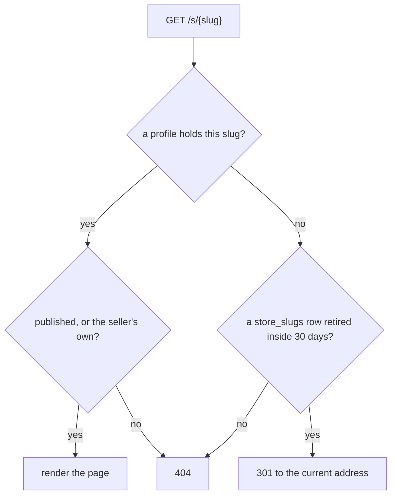
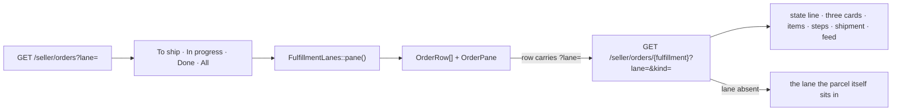
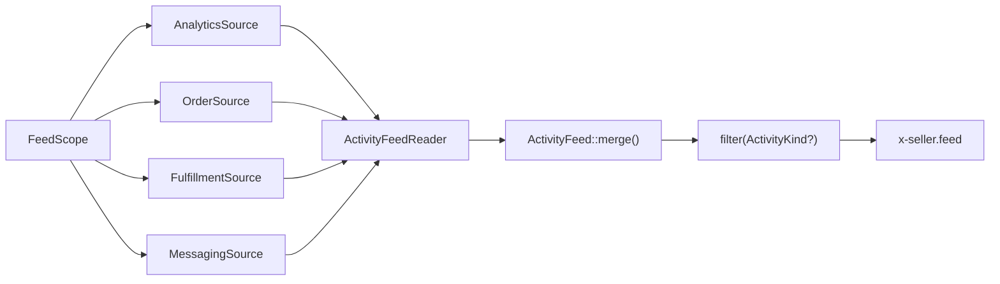

# Seller portal

The seller's own site: what a seller shows the world, what they have for
sale, what they owe a buyer, and what they are owed. The chrome is in
[`architecture.md`](architecture.md); each tool gets its own section here
as its lane lands.

Authorization is one idiom: a policy under `App\Policies`, reached through
the route's own FormRequest `authorize()` where one exists (`Gate::inspect`
against the bound or route-parameter model) and `$this->authorize()` in the
controller otherwise. No controller hand-rolls an ownership check with
`abort_if`.

Four suffixes carry one meaning each: `*Row` is one rendered row, the
output of an adapter that reads many, wherever the class holding it
lives (`App\Domain` or `App\Seller` alike — the suffix names the shape,
not the layer); `*Facts` is a handful of plain values about one thing,
an adapter's output but never itself a query (`StoreFacts` holds the
values, `StoreFactsReader` runs the count that fills them); `*Tally` is
a pure fold with no I/O, always under `App\Domain`; `NavLink` is the
one `{label, href, active, ?count}` a seller nav control renders,
replacing every `*Link` value object a lane built its own version of.

| Section                             | Read it for                                                                                             |
| ------------------------------------ | ---------------------------------------------------------------------------------------------------------- |
| [Dashboard](#dashboard)             | The range, the three tiles and their lines, listing activity, and the four focus groups                    |
| [Store profile](#store-profile)     | The six store tables, the typed-section rule, addresses as history, the routes, the limits, the seeds, and the public page at `/s/{slug}` |
| [Listings](#listings)               | List, table, and grid over one detail component; the query vocabulary; sorting as a link; overlay against takeover |
| [Orders](#orders)                   | Lanes as a query parameter, one rule read two ways, the parcel's detail, the flow editor, the label page |
| [Activity feed](#activity-feed)     | The four sources, which one owns which row, and why merging and filtering are pure                        |
| [Customers](#customers)             | Where the list comes from, the privacy rule, the query vocabulary, the customer page                      |
| [Messages](#messages)               | The context rail beside the transcript: the buyer's numbers, the piece or the parcel, their other threads  |
| [Earnings](#earnings)               | Next payout, held escrow, this period against the seven before it, and the printable statement            |
| [Support](#support)                 | The desk, its presence and reply time, help articles from markdown, and the seller's own support threads   |
| [Data](#data)                       | Where each table this portal added has its full shape                                                    |

## Dashboard

Question: a seller opens the portal in the morning. What are the three
numbers that say how the business is doing, which listings are working, and
what has to be done today — each one click from the tool that does it?

`GET /seller?range=7|30|90` is the whole vocabulary
(`App\Http\Requests\Seller\DashboardQueryRequest`, docs/alignment.md §5's
idiom: absent/emptied reads as `30`, unrecognised is a bare 400). Every
figure, delta, line, and strip reads over that one range.
`Http\Controllers\Seller\DashboardController` reads `Seller\NextPayout`,
`Seller\SellerOverview`, `Seller\ListingActivity`, and
`Seller\NeedsAttention`. `NextPayout` is read once and handed to both
`SellerOverview` and `NeedsAttention`, so the earnings tile's footer and
the payout group's heading can never name two different Mondays.

### Three tiles

Each is the Tailwind Plus "with brand icon" shape, the whole tile a link,
built by `App\Seller\SellerOverview` as three `OverviewTile` values.

| Tile | Figure | Change | Line | Opens |
| --- | --- | --- | --- | --- |
| Customers | every buyer, all-time | `+N new` — buyers whose first order landed in the range | new buyers per day | `/seller/customers?range=` |
| Orders | parcels placed in the range | vs the range before it (`RangeChange`) | parcels per day | `/seller/orders?lane=ship` |
| Earnings | net of the range's live parcels | vs the range before it | net per day | `/seller/earnings` |

The buyers are `SellerCustomers::forSeller()`'s own rows, so "new" is the
same `CustomerRow::isNewSince()` the customers tally reads. Orders and
earnings fold one query by the UTC day of `orders.placed_at`; a parcel
declined or refunded later still counts as an order placed and earns
nothing. `App\Domain\Seller\Sparkline::of()` scales a daily series onto one
SVG polyline, inset two pixels and scaled against its own floor so a high
plateau still shows its dip; `BarStrip` is the same idea in bars.

### Activity on your listings

`App\Seller\ListingActivity` answers four totals and five rows: views,
favorites, and cart adds off `ListingTable`'s rows for this range and
`AnalyticsReport::countsForListingsBetween()` for the previous one; sold is
units off `order_items` on paid orders whose parcel still stands. The rows
are `ListingTable`'s own `ListingTableRow` values sorted on Views
descending and cut to five, so a listing's dashboard figures and its
listings-table row agree, each carrying a daily view strip from
`AnalyticsReport::dailyViewsForListings()` capped at thirty days so ninety
bars never squeeze into one cell.

### Needs your attention

`App\Seller\NeedsAttention` reads four queues; `AttentionQueue` turns them
into panels, each counted whole and cut to five rows with a "N more" link.

| Group | Rows | Header opens |
| --- | --- | --- |
| Orders to ship | `FulfillmentLane::ToShip`, oldest first; the age reads in red past `AttentionQueue::SHIP_OVERDUE_DAYS` (2) | `/seller/orders?lane=ship` |
| Messages waiting on you | buyer threads holding a message the seller has not read, newest first, quoting it | `/seller/messages` |
| Payout `<Monday>` | what has released and is waiting on the run, and what delivery has yet to free (`PayoutEstimate`, `HeldEscrow::tallyFor()`) | `/seller/earnings` |
| Listings that need work | drafts and sold-out pieces, most recently edited first | `/seller/listings` |

The held row opens the earnings page's own held list (`#held-heading`); To
ship reads oldest by `orders.placed_at`, the fact the row's age and urgency
both come from. An empty group shows a sentence in place of its rows:
"Nothing is waiting to ship.", "Every buyer has heard back from you.",
"Nothing has settled yet.", "Every listing is published and in stock."

### What the dashboard costs

The page reads six queues across two connections and renders on a fixed
number of queries at any row count, which one test pins.
Two reads are duplicated by design: `Seller::escrowBalance()` is folded
once for the payout estimate and once for `HeldEscrow::tallyFor()`, and
the parcels waiting to ship are counted once for the orders tile's footer
and once for the focus group's heading. Both are cheap aggregates, and
threading either through would tie two adapters together for one query.
Nothing on the page hydrates a row it does not render: the held figures
are a ledger fold and one count, never the parcels behind them.

## Store profile

A seller presents on the site as a **store**: a name, an address under
`/s/{slug}`, a tagline, where they work, a portrait, a cover, links, and an
ordered list of sections. `GET /seller/store` is the screen; the same
component that renders the preview beside the form is what the storefront
renders as the public page.

### The tables

The profile row holds only what every store has once (`store_profiles`,
answering to `store_slugs`, `store_images`, `store_links`); everything the
page *says* is a `store_sections` row of a typed kind, ordered by position,
placing `store_images` through `store_section_images`. The full column
list and every relationship are in [`data-model.md`](data-model.md).

`portrait_image_id` and `cover_image_id` hold a `sim_` id without a
database foreign key: `store_images` carries `store_profile_id`, so a key
back the other way is a cycle SQLite cannot create in either order.
`App\Actions\Store\RemoveStoreImage` clears both columns before it deletes
the row. The tagline's 80 characters and a story's 4,000 are validation
ceilings (`StoreProfile::MAX_TAGLINE_LENGTH`, `StoreSection::MAX_BODY_LENGTH`)
the request enforces — both columns are `text`, with no length of their own.

### The section rule

`App\Domain\Store\StoreSectionKind::allows(StoreSectionField)` is the one
statement of which fields a kind uses:

| Kind      | Heading | Body | Images |
| --------- | ------- | ---- | ------ |
| `story`   | yes     | yes  | no     |
| `gallery` | yes     | no   | yes    |

`App\Http\Requests\Seller\StoreSectionRequest` reads it twice — once to
decide which fields to validate, once after validation to refuse a field
the kind does not use. Every section posts its own form under the same
field names, so its errors go into a bag named for it
(`StoreSectionRequest::errorBagFor()`) and the page reads that bag beside
the section that failed, showing the words the seller typed there and what
is stored everywhere else. A gallery numbers its pictures with an
`order[{image}]` field, `imageIds()` sorting by it and unnumbered last.

A new kind of store content is a case here, a renderer in
`resources/views/components/store/profile.blade.php`, and — when it needs
columns no other kind has — a child table keyed by section, never a wider
`store_profiles` row or a JSON blob.

### Addresses are history

The current address lives on the profile for the unique index and the fast
lookup. Every address the store has ever answered to is a `store_slugs`
row; `retired_at` says when it stopped being current. The column is unique
across the whole table, so a rename can never take an address another
store has used and a redirect can never be ambiguous.

`App\Actions\Store\RenameStoreSlug` is the one writer: in one transaction
it stamps the current row retired, brings the new address in as current,
and updates the profile. A rename back to a retired address revives that
row; a rename to the address the store already holds writes nothing.

### The routes

| Route                                              | What it does                                    |
| -------------------------------------------------- | ----------------------------------------------- |
| `GET /seller/store`                                | The form and the buyer preview                  |
| `PUT /seller/store`                                | Name, address, tagline, location, links, visibility |
| `POST /seller/store/images`                        | One picture, as the portrait, the cover, or a gallery picture |
| `DELETE /seller/store/images/{image}`              | Takes a picture out of the store                |
| `POST /seller/store/sections`                      | Adds a section of a kind                        |
| `PUT /seller/store/sections/{section}`             | The section's text and, for a gallery, its pictures |
| `DELETE /seller/store/sections/{section}`          | Takes the section off the page                  |
| `POST /seller/store/sections/{section}/reorder`    | Moves it one place up or down                   |

The first `GET /seller/store` mints the store — hidden, named after the
shop — through `App\Actions\Store\StartStore`, the shape
`Customer::cart()` already gives a visitor. Every route answers 404 for
another seller's rows (`App\Policies\StoreProfilePolicy`).

### Limits and seeds

| Thing                        | Ceiling                                    |
| ---------------------------- | ------------------------------------------ |
| Address                      | 3–60 characters, `[a-z0-9]` with single hyphens |
| Tagline                      | `StoreProfile::MAX_TAGLINE_LENGTH` (80)    |
| Pictures per store           | `StoreProfile::MAX_IMAGES` (24)            |
| Story body                   | `StoreSection::MAX_BODY_LENGTH` (4,000)    |
| Pictures per gallery         | `StoreSection::MAX_GALLERY_IMAGES` (8)     |
| Sections per store           | `StoreSection::MAX_PER_PROFILE` (12)       |

`Database\Seeders\StoreProfileSeeder` gives every seeded seller a published
store: a tagline, where they work, a story, a gallery, and two links. Each
picture is a copy of one of the seller's listing photos, onto the store's
own path under a name unique to the store — a store picture never names a
listing's file, or another store's.

### What the store does not write

`docs/alignment.md` §2.3 closes the log-event vocabulary and §3 closes the
rate-limit names. Store writes emit neither: there is no `store.*` event and
no store limiter until the contract gains them, so the actions here write
silently; minting a name the other two prototypes lack is what §2.3
forbids.

### The public page

`GET /s/{slug}` renders the store in the Warm Craft theme. It is the same
component the seller previews beside their form
(`resources/views/components/store/profile.blade.php`); only the shell
(`x-layouts.shop`) and the listing grid below it differ.

#### Resolving an address

`App\Seller\Store\StoreAddressLookup` is the query;
`App\Domain\Store\RetiredSlugWindow` is the thirty-day rule. The redirect
target is resolved through published profiles only, so an old address of a
store that has since been hidden answers 404 and never names where the
store now lives.
A hidden store, an address retired too long ago, and an address no store
ever held all answer the same 404, so a hidden store is never confirmed to
exist. Its own seller is the exception: they see the page with a banner
saying buyers cannot open it.

#### What the page shows

The cover, the portrait, the name, the tagline, the location, "N pieces for
sale · Selling since <Month Year>" (`App\Seller\Store\StoreFactsReader`
reads it into a `StoreFacts` — the count is `Listing::forSale()`, so a
sold piece stays on the page and out of
the number), the sections in order, the links, and the seller's storefront
listings (`Listing::onStorefront()` — for sale and sold, never draft,
archived, or removed) in the storefront's own grid partial.

The page carries a title, a description (the tagline, else the opening of
the first story, else the name), and an Open Graph image (the cover, else
the portrait) — `x-layouts.shop`'s `description`/`image` props, emitting
the Open Graph group only when one is passed.

#### Listing cards lead to it, and record a view

`x-listing-card` and `/art/{slug}` name the seller as a link to their store
when the store is published, and as plain text otherwise. The link reads
`$listing->seller->storeProfile`, so every query that feeds a card eager
loads `seller.storeProfile` — `Model::shouldBeStrict()` turns a missed one
into a lazy-loading violation outside production, so it fails loudly.

A view of a published page records `store.view` with `subject_type =
'store'` and the profile's `sto_` id, deduplicated per (store, customer,
UTC hour) by `App\Domain\Store\StoreViewCollapse` — `listing.view`'s shape.
A seller previewing their own hidden page records nothing; an actor's feed
names the store unlinked, the way it already names a cart.

## Listings

Question: how does a seller look at their inventory, and how does one
listing's detail end up rendered in three different places without drifting?
`GET /seller/listings?view=list|table|grid` picks the index shape; a row's
own link (`GET /seller/listings/{listing}?from=table|grid`) opens the same
detail, unchanged when `from` is absent.

### Query vocabulary

`App\Http\Requests\Seller\ListingsQueryRequest` owns every parameter both
routes share, the `docs/alignment.md` §5 idiom: an absent or emptied value
reads as its default, an unrecognised one answers a bare 400.

| Param   | Values                                                                | Default | Read by                     |
| ------- | ---------------------------------------------------------------------- | ------- | ---------------------------- |
| `view`  | `list` \| `table` \| `grid` (`App\Domain\Seller\ListingView`)          | `list`  | the index route              |
| `from`  | `table` \| `grid`                                                     | absent  | the detail route             |
| `sort`  | one of eleven `App\Domain\Seller\ListingSortColumn` cases               | `views` (`ListingSortColumn::defaultSort()`) | table/grid, and the header's `<select>` |
| `dir`   | `asc` \| `desc` (`App\Domain\Seller\SortDirection`)              | `desc`  | table/grid                   |
| `range` | `7` \| `30` \| `90` (`App\Domain\Analytics\AnalyticsRange::SIZES`)      | `30`    | the ranged columns and the detail's view strip |

The detail route carries `from`, not `view` — `ListingController::show()`
resolves `view` from it before building the header and, on table/grid,
the workspace behind the overlay, so every link there still names `view`
explicitly.

### Layers

`App\Seller\ListingTable::forSeller()` and `::forListing()`
(`Domain\Seller\{ListingTableRow,RowSort,TableSort,
ListingSortColumn,SortDirection,ListingView}`, and
`Analytics\AnalyticsReport::countsForListingsSince()`) build the same
`ListingTableRow` shape, so a listing's own page never disagrees with its
row in the table.

**Sold and revenue** are all-time, unranged: an `order_items` row counts
only when its order has been paid (`OrderStatus::hasBeenPaid()`) and its
matching `fulfillments` row (same `order_id` + `seller_id`) is still live
(not `declined`, not `refunded`) — a fulfillment exists from the moment an
order is placed, before payment clears, so the paid gate keeps an
abandoned checkout from reading as a sale.

### Sorting is a link

Every table column header is an `<a href>` carrying `aria-sort`; clicking
the already-sorted column flips `dir`
(`App\Domain\Seller\TableSort::nextDirectionFor()`), clicking another one
sorts it descending. The header's own `<select name="sort">` is the same
choice for Grid, which has no headers to click; it posts back to the index
route by GET through `data-sort-form`/`data-sort-select`/`data-sort-submit`
hooks that `public/sort-autosubmit.js` submits on change — the CSP outside
debug carries no inline `onchange`, so an always-rendered Sort button is
what a visitor with the script blocked uses.

### Overlay vs takeover

A table or grid row links to `/seller/listings/{id}?from=table` (or
`grid`). `ListingController::show()` renders one view,
`seller/listings/detail-overlay.blade.php`, carrying three blocks: the
listings workspace (`hidden … 2xl:flex`), a native `<dialog>` over it
(`hidden … 2xl:flex`), and a takeover of the content area (`2xl:hidden`)
with a back link. Tailwind's `2xl:` variants pick which shows.

The workspace carries its own copy of `x-seller.listings-header`
(`withNewListingDialog="false"`, so the New listing dialog's id never
repeats) inside the same `inert` wrapper as the table or grid — the
header, the view switch, and the New listing button all sit unreachable
there, script or no script. `public/listing-detail-dialog.js` upgrades
the dialog to a real modal at `2xl` and up: `showModal()` (matchMedia-
synced, so a resize crossing the breakpoint opens or closes it),
`autofocus` on Close, and a `close` event that navigates to
`data-close-href` — the same address the takeover's own back link
carries — unless the close was the script's own down-transition, which
leaves the page on the takeover instead. Both `x-seller.listings-header`
copies render "Listings" as a `
`, never an `<h1>`, since the listing's
own title — one copy in the overlay, one in the takeover, never both
exposed to assistive technology at once — is the page's one heading.

### One detail component

`x-seller.listing-detail` renders identity, status transitions, an
active-removal alert, price/stock/dimensions/ranged-views/favorites/
cart-adds/sold-and-revenue/last-sold, a ranged view strip (`x-bar-strip`
over `BarStrip::bars()`), and the sales table — a `Listing` and its
`ListingTableRow`, rendered identically in the list pane, the overlay, and
the takeover.

## Orders

Question: a seller opens Orders with three questions — what must go out,
what is on its way, what is finished. How does one list answer all three,
and how does one parcel's page tell the whole story of the sale?

### Lanes are a query parameter

`App\Domain\Fulfillment\LaneFilter` is the vocabulary: the three
`FulfillmentLane` piles plus `all`, the tab with no lane behind it. Each tab
carries its own label, whether it wears a count, and which end of the queue
it reads from — **To ship reads oldest first**, because the oldest unshipped
parcel is the one keeping a buyer waiting, and every other tab reads newest
first.

`App\Http\Requests\Seller\OrdersQueryRequest` owns `lane` and `kind` for both
routes and answers a bare 400 on a value outside either vocabulary
(docs/alignment.md §5). An absent `lane` is the default on the index and, on
a detail reached by a link that named none, the lane the open parcel sits in
— so the row is always in the pane beside it. Every row's own link carries
the lane it was opened from, and so does the back link below `lg`.

### One rule, read two ways

A lane is `status` plus "has a completed step". `Fulfillment::countedByLane`
is one grouped read over exactly those two facts, and
`FulfillmentLane::forStarted` folds each row into its pile — the same match
`FulfillmentLane::of` runs against a loaded `FulfillmentProgress`. The rows
under a tab come from `Fulfillment::inLane`, the same rule written as a
where clause. Two tests hold the three readings together: one asserts
`inLane` selects the parcel its own `lane()` names for a parcel of every
status, one asserts each tab's number equals what `inLane` counts for that
lane — the number on a tab and the rows beneath it cannot drift.

### What a row says beyond its own facts

`App\Seller\FulfillmentLanes` hands the pane out as readonly value objects
— `NavLink`, `OrderRow`, `OrderPane` — so the Blade decides nothing. Beyond
the buyer, the scan line, the badge and the day, a row carries one note:
**what the buyer asked and nobody answered**, else **the last step the
seller marked done** ("Label printed") — both from one query each across
the whole window, never per row.

### The detail

`App\Seller\OrderDetail::state()` builds `App\Domain\Fulfillment\ParcelState`,
the sentence under the buyer's name, one shape per status:

| Status | Line |
| --- | --- |
| Awaiting shipment, nothing done | `Placed 2 days ago · ship by Sep 5` |
| Awaiting shipment, a step done | `Label printed 3 hours ago · waiting for the parcel to leave` |
| Shipped | `In transit with Owl Post since Sep 1` |
| Delivered | `Delivered Aug 28 · $612.00 released to your balance` |
| Declined or refunded | `Declined Sep 1 · $450.00 returned to the buyer` |

"Ship by" is placed plus three days, a display rule never a stored date; the
money phrase reads the parcel's last ledger movement, also what the payment
card's Escrow line says through `LedgerEntryType::escrowState()`.

Three cards sit under the header: **Customer** (name, email, and what they
have bought from this seller, via `App\Seller\CustomerOnOrder`, leaving out
declined/refunded parcels), **Ships to** (the checkout address), and
**Payment** (the card, buyer paid, platform fee, your take, escrow). Then
the items, each linked to its listing; the flow's steps
(`x-seller.flow-steps`) with the next one live; the shipment — a carrier
and tracking form while the parcel is in the studio, four read-only facts
once it has left; and the activity feed under its `?kind=` filter.

### Actions the state allows

Message buyer is always there. Decline and Mark shipped are offered while
the parcel awaits shipment, and the policy decides. The buttons in the
header and in the mobile action bar submit the forms further down the page
by `form=`, so one form serves both. Completing a step redirects back to
the order — unless the step's action is `print_label`, which redirects to
the printable label page (`GET /seller/orders/{fulfillment}/label`)
instead; either way the feed shows the new row on return.
`GET/PUT /seller/orders/flow` is the seller's own flow editor: add, rename,
reorder, and remove a step, and choose which one prints the label — reached
from every order page.

## Activity feed

Question: a seller wants to read everything that happened between them and
one buyer — or everything on one order — in time order. Which row comes from
where, and what stops two sources telling the same story twice?

One feed, four sources, one merge.

`App\Seller\FeedScope` says which story: `forFulfillment()` is one parcel,
`forCustomer()` is everything between a seller and a buyer, both the same
shape (seller, customer, display name, fulfillment ids, listing ids) so a
source never asks which scope it is answering. Each source is one method —
`ActivityFeedSource::events(FeedScope): FeedEvent[]` — and
`App\Seller\ActivityFeedReader` is the only thing that knows there are four
of them.

### Which source owns which row

| Source | Reads | Rows it owns | Kind |
| --- | --- | --- | --- |
| `AnalyticsSource` | `analytics_events` on the analytics connection, `actor_id` = the customer | listing viewed, favorited, unfavorited, added to cart; checkout opened | `browse` |
| `OrderSource` | `orders`, `payments`, `ledger_entries`, `refunds` | the order placed; each card attempt, approved or declined; held in escrow, released, returned to the buyer | `order` |
| `FulfillmentSource` | `fulfillment_events` (see `orders.md`) | each completed flow step, the label with its carrier and tracking number, shipped, delivered, declined | `shipping` |
| `MessagingSource` | `conversations`, `messages` | every message in a thread between the two of them | `messages` |

Two boundaries keep a row from appearing twice:

- The analytics store also carries `order.place`, `order.pay`, and
  `order.cancel`. Those are the order source's, read from the tables that
  hold the money, where the amounts are. The analytics source takes the
  browsing five and nothing else.
- `fulfillment_events` carries a `refunded` row and `ledger_entries` carries
  a `refunded` movement. The movement wins: it carries the amount, which the
  log does not, and it takes the refund's reason as its quote. The
  fulfillment source skips that kind.

A decline is told once: the shipping row says the parcel was turned down and
the `refunded` movement carries the amount and the words the seller typed. A
message is a messages row whose quote is the body.

The refunded row names two amounts. The buyer gets the whole subtotal
(`App\Actions\Escrow\IssueRefund`), so that is the figure the row leads
with; the ledger entry beside it is the seller's net leaving their balance,
which the sentence names after it.

### Merging and filtering are pure

`App\Domain\Seller\ActivityFeed::merge(...$sources)` sorts each source's
`list<FeedEvent>` newest first with PHP's stable sort, so two rows sharing
an instant keep the order the reader passed their sources — browsing,
order, shipping, messages — and a page reading the same scope twice reads
the same feed. `filter(?ActivityKind)` narrows what the feed hands back,
never what the sources return, so a page can never disagree with itself; a
null kind (an absent `?kind=`) is the whole feed. Both are unit tested with
no database.

`FeedEvent` is readonly: `occurredAt`, `kind`, `icon`, `actor`, `text`, and
the optional `quote` and `link`. `FeedIcon` carries the heroicon path, so a
row brings its own picture and `x-seller.feed` stays a renderer — a 32px
round icon on a rail, the body, the instant.

## Customers

Question: a seller wants to know who buys from them. Where does that list
come from, given no table holds it — and what does a seller get to see about
a person?

A customer is a buyer. Someone holding at least one paid fulfillment with
the seller that still stands is on the list; browsing, favoriting, and
asking about a piece join their timeline once they have bought. Every
request derives the list from `fulfillments` — no table holds it — folded
into totals per buyer (orders, spent, first, last) and joined to
`customers`, `favorites`, and `conversations` for a `CustomerRow`.

A `fulfillments` row exists from the moment an order is placed, so the
derivation gates on the order having been paid: an abandoned checkout
leaves the list alone and leaves Spent alone. A declined or refunded parcel
settled its money back, so it counts toward nothing here — a buyer whose
only parcel was declined drops off the list and their page answers 404,
while the parcel itself stays listed on a page they still hold.

### Privacy

A seller sees a customer's name and email because an order carried them.
That is the whole permission: `GET /seller/customers/{customer}` answers
404 for anyone who has never bought from this seller, so a visitor who
favorited a piece or asked a question has no page a seller can open. The
name is the account's own where it has one, and the latest order's
`shipping_name` where it does not — the same fall-back for the email.

### Query vocabulary

`App\Http\Requests\Seller\CustomersQueryRequest` owns every parameter both
routes read, the `docs/alignment.md` §5 idiom: an absent or emptied value
reads as its default, an unrecognised one answers a bare 400.

| Param     | Values                                                                   | Default | Read by         |
| --------- | ------------------------------------------------------------------------ | ------- | --------------- |
| `range`   | `7` \| `30` \| `90` (`App\Domain\Analytics\AnalyticsRange::SIZES`)        | `30`    | the index route |
| `segment` | `all` \| `repeat` \| `new` (`App\Domain\Seller\CustomerSegment`)          | `all`   | the index route |
| `sort`    | one of seven `App\Domain\Seller\CustomerSortColumn` cases                | `spent` (`CustomerSortColumn::defaultSort()`) | the index route |
| `dir`     | `asc` \| `desc` (`App\Domain\Seller\SortDirection`)                      | `desc`  | the index route |
| `kind`    | one of four `App\Domain\Seller\ActivityKind` cases                       | absent  | the customer page's timeline |

`range` is what "new this period" means: a buyer is new when their first
order falls inside the window. The four figures above the table count every
buyer whatever the segment shows, so switching segments never moves them.

### Layers

`Seller\SellerCustomers::forSeller()` folds the figures in one grouped
query, then joins the account rows, favorites, and thread counts by id in
PHP. A buyer holding no account name or address takes both from their
latest order, one more query, run only when such a buyer is in the list.
`forCustomer()` is the same fold narrowed to one person; the customer
page, the Message button, and the thread rail all read it.

### The customer page

Identity (name, email, customer since, a Repeat buyer badge from two
orders), four figures, the activity feed under its kind filter, every
parcel between the two of them — a declined or refunded one included,
which the figures leave out and the seller still has to be able to look
back at — their favorites of this seller's pieces, and their threads.

Message opens the buyer's newest thread with this seller, or — for a buyer
the seller has yet to write to — the thread for the buyer's latest parcel
through `App\Actions\Messaging\OpenConversation`: a subject the two of them
already share, so the button needs no new kind of conversation.

## Messages

The inbox and the thread are `docs/messaging.md`. What the seller portal adds
beside the transcript is the context rail: who the seller is talking to, and
what the thread is about.

`App\Seller\ThreadContext::forSeller()` is the rail's one read — the
`FeedScope` idiom, a readonly value object with a named constructor that
reads `SellerCustomers::forCustomer()`. It carries the counterpart's name
and initials, the `CustomerRow` where they have bought from this seller,
the listing a question is about, the parcel a fulfillment thread is about
— named by this seller's own lines, since a two-seller order carries both
— and every other thread the two of them hold, newest first, rendered by
`x-seller.context-rail`.

The same privacy rule the customers section states: a buyer's numbers and
their email show because an order carried them. A visitor who has only
asked about a piece shows a name alone — no figures, no email, no View
customer link, since they have no customer page to open. A support thread
shows the desk in place of a customer, and no other conversations.

The rail sits beside the transcript at `2xl` and under it below that,
inside the thread component's own pane. Nothing about the transcript, the
composer, resolve, reopen, or Publish as FAQ changed; the rate-limited
reply re-renders the same rail with the thread it came back to.

## Earnings

`/seller/earnings` leads with the next payout, what is still held and why,
this payout period against the seven before it, and a printable statement
per period. Code: `app/Domain/Seller/{PayoutEstimate,HeldOrder,HeldState,
SaleFact,RefundFact,PeriodFigures,PeriodSettlement,PeriodPayoutStatus,
PeriodSaleRow}`, `app/Seller/{NextPayout,HeldEscrow,EarningsPeriods,
PeriodSales}`, `app/Http/Controllers/Seller/{EarningsController,
StatementController}`.

### Next payout

`PayoutEstimate::from(LedgerBalance, PayoutPeriod, releasedOrderCount)` reads
its amount straight from `LedgerBalance::available` — released money not yet
paid out, negative when a refund outran what escrow could cover
(docs/escrow.md) — for the Monday after the payout period `$now` falls in
(`PayoutPeriod::containing()`). `NextPayout::for()` counts the delivered
fulfillments since the seller's last real `payouts` row (every delivered
fulfillment, when there has never been one) as the released order count.

### Held in escrow

`HeldEscrow::for()` lists every `awaiting_shipment` or `shipped`
fulfillment, oldest first, each carrying its net and a `HeldState`
(`NotYetShipped` or `InTransit`) read from `shipped_at` alone — the
seller's own flow steps are a separate lane, not read here. The total is
`LedgerBalance::held`, not a sum of the rows, so it always reconciles.

### This period, past periods, and statements

the period `$now` falls in. Sales and fees are gross: every fulfillment of
a paid order counts, live or since declined or refunded, grouped by
`orders.placed_at`. Refunds fold separately, from `ledger_entries` of type
`refunded` grouped by `occurred_at`, so a refund lands in the period it
happened, not the period its sale was placed in — a parcel sold in one
period and declined or refunded in a later one leaves the first period's
sales untouched and nets the later period instead. `net()` is
`sales - fees - refunds`. The dashboard's earnings tile
(`App\Seller\SellerOverview`) reads the same model, folded by day instead
of by payout period.

`PeriodSettlement` reads a period's payout status from whether it is the
period in progress and whether a `payouts` row exists for it — a completed
period with no row reads as settled at zero, `RunWeeklyPayout`'s answer
for a balance that was never payable.

`PeriodSales::for()` lists every order placed inside one period, newest
first, whatever its status — the rows behind both the current period's
sales table and `StatementController`'s printable statement
(`/seller/earnings/statements/{period}`). A period outside the window, or
a string matching none in it, answers 404.

## Support

`/seller/support` is the desk hub: the two admins who answer, their
presence, the reply-time promise, other ways to reach the desk, help
articles by topic, and the seller's own support threads. Code:
`app/Domain/Seller/{HelpArticle,DeskPresence,PresenceStatus,ReplyTime}`,
`app/Seller/{HelpArticles,SupportDesk,DeskPerson,SupportThreads}`,
`app/Http/Controllers/Seller/{SupportController,HelpArticleController}`,
`config/support.php`, `resources/help/seller/*.md`.

### The desk

`SupportDesk::for()` lists every seeded admin (`AdminSeeder`), each under
the same shared role and presence — `DeskPresence::of()` reads weekday
hours from `config('support.hours')` and answers Online or a "Back
today/tomorrow/Monday at {opens_at}" label, no realtime signal behind it.
`lastReplyTime` is the gap between the seller's most recent message across
every `admin_seller` thread and the desk's first reply after it
(`ReplyTime::between()`), null while unanswered or unwritten. Every other
desk fact — email, phone and its hours, the booking URL, the reply-time
promise — is `config('support.*')`, read from env with a bracketed
placeholder default (`[PHONE NUMBER]`, `[BOOKING URL]`) for what is not
known yet.

### Help articles

`HelpArticle::fromMarkdown()` parses one file's `---`-delimited front
matter (`group`, `title`, `slug`, `position`) and splits its body into
blank-line-separated paragraphs — the markdown subset the four shipped
articles need, no library behind it. `HelpArticles` reads every
`resources/help/seller/*.md` file, cached per request, grouped by topic in
a fixed order; `HelpArticleController@show` 404s for an unrecognised slug.

### Own threads and the create form

`SupportThreads::for()` lists the seller's own `admin_seller` conversations,
newest first — the same rows Messages' Support tab lists. The existing
titled new-conversation form (`SupportController@create`/`store`) is
unchanged, now reached from the hub's "Start a conversation" button rather
than being the `/seller/support` route itself.

## Data

Nine tables, in two groups: six for how a seller presents (`store_profiles`,
`store_slugs`, `store_images`, `store_sections`, `store_section_images`,
`store_links`), three for how a seller ships (`fulfillment_flows`,
`fulfillment_flow_steps`, `fulfillment_events`), plus `listings`' one
nullable `fulfillment_flow_id` column. Every id is a prefixed ULID
(`docs/alignment.md` §1); the full column list, every relationship, and the
caveats a diagram cannot draw are in [`data-model.md`](data-model.md).
